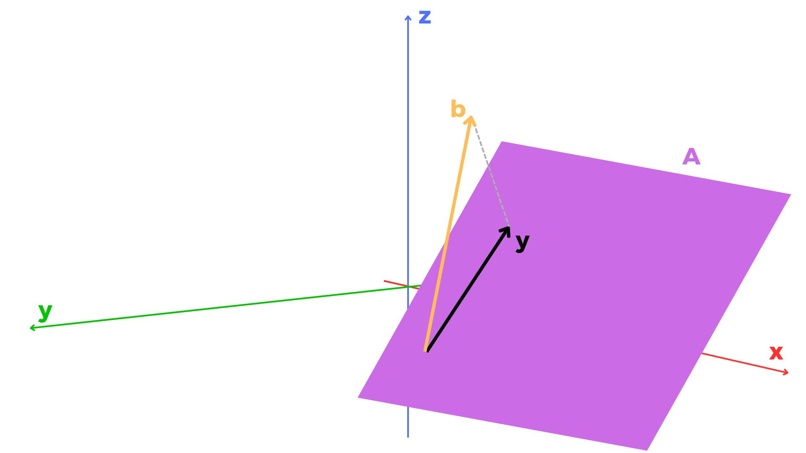
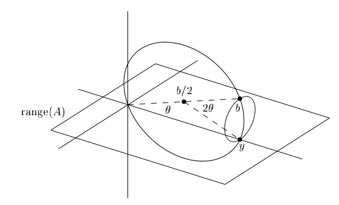
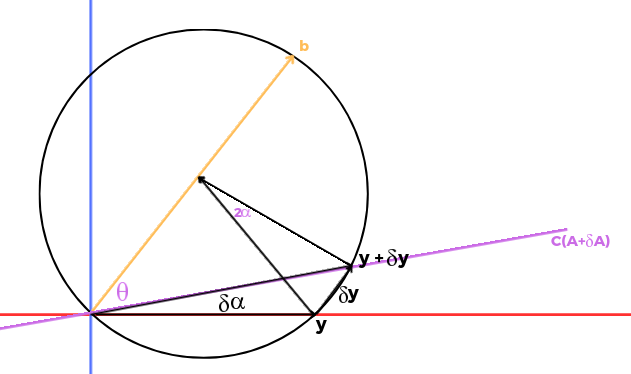

[Álgebra Linear Numérica](index.md)

<!-- wiki:original:inicio -->

# Condicionando Problemas de Mínimos Quadrados

**Nota**: Nessa lecture, quando escrevemos $\| \cdot \|$, estamos nos referindo a norma 2, **não a qualquer norma**, logo, $\| \cdot \| = \| \cdot \|_{2}$

Vamos relembrar o problema dos mínimos quadrados?

$$\begin{array}{r} \text{ Dada }A \in {\mathbb{C}}^{m \times n}\text{ de posto completo, }m \geq n\text{  e  }b \in {\mathbb{C}}^{m}, \\ \text{ache }x \in {\mathbb{C}}^{n}\text{ tal que }\| b - Ax\|_{2}\text{ seja a menor possível } \end{array}$$

No resumo passado, vimos que o $x$ que satisfaz esse problema é $$x = \left( A^{\ast}A \right)^{- 1}A^{\ast}b \Rightarrow y = {A\left( A^{\ast}A \right)}^{- 1}A^{\ast}b \Leftrightarrow y = Pb$$ Ou seja, a projeção ortogonal de $b$ em $A$ resulta no vetor $y$. Queremos então saber o condicionamento de [problema de mínimos quadrados](#min-squares) de acordo com perturbações em $b$, $A$, $y$ e $x$. Tenha em mente que o problema recebe dois parâmetros, $A$ e $b$ e retorna as soluções $x$ e $y$

## O Teorema

Antes de estabelecer de fato o teorema, vamos relembrar alguns fatores-chave aqui. Vamos rever a imagem que representa o problema de mínimos quadrados visualmente (Mesma imagem do resumo anterior)

Vamos relembrar algumas coisas que já vimos antes e algumas novas. Primeiro é lembrar que, como $A$ não é quadrada, definimos seu número de condicionamento como $$\kappa(A) = \| A\|\| A^{+}\| = \| A\|{\|\left( A^{\ast}A \right)}^{- 1}A^{\ast}\|$$ Não está explicito na imagem, mas podemos, também, definir o ângulo $\theta$ entre $b$ e $y$ $$\theta = \arccos(\frac{\| y\|}{\| b\|})$$ (A gente define assim pois $b$ é a hipotenusa do triangulo retângulo formado por $b$ e $y - b$)

E a segunda medida é $\eta$, que representa por quanto $y$ não atinge seu valor máximo $$\eta = \frac{\| A\|\| x\|}{\| y\|} = \frac{\| A\|\| x\|}{\| Ax\|}$$ Show! E esses parâmetros tem esses domínios: $$\kappa(A) \in \lbrack 1,\infty\rbrack\text{        }\theta \in \left\lbrack 0,\frac{\pi}{2} \right\rbrack\text{      }\eta \in \left\lbrack 1,\kappa(A) \right\rbrack$$

**Teorema: Condicionamento de Mínimos Quadrados**

Deixe $b \in {\mathbb{C}}^{m}$ e $A \in {\mathbb{C}}^{m \times n}$ de posto completo serem **fixos**. O [problema de mínimos quadrados](#min-squares) possui a seguinte tabela de condicionamentos em norma-2:

|  | $y$ | $x$ |
|:--:|:--:|:--:|
| $b$ | $\frac{1}{\cos(\theta)}$ | $\frac{\kappa(A)}{\eta\cos(\theta)}$ |
| $A$ | $\frac{\kappa(A)}{\cos(\theta)}$ | $\kappa(A) + \frac{{\kappa(A)}^{2}\tan(\theta)}{\eta}$ |

Sensibilidade de $x$ e $y$ com relação a perturbações em $A$ e $b$

Vale dizer também que a primeira linha são igualdades exatas, enquanto a linha de baixo são arredondamentos para cima

**Demonstração**

Antes de provar para cada tipo de perturbação, temos em mente que estamos trabalhando com a norma-2, correto? Então nós vamos reescrever $A$ para ter uma análise mais fácil. Seja $A = U\Sigma V^{\ast}$ a decomposição S.V.D de $A$, sabemos que $\| A\|_{2} = \|\Sigma\|_{2}$ (As matrizes unitárias não afetam a norma), então podemos, sem perca da generalidade, lidar diretamente com $\Sigma$, então podemos assumir que $A = \Sigma$ (Não literalmente, mas como vamos ficar analisando as normas, isso vai nos facilitar bastante) $$A = \begin{pmatrix} \sigma_{1} \\ & \sigma_{2} \\ & & \ddots \\ & & & \sigma_{n} \\ & \\  \end{pmatrix} = \begin{pmatrix} A_{1} \\ 0 \end{pmatrix}$$ Reescrevendo os outros termos, temos: $$b = \begin{pmatrix} b_{1} \\ b_{2} \end{pmatrix}\text{     }y = \begin{pmatrix} b_{1} \\ 0 \end{pmatrix}\text{      }\begin{pmatrix} A_{1} \\ 0 \end{pmatrix}x = \begin{pmatrix} b_{1} \\ 0 \end{pmatrix} \Leftrightarrow x = A_{1}^{- 1}b_{1}$$

- **Sensibilidade de $y$ com perturbações em $b$**: Vimos anteriormente nas [equações de mínimos quadrados](#min-squares-equations) que $y = Pb$, e podemos tirar o condicionamento disso se associarmos com a equação **genérica** $Ax = b$. Lembra que em estabilidade vimos que o condicionamento desse sistema genérico quando perturbamos $x$ é: $$\frac{\| A\|}{\| x\|/\| b\|}$$ Então, fazendo simples substituições: $$\frac{\| P\|}{\| y\|/\| b\|} = \frac{1}{\cos\theta}$$ O que até que faz sentido na intuição. Se fazemos com que $b$ fique muito próximo a um ângulo de $90{^\circ}$ com $C(A)$, na hora que formos projetar, a projeção será minúscula, o que pode acarretar erros numéricos dependendo da precisão usada pelo computador

- **Sensibilidade de x com perturbações em $b$**: Também tem uma relação bem direta pelas [equações de mínimos quadrados](#min-squares-equations): $x = A^{+}b$. Assim, temos o mesmo de antes: $$\frac{\| A^{+}\|}{\| x\|/\| b\|} = \| A^{+}\frac{\|\left( \| b\| \right)}{\| y\|}\frac{\| y\|}{\| x\|} = \| A^{+}\|\frac{1}{\cos\theta}\frac{\| A\|}{\eta} = \frac{\kappa(A)}{\eta\cos\theta}$$

Antes de continuar o resto da demonstração, temos que entender um pouco como as perturbações em $A$ podem afetar $C(A)$, porém, isso é um problema não-linear. Até daria pra fazer um monte de jacobiano algébrico, mas é melhor se manter numa pegada não muito formal e ter uma visão geométrica.

Primeiro, quando perturbamos $A$, isso afeta o problema de mínimos quadrados de dois modos: 1 - As perturbações afetam como vetores em ${\mathbb{C}}^{n}$ ($A \in {\mathbb{C}}^{m \times n}$) são mapeados em $C(A)$. 2 - Elas alteram $C(A)$ em si. A gente pode imaginar as perturbações em $C(A)$ como pequenas inclinações que a gente faz, coisa bem pouquinha mesmo. Então fazemos a pergunta: Qual é o maior ângulo de inclinação $\delta\alpha$ (O quão inclinado eu deixei em comparação a como tava antes) que pode ser causado por uma pequena perturbação $\delta A$? Aí a gente pode seguir do seguinte modo:

*Figura 3. Perturbação em $C(A)$. $v_{1}$ é o vetor que está na divisão entre o plano azul e o vermelho, $v_{2}$ é o vetor mais destacado no plano azul e $v_{3}$ é o vetor pontilhado*

Na [perturbação no espaço coluna de $A$](#CA-perturbation), a gente consegue ver isso um pouco melhor. Nosso plano original é o **azul**, formado por $v_{1}$ e $v_{2}$, enquanto o plano **vermelho** é formado por $v_{1}$ e $v_{3}$, onde $v_{3}$ é o $v_{2} + \delta v_{2}$. Percebam que os planos tem uma abertura entre si, medimos aquela abertura por meio de $\delta\alpha$ que mostra a diferença de inclinação entre os dois planos. A segunda mostra mais explicitamente esse ângulo aplicado a outros dois planos diferentes, eu aumentei a diferença entre um e outro apenas para ilustrar melhor a visualização do ângulo, mas normalmente queremos trabalhar com ângulos minúsculos.

Quando a gente projeta uma n-esfera unitária em $C(A)$, temos uma hiperelipse. Pra mudar $C(A)$ da forma mais eficiente possível, pegamos um ponto $p = Av$ que está na hiperelipse ($\| v\| = 1$) e cutucamos ela em uma direção $\delta p$ ortogonal a $C(A)$. A perturbação que melhor faz isso é $\delta A = (\delta p)v^{\ast}$, que resulta em $(\delta A)v = \delta p \Rightarrow \|\delta A\| = \|\delta p\|$. Essa perturbação é a melhor por conta da norma 2 de um produto externo: $$A = uv^{\ast} \Rightarrow \| Ax\| = \| uv^{\ast}x\| \leq \| u\|\| v\|\| x\|$$ Daí **para ter a igualdade**, basta pegar $x = v$. Agora a gente pode perceber que, se a gente quer a maior inclinação possível dado uma perturbação $\|\delta p\|$ a gente tem q fazer com que $p$ fique perto da origem o máximo possível. Ou seja, queremos o menor $p$ possível com base na definição, que seria $p = \sigma_{n}u_{n}$ onde $\sigma_{n}$ é o menor valor valor singular de $A$ e $u_{n}$ a $n$-ésima coluna de $U$. Se tomarmos $A = \Sigma$, $p$ é a última coluna de $A$, $v^{\ast} = e_{n}^{\ast} = (0,0,\ldots,1)$ e $\delta A$ são perturbações na entrada de A. Essa perturbação inclina $C(A)$ pelo ângulo $\delta A$ dado por $\tan(\delta\alpha) = \|\delta p\|/\|\sigma_{n}\|$, temos então: $$\delta\alpha \leq \frac{\|\delta A\|}{\sigma_{n}} = \frac{\|\delta A\|}{\| A\|}\kappa(A)$$ Agora sim podemos continuar a demonstração

- **Sensibilidade de $y$ com perturbações em $A$**: Podemos ver uma propriedades geométricas interessantes quando fixamos $b$ e mexemos $A$. Lembra que $y$ é a projeção **ortogonal** de $b$ em $C(A)$, ou seja, $y$ sempre é **ortogonal** a $y - b$.

  

  

  *Figura 4. Círculo de projeção de $y$. O círculo maior representa a inclinação de $C(A)$ no plano $0yb$ e o círculo menor é quando inclinamos $C(A)$ em uma direção ortogonal a ele*

  Como eu posso rotacionar $C(A)$ em $360{^\circ}$, eu posso visualizar todos os possíveis locais de $y$ estando nessa esfera. Quando eu inclino $C(A)$ por um ângulo $\delta\alpha$ no círculo maior, o meu ângulo $2\theta$ vai ser alterado. Mais especificamente, vai ser alterado em $2\delta\alpha$. Ou seja, a perturbação $\delta y$ que eu vou obter ao inclinar $C(A)$ será a base de um triângulo isóceles.

  

  *Figura 5. $C(A)$ após rotação de $\delta\alpha$*

  Podemos ver que o raio da esfera é $\| b\|/2$, ou seja, podemos chegar que: $$\begin{array}{r} \|\delta y\| \leq \| b\|\sin(\delta\alpha) \leq \| b\|(\delta\alpha) \leq \| b\frac{\|\left( \|\delta A\| \right)}{\| A\|}\kappa(A) \\ \cos(\theta) = \frac{\| y\|}{\| b\|} \Leftrightarrow \| b\| = \frac{\| y\|}{\cos(\theta)} \\ \Rightarrow \|\delta y\| \leq \frac{\frac{\| y\|}{\cos(\theta)(\|\delta A\|)}}{\| A\|}\kappa(A) \Leftrightarrow \frac{\frac{\|\delta y\|}{\| y\|}}{\frac{\|\delta A\|}{\| A\|}} = \frac{\kappa(A)}{\cos(\theta)} \end{array}$$ Concluímos assim, o 3º condicionamento

- **Sensibilidade de $x$ com perturbações em $A$**: Quando a gente faz uma perturbação $\delta A$ em $A$, podemos separar essa perturbação em duas outras: $\delta A_{1}$ que ocorre nas primeiras $n$ linhas de $A$ e $\delta A_{2}$ que ocorre nas $m - n$ linhas restantes. $$A = \begin{pmatrix} \delta A_{1} \\ \delta A_{2} \end{pmatrix}$$ Vamos ver $\delta A_{1}$ primeiro. Quando vemos essa perturbação específica, pelo que vimos em [redução de $A$ à forma diagonal](#A-reduction-to-diagonal), temos que $b$ não é alterado, então estamos mantendo $b$ fixo e tentando calcular $x$ com perturbação $\delta A_{1}$ em $A$. Esse condicionamento já vimos no último resumo: $$\left( \frac{\|\delta x\|}{\| x\|} \right)/\left( \frac{\|\delta A_{1}\|}{\| A\|} \right) \leq \kappa(A_{1}) = \kappa(A)$$ Já quando perturbamos por $\delta A_{2}$ (Estamos perturbando $C(A)$ por inteiro, não somente $A_{2}$), acaba que o vetor $y$ e, consequentemente, o vetor $b_{1}$ são perturbados, porém, sem perturbação em $A_{1}$. Isso é a mesma coisa que a gente perturbar $b_{1}$ sem perturbar $A_{1}$. O condicionamento disso é: $$\left( \frac{\|\delta x\|}{\| x\|} \right)/\left( \frac{\|\delta b_{1}\|}{\| b_{1}\|} \right) \leq \frac{\kappa(A_{1})}{\eta\left( A_{1};x \right)} = \frac{\kappa(A)}{\eta}$$ Agora precisamos relacionar $\delta b_{1}$ com $\delta A_{2}$. Sabemos que $b_{1}$ é $y$ expresso nas coordenadas de $C(A)$. Ou seja, as únicas mudanças em $y$ que podem ser vistas como mudanças em $b_{1}$ são aquelas paralelas a $C(A)$. Se $C(A)$ é inclinado por um ângulo $\delta\alpha$ no plano $0by$, $\delta y$ não está em $C(A)$, mas tem um ângulo de $\frac{\pi}{2} - \theta$. Ou seja, as mudanças em $b_{1}$ satisfazem: $$\|\delta b_{1}\| = \sin(\theta)\|\delta y\| \leq \left( \| b\|\delta\alpha \right)\sin(\theta)$$ Curiosamente se a gente inclina $C(A)$ na direção ortogonal ao plano $0by$ (Círculo menor na [figura do círculo de projeção](#projection-circle)) obtemos o mesmo resultado por motivos diferentes.

  Como vimos antes: $\cos(\theta) = \| y\|/\| b\| \Leftrightarrow \| b_{1}\| = \cos(\theta)\| b\|$, então podemos reescrever [relação entre $\delta b_1$ e $\delta y$](#deltab1-relation-to-deltay) como: $$\frac{\|\delta b_{1}\|}{\| b_{1}\|} \leq \frac{\| b\|\delta\alpha\sin(\theta)}{\| b\|\cos(\theta)} \Leftrightarrow \frac{\|\delta b_{1}\|}{\| b_{1}\|} \leq \delta\alpha\tan(\theta)$$ Assim, podemos relacionar $\delta\alpha$ com $\|\delta A_{2}\|$ da equação [ângulo máximo de inclinação](#tilting-angle-maximum) $$\begin{array}{r} \delta\alpha \leq \frac{\|\delta A_{2}\|}{\| A\|}\kappa(A) \Leftrightarrow \frac{\|\delta b_{1}\|}{\| b_{1}\|} \leq \frac{\|\delta A_{2}\|}{\| A\|}\kappa(A)\tan(\theta) \\ \left( \frac{\|\delta x\|}{\| x\|} \right)/\left( \frac{\|\delta b_{1}\|}{\| b_{1}\|} \right) \leq \frac{\kappa(A)}{\eta} \Leftrightarrow \frac{\|\delta x\|}{\| x\|} \leq \frac{\kappa(A)}{\eta}\frac{\|\delta b_{1}\|}{\| b_{1}\|} \Leftrightarrow \frac{\|\delta x\|}{\| x\|} \leq \frac{\kappa(A)}{\eta}\frac{\|\delta A_{2}\|}{\| A\|}\kappa(A)\tan(\theta) \\ \Leftrightarrow \left( \frac{\|\delta x\|}{\| x\|} \right)/\left( \frac{\|\delta A_{2}\|}{\| A\|} \right) \leq \frac{{\kappa(A)}^{2}\tan(\theta)}{\eta} \end{array}$$

  Combinando os condicionamentos de $A_{1}$ e $A_{2}$ temos $\kappa(A) + \frac{{\kappa(A)}^{2}\tan(\theta)}{\eta}$

------------------------------------------------------------------------

<!-- wiki:original:fim -->

## Percurso de estudo

[Trilha: A2](../../trilhas/algebra-linear-numerica/a2.md) · [Apresentação e contexto da fonte](../../trilhas/algebra-linear-numerica/a2.md#apresentacao-original)

- Anterior: [Estabilidade da Back Substitution](estabilidade-da-back-substitution.md)
- Próximo: [Estabilidade de Algoritmos de Mínimos Quadrados](estabilidade-de-algoritmos-de-minimos-quadrados.md)
