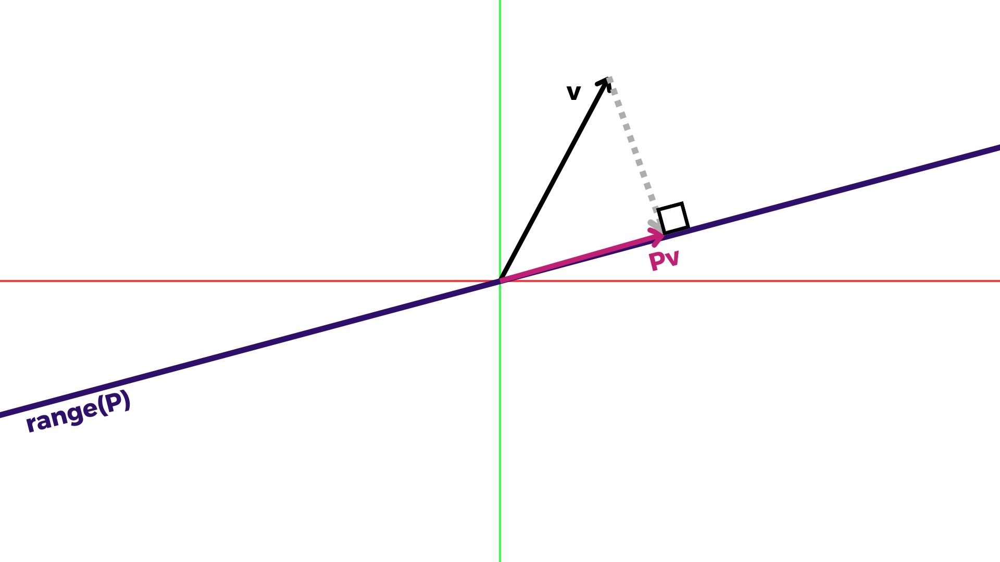

[Álgebra Linear Numérica](../index.md)

<!-- wiki:original:inicio -->

# Projetores

## Projetores complementares

Se $P$ é um projetor, $I - P$ é seu projetor complementar.

**Teorema**

$I - P$ projeta sobre null$(P)$ e $P$ projeta sobre null$(I - P)$

**Demonstração**

1.  $C(I - P) \subseteq N(P)$ porque $v - Pv \in N(P)$ e $C(I - P) \supseteq N(P)$ porque, se $Pv = 0$, podemos reescrever como $(I - P)v = v$, isso significa $N(P) = C(I - P)$

2.  Se reescrevermos a expressão como $P = I - (I - P)$, então, usando o mesmo argumento de antes, temos $C(P) = N(I - P)$

**Teorema**

$N(I - P) \cap N(P) = \left\{ 0 \right\}$

**Demonstração**

$N(A) \cap C(A) = \left\{ 0 \right\} \Rightarrow N(P) \cap C(P) = \left\{ 0 \right\} \Leftrightarrow N(P) \cap N(I - P) = \left\{ 0 \right\}$

Isso significa que, se temos um projetor $P$ em ${\mathbb{C}}^{m \times m}$, esse projetor separa ${\mathbb{C}}^{m}$ em dois espaços $S_{1}$ e $S_{2}$, de forma que $S_{1} \cap S_{2} = \left\{ 0 \right\}$ e $S_{1} + S_{2} = {\mathbb{C}}^{m}$.

## Projetores ortogonais

Finalmente! Os projetores que ouvimos falar o tempo todo! Eles projetam um vetor em um espaço fazendo a direção formar um ângulo de 90 graus com a projeção.

Isso significa $(Pv)^{\ast (v - Pv)} = 0$

**Teorema**

$P$ é um projetor ortogonal $\Leftrightarrow$ $P = P^{\ast}$

**Demonstração**

1.  $\Leftarrow )$ Dado $x,y \in {\mathbb{C}}^{m}$, então $x^{\ast}P^{\ast (I - P)}y = x^{\ast \left( P^{\ast} - P^{\ast}P \right)}y = x^{\ast \left( P - P^{2} \right)}y = x^{\ast (P - P)}y = 0$

2.  $\Rightarrow )$ Seja $\left\{ q_{1},\ldots,q_{m} \right\}$ uma base ortonormal de ${\mathbb{C}}^{m}$ onde $\left\{ q_{1},\ldots,q_{n} \right\}$ é base de $S_{1}$ e $\left\{ q_{n + 1},\ldots,q_{m} \right\}$ é base de $S_{2}$. Para $j \leq n$ temos $Pq_{j} = q_{j}$ e para $j > n$ temos $Pq_{j} = 0$, seja $Q$ a matriz com colunas $\left\{ q_{1},\ldots,q_{m} \right\}$, temos: $$Q = \begin{pmatrix} \vert  & & \vert  \\ q_{1} & \ldots & q_{m} \\ \vert  & & \vert \end{pmatrix} \Leftrightarrow PQ = \begin{pmatrix} \vert  & & \vert  & \vert  \\ q_{1} & \ldots & q_{n} & 0 & \ldots \\ \vert  & & \vert  & \vert \end{pmatrix} \Leftrightarrow Q^{\ast}PQ = \begin{pmatrix} 1 \\ & 1 \\ & & \ddots \\ & & & 1 \\ & & & & 0 \\ & & & & & \ddots \end{pmatrix}$$, o que significa que encontramos uma decomposição SVD para $P$:

$$
P = Q\Sigma Q^{\ast} \Leftrightarrow P^{\ast} = Q\Sigma^{\ast}Q^{\ast} = Q\Sigma Q^{\ast} = P
$$

## Projeção ortogonal sobre um vetor

Vamos usar o mesmo exemplo usado anteriormente

Seja $q$ o vetor que gera $P$, sabemos que $Pv = \alpha q$ $$(v - Pv)^{\ast}q = 0 = (v - \alpha q)^{\ast}q = 0$$ Agora procuramos o $\alpha$ que torna esta equação válida $$v^{\ast}q - \alpha q^{\ast}q = 0 \Leftrightarrow v^{\ast}q = \alpha q^{\ast}q \Leftrightarrow \alpha = \frac{v^{\ast}q}{q^{\ast}q}$$ $$Pv = \alpha q \Leftrightarrow Pv = \frac{v^{\ast}q}{q^{\ast}q}q \Leftrightarrow Pv = \frac{q^{\ast}v}{q^{\ast}q}q \Leftrightarrow Pv = q\frac{q^{\ast}v}{q^{\ast}q} \Leftrightarrow Pv = \frac{qq^{\ast}}{q^{\ast}q}v \Rightarrow P = \frac{qq^{\ast}}{q^{\ast}q}$$

## Projeção com base ortonormal

Vimos na prova de [\[orthogonal-projectors\]](../projetores-ortogonais/index.md#orthogonal-projectors) que alguns valores singulares de $P$ são $0$, então poderíamos remover essas linhas de $\Sigma$ e reduzi-lo a $I$, também removendo as colunas e linhas de $Q$, obtendo: $$P = \widehat{Q}{\widehat{Q}}^{\ast}$$ Seja $\left\{ q_{1},\ldots,q_{n} \right\}$ qualquer conjunto de vetores ortonormais em ${\mathbb{C}}^{m}$ e sejam eles as colunas de $\widehat{Q}$, sabemos que, para qualquer vetor $v \in {\mathbb{C}}^{m}$: $$v = r + \sum_{i = 1}^{n}q_{i}q_{i}^{\ast}v$$ O quê? Quando vimos isso? Calma, deixe-me recapitular para você:

**Teorema**

Seja $\left\{ q_{1},\ldots,q_{n} \right\}$ qualquer conjunto de vetores ortonormais em ${\mathbb{C}}^{m}$, então qualquer $v \in {\mathbb{C}}^{m}$ pode ser expresso como $$v = r + \sum_{i = 1}^{n}q_{i}q_{i}^{\ast}v$$ Com $r$ sendo outro vetor em $C^{m}$ ortogonal a $\left\{ q_{1},\ldots,q_{n} \right\}$ e, $\rightarrow n = m \Rightarrow r = 0$ e o conjunto de vetores escolhido é uma base para ${\mathbb{C}}^{m}$

**Demonstração**

Você sabe que, dada uma base de ${\mathbb{C}}^{m}$, qualquer vetor pode ser expresso como uma combinação linear desses vetores. Imagine a base canônica (com algumas rotações, essa lógica pode ser expandida para outras bases ortonormais), você pode imaginar que, se projetar o vetor que você tem sobre qualquer vetor da base canônica, obterá um vetor que, se somar com outro vetor $r$, obterá seu vetor original novamente! E podemos continuar esse processo até fazermos isso com $n$ vetores da base canônica, obtendo o $r$ original que, se somarmos todas as nossas projeções, obtemos o vetor original novamente, ou seja: $$v = r + \sum_{i = 1}^{n}q_{i}q_{i}^{\ast}v$$

Ok, sabendo que um vetor pode ser expresso assim, podemos ver que a parte da soma é a mesma que fazer: $$\widehat{Q}{\widehat{Q}}^{\ast}v$$ Ou seja, $\sum_{i = 1}^{n}q_{i}q_{i}^{\ast}v$ é um projetor sobre $C\left( \widehat{Q} \right)$

**Teorema**

O complemento de um projetor ortogonal também é um projetor ortogonal

**Demonstração**

1.  $\left( I - \widehat{Q}{\widehat{Q}}^{\ast} \right)^{2} = I - 2\widehat{Q}{\widehat{Q}}^{\ast} + \left( \widehat{Q}{\widehat{Q}}^{\ast} \right)^{2} = I - 2\widehat{Q}{\widehat{Q}}^{\ast} + \widehat{Q}{\widehat{Q}}^{\ast} = I - \widehat{Q}{\widehat{Q}}^{\ast}$

2.  $\left( I - \widehat{Q}{\widehat{Q}}^{\ast} \right)^{\ast} = I - \left( \widehat{Q}{\widehat{Q}}^{\ast} \right)^{\ast} = I - \widehat{Q}{\widehat{Q}}^{\ast}$

Um caso especial é o projetor ortogonal de posto um, que pega o vetor e obtém o componente em uma única direção $q$, que pode ser escrito: $$P_{q} = qq^{\ast}$$ E seu complemento é a matriz de posto ($m - 1$) $$P_{\bot q} = I - qq^{\ast}$$ Esse conceito também é válido para vetores não unitários: $$P_{a} = \frac{aa^{\ast}}{a^{\ast}a}$$ $$P_{\bot a} = I - \frac{aa^{\ast}}{a^{\ast}a}$$ Só para esclarecer as coisas. Se projetarmos um vetor $v$ sobre um vetor $a$, estamos restringindo $v$ na direção da projeção, então, se projetarmos no complemento de $a$, é como se pudéssemos expressar $v$ como uma combinação linear de $a$ e alguns outros vetores, e então remover a parte de $a$ nessa combinação linear, tendo apenas os outros vetores expressando um novo vetor.

## Projeção em base arbitrária

Dada uma base arbitrária $\left\{ a_{j} \right\}$, deixamos os vetores dessa base serem as colunas de $A$. Dado $v$ com $Pv = y \in$ $C(A)$, isso significa $y - v\bot$ $C(A)$, ou seja, $a_{j}^{\ast (y - v)} = 0\ \forall j$. Sabemos que $y \in$ $C(A)$, então vamos escrevê-lo como $Ax = y$, então podemos reescrever $a_{j}^{\ast (y - v)} = 0\ \forall j$ como: $$A^{\ast (Ax - v)} = 0 \Leftrightarrow A^{\ast}Ax - A^{\ast}v = 0 \Leftrightarrow A^{\ast}Ax = A^{\ast}v \Leftrightarrow x = \left( A^{\ast}A \right)^{- 1}A^{\ast}v$$ $$Ax = {A\left( A^{\ast}A \right)}^{- 1}A^{\ast}v \Leftrightarrow y = {A\left( A^{\ast}A \right)}^{- 1}A^{\ast}v$$ $$\Rightarrow P = {A\left( A^{\ast}A \right)}^{- 1}A^{\ast}$$

------------------------------------------------------------------------

<!-- wiki:original:fim -->

## Percurso de estudo

[Trilha: A1](../../../trilhas/algebra-linear-numerica/a1.md) · [Apresentação e contexto da fonte](../../../trilhas/algebra-linear-numerica/a1.md#apresentacao-original)

- Anterior: [SVD](../svd/index.md)
- Próximo: [Fatoração QR](../fatoracao-qr/index.md)
