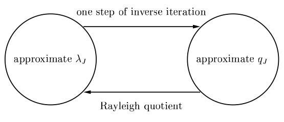

[Álgebra Linear Numérica](../index.md)

<!-- wiki:original:inicio -->

# Quociente de Rayleigh e Iteração Inversa

## Restrição à matrizes reais e simétricas

Aqui nós iremos fazer essa restrição por questões que, ao compararmos os casos gerais e hermitianos, eles tem diferenças consideráveis, então por simplificação, falaremos apenas sobre o caso onde $A$ é real e simétrica, ou seja:

- Autovalores reais

- Autovetores ortonormais

Isso vai continuar pelas próximas lectures até que se especifique que não vai mais continuar. Também vale ressaltar que a maioria das ideias descritas nas próximas lectures se referem a parte 2 das duas fases mencionadas na lecture 25. Ou seja, quando vamos aplicar as ideias que veremos aqui, $A$ já terá sido transformada em uma tri-diagonal. Vale citar que também utilizaremos $\| \cdot \| = \| \cdot \|_{2}$

## Quociente de Rayleigh

**Definição: Quociente de Rayleigh**

O Quociente de Rayleigh de um vetor $x \in {\mathbb{R}}^{m}$ é o escalar $$r(x) = \frac{x^{T}Ax}{x^{T}x}$$

Perceba que se $x$ é um autovetor de $A$ com autovalor $\lambda$ associado, então $r(x) = \lambda$. Uma motivação para essa fórmula é pensarmos no seguinte: Dado um $x$, qual escalar $\alpha$ “mais se comporta como um autovalor” no sentido de minimizar $\| Ax - \alpha x\|$? Isso é um problema de mínimos quadrados $m \times 1$ da forma $\alpha x \approx Ax$. Se escrevermos as equações normais: $$x^{T}\alpha x = x^{T}Ax \Rightarrow \alpha = r(x)$$ A gente pode fazer essas ideias mais quantitativas se tomarmos $r(x):{\mathbb{R}}^{m} \rightarrow {\mathbb{R}}$, então podemos tomar interesse no comportamento local de $r(x)$ quando $x$ está perto de um autovalor. A gente pode calcular as derivadas parciais para isso: $$\begin{array}{r} \frac{\partial r(x)}{\partial x_{j}} = \frac{\frac{\partial}{\partial x_{j}}\left( x^{T}Ax \right)}{x^{T}x}\frac{- \left( \left( x^{T}Ax \right)\frac{\partial}{\partial x_{j}}\left( x^{T}x \right) \right)}{\left( x^{T}x \right)^{2}} \\ = \frac{2(Ax)_{j}}{x^{T}x} - \frac{\left( x^{T}Ax \right)2x_{j}}{\left( x^{T}x \right)^{2}} = \frac{2}{x^{T}x}\left( Ax - r(x)x \right)_{j} \end{array}$$ Podemos então expressar o gradiente como: $$\nabla r(x) = \frac{2}{x^{T}x}\left( Ax - r(x)x \right)$$ É bem fácil de ver que, se a gente tem $\nabla r(x) = 0$, com $x \neq 0$ então $x$ é um autovetor de $A$ (Tenta fazer mentalmente e lembra que $r(x) \in {\mathbb{R}}$) e o inverso também, se $x$ é autovetor de $A$ então $\nabla r(x) = 0$.

Expressando geometricamente, os autovetores de $A$ são pontos estacionários (pontos críticos) de $r(x)$ e os autovalores de $A$ são os valores de $r(x)$ nesses pontos críticos.

*Figura 7. $r(x)$ em função dos vetores no ${\mathbb{R}}^{2}$ para a matriz $\begin{pmatrix} 5 & 4 \\ 0 & 3 \end{pmatrix}$*

Mas algo interessante que podemos perceber é que, aparentemente, não há apenas **um** ponto crítico nessa função, mas uma **reta**. Ué, mas por quê? O que acontece se, dado que $Ax = \lambda x$, eu pego um múltiplo $\mu x$ de $x$? $$A(\mu x) = \lambda(\mu x)$$ $\mu x$ **ainda é autovetor de $A$**. O que isso quer dizer? Quer dizer que, se um vetor $x$ faz com que $r(x)$ seja igual a um autovalor de $A$, então $\alpha x$ também o fará $\forall\alpha \in {\mathbb{R}}$. Não acredita em mim? Veja por conta própria: $$\begin{array}{r} \text{ Dado que }Ax = \lambda x \\ r(\alpha x) = \frac{(\alpha x)^{T}A(\alpha x)}{(\alpha x)^{T}(\alpha x)} = \frac{\alpha^{2}x^{T}Ax}{\alpha^{2}x^{T}Ax} = \frac{\lambda x^{T}x}{x^{T}x} = \lambda \end{array}$$ Mas podemos contornar isso **limitando** o domínio de $r(x)$. Podemos fazer isso fazendo com $r(x):{\mathbb{R}}^{m} \rightarrow {\mathbb{R}}\text{ tal que }\| x\| = 1$, dessa forma, limitamos a $m$-esfera unitária em ${\mathbb{R}}^{m}$ (No exemplo da [\[rayleigh-coefficient-example\]](#rayleigh-coefficient-example), seria uma circunferência em ${\mathbb{R}}^{2}$). Dessa forma, em vez de serem retas com infinitos valores possíveis para zerar $\nabla r(x)$, temos pontos isolados **na** esfera.

![Mesma função da [\[rayleigh-coefficient-example\]](#rayleigh-coefficient-example) limitada dentro do cilíndro $x^{2} + y^{2} \leq 1$. Só não coloquei $= 1$ pois o Geogebra não conseguia fazer a plotagem](../assets/r%28x%29-unit-sphere.png)

*Figura 8. Mesma função da [\[rayleigh-coefficient-example\]](#rayleigh-coefficient-example) limitada dentro do cilíndro $x^{2} + y^{2} \leq 1$. Só não coloquei $= 1$ pois o Geogebra não conseguia fazer a plotagem*

Seja $q_{j}$ um autovetor de $A$, do fato que $\nabla r\left( q_{j} \right) = 0$ nós chegamos que: $$r(x) - r\left( q_{j} \right) = O\left( \| x - q_{j}\|^{2} \right),x \rightarrow q_{j}$$ Não precisamos entender o passo-a-passo até chegar nesse resultado, o importante dele é que o quociente de Rayleigh é uma **ótima** aproximação dos autovalores de $A$.

Um jeito mais explícito de vermos isso é expressar $x$ como uma combinação linear dos autovetores de $A$ (A gente pode fazer isso já que todos os autovetores de uma matriz são L.I), ou seja: $x = \sum_{j = 1}^{m}a_{j}q_{j}$, o que significa que $r(x) = \sum_{j = 1}^{m}a_{j}^{2}\lambda_{j}/\sum_{j = 1}^{m}a_{j}^{2}$, que é uma média ponderada dos autovalores de $A$.

## Iteração por Potências

Agora nós invertemo as bola. Suponha que $v^{(0)}$ é um vetor com $\| v^{(0)}\| = 1$. O processo de iteração por potência, citado antes como não muito bom, é esperado para convergir para o maior autovalor de $A$

1.  **function** PowerIteration($A \in {\mathbb{C}}^{m \times m}$, $v^{(0)}\text{ com }\| v^{(0)}\| = 1$) {

    1.  **for** $k = 1,2,3,\ldots$

        1.  $w = Av^{(k - 1)}$

        2.  $v^{(k)} = w/\| w\|$

        3.  $\lambda^{(k)} = \left( v^{(k)} \right)^{T}Av^{(k)}$

2.  }

*Figura 9. Iteração por potências*

**Teorema**

Suponha que $\vert \lambda_{1}\vert  > \vert \lambda_{2}\vert  \geq \ldots \geq \vert \lambda_{m}\vert  > 0$ e $q_{1}^{T}v^{(0)} \neq 0$. Então as iterações do [\[power-iteration\]](#power-iteration) satisfazem: $$\| v^{k} - \left( \pm q_{1} \right)\| = O\left( \vert \frac{\lambda_{2}}{\lambda_{1}}\vert ^{k} \right),\vert \lambda^{(k)} - \lambda_{1}\vert  = O\left( \vert \frac{\lambda_{2}}{\lambda_{1}}\vert ^{2k} \right)$$ Conforme $k \rightarrow \infty$. O sinal $\pm$ significa que, a cada passo $k$, um dos dois sinais será escolhido para melhor estabilidade numérica

**Demonstração**

Escreva $v^{(0)} = a_{1}q_{1} + \ldots + a_{m}q_{m}$. Como $v^{(k)}$ é múltiplo de $A^{k}v^{(0)}$ temos que, para algumas contantes $c_{k}$ $$\begin{array}{r} v^{(k)} = c_{k}A^{k}v^{(0)} \\ = c_{k}\left( a_{1}\lambda_{1}^{k}q_{1} + \ldots + a_{m}\lambda_{m}^{k}q_{m} \right) \\ = c_{k}\lambda_{1}^{k}\left( a_{1}q_{1} + \ldots + a_{m}\left( \lambda_{1}/\lambda_{m} \right)^{k}q_{m} \right) \end{array}$$

A primeira equação se da ao fato de que, quando $\lim\limits_{k \rightarrow \infty}\left( \frac{\lambda_{j}}{\lambda_{1}} \right)^{k} = 0$, porém, como $\lambda_{2}$ é o maior entre $\lambda_{j}$, acaba que $\left( \frac{\lambda_{2}}{\lambda_{1}} \right)^{k}$ domina o fator de erro $v^{(k)} - \left( \pm q_{1} \right)$.

A segunda envolve uma análise complicada que não há necessidade prática de visualizarmos

O método de iteração por potências é bem ruim pois depende de alguns fatores específicos.

1.  Só pode encontrar o maior autovalor de uma matriz

2.  Se os dois maiores autovalores são próximos, a convergência demora muito

3.  Se os dois maiores autovalores possuem mesmo valor, então o algoritmo não converge

## Iteração Inversa

Antes de entendermos o que a iteração inversa faz, vamos conferir um teorema:

**Teorema**

Dado $\mu \in {\mathbb{R}}$ tal que $\mu$ **não é** autovalor de $A$, então os autovetores de $(A - \mu I)^{- 1}$ são os mesmos de $A$, onde os autovalores correspondentes são $\left\{ \left( \lambda_{j} - \mu \right)^{- 1} \right\}$ de tal forma que $\lambda_{j}$ são os autovalores de $A$

**Demonstração**

Muito importante ressaltar que, como $\mu$ **não é** autovalor de $A$, então $A - \mu I$ é **inversível**. $$\begin{array}{r} Av = \lambda v \\ Av - \mu Iv = \lambda v - \mu Iv \\ (A - \mu I)v = (\lambda - \mu)v\begin{array}{r} \\ (A - \mu I) \end{array}^{- 1}(A - \mu I)v = (A - \mu I)^{- 1}(\lambda - \mu)v \\ \frac{1}{\lambda - \mu}v = (A - \mu I)^{- 1}v \end{array}$$

E isso nos dá uma ideia! Se aplicarmos a iteração de potências em $(A - \mu I)^{- 1}$, o valor convergirá rapidamente para $q_{j}$ (Autovetor de $A$)

1.  **function** ReverseIteration($A \in {\mathbb{C}}^{m \times m}$, $v^{(0)}\text{ com }\| v^{(0)}\| = 1$) {

    1.  **for** $k = 1,2,3,\ldots$

        1.  Resolva $(A - \mu I)w = v^{(k - 1)}$ para $w$

        2.  $v^{(k)} = w/\| w\|$

        3.  $\lambda^{(k)} = \left( v^{(k)} \right)^{T}Av^{(k)}$

2.  }

*Figura 10. Iteração Inversa*

Você pode estar se perguntando: “Mas e se $\mu$ for um autovalor de $A$? Isso vai fazer com que $A - \mu I$ não seja inversível! Ou de $\mu$ for muito próximo de um autovalor de $A$, se isso acontecer, $A - \mu I$ vai ser **muito** mal-condicionada e vai ser quase impossível uma inversa precisa! Isso não vai quebrar o algoritmo?”. São perguntas válidas, mas não, isso não quebra o algoritmo! Há um exercício no livro que aborda isso (Se eu conseguir resolver antes da A2, eu coloco aqui).

Aqui o algoritmo também é um pouco mais interessante pois, dependendo do $\mu$ que escolhermos, podemos encontrar um autovalor diferente, ou seja, podemos escolher qual autovalor encontrar se fizermos a escolha certa de $\mu$

**Teorema**

Suponha que $\lambda_{J}$ é o autovalor **mais próximo** de $\mu$ e $\lambda_{K}$ é o **segundo** mais próximo. Suponha então que $q_{J}^{T}v^{(0)} \neq 0$, então as iterações do [\[inverse-power-iteration\]](#inverse-power-iteration) satisfazem: $$\begin{array}{r} \| v^{(k)} - \left( \pm q_{J} \right)\| = O\left( \vert \frac{\mu - \lambda_{J}}{\mu - \lambda_{K}}\vert ^{k} \right) \\ \vert \lambda^{(k)} - \lambda_{J}\vert  = O\left( \vert \frac{\mu - \lambda_{J}}{\mu - \lambda_{K}}\vert ^{2k} \right) \end{array}$$ Conforme $k \rightarrow \infty$ e $\pm$ tem o mesmo significado que [\[power-iteration-stability\]](../iteracao-por-potencias/index.md#power-iteration-stability)

Esse algoritmo, como mencionado, é muito útil se os autovalores são conhecidos ou se tem uma noção de quanto eles valem aproximadamente ($\mu$ converge para o mais próximo)

## Iteração do Quociente de Rayleigh

Beleza, a gente ja bisoiou 2 métodos, um que a gente tem uma estimativa inicial de autovetor, e vai aproximando o autovalor, depois uma que a gente tem uma aproximação de um autovalor e vamos aproximando um autovetor, combinar as duas ideias me parece uma **boa ideia**.

*Figura 11. Iteração do Quociente de Rayleigh*

A ideia é a gente ficar melhorando a estimativa de autovalores que temos pra que o algoritmo de **iteração reversa** tenha uma convergência muito mais rápida

1.  **function** RayleighQuotientIteration($A \in {\mathbb{C}}^{m \times m}$) {

    1.  $v^{(0)}\text{ com }\| v^{(0)}\| = 1$

    2.  $\lambda^{(0)} = \left( v^{(0)} \right)^{T}Av^{(0)}$

    3.  **for** $k = 1,2,3,\ldots$

        1.  Resolva $\left( A - \lambda^{(k - 1)}I \right)w = v^{(k - 1)}$ para $w$

        2.  $v^{(k)} = w/\| w\|$

        3.  $\lambda^{(k)} = \left( v^{(k)} \right)^{T}Av^{(k)}$

2.  }

*Figura 12. Iteração do Quociente de Rayleigh*

A convergência do algoritmo é ótima, a cada iteração o valor de precisão triplica.

**Teorema**

Quando o algoritmo de iteração do quociente de rayleigh converge para um autovalor $\lambda_{J}$ e um autovetor $q_{J}$ de $A$ de forma que: $$\begin{array}{r} \| v^{(k + 1)} - \left( \pm q_{J} \right)\| = O\left( \| v^{(k)} - \left( \pm q_{J} \right)\|^{3} \right) \\ \vert \lambda^{(k + 1)} - \lambda_{J}\vert  = O\left( \vert \lambda^{(k)} - \lambda_{J}\vert ^{3} \right) \end{array}$$

Não há necessidade de uma demonstração formal, apenas a ideia de que há uma **ótima** conversão do algoritmo

------------------------------------------------------------------------

<!-- wiki:original:fim -->

## Percurso de estudo

[Trilha: A2](../../../trilhas/algebra-linear-numerica/a2.md) · [Apresentação e contexto da fonte](../../../trilhas/algebra-linear-numerica/a2.md#apresentacao-original)

- Anterior: [Redução à forma de Hessenberg](../reducao-a-forma-de-hessenberg/index.md)
- Próximo: [Algoritmo QR sem Shift](../algoritmo-qr-sem-shift/index.md)
