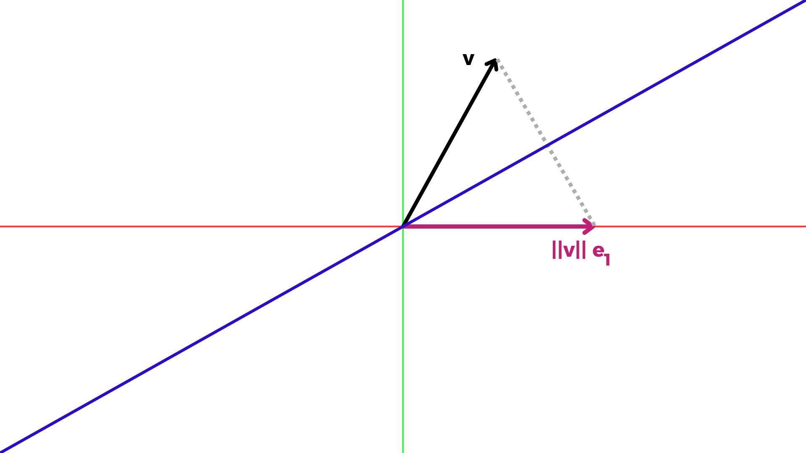

[Álgebra Linear Numérica](../index.md)

<!-- wiki:original:inicio -->

# Triangularização de Householder

## Triangularização por Introdução de Zeros

No coração do algoritmo de Householder, temos a ideia de aplicar uma matriz ortogonal que introduz zeros abaixo da diagonal principal! Assim (neste exemplo, $x$ significa uma entrada não nula, **$x$** significa uma entrada que mudou desde a última aplicação ortogonal e nada significa 0)

$$
\begin{pmatrix} x & x & x \\ x & x & x \\ x & x & x \\ x & x & x \\ x & x & x \end{pmatrix}_{A} \rightarrow Q_{1}A \rightarrow \begin{pmatrix} \mathbf{x} & \mathbf{x} & \mathbf{x} \\ & \mathbf{x} & \mathbf{x} \\ & \mathbf{x} & \mathbf{x} \\ & \mathbf{x} & \mathbf{x} \\ & \mathbf{x} & \mathbf{x} \end{pmatrix}_{Q_{1}A} \rightarrow Q_{2}Q_{1}A \rightarrow \begin{pmatrix} x & x & x \\ & \mathbf{x} & \mathbf{x} \\ & & \mathbf{x} \\ & & \mathbf{x} \\ & & \mathbf{x} \end{pmatrix}_{Q_{2}Q_{1}A} \rightarrow Q_{3}Q_{2}Q_{1}A \rightarrow \begin{pmatrix} x & x & x \\ & x & x \\ & & \mathbf{x} \\ & & \\ & & \end{pmatrix}_{Q_{3}Q_{2}Q_{1}A}
$$

## Refletores de Householder

Ok, entendemos como o algoritmo vai funcionar, mas que tipo de matrizes pode fazer tal coisa? É aqui que entram em cena os **refletores de Householder**! Cada $Q_{k}$ terá esta estrutura: $$Q_{k} = \begin{pmatrix} I & 0 \\ 0 & F \end{pmatrix}$$ Onde $I$ é a matriz identidade de tamanho $k - 1 \times k - 1$ e $F$ é uma matriz unitária $m - k + 1 \times m - k + 1$. Mas por que essa estrutura, onde vimos isso? Bem, lembre-se que, como vimos antes, quando multiplicamos $Q_{k - 1}\ldots Q_{1}A$ por $Q_{k}$, queremos manter as linhas $1$ a $k - 1$ intocadas, então, para fazer isso, criamos uma matriz bloco $k - 1 \times k - 1$ da identidade para manter essas linhas intocadas.

E por que $F$ é uma matriz unitária? Bem, sabemos que, por causa dos zeros abaixo de $I$ e acima de $F$, as colunas de $F$ serão ortogonais às colunas de $I$ independentemente do que eu colocar ali, mas queremos que $Q_{k}$ seja ortogonal, então, se as colunas de $I$ já são ortonormais, só precisamos que as colunas de $F$ também sejam ortonormais, ou seja, $F$ deve ser ortogonal.

Ok, mas agora a parte mais difícil, precisamos que, quando multiplicarmos por $F$, ela introduza zeros abaixo da $k$-ésima entrada da diagonal e ainda seja ortogonal. Vamos fazer $F$ estar em ${\mathbb{C}}^{m - k + 1 \times m - k + 1}$ e afetar vetores de ${\mathbb{C}}^{m - k + 1}$ (podemos ver as linhas abaixo das $k$-ésimas entradas de vetores desse espaço), então queremos que a primeira entrada dos vetores seja diferente de 0 e o resto seja 0, sabendo que matrizes ortogonais são rotações em um espaço, podemos fazer $F$ fazer isso:

$$
x = \begin{pmatrix} x \\ x \\ x \\ \vdots \\ x \end{pmatrix} \rightarrow Fx = \begin{pmatrix} \| x\| \\ 0 \\ 0 \\ \vdots \\ 0 \end{pmatrix} = \| x\| e_{1}
$$

Como mostrado nesta figura: 

Observe que projetar $v$ para obter $\| v\| e_{1}$ não nos dará uma projeção ortogonal, mas podemos projetá-lo na linha azul, que é a bissetriz do ângulo entre $v$ e $\| v\| e_{1}$. Essa bissetriz forma um ângulo de 90 graus com $\| v\| e_{1} - v$. Este é um plano 2D, então é a bissetriz do ângulo, mas em um espaço de dimensão maior, será um hiperplano ortogonal a $\| v\| e_{1} - v$. Vamos definir $w = \| v\| e_{1} - v$, então, se $H$ é o hiperplano ortogonal a $w$, podemos projetar $v$ sobre $H$ fazendo:

$$
Pv = I - \frac{ww^{\ast}}{w^{\ast}w}v
$$

Mas, como podemos ver, se projetarmos $v$ sobre $H$, para chegar a $\| v\| e_{1}$, precisamos percorrer duas vezes a distância que acabamos de percorrer, então, a equação final para o refletor de Householder é:

$$
F = I - 2\frac{ww^{\ast}}{w^{\ast}w}
$$

## O Melhor de Dois Refletores

Na verdade, podemos ter muitos refletores de Householder, por exemplo, no caso complexo, podemos projetar $v$ em qualquer vetor $z\| v\| e_{1}$ com $\vert z\vert  = 1$. No caso real, temos duas alternativas:

Então, o que devo escolher? Qual vetor é melhor para meu algoritmo? Todos serão a mesma coisa? Na verdade, há uma melhor opção que você pode escolher! Matematicamente, todos são a mesma coisa, mas para estabilidade numérica (insensibilidade a erros de arredondamento), escolheremos o $z\| v\| e_{1}$ que não está muito próximo de $v$, para alcançar isso, projetaremos em $- \text{sign}\left( v_{1} \right)\| v\| e_{1}$ onde $v_{1}$ é a primeira entrada de $v$, isso significa:

$$
w = - \text{sign}\left( v_{1} \right)\| v\| e_{1} - v \vee w = \text{ sign}\left( v_{1} \right)\| v\| e_{1} + v
$$

E podemos definir que:

$$
\text{ sign}(0) = 1
$$

Só para esclarecer por que fizemos essa escolha, imagine que o ângulo entre $v$ e $\| v\| e_{1}$ é MUITO PEQUENO, isso significa que, quando fazemos $\| v\| e_{1} - v$, estamos subtraindo quantidades próximas, dependendo de quais quantidades, isso poderia nos levar a cálculos imprecisos, levando a grandes erros

## O Algoritmo

Agora podemos reescrevê-lo como um algoritmo, mas antes disso:

**Definição**

Dada a matriz $A$, $A_{i:i',j:j'}$ é a submatriz $(i' - i + 1) \times (j' - j + 1)$ de $A$ com o elemento do canto superior esquerdo igual a $(A)_{ij}$ e o elemento do canto inferior direito igual a $(A)_{i'j'}$. Se a submatriz for um vetor linha ou coluna, podemos escrevê-lo como $A_{i,j:j'}$ ou $A_{i:i',j}$

Dada essa definição, vamos reescrever o algoritmo

1.  **para** $k = 1$ **até** $n$

    1.  $x = A_{k:m,k}$

    2.  $v_{k} = \text{ sign}\left( x_{1} \right)\| x\| e_{1} + x$

    3.  $v_{k} = \frac{v_{k}}{\| v_{k}\|}$

    4.  $A_{k:m,k:n} = A_{k:m,k:n} - 2v_{k}\left( v_{k}^{\ast}A_{k:m,k:n} \right)$

## Aplicando na formação de Q

Observe que não construímos a matriz $Q$ inteira no algoritmo, apenas aplicamos: $$Q^{\ast} = Q_{n}\ldots Q_{1} \Leftrightarrow Q = Q_{1.}..Q_{n}$$ (Não há asteriscos faltando, porque cada $Q_{j}$ é hermitiana!)

Fazemos isso porque construir $Q$ requer trabalho extra, então trabalhamos diretamente com $Q_{j}$. Por exemplo, lembra que podemos reescrever $b = Ax$ como $Q^{\ast}b = Rx$? Bem, podemos fazer isso como no algoritmo anterior:

1.  **para** $k = 1$ **até** $n$

    1.  $b_{k:m} = b_{k:m} - 2v_{k}\left( v_{k}^{\ast}b_{k:m} \right)$

Observe que fizemos o mesmo processo que fizemos com $A$, só não explicitei as partes onde defini $v_{k}$ e o normalizei.

------------------------------------------------------------------------

<!-- wiki:original:fim -->

## Percurso de estudo

[Trilha: A1](../../../trilhas/algebra-linear-numerica/a1.md) · [Apresentação e contexto da fonte](../../../trilhas/algebra-linear-numerica/a1.md#apresentacao-original)

- Anterior: [Ortonormalização de Gram-Schmidt](../ortonormalizacao-de-gram-schmidt/index.md)
- Próximo: [Problemas de Mínimos Quadrados](../problemas-de-minimos-quadrados/index.md)
