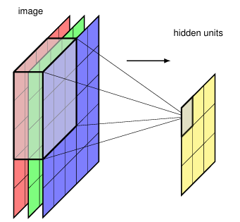
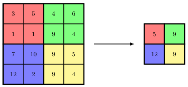
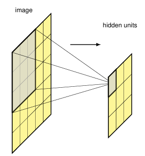

[Aprendizado de Máquina](../index.md)

<!-- wiki:original:inicio -->

# Convolutional Neural Networks (CNN)

## Arquiteturas

Mas como podemos combinar todas essas operações para formar uma rede neural convolucional? A resposta é através de arquiteturas. Uma arquitetura de CNN é composta por várias camadas, cada uma com suas próprias operações de convolução, pooling e funções de ativação. As camadas são organizadas em uma sequência, onde a saída de uma camada é a entrada da próxima camada. As arquiteturas podem variar em profundidade, largura e complexidade, dependendo do problema e da aplicação.

*Figura 9. Representação visual da arquitetura da AlexNet, uma das primeiras CNNs a alcançar sucesso em tarefas de visão computacional. A AlexNet é composta por várias camadas de convolução, pooling e funções de ativação, além de camadas totalmente conectadas no final*

## Convolução Multidimensional

Até o momento, falamos das operações em matrizes bidimensionais ($2$ valores), porém, a maioria das imagem são coloridas, então teríamos 3 matrizes, uma para cada canal de cor. Expandir essa operação para múltiplos canais é relativamente simples. Se minha imagem $I$ tem dimensões $H \times W \times C$ (altura, largura e quantidade de canais) e o filtro $K$ tem dimensões $M \times M \times C$, eu vou utilizar cada feature map $M \times M$ com seu respectivo canal da imagem, e somar os resultados. A feature map resultante terá dimensões $(H - M + 1) \times (W - M + 1)$, e cada valor de ativação representará a presença de um padrão específico na região correspondente da imagem, considerando todos os canais de cor. Essa operação é chamada de **convolução multidimensional** e é fundamental para o processamento de imagens coloridas em CNNs.

*Figura 7. Representação visual da operação de convolução multidimensional*

No entanto, essa feature map que formamos, é capaz de detectar apenas um certo padrão de formatos. Por exemplo, ela só pode detectar olhos, mas não pode detectar narizes. Para resolver esse problema, podemos utilizar múltiplos filtros, cada um capaz de detectar um padrão diferente. Dessa forma, dado uma imagem de tamanho $H \times W \times C$, o filtro agora terá tamanho $M \times M \times C \times C_{\text{OUT}}$ onde $C_{\text{OUT}}$ é a quantidade de feature maps resultantes. Cada feature map possui seu próprio bias, dessa forma, o número total de parâmetros do modelo será $C_{\text{OUT }}\left( M^{2}C + 1 \right)$.

### Pooling

Nós vimos anteriormente como obter equivariância à translação, porém, em certas aplicações, queremos que a mesma imagem, mesmo que transladada, seja classificada da mesma forma. Para isso, podemos utilizar uma operação chamada **pooling**, que é uma operação de downsampling que reduz a dimensionalidade da feature map, mantendo as informações mais importantes. Existem diferentes tipos de pooling, como **max pooling**, **average pooling** e **global pooling**.

*Figura 8. Operação de max-pooling em um feature map $4 \times 4$ com uma janela de $2 \times 2$ e stride de $2$, resultando em um feature map $2 \times 2$. A operação de $\max$ pega o valor máximo da janela de pooling*

Seguindo o exemplo da [\[max-pooling\]](#max-pooling), podemos ver que a operação de pooling reduz a dimensionalidade da feature map, mantendo as informações mais importantes. A operação de pooling é importante em CNNs, pois permite que a rede aprenda padrões invariantes à posição do objeto na imagem, além de reduzir o número de parâmetros do modelo e evitar overfitting. Além de max-pooling, também podemos utilizar **average pooling**, que calcula a média dos valores da janela de pooling, e **global pooling**, que calcula a média ou o máximo de toda a feature map. A escolha do tipo de pooling depende da aplicação e do problema em questão.

## Convoluções com Stride

Além do padding, outra técnica importante em CNNs é o **stride**, que é o passo. O stride define quantos pixels o filtro se move a cada aplicação da convolução. Por exemplo, se o stride for $1$, o filtro se move um pixel de cada vez, enquanto se o stride for $2$, o filtro se move dois pixels de cada vez. O uso do stride permite que a rede aprenda padrões em diferentes escalas e resoluções, além de reduzir o tamanho da feature map resultante. Se minha imagem $I$ tem dimensões $H \times W$ e o filtro $K$ tem dimensões $M \times M$, e eu aplico o mesmo passo $S$ tanto verticalmente quanto horizontalmente, e eu apliquei um **padding completo**, então a dimensão do feature map será: $$\left\lfloor {\frac{H + 2P - M}{S} - 1} \right\rfloor \times \left\lfloor {\frac{W + 2P - M}{S} - 1} \right\rfloor$$

## Equivariância em Translação

Imagine que estamos tentando identificar um rosto em uma imagem, se o rosto estiver em uma posição diferente na imagem, a rede ainda deve ser capaz de reconhecê-lo. Nossa rede neural precisa ser capaz de capturar essa propriedade, mas como? Se um filtro é capaz de identificar uma borda em uma região da imagem, ele deve ser capaz de identificar a mesma borda em qualquer outra região da imagem. Isso significa que os filtros devem ser aplicados a toda a imagem, permitindo que a rede aprenda padrões invariantes à posição do objeto na imagem. Essa propriedade é chamada de **equivariância em translação**, e é uma das principais vantagens das CNNs em relação às redes neurais tradicionais.

**Definição: Feature Map/Convolução**

Para uma imagem $I$ com intensidades de pixel $I(j,k)$ e um filtro $K$ com valores $K(l,m)$, a feature map $C$ tem valores de ativação: $$C(j,k) = \sum_{l}\sum_{m}I(j + l,k + m)K(l,m)$$ é comum representar essa operação como $C = I \ast K$, onde $\ast$ denota a operação de convolução. A feature map é uma representação da imagem original, onde cada valor de ativação representa a presença de um padrão específico na região correspondente da imagem. Vale também ressaltar que essa operação, mesmo se chamando convolução, difere da convolução matemática tradicional.

Se $I \in {\mathbb{R}}^{H \times W}$ e $K \in {\mathbb{R}}^{h \times w}$, então $C \in {\mathbb{R}}^{(H - h + 1) \times (W - w + 1)}$

*Figura 5. Representação visual da operação de convolução, onde a feature map $C$ é obtida aplicando o filtro $K$ à imagem $I$*

## Filtros

As CNNs são interessantes. Se tentássemos treinar uma rede neural comum usando uma imagem, seria inviável, pois a rede seria MUITO grande. Imagine uma imagem de, por exemplo, $1000 \times 1000$ pixels. Se tentássemos treinar uma rede neural comum usando essa imagem, teríamos $1.000.000$ de entradas (uma para cada pixel), além de que se for colorida, seria $3.000.000$. Isso resultaria em uma rede neural com milhões de parâmetros, tornando o treinamento extremamente difícil e propenso a overfitting. Para tentar contornar esse problema, as CNNs utilizam de diversas abordagens para, dentro da arquitetura, capturar propriedades específicas de imagens:

- **Hierarquia**: Elementos em imagens possuem uma hierarquia natural. Por exemplo, uma imagem de um rosto humano pode ser decomposta em partes como olhos, nariz e boca, que por sua vez podem ser decompostas em características mais simples, como bordas e texturas. As CNNs são projetadas para capturar essas hierarquias de características, permitindo que a rede aprenda representações cada vez mais complexas à medida que avança pelas camadas.

- **Localidade**: As CNNs exploram a localidade das imagens, ou seja, a ideia de que pixels próximos uns dos outros estão mais relacionados do que pixels distantes. Isso é feito através do uso de filtros convolucionais, que operam em pequenas regiões da imagem, permitindo que a rede capture padrões locais e invariantes a transformações.

- **Equivariância**: As CNNs são projetadas para serem equivariantes a translações, o que significa que se um objeto na imagem for deslocado, a rede ainda será capaz de reconhecê-lo. Isso é alcançado através do uso de operações de convolução e pooling, que permitem que a rede aprenda características independentes da posição do objeto na imagem.

- **Invariância**: As CNNs também podem ser projetadas para serem invariantes a certas transformações, como rotação e escala. Isso é feito através do uso de técnicas como data augmentation, que aumentam a diversidade do conjunto de treinamento, e camadas de pooling, que reduzem a sensibilidade da rede a pequenas variações na posição e tamanho dos objetos.

### Capturando Localidade

Por simplicidade, no momento vamos assumir que nossas imagens estão na escala de cinza (são matrizes no ${\mathbb{R}}^{H \times W}$). Queremos, de alguma forma, capturar a localidade das imagens. Intuitivamente, podemos pensar em, de alguma forma, resumir uma região da imagem em um único valor. Por exemplo, podemos pegar uma região de $3 \times 3$ pixels e calcular a média dos valores dos pixels dessa região. Isso nos daria um único valor representando a intensidade média da região. No entanto, essa abordagem simples não captura padrões mais complexos, como bordas ou texturas

*Figura 4. Representação visual de como podemos capturar a localidade de uma imagem usando uma região de $3 \times 3$ pixels*

Uma forma mais interessante que reflete o que fizemos até o momento, é aplicar uma matriz de pesos à esses pixels. $$z = \text{ ReLU}\left( w^{T}x + w_{0} \right)$$ onde $x$ é o vetor de pixels da região, $w$ é o vetor de pesos e $w_{0}$ é o viés. Essa abordagem permite que a rede aprenda padrões mais complexos, como bordas ou texturas, ao invés de apenas calcular a média da região. Além disso, podemos aplicar diferentes matrizes de pesos a diferentes regiões da imagem, permitindo que a rede aprenda diferentes padrões em diferentes partes da imagem. Esses filtros também são chamados popularmente de **kernels** e são aplicados a toda a imagem, permitindo que a rede aprenda padrões invariantes à posição do objeto na imagem. A operação de aplicar um filtro a uma região da imagem é chamada de **convolução**, e é a base das CNNs.

## Imagens como dados

Podemos interpretar imagens como dados estruturados em uma grade bidimensional, onde cada pixel representa uma unidade de informação. Cada pixel possui valores que representam a intensidade da cor em diferentes canais (como vermelho, verde e azul para imagens RGB). Essa estrutura de grade permite que as CNNs explorem a relação espacial entre os pixels, capturando padrões locais e hierárquicos. $$I \in {\mathbb{R}}^{H \times W \times C}$$ onde $H$, $W$ e $C$ representam a altura, largura e número de canais da imagem, respectivamente. No caso, se a imagem é colorida, $C = 3$ e se ela é preto e branco, $C = 1$ (O que podemos entender como uma matriz com dimensões $H \times W$)

## Introdução

Dentro do campo de aprendizado de máquina, redes neurais convolucionais (CNNs) são uma classe de redes neurais artificiais projetadas para processar dados com uma estrutura de grade, como imagens. Elas são inspiradas na organização do córtex visual dos animais e são particularmente eficazes em tarefas de visão computacional, como reconhecimento de objetos, detecção de objetos e segmentação de imagens.

O campo de visão computacional tem sido um dos principais impulsionadores do desenvolvimento de CNNs, com aplicações em reconhecimento facial, análise de imagens médicas, veículos autônomos e muito mais. As CNNs são capazes de aprender automaticamente características hierárquicas dos dados, permitindo que elas capturem padrões complexos e invariantes a transformações, como rotação e escala. Algumas aplicações de machine learning no campo da visão computacional são:

- **Classificação de imagens**: Identificar a categoria a que uma imagem pertence, como classificar fotos de animais em diferentes espécies.

- **Detecção de objetos**: Localizar e identificar objetos específicos dentro de uma imagem, como detectar carros, pedestres ou sinais de trânsito em imagens de ruas.

- **Segmentação de imagens**: Dividir uma imagem em regiões significativas, como segmentar diferentes órgãos em imagens médicas para análise diagnóstica.

- **Reconhecimento facial**: Identificar ou verificar a identidade de uma pessoa com base em sua imagem facial, utilizado em sistemas de segurança e autenticação.

- **Síntese**: Gerar novas imagens a partir de descrições textuais ou de outras imagens, como criar imagens realistas de pessoas ou objetos que não existem.

## Os Gradientes

Não basta mostrar arquiteturas e métodos usados em CNN se não sabemos como treiná-las. Para isso, precisamos entender como calcular os gradientes das operações de convolução e pooling. O cálculo dos gradientes é feito através do algoritmo de backpropagation (também muito utilizado o automatic differentiation).

### Convolução sem Padding e Stride

Vamos primeiro olhar a derivação dos gradientes no caso mais fácil, que é com uma imagem com escalas de cinza, onde toda a imagem é representada por uma única matriz 2D.

**Definição: Convolução/Correlação Cruzada 2D sem padding e stride**

Seja a imagem $X \in {\mathbb{R}}^{H \times W}$ e o filtro $K \in {\mathbb{R}}^{M \times N}$, definimos a saída da camada convolucional, sem padding e sem stride como: $$(X \ast K)_{ij} = Y_{ij} = \sum_{m = 0}^{M - 1}\sum_{n = 0}^{N - 1}X_{i + m,j + n}K_{mn} + b$$ para $$0 \leq i \leq H - M\text{\quad\quad}0 \leq j \leq W - N$$

considere que estamos trabalhando com o gradiente em cima de uma função de perca $L$, por exemplo, se estamos usando a CNN para fazer a classificação de imagens, podemos usar a função de perca **cross-entropy**. Defina também: $$\delta_{ij} = \frac{\partial L}{\partial Y_{ij}}$$

**Teorema: Gradiente da Convolução Discreta 2D sem padding e stride**

O gradiente da perca em relação ao coeficiente $K_{mn}$ é dado por: $$\frac{\partial L}{\partial K_{mn}} = \sum_{i = 0}^{H - M}\sum_{j = 0}^{W - N}\delta_{ij}X_{i + m,j + n}$$ para $$0 \leq m \leq M - 1\text{\quad\quad}0 \leq n \leq N - 1$$ ou, equivalentemente, podemos escrever de forma matricial como: $$\nabla_{K}L = X \ast \delta$$ onde $\delta \in {\mathbb{R}}^{H - M + 1 \times W - N + 1}$ e $$\delta = \begin{pmatrix} - & \delta_{0,0} & - & \delta_{0,1} & - & \ldots & - & \delta_{0,W - N} & - \\ & \vdots & \\ - & \delta_{H - M,0} & - & \delta_{H - M,1} & - & \ldots & - & \delta_{H - M,W - N} & - \end{pmatrix}$$

**Demonstração**

Pela regra da cadeia, temos que $$\frac{\partial L}{\partial K_{mn}} = \sum_{i,j}\frac{\partial L}{\partial Y_{ij}}\frac{\partial Y_{ij}}{\partial K_{mn}}$$ e, por definição $$Y_{ij} = \sum_{u,v}X_{i + u,j + v}K_{uv} + b$$ logo: $$\frac{\partial Y_{ij}}{\partial K_{mn}} = X_{i + m,j + n}$$ substituindo na equação anterior, temos que $$\frac{\partial L}{\partial K_{mn}} = \sum_{i,j}\delta_{ij}X_{i + m,j + n}$$

**Teorema: Gradiente do Bias**

Temos que: $$\frac{\partial L}{\partial b} = \sum_{ij}\delta_{ij}$$

**Demonstração**

Novamente, pela regra da cadeia, temos que $$\frac{\partial L}{\partial b} = \sum_{i,j}\frac{\partial L}{\partial Y_{ij}}\frac{\partial Y_{ij}}{\partial b}$$ e como vimos anteriormente, pela definição, temos que $$\frac{\partial Y_{ij}}{\partial b} = 1$$ substituindo na equação anterior, temos que $$\frac{\partial L}{\partial b} = \sum_{i,j}\delta_{ij}$$

**Teorema: Gradiente da Imagem**

O gradiente da perca em relação à imagem $X$ é dado por: $$\frac{\partial L}{\partial X_{ij}} = \sum_{m = 0}^{M - 1}\sum_{n = 0}^{N - 1}\delta_{i - m,j - n}K_{mn}$$ para $$0 \leq i \leq H - 1\text{\quad\quad}0 \leq j \leq W - 1$$ ou, equivalentemente, podemos escrever de forma matricial como: $$\nabla_{X}L = \delta \ast K^{\text{flip }}$$ onde $\delta \in {\mathbb{R}}^{H - M + 1 \times W - N + 1}$ e $K^{\text{flip}}$ é a imagem da kernel $K$ rotacionada por 180 graus, ou seja: $$K_{mn}^{\text{flip}} = K_{M - 1 - m,N - 1 - n}$$

**Demonstração**

Vamos fixar uma coordenada $(a,b)$ e calcular o gradiente da perca em relação à imagem $X$ nessa coordenada. Pela regra da cadeia, temos que: $$\frac{\partial L}{\partial X_{ab}} = \sum_{i,j}\frac{\partial L}{\partial Y_{ij}}\frac{\partial Y_{ij}}{\partial X_{ab}}$$ como vimos anteriormente, pela definição, temos que $$Y_{ij} = \sum_{u,v}X_{i + u,j + v}K_{uv} + \text{ bias }$$ temos então que $$\frac{\partial Y_{ij}}{\partial X_{ab}} = K_{a - i,b - j}$$ sempre que os índices estão no suporte do kernel. Logo, $$\frac{\partial L}{\partial X_{ab}} = \sum_{i,j}\delta_{ij}K_{a - i,b - j}$$ e por que essa expressão equivale a $K^{\text{flip}}$? Pois, se definirmos $K_{ij}^{\text{flip}} = K_{M - 1 - i,N - 1 - j}$, então podemos reescrever a expressão acima como: $$\frac{\partial L}{\partial X_{ab}} = \sum_{i,j}\delta_{a - i,b - j}K_{ij}^{\text{flip}}$$

### Convolução com Padding e Stride

**Definição: Padding**

Padding pode ser definido como uma função $T:{\mathbb{R}}^{H \times W} \rightarrow {\mathbb{R}}^{H + 2P \times W + 2P}$, onde $P$ é o tamanho do padding que adicona $P$ linhas e $P$ colunas de zeros ao redor da imagem original

**Teorema: Padding é Linear**

Seja $X,Y \in {\mathbb{R}}^{H \times W}$ e $T(X) \in {\mathbb{R}}^{H + 2P \times W + 2P}$ o padding de $X$, então temos que: $$T(\alpha X + \beta Y) = \alpha T(X) + \beta T(Y)$$

**Demonstração**

Primeiro, vamos mostrar que $T$ é linear em vetores, e então, mostrar que a operação também é linear em matrizes. Seja $x \in {\mathbb{R}}^{m}$ e $\hat{x} = T(x) \in {\mathbb{R}}^{m + 2P}$ o padding de $x$, temos que a operação faz: $$\begin{pmatrix} x_{1} \\ x_{2} \\ \vdots \\ x_{m} \end{pmatrix} \mapsto \begin{pmatrix} 0 \\ \vdots \\ 0 \\ x_{1} \\ \vdots \\ x_{m} \\ 0 \\ \vdots \\ 0 \end{pmatrix}$$ No entando, perceba que, se definirmos a matriz: $$M = \begin{pmatrix} \mathbf{0} \\ I \\ \mathbf{0} \end{pmatrix} \in {\mathbb{R}}^{(m + 2P) \times m}$$ onde $\mathbf{O} \in {\mathbb{R}}^{P \times m}$ e a identidade $I \in {\mathbb{R}}^{m \times m}$, então podemos definir: $$\hat{x} = T(x) = Mx$$ então podemos definir o padding de matrizes como: $$T(X) = \begin{pmatrix} & \vert  & & \vert  & \\ \mathbf{0} & T\left( x_{1} \right) & \ldots & T\left( x_{W} \right) & \mathbf{0} \\ & \vert  & & \vert \end{pmatrix}$$ esses novos $0$ são bloco de matrizes de zeros de tamanho $H \times P$. Logo, temos que: $$T(X) = \begin{pmatrix} \mathbf{0} & M & \mathbf{0} \end{pmatrix}X$$ onde $M$ é matriz $(m + 2P) \times m$ que vimos e $\mathbf{0}$ é uma matriz de zeros de tamanho $H \times P$. Logo, temos no final uma matriz de tamanho $(H + 2P) \times (W + 2P)$ e, como $T$ é uma multiplicação de matrizes, temos que $T$ é linear.

**Definição: Stride**

Seja $S \in {\mathbb{N}}$ o stride. Definimos o operador de stride

$$
D_{S}:{\mathbb{R}}^{H \times W} \rightarrow {\mathbb{R}}^{H' \times W'}
$$

onde

$$
H' = \left\lfloor \frac{H - 1}{S} \right\rfloor + 1
$$

e

$$
W' = \left\lfloor \frac{W - 1}{S} \right\rfloor + 1
$$

tal que

$$
\left( D_{S}(X) \right)_{i,j} = X_{iS,jS}.
$$

Em outras palavras, o operador mantém apenas as entradas espaçadas de $S$ posições.

**Teorema: Stride é Linear**

Seja

$$
D_{S}:{\mathbb{R}}^{H \times W} \rightarrow {\mathbb{R}}^{H' \times W'}
$$

o operador de stride de tamanho $S$.

Então

$$
D_{S}(\alpha X + \beta Y) = \alpha D_{S}(X) + \beta D_{S}(Y)
$$

para quaisquer

$$
X,Y \in {\mathbb{R}}^{H \times W}
$$

e

$$
\alpha,\beta \in {\mathbb{R}}.
$$

**Demonstração**

Primeiro consideremos o caso vetorial.

Seja

$$
x = \left( x_{0},x_{1},\ldots,x_{n - 1} \right)^{T} \in {\mathbb{R}}^{n}.
$$

O operador de stride mantém apenas as coordenadas

$$
0,S,2S,\ldots
$$

Assim,

$$
D_{S}(x) = \left( x_{0},x_{S},x_{2S},\ldots \right)^{T}.
$$

Definamos a matriz

$$
M_{S} = \begin{pmatrix} 1 & 0 & 0 & 0 & \ldots \\ 0 & \ldots & 1 & 0 & \ldots \\ \ldots & \ldots & \ldots & \ldots & \ldots \end{pmatrix}
$$

cujas linhas possuem exatamente um elemento igual a $1$ nas posições

$$
0,S,2S,\ldots
$$

e zero nas demais.

Então

$$
D_{S}(x) = M_{S}x.
$$

Logo,

$$
D_{S}(\alpha x + \beta y) = M_{S}(\alpha x + \beta y)
$$

$$
= \alpha M_{S}x + \beta M_{S}y
$$

$$
= \alpha D_{S}(x) + \beta D_{S}(y).
$$

Portanto $D_{S}$ é linear em vetores.

**Definição: Convolução/Correlação Cruzada 2D com padding e stride**

Seja $X \in {\mathbb{R}}^{H \times W}$, $K \in {\mathbb{R}}^{M \times N}$, $P$ o padding, $S$ o stride e $\widetilde{X} = T(X)$ a imagem com padding, então a saída da camada convolucional é dada por: $$Y_{ij} = \sum_{m = 0}^{M - 1}\sum_{n = 0}^{N - 1}{\widetilde{X}}_{i \cdot S + m,j \cdot S + n}K_{mn} + b$$

**Teorema: Gradiente da Convolução Discreta 2D com padding e stride**

O gradiente da perca em relação ao coeficiente $K_{mn}$ é dado por: $$\frac{\partial L}{\partial K_{mn}} = \sum_{i = 0}^{H - M}\sum_{j = 0}^{W - N}\delta_{ij}{\widetilde{X}}_{i \cdot S + m,j \cdot S + n}$$ para $$0 \leq m \leq M - 1\text{\quad\quad}0 \leq n \leq N - 1$$ ou, equivalentemente, podemos escrever de forma matricial como: $$\nabla_{K}L = \widetilde{X} \ast \delta$$ onde $\ast$ denota a convolução cruzada com stride $S$

**Demonstração**

Pela regra da cadeia, temos que $$\frac{\partial L}{\partial K_{mn}} = \sum_{i,j}\frac{\partial L}{\partial Y_{ij}}\frac{\partial Y_{ij}}{\partial K_{mn}}$$ e, por definição $$Y_{ij} = \sum_{u,v}{\widetilde{X}}_{i \cdot S + u,j \cdot S + v}K_{uv} + b$$ logo: $$\frac{\partial Y_{ij}}{\partial K_{mn}} = {\widetilde{X}}_{i \cdot S + m,j \cdot S + n}$$ substituindo na equação anterior, temos que $$\frac{\partial L}{\partial K_{mn}} = \sum_{i,j}\delta_{ij}{\widetilde{X}}_{i \cdot S + m,j \cdot S + n}$$

**Teorema: Gradiente da Entrada com Stripe**

Defina o operador de expansão $$U_{S}(\delta):{\mathbb{R}}^{H \times W} \rightarrow {\mathbb{R}}^{(H - 1) \cdot (S - 1) + 1 \times (W - 1) \cdot (S - 1) + 1}$$ obtido inserindo $S - 1$ linhas e colunas de zeros entre cada linha e coluna de $\delta$. Então, o gradiente da perca em relação à imagem $X$ é dado por: $$\nabla_{\widetilde{X}}L = U_{S}(\delta) \ast K^{\text{flip }}$$

**Exemplo**

Suponha $S = 2$ e $$\delta = \begin{pmatrix} a & b \\ c & d \end{pmatrix}$$ então $$U_{2}(\delta) = \begin{pmatrix} a & 0 & b \\ 0 & 0 & 0 \\ c & 0 & d \end{pmatrix}$$ logo $$\nabla_{\widetilde{X}}L = U_{2}(\delta) \ast K^{\text{flip }}$$

A intuição é que, quando o stride é 2, a convolução só visita $$(0,0),(0,2),(2,0),(2,2)$$ As posições intermediárias nunca participam do forward. Por isso surgem os zeros na expansão, pois essas posições intermediárias não contribuem para o gradiente da entrada.

## Otimizações Computacionais

Fizemos algumas definições e teoremas sobre convolução, mas não falamos sobre como implementá-las de forma eficiente. A implementação direta das operações de convolução e pooling pode ser ineficiente, especialmente para imagens grandes e redes profundas. Para melhorar a eficiência computacional, podemos utilizar certas técnicas

### im2col

Temos um problema, na convolução comum, temos: $$Y_{ij} = \sum_{m = 0}^{M - 1}\sum_{n = 0}^{N - 1}{\widetilde{X}}_{i \cdot S + m,j \cdot S + n}K_{mn} + b$$ essa operação já tem complexidade $O(MN)$, e isso é apenas para uma das entradas, tendo em mente que faremos isso para outras $H \times W$ entradas, a complexidade sobe para $O(HWMN)$, o que é computacionalmente caro. Entretanto, existe uma observação genial que podemos fazer aqui

Considere a imagem: $$X = \begin{pmatrix} x_{0,0} & x_{0,1} & x_{0,2} & x_{0,3} \\ x_{1,0} & x_{1,1} & x_{1,2} & x_{1,3} \\ x_{2,0} & x_{2,1} & x_{2,2} & x_{2,3} \\ x_{3,0} & x_{3,1} & x_{3,2} & x_{3,3} \end{pmatrix}$$ e um kernel $3 \times 3$. Em um stride padrão de $1$, as janelas visitadas são. Primeira: $$\begin{pmatrix} x_{0,0} & x_{0,1} & x_{0,2} \\ x_{1,0} & x_{1,1} & x_{1,2} \\ x_{2,0} & x_{2,1} & x_{2,2} \end{pmatrix}$$ Segunda: $$\begin{pmatrix} x_{0,1} & x_{0,2} & x_{0,3} \\ x_{1,1} & x_{1,2} & x_{1,3} \\ x_{2,1} & x_{2,2} & x_{2,3} \end{pmatrix}$$ e assim vai. A ideia é transformar cada uma dessas janelas em uma coluna de uma matriz. Primeira janela: $$\begin{pmatrix} x_{0,0} \\ x_{0,1} \\ x_{0,2} \\ x_{1,0} \\ x_{1,1} \\ x_{1,2} \\ x_{2,0} \\ x_{2,1} \\ x_{2,2} \end{pmatrix}$$ Segunda janela: $$\begin{pmatrix} x_{0,1} \\ x_{0,2} \\ x_{0,3} \\ x_{1,1} \\ x_{1,2} \\ x_{1,3} \\ x_{2,1} \\ x_{2,2} \\ x_{2,3} \end{pmatrix}$$ e assim vai. Então como resultado, vamos ter: $$X_{\text{col }} = \begin{pmatrix} x_{0,0} & x_{0,1} & \\ x_{0,1} & x_{0,2} & \\ x_{0,2} & x_{0,3} & \\ x_{1,0} & x_{1,1} & \\ x_{1,1} & x_{1,2} & \ldots \\ x_{1,2} & x_{1,3} & \\ x_{2,0} & x_{2,1} & \\ x_{2,1} & x_{2,2} & \\ x_{2,2} & x_{2,3} & \end{pmatrix}$$

e o resultado obtido da convolução será $Y_{\text{col}}$ e estará no mesmo estilo de $X_{\text{col}}$. Para isso, precisamos achatar o kernel, de forma que, se nosso kernel tem tamanho $3 \times 3$ $$K = \begin{pmatrix} k_{0,0} & k_{0,1} & k_{0,2} \\ k_{1,0} & k_{1,1} & k_{1,2} \\ k_{2,0} & k_{2,1} & k_{2,2} \end{pmatrix}$$

então $K_{\text{col}}$ será: $$K_{\text{col }} = \begin{pmatrix} k_{0,0} \\ k_{0,1} \\ k_{0,2} \\ k_{1,0} \\ k_{1,1} \\ k_{1,2} \\ k_{2,0} \\ k_{2,1} \\ k_{2,2} \end{pmatrix}$$

Logo, teremos que $$Y_{\text{col }} = K_{\text{col}}^{T}X_{\text{col }} + b$$

matematicamente, essa operação também não altera nada, pois no backward do filtro $$\nabla_{K}L = X_{\text{col }}\delta_{\text{col}}^{T}$$ e o backward do input $$\nabla_{X_{\text{col}}}L = K_{\text{col }}\delta_{\text{col }}$$

### col2im

Essa operação é mais utilizada para, a partir do gradiente de $X_{\text{col}}$, obtermos o gradiente com respeito de $X$ de volta para continuar as operações do backpropagation

### Aplicação como uma Multiplicação de Matrizes

Como vimos, a maior parte das operações de convolução podem ser representadas como multiplicações de matrizes, o que permite que possamos utilizar bibliotecas otimizadas para multiplicação de matrizes, como BLAS e cuBLAS, para acelerar o treinamento das CNNs. Além disso, podemos utilizar técnicas de paralelização e distribuição para treinar redes profundas em grandes conjuntos de dados.

Seja $X$ a imagem de entrada, podemos definir a saída da convolução como: $$Y = D_{S} \cdot K \cdot M \cdot D_{P} \cdot X$$ onde

- $D_{P}$ é o operador de padding

- $M$ é o operador de im2col

- $K$ é o operador de multiplicação do kernel

- $D_{S}$ é o operador de stride

Então o backward será simplesmente a operação: $$\nabla_{X}L = D_{P}^{\ast} \cdot M^{\ast} \cdot K^{\ast} \cdot D_{S}^{\ast} \cdot \delta$$

- Crop $P^{\ast}$

- col2im $M^{\ast}$

- Kernel invertido $K^{\ast}$

- Operador de expansão $D_{S}^{\ast}$ (O mesmo definido em [\[input-gradient-with-stride\]](../os-gradientes/index.md#input-gradient-with-stride))

## Padding

Podemos ver da [\[convolution-representation\]](../equivariancia-em-translacao/index.md#convolution-representation) que a feature map $C$ é menor que a imagem original $I$. Isso ocorre porque a convolução é aplicada apenas às regiões da imagem onde o filtro pode ser completamente sobreposto. Para evitar essa redução de tamanho, podemos aplicar **padding** à imagem original, adicionando uma borda de zeros ao redor da imagem após uma normalização (Assim, o 0 representa o valor médio de pixel da imagem). Isso permite que o filtro seja aplicado a todas as regiões da imagem, incluindo as bordas, resultando em uma feature map do mesmo tamanho que a imagem original. Se minha imagem $I$ tem dimensões $H \times W$ e o filtro $K$ tem dimensões $M \times M$, então a feature map $C$ terá dimensões $(H - M + 1) \times (W - M + 1)$, se eu aplicar um padding de tamanho $P$, então a feature map $C$ terá dimensões $(H - M + 1 + 2P) \times (W - M + 1 + 2P)$. Isso se chama uma **padding válido**. Quando o padding é escolhido de forma que o tamanho da feature map seja o mesmo que o tamanho da imagem original, chamamos de **padding completo** ($P = (M - 1)/2$). O padding é uma técnica importante em CNNs, pois permite que a rede aprenda padrões em todas as regiões da imagem, incluindo as bordas.

*Figura 6. Padding de $1$ pixel aplicado à uma imagem $4 \times 4$, transformando ela em uma imagem $6 \times 6$ com uma borda de zeros ao redor da imagem original*

## Pooling

Para as definições a baixo, vamos considerar janelas já transformadas em colunas após a operação de im2col, e o stride já aplicado. Ou seja, a entrada da operação de pooling será um vetor $x \in {\mathbb{R}}^{m}$, de forma que a operação é aplicada em cada coluna da matriz $X_{\text{col}}$

**Definição: Max Pooling**

Seja $x \in {\mathbb{R}}^{m}$ a saída da camada de max pooling é dada por: $$Y_{ij} = \max x$$

**Teorema: Não-linearidade**

A operação de max pooling é não-linear, ou seja, não podemos expressá-la como uma combinação linear das entradas. Isso significa que a operação de pooling não pode ser representada como uma multiplicação de matrizes, o que dificulta a análise teórica da operação

**Definição: Adjunto do Max Pooling**

O adjunto do max pooling consiste em você armazenar a posição da última entrada máxima de cada janela de pooling, e no backward, você propaga o gradiente apenas para essa posição, enquanto as demais posições recebem gradiente zero. Isso garante que o gradiente seja propagado corretamente através da operação de max pooling, permitindo que a rede aprenda padrões invariantes à posição do objeto na imagem

**Exemplo**

$$\begin{pmatrix} a & b & c & d \end{pmatrix}$$ Supondo que $b$ é o maior valor, o max pooling vai retornar $$b$$ Então no backward, a matriz gerada será: $$\begin{pmatrix} 0 & \delta & 0 & 0 \end{pmatrix}$$

**Definição: Average Pooling**

Seja $x \in {\mathbb{R}}^{k^{2}}$ a coluna representando uma janela $k \times ₭$ a saída da camada de average pooling é dada por: $$y = \left( \frac{1}{k^{2}} \right)\sum_{i}^{k^{2}}x_{i}$$

**Teorema: Linearidade do Average Pooling**

A operação de average pooling é linear, ou seja, podemos expressá-la como uma combinação linear das entradas. Isso significa que a operação de pooling pode ser representada como uma multiplicação de matrizes

**Demonstração**

Definindo a matriz $$Q = \frac{1}{k^{2}}\begin{pmatrix} 1 & 1 & 1 & \ldots & 1 \end{pmatrix}$$ podemos escrever $$y = Qx$$ assim, ainda obtemos seu adjunto como $Q^{T}$, espalhando o erro igualmente para todas as camadas $$Q^{T}\delta = \frac{1}{k^{2}}\begin{pmatrix} \delta \\ \delta \\ \delta \\ \ldots \\ \delta \end{pmatrix} = \frac{\delta}{k^{2}}\begin{pmatrix} 1 \\ 1 \\ 1 \\ \ldots \\ 1 \end{pmatrix}$$

------------------------------------------------------------------------

<!-- wiki:original:fim -->

## Conteúdos relacionados

- [Aplicando CNN — Aprendizado Profundo](../../aprendizado-profundo/recurrent-neural-networks-rnns/aplicando-cnn/index.md)

## Percurso de estudo

[Trilha: A2](../../../trilhas/aprendizado-de-maquina/a2.md) · [Apresentação e contexto da fonte](../../../trilhas/aprendizado-de-maquina/a2.md#apresentacao-original)

- Anterior: [Graph Convolutional Network (GCN)](../graph-neural-networks/index.md#graph-convolutional-network-gcn)
- Próximo: [Referências](../referencias/index.md)
