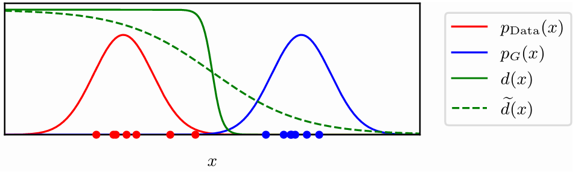

[Aprendizado de Máquina](index.md)

<!-- wiki:original:inicio -->

# Generative Adversarial Networks

## Introdução

Esse capítulo trata de um método de aprendizado não supervisionado usado para treinar modelos **generativos**. Esses modelos são capazes de gerar novos exemplos que se assemelham aos dados de treinamento. A ideia central é simples. Queremos que as novas amostras geradas por nosso modelo generativo sejam tão boas que seja difícil afirmar qual é a amostra real e qual é a amostra gerada. Para isso, utilizamos uma abordagem de aprendizado adversarial, onde dois modelos competem entre si: um gerador e um discriminador.

Enquanto o modelo generativo cria imagens, o discriminador tenta distinguir entre imagens reais e imagens geradas. O objetivo do gerador é enganar o discriminador, enquanto o objetivo do discriminador é identificar corretamente as imagens reais e falsas. Esse processo de competição leva a uma melhoria contínua de ambos os modelos, resultando em um gerador capaz de produzir amostras realistas.

## Treinamento Adversarial

Vamos considerar um modelo generativo baseado numa transformação de uma variável latente $z$ para o espaço dos dados $x$. Por simplicidade, vamos definir $$p(z) = N(0,I)$$ juntamente de uma transformação não-linear $g(z,w)$ definida por uma rede neural profunda com parâmetros $w$ conhecida como **gerador**. Essas definições implicam que há uma distribuição de probabilidade sobre $x$ que queremos encaixar em cima dos nossos dados. No entanto, nós não conseguimos determinar $w$ maximizando a verossimilhança, já que em geral não tem forma fechada.

Como já explicamos, a ideia das GANs é introduzir uma segunda rede que vai ser treinada em conjunto com a rede **geradora**, a chamada **discriminadora**. Seu trabalho é distinguir entre amostras reais e amostras geradas. O discriminador é definido como uma rede neural profunda $d(x,\varphi)$ com parâmetros $\varphi$ que retorna a probabilidade de $x$ ser uma amostra real. O discriminador é treinado para maximizar a probabilidade de classificar corretamente as amostras reais e falsas, enquanto o gerador é treinado para fazer com que a probabilidade seja a mais próxima possível de $0.5$, ou seja, o gerador quer enganar o discriminador.

## Função de Custo

Para definir isso precisamente, vamos definir uma variável binária: $$t = \begin{cases} 1\text{ se }x\text{ é real} \\ 0\text{ se }x\text{ é sintética } \end{cases}$$

a rede discriminadora possui um único output com uma ativação sigmoidal. Esse output representa a probabilidade de $x$ ser real, ou seja $$d(x,\varphi) = {\mathbb{P}}(t = 1\vert x,\varphi)$$

nós treinamos a rede discriminadora usando a clássica função cross-entropy $$E(w,\varphi) = - \frac{1}{N}\sum_{n = 1}^{N}\left\{ t_{n}\ln d\left( x_{n},\varphi \right) + \left( 1 - t_{n} \right)\ln\left( 1 - d\left( x_{n},\varphi \right) \right) \right\}$$

O dataset utilizado tem tanto as amostras reais $x_{n}$ quanto as sintéticas $z_{n}$ geradas pelo gerador. Então podemos separar o dataset $D$ em $D_{\text{real}}$ e $D_{\text{sintético}}$. Dessa forma, como definimos que $t = 1$ para amostras reais e $t = 0$ para amostras sintéticas, podemos reescrever a função de custo como: $$E(w,\varphi) = - \frac{1}{N_{\text{real}}}\sum_{n \in D_{\text{real}}}\ln d\left( x_{n},\varphi \right) - \frac{1}{N_{\text{sintético}}}\sum_{n \in D_{\text{sintético}}}\ln\left( 1 - d\left( z_{n},\varphi \right) \right)$$

onde (normalmente) $N_{\text{real }} = N_{\text{sintético}}$, ou seja, o dataset é balanceado. O interessante desse método é que podemos otimizar a função com base no gradiente, no entanto, nós a minimizamos com relação a $\varphi$ e **maximizamos** com relação a $w$. Ou seja, o gerador quer maximizar a função de custo, enquanto o discriminador quer minimizar. Isso é conhecido como **jogo de soma zero**.

O modo de treino que apresentamos até o momento faz com que o gerador aprenda distribuições não-condicionais $p(x)$. Por exemplo, se ele for treinado com imagens de cachorros, ele vai aprender a gerar imagens de cachorros. No entanto, podemos criar GANs condicionais, onde o gerador aprende uma distribuição $p\left( x\vert c \right)$ onde $c$ pode, por exemplo, representar um vetor que especifica a raça do cachorro.

## Treinamento do GAN

Por mais que essa abordagem de treinamento seja interessante e gere ótimos resultados, ela possui algumas dificuldades por conta do aprenzidado adversarial.

Um desafio que pode surgir durante o treinamento é o **colapso do modo** (mode collapse). Isso ocorre quando o gerador aprende a produzir apenas um conjunto limitado de amostras, ignorando a diversidade presente nos dados reais. Como resultado, o gerador pode gerar imagens muito semelhantes entre si, mesmo que os dados reais sejam variados. Por exemplo, num dataset de digitos, o gerador pode aprender a gerar apenas o dígito “3”, mesmo que o dataset contenha todos os dígitos de 0 a 9. Isso indica que o gerador não está capturando a diversidade dos dados reais, resultando em uma representação limitada do espaço de entrada. Isso ocorre pois o gerador encontra um ponto ótimo local que engana o discriminador, mas não representa a distribuição real dos dados.

Essa imagem mostra um exemplo dos dados reais provindos da distribuição **fixa**, mas **desconhecida**, $p_{\text{Data }}(x)$ e os dados do gerador $p_{G}(x)$. Podemos ver que, como os dados são muito distintos, o discriminador consegue facilmente distinguir entre eles. No entanto, justamente por conta dos dados iniciais do gerador serem tão diferentes e o discriminador classificá-los tão bem, o treinamento do gerador não é eficiente, pois pequenas aleterações no seu processo de geração de amostras não vão enganar o discriminador. Para contornar isso, podemos utilizar de uma função discriminadora mais suave, na imagem representada por $\widetilde{d}(x)$

------------------------------------------------------------------------

<!-- wiki:original:fim -->

## Conteúdos relacionados

- [Generative Adversarial Networks (GANs) — Aprendizado Profundo](../aprendizado-profundo/generative-adversarial-networks-gans/index.md)

## Percurso de estudo

[Trilha: A3](../../trilhas/aprendizado-de-maquina/a3.md) · [Apresentação e contexto da fonte](../../trilhas/aprendizado-de-maquina/a3.md#apresentacao-original)

- Anterior: [Variational Autoencoders](variational-autoencoders.md)
- Próximo: [Referências](referencias-a3.md)
