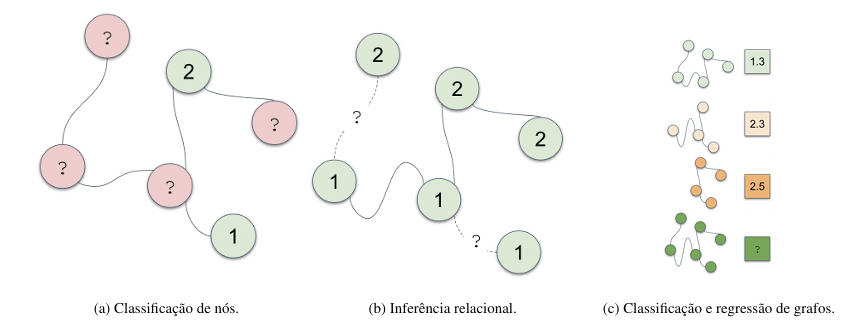

[Aprendizado de Máquina](index.md)

<!-- wiki:original:inicio -->

# Graph Neural Networks

## Introdução

Graph neural networks (GNNs) são uma classe de redes neurais projetadas para trabalhar com dados estruturados em grafos. Diferentemente das redes neurais tradicionais, que operam em dados tabulares ou sequenciais, as GNNs são capazes de capturar a complexidade das relações entre os nós de um grafo, permitindo a modelagem de interações complexas e dependências entre os elementos do grafo.

## Notações

Para facilitar a compreensão, vamos definir algumas notações comuns usadas em GNNs:

- $G = (V,E)$: Um grafo onde $V$ é o conjunto de nós e $E$ é o conjunto de arestas.

- $A$: Matriz de adjacência do grafo, onde $A_{\left\{ ij \right\}} = 1$ se houver uma aresta entre os nós $i$ e $j$, e $0$ caso contrário.

- $X$: Matriz de características dos nós, onde cada linha representa as características de um nó. (Por exemplo, $x_{i}$ pode ser o conjunto **idade**, **peso**, **altura** de uma pessoa representada pelo nó $i$).

- Normalmente, é utilizada a matriz de adjacência normalizada com self loops, dada por $A' = (D + I)^{- \frac{1}{2}}(A + I)(D + I)^{- \frac{1}{2}}$, onde $D$ é a matriz diagonal de grau dos nós e $I$ é a matriz identidade onde $D_{ii} = \sum_{j}A_{ij} = \delta(v_{i}) = \text{ Grau de }v_{i}$

## Usos de GNNs

**Classificação de nós**. Seja $\mathcal{Y} = \left\{ 1,\ldots,L \right\}$ um conjunto finito de classes, $G = (V,E)$ um grafo e $V_{l} \subseteq V$ um subconjunto de nós anotados com classes em $\mathcal{Y}$. Classificacão de nós consiste no problema de classificar os nós em $V_{l}^{c} = V\backslash V_{l}$. Como exemplo, sistemas de detecção de fraude na Internet objetivam verificar a legitimidade da identidade de usuários; para isso, esses sistemas binariamente classificam como legítimo ou fraudulento os nós de uma rede de pessoas que interagem com alguma interface on-line. Existem duas diferenças essenciais entre classificação de nós em um grafo e os cenários canônicos de classificação em problemas de aprendizado supervisionado. Primeiro, supomos que o grafo, e logo seus nós/amostras, é inteiramente observado e que apenas não conhecemos as classes de algum subconjunto dos nós; em contraste, métodos convencionais de classificação não permitem a classificação de amostras não observadas durante o treinamento do modelo —i.e., classificação de nós costuma ser uma tarefa transdutiva, enquanto métodos convencionais focam em aprendizado indutivo. Segundo, as amostras em um grafo são intrinsecamente correlacionadas e então descumprem a típica suposição de independência distribucional assumida pelos métodos historicamente relevantes de classificação - como os modelos lineares; essa inconsistência explica a efetiva inutilidade destes métodos à classificação de nós em grafos e, no passado, incentivou o desenvolvimento de procedimentos que incorporam a estrutura correlacional das amostras em seus mecanismos de inferência. Circunstancialmente, as GNNs exploram a correlação induzida nas amostras pelo seu grafo subjacente e as informações não estruturais para classificar os nós não anotados em um grafo.

**Inferência relacional (predição de aresta)**. Seja $G = (V,E)$ um grafo e suponha que observamos o grafo parcial $\hat{G} = \left( V,\hat{E} \right)$ com $\hat{E} \subset E$; o objetivo da inferência relacional é identificar as arestas (relações) não observadas $\begin{array}{r} E \\ \hat{E} \end{array}$. Por exemplo, a estimativa da probabilidade de que um par de indivíduos se conhece em uma mídia social é crucial para aumentar o engajamento dos usuários com a plataforma e corresponde a uma instanciação do problema de inferência relacional. Em outra direção, a descrição de como as diferentes proteínas interagem para permitir o desenvolvimento de um organismo é um dos problemas fundacionais de biologia molecular e é equivalente à predição de arestas no grafo de interação entre proteínas (chamado de interatoma). Enfaticamente, a inferência relacional, como a classificação de nós, transcende as fronteiras dos algoritmos tradicionais de aprendizagem de máquina ao exigir o tratamento de amostras correlacionadas para identificar as arestas prováveis em um espaço combinatoriamente grande de arestas possíveis. Em contraste, as GNNs eficientemente utilizam a topologia da rede e os atributos dos nós para precisamente inferir a existência de arestas de G não observadas em $\hat{G}$.

**Classificação e regressão de grafos**. Alguns problemas exigem o tratamento de bases de dados relacionais em que as instâncias são objetos representados como grafos. O químico que almeja enumerar os efeitos colaterais de determinado medicamento, por exemplo, está tipicamente equipado com um conjunto de outros medicamentos com efeitos colaterais metabolicamente reconhecíveis; e cada medicamento é epistemicamente representado por uma estrutura molecular equivalente a um grafo. Esta categoria de problemas de inferência em grafos é a mais similar e receptiva à abordagem tradicional de aprendizagem de máquina; neste caso, cada grafo corresponde a uma amostra independente e presumivelmente identicamente distribuída as outras. A dificuldade incide na geração de representações vetoriais suficientemente informativas dos grafos para maximizar a eficácia de procedimentos de classificação e de regressão subsequentemente aplicados a estas representações. Notadamente, as redes neurais para grafos naturalmente aprendem representações latentes dos nós que podem ser sucessivamente agregadas e então exploradas em algoritmos de inferência canônicos de aprendizagem de máquina.

*Figura 3. Representação visual de cada um dos três usos de GNNs discutidos*

## Passagem de Mensagem

As redes em grafo funcionam de forma que as informações de cada nó são passadas para seus vizinhos, que por sua vez passam as informações para seus vizinhos, e assim por diante. Esse processo é chamado de **passagem de mensagem** (message passing). A passagem de mensagem é um processo iterativo que ocorre em $T$ rodadas, onde $T$ é um hiperparâmetro do modelo. Em cada rodada $t$, cada nó $v$ recebe mensagens de seus vizinhos $\mathcal{N}(v)$ e atualiza seu estado com base nessas mensagens. Podemos dividir o processo aplicado à cada nó como: $$\begin{array}{rlr} m_{v}^{(t)} & = \text{ AGGREGATE}^{(t)}\left( \left\{ h_{u}^{(t - 1)},\forall u \in \mathcal{N}(v) \right\} \right)\text{\quad\quad} & \forall v \in V \\ h_{v}^{(t)} & = \text{ UPDATE}^{(t)}\left( h_{v}^{(t - 1)},m_{v}^{(t)} \right)\text{\quad\quad} & \forall v \in V \end{array}$$ de forma que $h_{v}^{(0)} = x_{v}$

As funções $\text{AGGREGATE}$ e $\text{UPDATE}$ são funções que variam dependendo da implementação, de forma que diferentes implementações de GNNs podem ser obtidas. A função $\text{AGGREGATE}$ é responsável por agregar as informações dos vizinhos de um nó, enquanto a função $\text{UPDATE}$ é responsável por atualizar o estado do nó com base nas informações agregadas. A escolha dessas funções é crucial para o desempenho da GNN e pode ser feita de várias maneiras, incluindo somas, médias, máximos ou redes neurais.

Podemos reformular de forma mais compacta a passagem de mensagem definindo: $$\begin{array}{r} H^{(t)} = \begin{pmatrix} - & h_{1}^{(t)} & - \\ & \vdots & \\ - & h_{\vert V\vert }^{(t)} & - \end{pmatrix} \\ M^{(t)} = \begin{pmatrix} - & m_{1}^{(t)} & - \\ & \vdots & \\ - & m_{\vert V\vert }^{(t)} & - \end{pmatrix} \end{array}$$ então reescrevemos os passos anteriores como $$\begin{array}{r} M^{(t)} = \text{ AGGREGATE}^{(t)}\left( A,H^{(t - 1)} \right) \\ H^{(t)} = \text{ UPDATE}^{(t)}\left( H^{(t - 1)},M^{(t)} \right) \end{array}$$

## Graph Convolutional Network (GCN)

Popularizou as GNNs por sua simplicidade. É um modelo baseado em message-passing, onde a função de agregação é uma média ponderada dos vizinhos de um nó e a função de atualização é uma rede neural simples. A GCN é definida como: $$\begin{array}{rlr} m_{v}^{(t)} & = \sum_{u \in \mathcal{N}(v)}\frac{h_{u}^{(t - 1)}}{\sqrt{{\overline{d}}_{u}{\overline{d}}_{v}}}\text{\quad\quad} & \forall v \in V \\ h_{v}^{(t)} & = \sigma(\left( \frac{1}{{\overline{d}}_{v}}h_{v}^{(t - 1)} + m_{v}^{(t)} \right)\Theta_{t})\text{\quad\quad} & \forall v \in V \end{array}$$

onde $\Theta_{t}$ é uma matriz de pesos aprendida durante o treinamento e ${\overline{d}}_{v}$ é o grau do nó $v$ com self-loops. A função de ativação $\sigma$ é geralmente uma função não-linear como ReLU ou sigmoid. Podemos reescrever a GCN de forma matricial como: $$H^{(t)} = \sigma(D^{- \frac{1}{2}}AD^{- \frac{1}{2}}H^{(t - 1)}\Theta_{t})$$

------------------------------------------------------------------------

<!-- wiki:original:fim -->

## Percurso de estudo

[Trilha: A2](../../trilhas/aprendizado-de-maquina/a2.md) · [Apresentação e contexto da fonte](../../trilhas/aprendizado-de-maquina/a2.md#apresentacao-original)

- Anterior: [Processos Gaussianos](processos-gaussianos.md)
- Próximo: [Convolutional Neural Networks (CNN)](convolutional-neural-networks-cnn.md)
