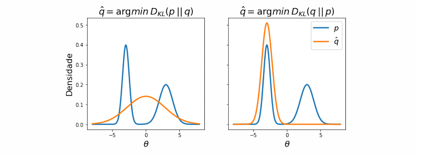

[Aprendizado de Máquina](index.md)

<!-- wiki:original:inicio -->

# Inferência Variacional

## Introdução

Na inferência variacional, nosso objetivo é aproximar uma distribuição $p$ através de outra distribuição $q$ que conseguimos manipular mais facilmente. Fazemos isso minimizando alguma medida de discrepância entre as duas distribuições, a forma mais comum de fazer isso é através da divergência de Kullback-Leibler, que é dada por: $$\text{ KL}\left( q\| p \right) = \int q(x)\ln\left\{ \frac{q(x)}{p(x)} \right\} dx = {\mathbb{E}}_{x \sim q}\left\lbrack \ln\left\{ \frac{q(x)}{p(x)} \right\} \right\rbrack$$

## Propriedades da divergência de Kullback-Leibler

**Teorema: Não-negatividade**

A divergência de Kullback-Leibler é não-negativa, ou seja, $\text{KL}\left( q\| p \right) \geq 0$

**Demonstração**

A desigualdade de Jensen fala que, para uma função convexa $f$ e uma variável aleatória $X$, temos que: $$f\left( {\mathbb{E}}\lbrack X\rbrack \right) \leq {\mathbb{E}}\left\lbrack f(X) \right\rbrack$$ sabemos que $- \ln(x)$ é uma função convexa, então, aplicando a desigualdade de Jensen, temos que: $$- \ln({\mathbb{E}}_{x \sim q}\left\lbrack \frac{p(x)}{q(x)} \right\rbrack) \leq {\mathbb{E}}_{x \sim q}\left\lbrack - \ln(\frac{p(x)}{q(x)}) \right\rbrack = {\mathbb{E}}_{x \sim q}\left\lbrack \ln(\frac{q(x)}{p(x)}) \right\rbrack = \text{ KL}\left( q\| p \right)$$ porém: $${\mathbb{E}}_{x \sim q}\left\lbrack \frac{p(x)}{q(x)} \right\rbrack = \int q(x)\left\{ \frac{p(x)}{q(x)} \right\} dx = \int p(x)dx = 1$$ logo: $$- \ln({\mathbb{E}}_{x \sim q}\left\lbrack \frac{p(x)}{q(x)} \right\rbrack) = - \ln(1) = 0$$ chegando à conclusão que: $$0 \leq \text{ KL}\left( q\| p \right)$$

**Teorema: Identidade**

$$\text{ KL}\left( q\| p \right) = 0 \Leftrightarrow q = p\text{ quase certamente }$$ ou seja, a divergência de Kullback-Leibler é zero se, e somente se, $q$ e $p$ são iguais

**Demonstração**

$\Longrightarrow )$ Se $q = p$, então: $$\text{ KL}\left( q\| p \right) = \int q(x)\ln\left\{ \frac{q(x)}{p(x)} \right\} dx = \int q(x)\ln\left\{ 1 \right\} dx = \int q(x)0dx = 0$$

$\Longleftarrow )$ Se $\text{KL}\left( q\| p \right) = 0$, então: $${\mathbb{E}}_{x \sim q}\left\lbrack \ln q(x) \right\rbrack = {\mathbb{E}}_{x \sim q}\left\lbrack \ln p(x) \right\rbrack$$ como $- \ln$ é uma função estritamente convexa, então, pela desigualdade de Jensen, temos que: $$0 \leq - {\mathbb{E}}_{x \sim q}\left\lbrack \ln(\frac{p(x)}{q(x)}) \right\rbrack$$ porém, a desiguldade de Jensen enuncia que: $${\mathbb{E}}\left\lbrack f(X) \right\rbrack = f\left( {\mathbb{E}}\lbrack X\rbrack \right) \Leftrightarrow X = c$$ ou seja, temos que $$\frac{p(x)}{q(x)} = c$$ entretanto ambas são densidades, assim: $$\int q(x)cdx = c = \int p(x)dx = 1 \Rightarrow c = 1 \Rightarrow \frac{p(x)}{q(x)} = 1 \Rightarrow p(x) = q(x)$$

**Teorema: KL e Entropia Cruzada**

A divergência de Kullback-Leibler pode ser escrita como a diferença entre a entropia cruzada e a entropia de $q$, ou seja: $$\text{ KL}\left( q\| p \right) = H(q,p) - H(q)$$ onde $H(q,p) = - {\mathbb{E}}_{x \sim q}\left\lbrack \ln p(x) \right\rbrack$ é a entropia cruzada entre $q$ e $p$ e $H(q) = - {\mathbb{E}}_{x \sim q}\left\lbrack \ln q(x) \right\rbrack$ é a entropia de $q$. Um ótimo vídeo que fala sobre isso é o [The Key Equation Behind Probability](https://youtu.be/KHVR587oW8I?si=HdtlJh1BHLMH7Has) do canal [Artem Kirsanov](https://www.youtube.com/@ArtemKirsanov)

**Demonstração**

$$
\begin{aligned} \text{ KL}\left( q\| p \right) & = \int q(x)\ln\left\{ \frac{q(x)}{p(x)} \right\} dx \\ & = \int q(x)\ln\left\{ q(x) \right\} dx - \int q(x)\ln\left\{ p(x) \right\} dx \\ & = - H(q) + H(q,p) \\ & = H(q,p) - H(q) \end{aligned}
$$

**Divergência KL *forward* vs *reverse***: É importante notar que, de forma geral, a divergência KL não é simétrica — i.e., $\text{KL}\left( q\| p \right) \neq \text{ KL}\left( p\| q \right)$. Na literatura de ML, é comum chamar $\text{KL}\left( q\| p \right)$ de divergência KL reversa. Conversamente, $\text{KL}\left( p\| q \right)$ é conhecida como a divergência forward. Empiricamente, é bem estabelecido que minimizar a divergência reversa costuma resultar em resultados que focam em alguma(s) modas. Por outro lado, minimizar a divergência forward costuma promover aproximações que cobrem melhor o suporte de $p$. A figura abaixo ilustra esse fenômeno com $p(\theta) = \frac{1}{2}\mathcal{N}(\theta\vert 3,1) + \frac{1}{2}\mathcal{N}(\theta\vert  - 3,\left( \frac{1}{2} \right)^{2})$ e $q$ sendo Gaussiana univariada

## Cota Inferior (ELBO)

Normalmente estamos realizando inferência bayesiana, ou seja, queremos calcular a distribuição posterior $p\left( \theta\vert D \right)$, mas isso é difícil de fazer diretamente. Então, vamos usar a divergência KL para encontrar uma aproximação $q(\theta)$ para $p\left( \theta\vert D \right)$. Para isso, vamos minimizar a divergência KL reversa: $$\begin{aligned} \text{ KL}\left( q(\theta)\| p\left( \theta\vert D \right) \right) & = {\mathbb{E}}_{\theta \sim q(\theta)}\left\lbrack \ln\left\{ \frac{q(\theta)}{p\left( \theta\vert D \right)} \right\} \right\rbrack \\ & = {\mathbb{E}}_{\theta \sim q(\theta)}\left\lbrack \ln q(\theta) \right\rbrack - {\mathbb{E}}_{\theta \sim q(\theta)}\left\lbrack \ln p\left( \theta\vert D \right) \right\rbrack \\ & = {\mathbb{E}}_{\theta \sim q(\theta)}\left\lbrack \ln q(\theta) \right\rbrack - {\mathbb{E}}_{\theta \sim q(\theta)}\left\lbrack \ln\frac{p\left( D\vert \theta \right)p(\theta)}{p(D)} \right\rbrack \\ & = {\mathbb{E}}_{\theta \sim q(\theta)}\left\lbrack \ln q(\theta) \right\rbrack - {\mathbb{E}}_{\theta \sim q(\theta)}\left\lbrack \ln p(D,\theta) \right\rbrack + \ln p(D) \end{aligned}$$ Vamos definir $L(q)$ como: $$L(q) = {\mathbb{E}}_{\theta \sim q(\theta)}\left\lbrack \ln p(D,\theta) \right\rbrack - {\mathbb{E}}_{\theta \sim q(\theta)}\left\lbrack \ln q(\theta) \right\rbrack$$ então temos que a distribuição $q$ que minimiza a divergência KL seria: $$\begin{aligned} \hat{q} & = \text{ argmin}_{q}\text{ KL}\left( q(\theta)\| p\left( \theta\vert D \right) \right) \\ & = \text{ argmin}_{q}{\mathbb{E}}_{\theta \sim q(\theta)}\left\lbrack \ln q(\theta) \right\rbrack - {\mathbb{E}}_{\theta \sim q(\theta)}\left\lbrack \ln p(D,\theta) \right\rbrack + \ln p(D) \\ & = \text{ argmin}_{q} - L(q) + \ln p(D) \\ & = \text{ argmax}_{q}L(q) \end{aligned}$$

algo interessante de se ressaltar é que, como $\text{KL } \geq 0$, temos que: $$\ln p(D) - L(q) = \text{ KL } \geq 0 \Rightarrow L(q) \leq \ln p(D)$$ logo, $\ln p(D)$ (conhecido como evidência) é uma cota superior para $L(q)$, e como queremos maximizar $L(q)$, estamos na verdade tentando encontrar a melhor aproximação para a evidência. Por isso, chamamos $L(q)$ de **Evidence Lower Bound** (ELBO), ou cota inferior da evidência.

## Lidando com ELBO intratável

Com relação à escolha de $Q$, costuma-se adotar uma família de distribuições paramétricas. Deste modo, podemos maximizar $L$ sobre um espaço de parâmetros $\Omega$. Por exemplo, se $Q$ é o conjunto das distribuições Gaussianas univariadas, $\Omega = {\mathbb{R}} \times R^{+}$ e $\omega \in \Omega$ é um par média/variância. De maneira geral, os termos envolvidos no ELBO podem ser intratáveis e, até meados da década passada, desenvolver soluções customizadas para posterioris diferentes era considerado uma contribuição técnica em ML.

Atualmente, existem metodologias genéricas, que viabilizam inferência variacional quase como uma tecnologia *off-the-shelf*. A mais famosa dentre essas, é o truque reparametrização. Essa técnica assume que é possível descrever a amostragem de $\theta \sim q$ a partir de uma transformação g de uma variável aleatória auxiliar $\varepsilon$. Além disso, precisamos que g seja diferenciável com respeito aos parâmetros $\omega$ de $q$. Por exemplo, se q é uma distribuição normal com parâmetros $\omega = \left( \mu,\sigma^{2} \right)$, podemos obter uma amostra $\theta \sim q$ definindo $\theta = g(\varepsilon;\omega) = \sigma\varepsilon + \mu$ e amostrando $\varepsilon$ de numa gaussiana padrão — i.e., com média zero e variância um.

Com isso, podemos aproximar os termos do ELBO amostrando M variáveis auxiliares $\varepsilon(1),...,\varepsilon(M)$ e estimar o gradiente de $L(q)$ com respeito a $\omega$ como:

$$
\nabla_{\omega}L(q) = \nabla_{\omega}\frac{1}{M}\sum_{m = 1}^{M}\ln p\left( D\vert \theta^{(m)} \right) + \ln p\left( \theta^{(m)} \right) - \ln q\left( \theta^{(m)};\omega \right)
$$

Note que, na notação acima, $q$ também depende diretamente de $\omega$. Em posse dessa estimativa, podemos utilizar nosso algoritmo de gradiente preferido para otimizar o ELBO. Naturalmente, essa aproximação deve ser refeita com novas amostras a cada passo de gradiente. Para evitar incluir restrições explícitas para garantir que parâmetros restritos sejam válidos (e.g., variâncias devem ser não-negativas), nós também as modelamos como a transformação de uma variável real. No caso citado acima, podemos ter $\omega = \left( \mu,\sigma^{2} = u(z) \right)$ com $u(z) = e^{z}$ ou $u(z) = \beta^{- 1}\ln(1 + e^{\beta z})$ para algum $\beta > 0$.

<!-- wiki:original:fim -->

## Percurso de estudo

[Trilha: A1](../../trilhas/aprendizado-de-maquina/a1.md) · [Apresentação e contexto da fonte](../../trilhas/aprendizado-de-maquina/a1.md#apresentacao-original)

- Anterior: [Redes Neurais](redes-neurais.md)
