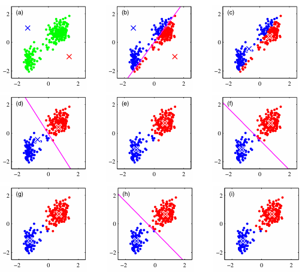

[Aprendizado de Máquina](index.md)

<!-- wiki:original:inicio -->

# K-means

## Introdução

A partir desse momento, vamos começar a estudar métodos de machine learning não supervisionados. Diferente do aprendizado supervisionado, onde temos um conjunto de dados rotulado, no aprendizado não supervisionado, os dados não possuem rótulos e o objetivo é encontrar padrões ou estruturas subjacentes nos dados.

O primeiro que vamo estudar é um dos algoritmos de machine learning não supervisionado mais simples que existe, o K-means. Ele é um algoritmo de clustering que busca particionar os dados em K grupos distintos com base em suas características.

## O Algoritmo

Considere o problema de classificar pontos em um espaço. Naturalmente, pensamos que os pontos mais próximos um do outro devem pertencer ao mesmo grupo. O K-means é um algoritmo que busca encontrar esses grupos de forma iterativa, ajustando os centróides dos clusters até que a convergência seja alcançada.

Suponha que temos um dataset $D = \left\{ x_{1},\ldots,x_{N} \right\}$ com pontos aleatórios de um espaço euclidiano de dimensão $D$. O nosso objetivo é particionar o dataset em um conjunto de $K$ clusters, onde, no momento, vamos supor que $K$ é conhecido. Também definimos um conjunto de $K$ centróides $\mu_{1},\ldots,\mu_{K}$. Nosso objetivo então é associar cada um dos pontos $x_{i}$ a um dos centróides $\mu_{k}$, de forma que a soma das distâncias quadradas entre os pontos e seus centróides seja minimizada. Definimos também uma variável de associação $r_{nk} \in \left\{ 0,1 \right\}$, que indica se o ponto $x_{n}$ pertence ao cluster $k$ ou não. Então podemos definir nossa função de custo, também conhecida como *função de distorção*, como: $$J = \sum_{n = 1}^{N}\sum_{k = 1}^{K}r_{nk}\| x_{n} - \mu_{k}\|^{2}$$ que é a soma das distâncias quadradas entre cada ponto e o centróide do cluster ao qual ele pertence. O objetivo do K-means é minimizar essa função de custo.

**Teorema: Valor ótimo de $r_{nk}$**

Para um conjunto fixo de centróides $\mu_{1},\ldots,\mu_{K}$, a escolha ótima de $r_{nk}$ é dada por: $$r_{nk} = \begin{cases} 1\text{ se }k = \text{ argmin}_{j}\| x_{n} - \mu_{j}\|^{2} \\ 0\text{ caso contrário} \end{cases}$$

**Demonstração**

Perceba que [\[kmeans-cost-function\]](#kmeans-cost-function) é uma função linear de $r_{nk}$. Os termos envolvendo diferentes $n$ são independentes entre si, então podemos otimizar para cada $n$ separadamente de forma que $r_{nk} = 1$ para qualquer valor $k$ que minimize $\| x_{n} - \mu_{k}\|^{2}$ e $r_{nk} = 0$ para todos os outros valores de $k$. Ou seja, simplesmente assinalamos cada ponto ao cluster cujo centróide está mais próximo (o que pode ser expresso como $k = \text{ argmin}_{j}\| x_{n} - \mu_{j}\|^{2}$).

**Teorema: Valor ótimo de $\mu_{k}$**

Para um conjunto fixo de associações $r_{nk}$, a escolha ótima de $\mu_{k}$ é dada por: $$\mu_{k} = \frac{\sum_{n = 1}^{N}r_{nk}x_{n}}{\sum_{n = 1}^{N}r_{nk}}$$

**Demonstração**

Perceba que [\[kmeans-cost-function\]](#kmeans-cost-function) é uma função quadrática de $\mu_{k}$. Para encontrar o valor ótimo de $\mu_{k}$, podemos derivar a função de custo em relação a $\mu_{k}$ e igualar a zero: $$\frac{\partial J}{\partial\mu_{k}} = 2\sum_{n = 1}^{N}r_{nk}\left( \mu_{k} - x_{n} \right) = 0$$ Rearranjando os termos, obtemos: $$\mu_{k}\sum_{n = 1}^{N}r_{nk} = \sum_{n = 1}^{N}r_{nk}x_{n}$$ Dividindo ambos os lados por $\sum_{n = 1}^{N}r_{nk}$, obtemos a expressão desejada para $\mu_{k}$.

Perceba que no [\[optimal-mu-k\]](#optimal-mu-k), o centróide $\mu_{k}$ é simplesmente a média de todos os pontos que pertencem ao cluster $k$. Isso faz sentido intuitivamente, pois queremos que o centróide represente o “centro” do cluster.

Perceba, porém, que o [\[kmeans-cost-function\]](#kmeans-cost-function) não é uma função convexa de $r_{nk}$ e $\mu_{k}$ juntos, então não podemos otimizar ambos ao mesmo tempo. O K-means resolve isso alternando entre otimizar $r_{nk}$ e $\mu_{k}$ iterativamente até que a convergência seja alcançada.

Além disso, o K-means é sensível à inicialização dos centróides. Diferentes inicializações podem levar a diferentes soluções locais, então é comum executar o algoritmo várias vezes com diferentes inicializações e escolher a melhor solução encontrada.

Note que eu mostrei uma forma de aplicar o K-means em batch, ou seja, considerando todos os pontos de uma vez. Existe também uma versão estocástica online do K-means, onde os centróides são atualizados à medida que novos pontos chegam. Não entraremos em detalhes da derivação, mas esse método se utiliza do procedimento de Robbins-Monro para atualizar os centróides de forma incremental. Esse procedimento é utilizado para resolver equações do tipo $${\mathbb{E}}\left\lbrack Z(\theta) \right\rbrack = 0$$ onde não observamos $Z(\theta)$ diretamente, mas sim uma amostra $Z_{n(\theta)}$ ruidosa de $Z(\theta)$. Em Machine Learning Pattern and Recognition([Bishop 2006](referencias-a3.md#ref-mlpatternrecognition)), Bishop nota que a equação do gradiente de $\nabla J$ é exatamente no formato de [\[robbins-monro\]](#robbins-monro) $$\sum_{n = 1}^{N}r_{nk}\left( \mu_{k} - x_{n} \right) = 0$$ então chegamos no procedimento de atualização estocástico do K-means, que é dado por: $$\mu_{k}^{t + 1} = \mu_{k}^{t} + \eta_{n}\left( x_{n} - \mu_{k}^{t} \right)$$ onde $\eta_{n}$ é a taxa de aprendizado, que deve ser escolhida de forma que ela diminua quanto mais pontos forem vistos, para garantir a convergência do algoritmo.

**Algoritmo K-means (Batch)**

1.  **function** *K-means*($D$, $K$) {

    1.  **initialize** $\mu_{1},\ldots,\mu_{K}$ **randomly**

    2.  **repeat** {

        1.  **for** $n = 1$ **to** $N$ {

            1.  $r_{nk} = 0$ for all $k$

            2.  $r_{nk} = 1$ for $k = \text{ argmin}_{j}\| x_{n} - \mu_{j}\|^{2}$

        2.  }

        3.  **for** $k = 1$ **to** $K$ {

            1.  $\mu_{k} = \frac{\sum_{n = 1}^{N}r_{nk}x_{n}}{\sum_{n = 1}^{N}r_{nk}}$

        4.  }

    3.  }

    4.  **until** convergence

2.  }

O algoritmo do K-means é baseado na distância euclidiana para medir a discrepância entre os pontos e os centróides. No entanto, essa medida não é adequada em todos os cenários. Por exemplo, se os clusters forem labels? Além de que torna $J$ não resistente à outliers. Para lidar com isso, podemos utilizar o *K-medoids*, que é uma variação do K-means que utiliza uma outra distorção qualquer $\mathcal{V}(x,x')$ em vez da média para calcular os centróides. $$\widetilde{J} = \sum_{n = 1}^{N}\sum_{k = 1}^{K}r_{nk}\mathcal{V}(x_{n},\mu_{k})$$

------------------------------------------------------------------------

<!-- wiki:original:fim -->

## Percurso de estudo

[Trilha: A3](../../trilhas/aprendizado-de-maquina/a3.md) · [Apresentação e contexto da fonte](../../trilhas/aprendizado-de-maquina/a3.md#apresentacao-original)

- Próximo: [Principal Component Analysis](principal-component-analysis.md)
