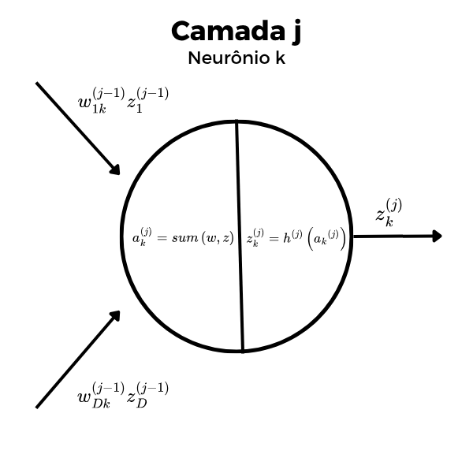
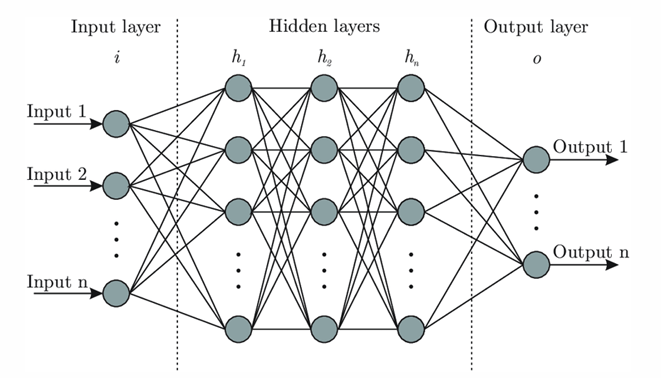

[Aprendizado de Máquina](index.md)

<!-- wiki:original:inicio -->

# Redes Neurais

## Estrutura Inicial

As redes neurais são estruturadas com base em camadas de neurônios interconectados, de forma que cada camada tem sua própria quantidade de neurônios e cada neurônio é conectado a todos os neurônios da camada seguinte.

*Figura 9. Representação do neurônio $k$ da camada $j$. $\text{sum}(w,z) = b_{k}^{(j)} + \sum_{i = 1}^{D}w_{ik}^{(j - 1)}z_{i}^{(j - 1)}$*

Na primeira camada, $Z = X$. Mas antes de continuarmos vendo isso, vamos definir as camadas em si:

*Figura 10. Camadas de entrada, escondidas e de saída*

Então a estrutura de uma rede neural com $K$ camadas escondidas é, pegar o datapoint, joga na camada de entrada, ele é processado dentro de todas as camadas e finalmente chega na camada de saída, onde é feita a predição.

## Estrutura Matemática

Vamos agora formalizar a estrutura matemática das Redes Neurais. Pelo que você viu na imagem anterior, cada camada $j$ tem um número de neurônios $M_{j}$. O número de neurônios da camada de entrada é $M_{0} = D$ e o número de neurônios da camada de saída é $M_{K + 1} = L$. Para cada camada $j \in \left\{ 1,\ldots,K + 1 \right\}$, temos uma matriz de pesos $W^{(j)}$ de tamanho $M_{j - 1} \times M_{j}$ e um vetor de bias $b^{(j)}$ de tamanho $M_{j}$. Podemos escrever o resultado da última camada $Z^{K + 1}$ como: $$Z^{(3)} = h^{(3)}\left( h^{(2)}\left( h^{(1)}\left( XW^{(1)} + b^{(1)}\mathbb{1}^{T} \right)W^{(2)} + b^{(2)}\mathbb{1}^{T} \right)W^{(3)} + b^{(3)}\mathbb{1}^{T} \right)$$

(Exemplo com 3 camadas, 1 de entrada, 1 escondida e 1 de saída)

De forma que a $i$-ésima coluna de $W^{(j)}$ representa os pesos de todas as conexões que chegam no neurônio $i$ da camada $j$ e a $i$-ésima entrada de $b^{(j)}$ é o bias do neurônio $i$ da camada $j$. A função $h^{(j)}$ é a função de ativação da camada $j$, que é aplicada elemento a elemento

## Não-linearidade

É importante ressaltar que, se as funções de ativação $h^{(1)},\ldots,h^{(K)}$ forem todas lineares, então a rede neural é equivalente a um modelo de [regressão linear](regressao-linear.md) sem camadas escondidas, pois, se $h$ é uma função linear: $$h(X) = AX$$

para algum $X$

## Treinamento

O treinamento da rede neural é divido em 3 passos:

1.  **Forward Pass**: Não é nada além de passar os dados pela rede neural e armazenas os resultados de cada camada, que serão usados no passo seguinte

2.  **Backward Pass**: Também conhecido como retropropagação, é o processo de calcular os gradientes de cada peso e bias da rede neural com respeito a função de custo, usando o algoritmo de retropropagação

3.  **Atualização dos pesos**: Depois de obter os gradientes, basta usar um método de otimização, como o SGD, para atualizar os pesos e bias da rede neural

### Forward Pass

O forward pass é o processo de passar os dados pela rede neural e armazenar os resultados de cada camada. Para isso, basta seguir a estrutura matemática que vimos anteriormente

1.  **function** forward_pass($X \in {\mathbb{R}}^{N \times D}$, $W$, $b$) {

    1.  $Z^{(0)} \leftarrow X$

    2.  **for** $j = 1,\ldots,K + 1$ **do**

        1.  $Z^{(j)} \leftarrow h^{(j)}\left( Z^{(j - 1)}W^{(j)} + b^{(j)}\mathbb{1}^{T} \right)$

    3.  **end for**

    4.  **return** $Z^{(K + 1)}$

2.  }

### Backpropagation

O backward pass é o processo de calcular os gradientes de cada peso e bias da rede neural com respeito a função de custo, usando o algoritmo de retropropagação. Para isso, basta usar a [regra da cadeia](diferenciacao-automatica.md#diferenciacao-automatica-reverse-mode) para calcular os gradientes de cada camada, começando pela última camada e indo para a primeira camada. Para calcular o gradiente das camadas, antes de tudo precisamos de uma função de perca, e isso vai variar dependendo do problema que estamos tentando resolver. Por exemplo, para um problema de regressão, podemos usar o MSE como função de perca, enquanto para um problema de classificação, podemos usar a entropia cruzada. Depois de escolher a função de perca, basta seguir o algoritmo de retropropagação para calcular os gradientes de cada camada.

**Lembrando** que, nesse momento, nós temos armazenado/sabemos os valores de:

- $Z^{(j)}\ \forall j \in \left\{ 1,\ldots,K + 1 \right\}$

- $W^{(j)}\ \forall j \in \left\{ 1,\ldots,K + 1 \right\}$

- $b^{(j)}\ \forall j \in \left\{ 1,\ldots,K + 1 \right\}$

#### Regressão

Em redes neurais, a regressão linear é obtida quando a função de ativação da última camada é a função identidade, ou seja, $h^{(K + 1)}$ é a função identidade. Nesse caso, a saída da rede neural é dada por: $$Z^{(K + 1)} = Z^{(K)}W^{(K + 1)} + b^{(K + 1)}\mathbb{1}^{T}$$ ou seja, **não** é uma regressão linear na última camada como conhecemos, mas uma combinação linear dos valores da saída da camada anterior. Intuitivamente, é como se a rede neural aprendesse uma forma mais fácil dos dados, ao ponto que apenas uma combinação linear dos valores da última camada fosse suficiente para fazer uma boa predição

Para demonstrar o algoritmo, vamos usar o MSE como função de perca. Então, antes de tudo, vamos ter $X \in {\mathbb{R}}^{N \times D}$ que são meus dados e $T \in {\mathbb{R}}^{N \times L}$ que é a matriz de resultados que quero prever. Ao aplicar o forward pass, obtemos $Y = Z^{(K + 1)} \in {\mathbb{R}}^{N \times L}$ que é a matriz de predições da minha rede neural. Com isso, podemos calcular a função de perca como: $$E_{n}(w) = \frac{1}{2}\sum_{k}\left( y_{nk} - t_{nk} \right)^{2}$$

Que é o erro quadrático médio para o $n$-ésimo exemplo de treinamento e o erro total é dado por: $$E(w) = \sum_{n = 1}^{N}E_{n}(w) = \| Y - T\|_{F}^{2}$$

O gradiente do erro total com respeito a $Y$ é dado por: $$\frac{\partial E_{n}}{\partial y_{nk}} = y_{nk} - t_{nk} \Rightarrow \nabla_{Y}E(w) = Y - T$$

#### Camadas Escondidas

Mostramos antes como calcular o gradiente da última camada na situação de uma **regressão linear**, mas saiba que pode variar dependendo das função de saída que você escolher. Agora vamos olhar como calcular a derivada das camadas escondidas.

Pegando o erro total $$E(w) = \sum_{n = 1}^{N}E_{n}(w)$$ vamos tirar a derivada do erro de acordo com a entrada $w_{ij}^{(p)}$, vamos primeiro considerar o erro linha-a-linha, ou seja, $E_{n}$ e depois somar os resultados para obter o gradiente total: $$\frac{\partial E_{n}}{\partial w_{ij}^{(p)}} = \frac{\partial E_{n}}{\partial z_{nj}^{(p)}}\frac{\partial z_{nj}^{(p)}}{\partial a_{nj}^{(p)}}\frac{\partial a_{nj}^{(p)}}{\partial w_{ij}^{(p)}}$$ E eu posso fazer essa regra da cadeia pois nada anterior a $w_{ij}^{(p)}$ depende dele, porém, tudo que vem depois, tem uma influência que ele aplicou em sua camada. Agora vamos calcular cada um desses termos: $$a_{nj}^{(p)} = \sum_{k = 1}^{M_{p - 1}}z_{nk}^{(p - 1)}w_{kj}^{(p)} + b_{j}^{(p)}\frac{\begin{array}{r} \\ \left( \partial a_{nj}^{(p)} \right) \end{array}}{\partial w_{ij}^{(p)}} = z_{ni}^{(p - 1)}$$

$$
z_{nj}^{(p)} = h^{(p)}\left( a_{nj}^{(p)} \right)\frac{\begin{array}{r} \\ \left( \partial z_{nj}^{(p)} \right) \end{array}}{\partial a_{nj}^{(p)}} = h'^{(p)}\left( a_{nj}^{(p)} \right)
$$

Agora a parte mais delicada, qual é a derivada de $\left( \partial E_{n} \right)/\left( \partial z_{nj}^{(p)} \right)$? Por enquanto, vamos apenas atribuir um novo nome para ele: $$\frac{\partial E_{n}}{\partial z_{nj}^{(p)}} = \delta_{nj}^{(p)}$$ perfeito! Jaja voltamos nele, agora vamos calcular o gradiente TOTAL em todas as linhas: $$\frac{\partial E}{\partial w_{ij}^{(p)}} = \sum_{n = 1}^{N}\frac{\partial E_{n}}{\partial w_{ij}^{(p)}} = \sum_{n = 1}^{N}\delta_{nj}^{(p)}h'^{(p)}\left( a_{nj}^{(p)} \right)z_{ni}^{(p - 1)}$$ legal, obtemos uma fórmula para a derivada do erro total com respeito a $w_{ij}^{(p)}$, mas ainda não sabemos o que é $\delta_{nj}^{(p)}$. Para isso, vamos usar a regra da cadeia para expressar $\delta_{nj}^{(p)}$ em termos de $\delta_{nk}^{(p + 1)}$, como assim? Lembra que, quando eu calculo $z_{nj}^{(p)}$, eu vou mandar ele pra próxima camada, e a próxima camada vai usar ele para calcular $a_{nk}^{(p + 1)}$ e depois $z_{nk}^{(p + 1)}$. Então eu teria algo assim: $$\begin{array}{r} z_{nk}^{(p + 1)} = h^{(p + 1)}\left( a_{nk}^{(p + 1)} \right) \\ a_{nk}^{(p + 1)} = \sum_{j = 1}^{M_{p}}z_{nj}^{(p)}w_{jk}^{(p + 1)} + b_{k}^{(p + 1)} \end{array}$$ olha só, o meu $z_{nj}^{(p)}$ ta ali no meio do somatório, e porque diabos isso me é útil? Calma que ainda vai fazer sentido. Com essa estrutura, concorda comigo que meu $z_{nj}^{(p)}$ não ta só no neurônio $k$, mas também ta no neurônio $1$, $2$, … , $M_{p + 1}$ (ou seja, eu mando ele pra todos os neurônios da camada seguinte)? Então, quando eu calcular a derivada de $E_{n}$ com respeito a $z_{nj}^{(p)}$, eu vou ter que somar a contribuição de cada um desses neurônios, ou seja: $$\frac{\partial E_{n}}{\partial z_{nj}^{(p)}} = \sum_{k = 1}^{M_{p + 1}}\frac{\partial E_{n}}{\partial z_{nk}^{(p + 1)}}\frac{\partial z_{nk}^{(p + 1)}}{\partial a_{nk}^{(p + 1)}}\frac{\partial a_{nk}^{(p + 1)}}{\partial z_{nj}^{(p)}}$$ mas perceba que: $$\begin{array}{r} a_{nk}^{(p + 1)} = \sum_{j = 1}^{M_{p}}z_{nj}^{(p)}w_{jk}^{(p + 1)} + b_{k}^{(p + 1)} \\ \Rightarrow \frac{\partial a_{nk}^{(p + 1)}}{\partial z_{nj}^{(p)}} = w_{jk}^{(p + 1)} \end{array}$$ $$\frac{\partial z_{nk}^{(p + 1)}}{\partial a_{nk}^{(p + 1)}} = h'^{(p + 1)}\left( a_{nk}^{(p + 1)} \right)$$ e pela definição de $\delta$ que fizemos antes, temos que: $$\frac{\partial E_{n}}{\partial z_{nk}^{(p + 1)}} = \delta_{nk}^{(p + 1)}$$ logo: $$\frac{\partial E_{n}}{\partial z_{nj}^{(p)}} = \sum_{k = 1}^{M_{p + 1}}\delta_{nk}^{(p + 1)}h'^{(p + 1)}\left( a_{nk}^{(p + 1)} \right)w_{jk}^{(p + 1)}$$ beleza, e porque que isso é útil? Agora eu to escrevendo a derivada de $z_{nj}^{(p)}$ na camada $p$ em função da camada seguinte $p + 1$. Por que isso ajudaria? Simples! Porque nós começamos já calculando o gradiente da última camada, lembra? Ou seja, nós calculamos $\delta_{nk}^{(K + 1)}$ para a última camada, e agora, usando a fórmula acima, podemos calcular $\delta_{nj}^{(K)}$ para a camada anterior, e depois $\delta_{ni}^{(K - 1)}$ para a camada anterior a essa, e assim por diante, até chegar na primeira camada. Ou seja, nós conseguimos calcular o gradiente de todas as camadas usando apenas o gradiente da última camada e a estrutura da rede neural. E isso é o que chamamos de retropropagação! Mas antes de concluir, vamos reformular rapidinho de uma forma matricial, afinal, não vamos no computador fazer o cálculo de cada neurônio individualmente, mas sim de toda a camada de uma vez.

Para entendermos bem como e porque essa mudança pra matriz funciona, é interessante fazermos um passo-a-passo. Primeiro, na abordagem igênua, nós atualizamos cada peso individualmente, ou seja: $$w_{ij}^{(p)} \leftarrow w_{ij}^{(p)} - \eta\frac{\partial E}{\partial w_{ij}^{(p)}}$$ ou seja, olhando numa abordagem mais matricial, mas ainda ingênua, podemos escrever: $$W^{(p)} \leftarrow W^{(p)} - \eta\begin{pmatrix} \frac{\partial E}{\partial w_{11}^{(p)}} & \frac{\partial E}{\partial w_{12}^{(p)}} & \ldots & \frac{\partial E}{\partial w_{1M_{p}}^{(p)}} \\ \frac{\partial E}{\partial w_{21}^{(p)}} & \frac{\partial E}{\partial w_{22}^{(p)}} & \ldots & \frac{\partial E}{\partial w_{2M_{p}}^{(p)}} \\ \vdots & \vdots & & \vdots \\ \frac{\partial E}{\partial w_{M_{p - 1}1}^{(p)}} & \frac{\partial E}{\partial w_{M_{p - 1}2}^{(p)}} & \ldots & \frac{\partial E}{\partial w_{M_{p - 1}M_{p}}^{(p)}} \end{pmatrix}$$ Essa matriz maior, nós a chamamos de **jacobiana** de $E$ com respeito a $W^{(p)}$, ou seja, $J_{E,W^{(p)}}$. Agora, usando a fórmula que obtivemos para a derivada de cada peso, podemos escrever $$J_{E,W^{(p)}} = \begin{pmatrix} \sum_{n = 1}^{N}\delta'_{n1}^{(p)}z_{n1}^{(p - 1)} & \sum_{n = 1}^{N}\delta'_{n2}^{(p)}z_{n1}^{(p - 1)} & \ldots & \sum_{n = 1}^{N}\delta'_{nM_{p}}^{(p)}z_{n1}^{(p - 1)} \\ \sum_{n = 1}^{N}\delta'_{n1}^{(p)}z_{n2}^{(p - 1)} & \sum_{n = 1}^{N}\delta'_{n2}^{(p)}z_{n2}^{(p - 1)} & \ldots & \sum_{n = 1}^{N}\delta'_{nM_{p}}^{(p)}z_{n2}^{(p - 1)} \\ \vdots & \vdots & & \vdots \\ \sum_{n = 1}^{N}\delta'_{n1}^{(p)}z_{nM_{p - 1}}^{(p - 1)} & \sum_{n = 1}^{N}\delta'_{n2}^{(p)}z_{nM_{p - 1}}^{(p - 1)} & \ldots & \sum_{n = 1}^{N}\delta'_{nM_{p}}^{(p)}z_{nM_{p - 1}}^{(p - 1)} \end{pmatrix}$$ aqui, por questão de leitura, mas não muda em nada as fórmulas, eu defini $\delta'_{nj}^{(p)} = \delta_{nj}^{(p)}h'^{(p)}\left( a_{nj}^{(p)} \right)$. Tirando o somatório para fora, temos: $$J_{E,W^{(p)}} = \sum_{n = 1}^{N}\begin{pmatrix} \delta'_{n1}^{(p)}z_{n1}^{(p - 1)} & \delta'_{n2}^{(p)}z_{n1}^{(p - 1)} & \ldots & \delta'_{nM_{p}}^{(p)}z_{n1}^{(p - 1)} \\ \delta'_{n1}^{(p)}z_{n2}^{(p - 1)} & \delta'_{n2}^{(p)}z_{n2}^{(p - 1)} & \ldots & \delta'_{nM_{p}}^{(p)}z_{n2}^{(p - 1)} \\ \vdots & \vdots & & \vdots \\ \delta'_{n1}^{(p)}z_{nM_{p - 1}}^{(p - 1)} & \delta'_{n2}^{(p)}z_{nM_{p - 1}}^{(p - 1)} & \ldots & \delta'_{nM_{p}}^{(p)}z_{nM_{p - 1}}^{(p - 1)} \end{pmatrix}$$ reparem na matriz acima e nessa definição de produto externo: $$\begin{array}{r} u = \begin{pmatrix} u_{1} & u_{2} & \ldots & u_{m} \end{pmatrix}^{T}\text{ e }v = \begin{pmatrix} v_{1} & v_{2} & \ldots & v_{n} \end{pmatrix}^{T} \\ \Rightarrow uv^{T} = \begin{pmatrix} u_{1}v_{1} & u_{1}v_{2} & \ldots & u_{1}v_{n} \\ u_{2}v_{1} & u_{2}v_{2} & \ldots & u_{2}v_{n} \\ \vdots & \vdots & & \vdots \\ u_{m}v_{1} & u_{m}v_{2} & \ldots & u_{m}v_{n} \end{pmatrix} \end{array}$$ então definindo $\delta'_{n}^{(p)} = \begin{pmatrix} \delta'_{n1}^{(p)} & \delta'_{n2}^{(p)} & \ldots & \delta'_{nM_{p}}^{(p)} \end{pmatrix}^{T}$ e $z_{n}^{(p - 1)} = \begin{pmatrix} z_{n1}^{(p - 1)} & z_{n2}^{(p - 1)} & \ldots & z_{nM_{p - 1}}^{(p - 1)} \end{pmatrix}^{T}$, temos que: $$J_{E,W^{(p)}} = \sum_{n = 1}^{N}\delta'_{n}^{(p)}\left( z_{n}^{(p - 1)} \right)^{T}$$ agora, reparando melhor em $\delta'_{n}^{(p)}$, vamos abrir sua definição: $$\begin{array}{r} \delta'_{n}^{(p)} = \begin{pmatrix} \delta'_{n1}^{(p)} & \delta'_{n2}^{(p)} & \ldots & \delta'_{nM_{p}}^{(p)} \end{pmatrix}^{T} \\ = \begin{pmatrix} \delta_{n1}^{(p)}h'^{(p)}\left( a_{n1}^{(p)} \right) & \delta_{n2}^{(p)}h'^{(p)}\left( a_{n2}^{(p)} \right) & \ldots & \delta_{nM_{p}}^{(p)}h'^{(p)}\left( a_{nM_{p}}^{(p)} \right) \end{pmatrix}^{T} \end{array}$$ então definindo $h'^{(p)}\left( a_{n}^{(p)} \right) = \begin{pmatrix} h'_{n1}^{(p)} & h'_{n2}^{(p)} & \ldots & h'_{nM_{p}}^{(p)} \end{pmatrix}^{T}$ onde $h'_{nj}^{(p)} = h'^{(p)}\left( a_{nj} \right)$, também podemos escrever assim: $$\delta'_{n}^{(p)} = \delta_{n}^{(p)} \odot h'^{(p)}\left( a_{n}^{(p)} \right)$$ onde $\odot$ é o produto de Hadamard, ou seja, o produto elemento a elemento. Então, finalmente, temos que: $$J_{E,W^{(p)}} = \sum_{n = 1}^{N}\left( \delta_{n}^{(p)} \odot h'^{(p)}\left( a_{n}^{(p)} \right) \right)\left( z_{n}^{(p - 1)} \right)^{T}$$ ok, mas tem como simplificar MAIS AINDA. Por questão de leitura, vamos escrever usando $\delta'$ em vez de $\delta \cdot h'$. Se vocês lembram, em álgebra linear, existe um teorema chamado **decomposição em soma de matrizes de rank 1**

**Teorema: Decomposição em soma de matrizes de posto 1**

Dada uma matriz $A \in {\mathbb{R}}^{m \times n}$ com colunas $a_{1},a_{2},\ldots,a_{n}$ e $B \in {\mathbb{R}}^{n \times p}$ com linhas $b_{1}^{T},b_{2}^{T},\ldots,b_{p}^{T}$, então o produto $AB$ é dado por: $$\begin{pmatrix} \vert  & \vert  & \ldots & \vert  \\ a_{1} & a_{2} & \ldots & a_{n} \\ \vert  & \vert  & \ldots & \vert \end{pmatrix}\begin{pmatrix} - & b_{1}^{T} & - \\ - & b_{2}^{T} & - \\ & \vdots & \\ - & b_{p}^{T} & - \end{pmatrix} = \sum_{i = 1}^{n}a_{i}b_{i}^{T}$$

perceba como essa é a EXATA MESMA ESTRUTURA de $J_{E,W^{(p)}}$. Então, se definirmos $\Delta'^{(p)}$ sendo a matriz com **linhas** $\delta'_{n}^{(p)}$ e $Z^{(p - 1)}$ sendo a matriz com **linhas** $z_{n}^{(p - 1)}$, temos que: $$J_{E,W^{(p)}} = \left( Z^{(p - 1)} \right)^{T}\Delta'^{(p)}$$ não só isso, mas também, para calcular $\Delta'^{(p)}$, vamos recaptular a fórmula de um $\delta'_{n}^{(p)}$: $$\delta'_{n}^{(p)} = \sum_{k = 1}^{M_{p + 1}}\delta'_{nk}^{(p + 1)}w_{jk}^{(p + 1)}$$ então, definindo $W^{(p + 1)}$ como a matriz de pesos da camada seguinte onde cada **coluna** é o vetor de pesos de um neurônio da camada seguinte, temos que: $$\begin{array}{r} \delta'_{n}^{(p)} = \sum_{k = 1}^{M_{p + 1}}\delta'_{nk}^{(p + 1)}w_{j}^{(p + 1)} \\ \Rightarrow \Delta'^{(p)} = \Delta'^{(p + 1)}\left( W^{(p + 1)} \right)^{T} \end{array}$$ e para finalizar, precisamos também do resultado do gradiente com respeito ao bias, que é dado por: $$\begin{array}{r} \frac{\partial E}{\partial b_{j}^{(p)}} = \sum_{n = 1}^{N}\frac{\partial E_{n}}{\partial b_{j}^{(p)}} = \sum_{n = 1}^{N}\frac{\partial E_{n}}{\partial z_{nj}^{(p)}}\frac{\partial z_{nj}^{(p)}}{\partial a_{nj}^{(p)}}\frac{\partial a_{nj}^{(p)}}{\partial b_{j}^{(p)}} \\ a_{nj}^{(p)} = \sum_{k = 1}^{M_{p - 1}}z_{nk}^{(p - 1)}w_{kj}^{(p)} + b_{j}^{(p)} \Rightarrow \frac{\partial a_{nj}^{(p)}}{\partial b_{j}^{(p)}} = 1 \\ \Rightarrow \frac{\partial E}{\partial b_{j}^{(p)}} = \sum_{n = 1}^{N}\delta'_{nj}^{(p)} \end{array}$$ ou seja, definindo $\Delta'^{(p)}$ como a matriz com **colunas** $\delta'_{nj}^{(p)}$, temos que: $$J_{E,b^{(p)}} = \sum_{n = 1}^{N}\delta'_{nj}^{(p)} = \sum_{n = 1}^{N}\left( \delta_{n}^{(p)} \odot h'^{(p)}\left( a_{n}^{(p)} \right) \right)$$

### O Algoritmo Completo

**Multilayer Perceptron**

1.  $\mathbf{W} \leftarrow \left\lbrack W^{(1)},\ldots,W^{(P + 1)} \right\rbrack$

2.  $\mathbf{b} \leftarrow \left\lbrack b^{(1)},\ldots,b^{(P + 1)} \right\rbrack$

3.  $\mathbf{h} \leftarrow \left\lbrack h^{(1)},\ldots,h^{(P + 1)} \right\rbrack$

4.  $\mathbf{h'} \leftarrow \left\lbrack h'^{(1)},\ldots,h'^{(P + 1)} \right\rbrack$

5.  $\mathbf{A} \leftarrow \left\lbrack A^{(1)} = 0,\ldots,A^{(P + 1)} = 0 \right\rbrack$

6.  $\mathbf{Z} \leftarrow \left\lbrack Z^{(1)} = 0,\ldots,Z^{(P + 1)} = 0 \right\rbrack$

7.  // Forward pass

8.  **for** $j = 1,\ldots,P + 1$ **do**

    1.  $A^{(j)} \leftarrow Z^{(j - 1)}W^{(j)} + b^{(j)}\mathbb{1}^{T}$

    2.  $Z^{(j)} \leftarrow h^{(j)}\left( A^{(j)} \right)$

9.  **end for**

10. // Backward pass

11. $\Delta'^{(P + 1)} \leftarrow \nabla_{Z}E \odot h'^{(P + 1)}\left( A^{(P + 1)} \right)$

12. **for** $j = P,P - 1,\ldots,1$ **do**

    1.  $\Delta'^{(j)} \leftarrow \Delta'^{(j + 1)}\left( W^{(j + 1)} \right)^{T} \odot h'^{(j)}\left( A^{(j)} \right)$

13. **end for**

*Figura 11. Multilayer Perceptron*

### Exemplo em código

Para um exemplo em código, acesse [Machine Learning - João Pedro Jerônimo](https://github.com/jaopredo/machine-learning/)

------------------------------------------------------------------------

<!-- wiki:original:fim -->

## Conteúdos relacionados

- [Recurrent Neural Networks (RNNs) — Aprendizado Profundo](../aprendizado-profundo/recurrent-neural-networks-rnns/index.md)

## Percurso de estudo

[Trilha: A1](../../trilhas/aprendizado-de-maquina/a1.md) · [Apresentação e contexto da fonte](../../trilhas/aprendizado-de-maquina/a1.md#apresentacao-original)

- Anterior: [Regressão Logística](regressao-logistica.md)
- Próximo: [Inferência Variacional](inferencia-variacional.md)
