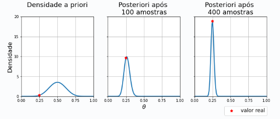

[Aprendizado de Máquina](index.md)

<!-- wiki:original:inicio -->

# Regressão Logística

## Regressão Logística Bayesiana

Na seção anterior, discutimos como obter uma estimativa pontual $\hat{\theta}$ para $\theta$ via [máxima verossimilhança](../inferencia-estatistica/estatistica-frequentista.md#secao-14) (MLE). Um problema com estimativas pontuais, no entanto, é que elas não refletem nossa incerteza sobre o valor estimado. Intuitivamente, por exemplo, esperamos que estimativas feitas com grandes quantidades de dados sejam mais confiáveis que as feitas com poucos dados. Para observar que MLE não captura esse aspecto, basta notar que repetir o conjunto de dados qualquer número arbitrário de vezes não causa impacto algum em $\hat{\theta}$.

A [estatística Bayesiana](../inferencia-estatistica/estatistica-bayesiana.md) propõe uma saída intuitiva para esse empasse. A ideia é modelar os parâmetros $\theta$ do modelo como uma variável aleatória, usando uma distribuição a priori $p(\theta)$ e aplicar a regra de Bayes para computar a distribuição de $\theta$ condicionada nas observações $D$, que chamamos de posteriori: $$p\left( \theta\vert D \right) = \frac{p\left( D\vert \theta \right)p(\theta)}{p(D)} = \frac{\mathcal{L}(\theta)p(\theta)}{\int\mathcal{L}(\theta')p(\theta')d\theta'}$$ Informalmente, a posteriori representa a incerteza que temos sobre o valor da variável $\theta$. Além disso, vale ressaltar que a priori nos permite encapsular conhecimento prévio, potencialmente subjetivo, sobre $\theta$ (i.e., antes de ver os dados) e sua escolha é uma questão de modelagem estatística. Quando não possuímos informação significante sobre os dados, é comum escolher uma distribuição de alta entropia como priori. No caso em que $\theta$ assume valores reais, e.g., poderíamos usar uma priori Gaussiana com alta variância.

No caso da regressão logística, é comum adotar uma priori Gaussiana sobre $\theta$ e a verossimilhança que usamos na seção anterior, resultando no modelo $$\begin{array}{r} \theta \sim N(\mu,\Sigma) \\ y_{n}\vert x_{n},\theta \sim \text{ Bern}\left( \sigma(\theta^{T}x_{n}) \right)\ \forall n = 1,\ldots,N \end{array}$$

cuja posteriori é dada por $$p\left( \theta\vert D \right) = \frac{\prod_{n = 1}^{N}\text{ Bern}\left( y_{n}\vert \sigma(\theta^{T}x_{n}) \right)N\left( \theta\vert \mu,\Sigma \right)}{\int_{x \in {\mathbb{R}}^{D + 1}}\prod_{n = 1}^{N}\text{ Bern}\left( y_{n}\vert \sigma(\theta'^{T}x_{n}) \right)N\left( \theta'\vert \mu,\Sigma \right)}$$

Notavelmente, computar a posteriori acima depende da resolução de uma integral que não possui forma fechada. Consequentemente, também não há uma forma analítica para $p\left( \theta\vert D \right)$. Essa dificuldade técnica não é uma raridade em modelos Bayesianos. Apesar de algumas escolhas pareadas de verossimilhança e priori resultarem em posteriores com forma analítica, esse não é o caso geral. Para driblar esse problema, usaremos métodos numéricos para aproximar a posteriori com distribuição mais simples, de forma conhecida

**Prevendo a label $y^{\ast}$ para um novo input $x^{\ast}$**: Suponha que conseguimos computar a posteriori $p\left( \theta\vert D \right)$, como podemos obter uma distribuição para $p\left( y^{\ast}\vert x^{\ast} \right)$? Quando estavamos usando uma estimativa pontual $\hat{\theta}$ (MLE), obtivemos uma distribuição sobre $y^{\ast}$ simplesmente encaixando $\hat{\theta}$ na nossa verossimilhança, i.e., tomamos $p\left( y^{\ast}\vert x^{\ast} \right) \approx \text{ Ber}\left( \sigma({\hat{\theta}}^{T}x^{\ast}) \right)$. No paradigma Bayesiano, levamos em consideração a incerteza sobre $\theta$ (codificada em nossa posteriori), ponderando cada valoração de $\theta$ pela sua densidade posteriori. O resultado, é o que chamamos de posteriori preditiva $$p\left( y^{\ast}\vert x^{\ast} \right) = \int p\left( y^{\ast}\vert x^{\ast},\theta \right)p\left( \theta\vert D \right)d\theta$$

**[Máxima verossimilhança](../inferencia-estatistica/estatistica-frequentista.md#secao-14) e máximo *a posteriori***: Uma das maiores virtudes do paradigma Bayesiano é oferecer uma maneira de quantificar incerteza. No entanto, há situações nas quais computar a posteriori, mesmo que de maneira aproximada, pode se tornar computacionalmente indesejável. Nesses casos, é comum procurar o ponto que máximiza a posteriori e tomá-lo como estimativa pontual. Chama-se esse precedimento de máximo a posteriori (MAP). Mais concretamente, a estimativa ${\hat{\theta}}_{\text{MAP}}$ pode ser obtida como: $$\begin{aligned} {\hat{\theta}}_{\text{MAP }} & = \text{ argmax}_{\theta}\log p\left( \theta\vert D \right) \\ & = \text{ argmax}_{\theta}\left\{ \log p\left( D\vert \theta \right) + \log p(\theta) - \log\int_{\theta}p\left( D\vert \theta \right)p(\theta) \right\} \\ & = \text{ argmax}_{\theta}\left\{ \log\mathcal{L}(\theta) + \log p(\theta) \right\} \end{aligned}$$

e, portanto, pode ser interpretada como uma versão regularizada do MLE, na qual $\log p(\theta)$ penaliza regiões pouco prováveis a priori

**Exemplo: Priori conjugada**

Para escolhas específicas de priori e verossimilhança, a distribuição posteriori possui forma analítica. Uma instância dessas ocorre quando $p(\theta)$ é uma distribuição Beta e a verossimilhança $p\left( D\vert \theta \right)$ é Bernoulli. Mais concretamente, suponha que escolhemos uma priori $\text{Beta}(\alpha,\beta)$ para $\theta$, dada por: $$Β(\theta\vert \alpha,\beta) = \left( \frac{\Gamma(\alpha + \beta)}{\Gamma(\alpha)\Gamma(\beta)} \right)\theta^{\alpha - 1}(1 - \theta)^{\beta - 1}$$ Podemos inferir, então, o seguinte sobre a posteriori do nosso modelo: $$\begin{aligned} p\left( \theta\vert D \right) & \propto \prod_{n = 1}^{N}\text{ Bern}\left( y_{n}\vert \theta \right)\text{ Beta}\left( \theta\vert \alpha,\beta \right) \\ & \propto \prod_{n = 1}^{N}\theta^{y_{n}}(1 - \theta)^{1 - y_{n}}\theta^{\alpha - 1}(1 - \theta)^{\beta - 1} \\ & \propto \theta^{\alpha + \sum_{n = 1}^{N}y_{n} - 1}(1 - \theta)^{\beta + N - \sum_{n = 1}^{N}y_{n} - 1} \\ & \propto \theta^{\alpha' - 1}(1 - \theta)^{\beta' - 1} = \text{ Beta}\left( \theta\vert \alpha',\beta' \right) \end{aligned}$$

onde $\alpha' = \alpha + \sum_{n = 1}^{N}y_{n}$ e $\beta' = \beta + N - \sum_{n = 1}^{N}y_{n}$.

Portanto, concluimos que nossa posteriori é uma $\text{Beta}(\alpha',\beta')$. Para ilustrar o uso da regra de Bayes, a figura abaixo mostra atualizações da posteriori derivada acima para diferentes números de amostras $N$. Para tal, assumimos que a distribuição geradora dos dados é $\text{Bern}(0.25)$ e usamos uma priori $\text{Beta}(10,10)$. Veja que, à medida que vemos mais amostras, a posteriori se afunila ao redor de $0.25$.

### Aproximação de Laplace

A aproximação de Laplace é, possivelmente, a mais simples técnica de inferência Bayesiana aproximada. A ideia é construir uma aproximação simples $q(\theta)$ para a posteriori $p\left( \theta\vert D \right)$ usando uma expansão de Taylor de segunda ordem em $\log p\left( \theta\vert D \right)$ ao redor da moda $m$ da posteriori (i.e., o ponto de máxima densidade) $$\log p\left( \theta\vert D \right) \approx \log p\left( m\vert D \right) + (\theta - m)^{T}\nabla_{\theta}\log p\left( m\vert D \right) + \frac{1}{2}(\theta - m)^{T}\nabla_{\theta}^{2}\log p\left( m\vert D \right)(\theta - m)$$

Note que $\log p\left( m\vert D \right)$ é uma constante com respeito a $\theta$ e lembre que o gradiente de uma função em sua moda, caso ela exista, é zero. Então, concluímos que: $$\log p\left( \theta\vert D \right) \approx \frac{1}{2}(\theta - m)^{T}\mathbf{H}(\theta - m) + C$$

onde $\mathbf{H} = \nabla_{\theta}^{2} - \log p\left( m\vert D \right)$. Por design, construímos $q$ tal que $\log q$ difira da expansão acima apenas por uma constante aditiva, então: $$\log q(\theta) = \frac{1}{2}(\theta - m)^{T}\mathbf{H}(\theta - m) + C' \Rightarrow q(\theta) \propto \exp(\frac{1}{2}(\theta - m)^{T}\mathbf{H}(\theta - m))$$ e como $q(\theta)$ é proporcional á uma densidade normal multivariada com média $m$ e matriz de covariância igual á inversa de $H$, temos: $$q(\theta) = N\left( \theta\vert \mu = m,\Sigma = H^{- 1} \right),\text{ onde }m = \text{ argmax}_{\theta}p\left( \theta\vert D \right)\text{ e }H = \nabla_{\theta}^{2} - \log p\left( m\vert D \right)$$

Note que o procedimento acima envolve inverter $H$. Como $m$ é um mínimo local para a função $- \log p\left( \cdot \vert D \right)$, segue diretamente das condições de optimalidade de segunda ordem que $H$ é PSD. Caso $H$ não seja PD ou haja instabilidade numérica na inversão de $H$, uma prática comum é adicionar um pequeno valor $c > 0$ à sua diagonal.

Para aplicar o método de Laplace ao nosso modelo de regressão logística Bayesiano, podemos usar alguma variação de [gradiente descendente](../otimizacao-para-ciencia-de-dados/metodo-do-gradiente.md) para achar $m$ e, assumindo $\mu = 0$ e $\Sigma = cI$ para $c > 0$, as entradas $H_{ij}$ da Hessiana $H$ são dadas por $$H_{ij} = \begin{cases} \sum_{n = 1}^{N}\sigma(\theta^{T}x_{n})\sigma( - \theta^{T}x_{n})x_{ni}x_{nj}\text{ se }i \neq j \\ \sum_{n = 1}^{N}\sigma(\theta^{T}x_{n})\sigma( - \theta^{T}x_{n})x_{ni}^{2} + c^{- 1}\text{ se }i = j \end{cases}$$

## Problemas multiclasse, classificador *softmax*

Nesse capítulo, nos focamos em problemas de classificação binária, em que $\vert \mathcal{Y}\vert  = 2$. No entanto, é fácil generalizar as técnicas que discutimos para problemas multi-classe (i.e., $\vert \mathcal{Y}\vert  > 2$). Para tal, basta substituir o nosso modelo observacional Bernoulli por uma distribuição categórica. Lembre que a Bernoulli é parametrizada por um parâmetro escalar que dita a probabilidade de cada classe. No caso da categórica, precisamos de um vetor de probabilidades, i.e., um vetor $r$ de tamanho $L = \vert \mathcal{Y}\vert$, em que cada entrada $r_{l}$ denota a probabilidade da classe $l$. Naturalmente, todas as entradas de $r$ devem ser não-negativas e $\sum_{l = 1}^{L}r_{l} = 1$. Resta-nos, então, expressar $r$ como uma função de $x$. Para tal, podemos generalizar nosso o procedimento que usamos para regressão logística.

Primeiro, calculamos um vetor de logits $z$, desta vez usando uma transformação linear para cada uma das $L$ classes $$z = \begin{pmatrix} x^{T}\theta^{(1)} \\ x^{T}\theta^{(2)} \\ \vdots \\ x^{T}\theta^{(L)} \end{pmatrix}$$

Finalmente, aplicamos a função Softmax para transformar $z$ em um vetor de probabilidades e obter $r$, que é dado por: $$r_{l} = \text{ Softmax}(z) = \frac{e^{z_{l}}}{\sum_{l' = 1}^{L}e^{z_{l'}}}$$

------------------------------------------------------------------------

<!-- wiki:original:fim -->

## Percurso de estudo

[Trilha: A1](../../trilhas/aprendizado-de-maquina/a1.md) · [Apresentação e contexto da fonte](../../trilhas/aprendizado-de-maquina/a1.md#apresentacao-original)

- Anterior: [Regressão Linear](regressao-linear.md)
- Próximo: [Redes Neurais](redes-neurais.md)
