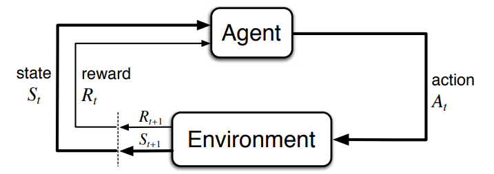
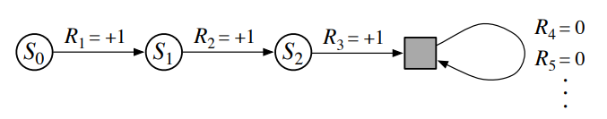
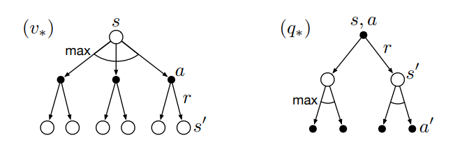
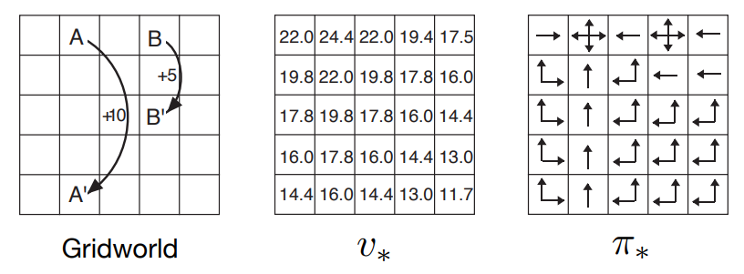

[Aprendizado por Reforço](../index.md)

<!-- wiki:original:inicio -->

# Processos de Decisão de Markov Finitos

## A interface do agente-ambiente

MDPs são uma formulação direta do problema de aprender de interações para alcançar um objetivo. O tomador de decisão é chamado de agente. A coisa que interage com ele, compreendendo tudo de fora do agente, é chamado de ambiente. Eles interagem continuamente, com o agente selecionando ações e o ambiente reagindo a essas ações e retornando outras situações e retornando recompensas.

*Figura 9. O agente e o ambiente interagindo em um Processo de Decisão de Markov.*

Mais especificamente, o agente e o ambiente interagem a cada sequência de passos discreta, $t = 1,2,\ldots$(restringindo a uma quantidade discreta para entendermos melhor). A cada passo $t$, o agente recebe alguma representação sobre o $\text{estado}$ do ambiente, $S_{t} \in \mathcal{S}$, e com base nisso seleciona uma ação, $A_{t} \in \mathcal{A}(s)$. Após a ação selecionada, o agente recebe uma recompensa numérica $R_{t + 1} \in \mathcal{R} \subset {\mathbb{R}}$ e acha para si mesmo um novo estado, $S_{t + 1}$. O agente e o ambiente numa MDP faz uma trajetória desse tipo:

$$
S_{0},A_{0},R_{1},S_{1},A_{1},R_{2},S_{2},A_{2},R_{3},\ldots
$$

Em um MDP finito, o conjunto de ações e recompensas têm um número finito de elementos. Nesse caso, conseguimos definir variáveis aleatórias discretas $R_{t}$ e $S_{t}$ dependendo apenas do estado e ação anterior. Ou seja, para $s' \in \mathcal{S}\text{ and  }r \in \mathcal{R}$, existe uma probabilidade desses valores ocorrerem no tempo $t$, dado valores do estado e ação:

$$
p\left( s',r\vert s,a \right)\dot{=}\Pr\left\{ S_{t} = s',R_{t} = r\vert S_{t - 1} = s,A_{t - 1} = a \right\}
$$

para todo $s',s \in \mathcal{S},r \in \mathcal{R}$ e $a \in \mathcal{A}(s)$. Essa probabilidade significa basicamente: depois de estar no estado $s$ e tomar a ação $a$, o ambiente responda com a recompensa $r$ e transite para o estado $s'$. Lembre-se que $p$ especifica uma distribuição de probabilidade para cada escolha de $s$ e $a$, ou seja

$$
\sum_{s' \in \mathcal{S}}\sum_{r \in \mathcal{R}}p\left( s',r~\vert ~s,a \right) = 1,\text{   para todo }s \in \mathcal{S},a \in \mathcal{A}(s)
$$

Em MDPs, a probabilidade caracteriza completamente a dinâmica do ambiente. Ou seja, a probabilidade de cada valor possível para $R_{t}$ e $S_{t}$ depende apenas no estado e ação imediatamente anterior $S_{t - 1}$ e $R_{t - 1}$. Note então que o estado deve incluir todas as informações relevantes sobre as interações passadas entre o agente e o ambiente que possam influenciar no futuro. Dizemos que, se isso acontece, o estado tem a propriedade de Markov, e assumiremos essa propriedade durante o resumo.

Podemos calcular outras quantidades válidas baseado nessa probabilidade geral, como a probabilidade de transição de estado(como uma função de 3 arguentos $$p:\mathcal{S}$$ x $\mathcal{S}$ x $\mathcal{A} \rightarrow \lbrack 0,1\rbrack$):

$$
p\left( s'\vert s,a \right)\dot{=}\Pr\left\{ S_{t} = s'~\vert ~S_{t - 1} = s,A_{t - 1} = a \right\} = \sum_{r \in \mathcal{R}}p\left( s',r~\vert ~s,a \right)
$$

Nós também podemos podemos calcular as recompensas esperadas para pares estado-ação, definido como $r:\mathcal{S}$ x $\mathcal{A} \rightarrow {\mathbb{R}}$:

$$
r(s,a)\dot{=}{\mathbb{E}}\left\lbrack R_{t}~\vert ~S_{t - 1} = s,A_{t - 1} = a \right\rbrack = \sum_{r \in \mathcal{R}}r\sum_{s' \in \mathcal{S}}p\left( s',r~\vert ~s,a \right)
$$

E as recompensas esperadas condicionadas também ao próximo estado, como uma função de três argumentos $r:\mathcal{S}$ x $\mathcal{A}$ x $\mathcal{S} \rightarrow {\mathbb{R}}$:

$$
r(s,a,s')\dot{=}{\mathbb{E}}\left\lbrack R_{t}~\vert ~S_{t - 1} = s,A_{t - 1} = a,S_{t} = s' \right\rbrack = \sum_{r \in \mathcal{R}}r\frac{p\left( s',r~\vert ~s,a \right)}{p\left( s'\vert s,a \right)}
$$

O MDP pode ser um pouco abstrato e flexível às vezes, e pode ser aplicado a muitos tipos de maneiras diferentes. Os passos de tempo($t,t + 1$, etc.) não precisam corresponder a intervalos fixos de tempo real, eles podem se referir a estágios arbitrários e sucessivos de tomada de decisão e ação.

Por exemplo, as ações podem ser de baixo nível, como controles de voltagem de um braço robótico, ou alto nível, como decidir ou não se deve almoçar. A mesma coisa acontece para os estados, que podem ser de baixo nível, como leituras de sensores, ou podem ser mais abstratos e de alto nível, como descrições simbólicas de elementos numa sala. Ou seja, cada “time step” representa apenas uma unidade lógica de decisão e consequência.

Em geral, seguimos uma regra que diz o seguinte: tudo que não pode ser alterado arbitrariamente pelo agente é considerado parte do ambiente. Não assumimos que tudo no ambiente é desconhecido pelo agente, mas sempre consideramos o cálculo das recompensas como algo externo do agente. Por fim, em alguns casos o agente pode saber tudo sobre como o ambiente funciona e ainda assim enfrentar uma tarefa de aprendizado por reforço difícil, assim como podemos conhecer exatamente as regras de um cubo mágico e ainda assim não conseguir resolvê-lo.

A fronteira entre o agente e o ambiente pode ser localizado de diferentes lugares, para diferentes propósitos. Por exemplo, um agente pode tomar decisões de alto nível que formam parte dos estados enfrentados por um agente de nível mais baixo, que implementa as decisões de alto nível.

Um quadro de MDP é uma abstração considerável do problema de aprender com o objetivo de atingir metas a partir da interação. Esse modelo propõe que, qualquer problema de aprendizado de comportamento orientado a objetivos pode ser reduzido a três sinais trocados entre um agente e seu ambiente:

- Um sinal para representar as escolhas feitas pelo agente (as ações),

- Um sinal para representar a base sobre a qual as escolhas são feitas (os estados), e

- Um sinal para definir o objetivo do agente (as recompensas).

**Exemplo**

**Biorreator**

Suponha que o aprendizado por reforço esteja sendo aplicado para determinar, momento a momento, as temperaturas e taxas de agitação de um biorreator (um grande tanque de nutrientes e bactérias usado para produzir substâncias químicas úteis).

As ações, nesse tipo de aplicação, podem ser temperaturas-alvo e taxas de agitação-alvo que são passadas para sistemas de controle de baixo nível que, por sua vez, ativam diretamente elementos de aquecimento e motores para atingir esses valores.

Os estados provavelmente consistem em leituras de sensores (como termopares), possivelmente filtradas e atrasadas, além de entradas simbólicas representando os ingredientes no tanque e o produto químico desejado.

As recompensas podem ser medidas momento a momento da taxa de produção da substância útil pelo biorreator.

Note que aqui cada estado é uma lista (ou vetor) de leituras de sensores e entradas simbólicas, e cada ação é um vetor consistindo de uma temperatura-alvo e uma taxa de agitação. É típico em tarefas de aprendizado por reforço que estados e ações tenham representações estruturadas desse tipo. As recompensas, por outro lado, são sempre números únicos (escalares).

**Exemplo**

**Robô de Pegar e Colocar (Pick-and-Place)**

Considere o uso de aprendizado por reforço para controlar o movimento do braço de um robô em uma tarefa repetitiva de pegar e colocar objetos. Se quisermos aprender movimentos rápidos e suaves, o agente de aprendizado precisará controlar diretamente os motores e ter informações de baixa latência sobre as posições e velocidades atuais das articulações mecânicas.

As ações, nesse caso, podem ser as tensões elétricas aplicadas a cada motor em cada articulação, e os estados podem ser as leituras mais recentes dos ângulos e velocidades das juntas.

A recompensa pode ser +1 para cada objeto que o robô pegar e colocar com sucesso. Para encorajar movimentos suaves, a cada passo de tempo pode ser dada uma pequena recompensa negativa, em função da “tremedeira” (ou irregularidade) do movimento no momento.

## Metas e recompensas

Em teoria, o objetivo do agente é maximizar o total de recompensas que recebe. Como mostrado em seções anteriores, isso não significa maximizar apenas a recompensa imediata, mas a recompensa acumulada ao longo do tempo.

O autor diz: “Tudo o que entendemos por metas e propósitos pode ser considerado como a maximização do valor esperado da soma cumulativa de um sinal escalar recebido (chamado recompensa.”

Em particular, o sinal de recompensa não deve ser usado para transmitir ao agente conhecimento prévio sobre como alcançar um objetivo. Por exemplo, um agente que joga xadrez deve ser recompensado apenas por vencer o jogo, e não por sub-objetivos intermediários como capturar peças ou controlar o centro do tabuleiro. Se esses sub-objetivos fossem recompensados separadamente, o agente poderia encontrar uma maneira de atingi-los sem alcançar o verdadeiro objetivo — por exemplo, capturar várias peças, mas ainda assim perder a partida, o que não traria o resultado esperado.

## Retornos e episódios 

Como explicado até agora, a meta do agente é maximizar a recompensa cumulativa do agente ao longo da execução. Mas como definir isso formalmente? O retorno esperado, denominado $G_{t}$, após o tempo $t$, pode ser definido no caso simples como:

$$
G_{t}\dot{=}R_{t + 1} + R_{t + 2} + R_{t + 3} + \ldots + R_{T}
$$

Onde $T$ é o passo final. Essa formulação faz sentido em aplicações nas quais existe uma noção natural de término, ou seja, quando a interação entre o agente e o ambiente se divide em subsequências, que chamamos de episódios — como partidas de um jogo, travessias de um labirinto ou qualquer tipo de interação repetida. Cada episódio termina em um estado especial chamado estado terminal, seguido de um reinício para um estado inicial padrão.

Mesmo que os episódios terminem de formas diferentes (por exemplo, vitória ou derrota em um jogo), o próximo episódio começa independentemente de como o anterior terminou. Assim, podemos considerar que todos os episódios terminam em um mesmo estado terminal, apenas com recompensas diferentes para os diferentes resultados.

Tarefas com episódios desse tipo são chamadas de tarefas episódicas. Em tarefas episódicas, às vezes precisamos distinguir o conjunto de todos os estados não terminais, denotado por $\mathcal{S}$, do conjunto de todos os estados incluindo o terminal, denotado por $\mathcal{S^{+}}$.O tempo de término $T$ é uma variável aleatória, que normalmente varia de episódio para episódio.

Por outro lado, em muitos casos, a interação entre o agente e o ambiente não se divide naturalmente em episódios identificáveis, mas continua indefinidamente, sem limite de tempo. Por exemplo, isso seria o modo natural de formular uma tarefa de controle de processo contínuo, ou uma aplicação em um robô de longa duração. Chamamos essas de tarefas contínuas (continuing tasks).

Note que no caso de tarefas contínuas teríamos uma soma infinita de termos de valores de recompensas, o que poderia causar $G_{t} = \infty$. Mas não é exatamente isso que queremos. Assim, adicionamos um novo conceito que precisamos, chamado de desconto, da forma:

$$
G_{t}\dot{=}R_{t + 1} + \gamma R_{t + 2} + \gamma^{2}R_{t + 3} + \ldots = \sum_{k = 0}^{\infty}\gamma^{k}R_{t + k + 1}
$$

onde $0 \leq \gamma \leq 1$, chamado de taxa de desconto. Esse parâmetro faz com que recompensas futuras valham menos, mantendo $G_{t + 1}$ finito mesmo em tarefas infinitas e expressa a ideia intuitiva que recompensas imediatas valem mais do que futuras.

Ainda, note que, se $\gamma < 1$, a soma infinita tem um valor finito, desde que a sequência de recompensas seja limitada. Se $\gamma = 0$, o agente é chamado de míope, pois se preocupa apenas em maximizar recompensas imediatas, seu objetivo então se torna apenas escolher $A_{t}$ de modo a maximizar $R_{t + 1}$.

Por fim, note que $$\begin{aligned} G_{t} & = R_{t + 1} + \gamma R_{t + 2} + \gamma^{2}R_{t + 3} + \gamma^{3}R_{t + 4} + \ldots \\ & = R_{t + 1} + \gamma\left( R_{t + 2} + \gamma_{t + 3} + \gamma^{2}R_{t + 4} + \ldots \right) \\ & = R_{t + 1} + \gamma G_{t + 1} \end{aligned}$$

e isso funciona para todos os instantes de tempo $t < T$, mesmo que a terminação ocorra em $t + 1$, se definirmos $G_{T} = 0$.

**Exemplo**

Equilíbrio de um Pêndulo (Pole-Balancing)

O objetivo nesta tarefa é aplicar forças a um carrinho que se move ao longo de um trilho, de modo a manter uma haste presa ao carrinho sem cair. Considera-se que ocorre falha quando a haste ultrapassa um certo ângulo limite a partir da vertical ou quando o carrinho sai dos trilhos. Após cada falha, a haste é reposta na posição vertical.

Esta tarefa pode ser tratada como episódica, em que os episódios naturais são as tentativas repetidas de equilibrar a haste. A recompensa neste caso poderia ser +1 a cada passo de tempo em que não ocorre falha, de modo que o retorno em cada instante seria igual ao número de passos até a falha. Nesse caso, conseguir equilibrar a haste para sempre implicaria em um retorno infinito.

Alternativamente, poderíamos tratar o equilíbrio da haste como uma tarefa contínua, usando desconto. Nesse caso, a recompensa seria $- 1$ a cada falha e zero nos outros momentos. O retorno em cada instante seria então relacionado a $- \gamma^{K}$, onde $K$ é o número de passos de tempo antes da falha.

Em qualquer dos casos, o retorno é maximizado mantendo a haste equilibrada pelo maior tempo possível.

*Figura 10. Imagem representativa do exemplo*

## Notação Unificada para Tarefas Contínuas e episódicas

Para conseguirmos nos referir não só a Tarefas Contínuas mas também Episódicas sem perda de generalidade e na mesma notação, precisamos nos referir não apenas a $S_{t}$, a representação no tempo $t$, mas sim a $S_{t,i}$, a representação do estado $t$ no episódio $i$(Análogo para $A_{t,i}$, $R_{t,i}$, etc.).

Agora, precisamos apenas de mais uma convenção de notação única que cubra tanto as tarefas episódicas quanto as contínuas. Os dois casos podem ser unificados se considerarmos que a terminação de um episódio corresponde à entrada de um estado especial absorvente, que faz transição apenas para si mesmo e gera recompensas iguais a zero.

*Figura 11. Exemplo de unificação dos casos*

No exemplo acima, vemos que o quadrado é exatamente o estado que descrevemos, e que ao somar as recompensas, obtemos o mesmo retorno se somarmos até $T = 3$ ou se somarmos a sequência infinita completa.

Assim, podemos definir o retorno em geral da forma:

$$
G_{t}\dot{=}\sum_{k = t + 1}^{T}\gamma^{k - t - 1}R_{k}
$$

Incluindo a probabilidade de $T = \infty$ ou $\gamma = 1$.

## Políticas e Funções de valor

Quase todos os algoritmos de Aprendizado por Reforço envolvem a estimação de funções de valor - funções de estados (ou de pares estado-ação) - que estimam o quão bom é para o agente estar em um determinado estado. Essa noção de “quão bom” é definida em termos de recmpensas futuras que podem ser esperadas, ou em termos de retorno esperado.

Assim, as funções de valor são definidas com respeito a modos particulares de agir, chamados políticas. Uma política é um mapeamento de estados para probabilidades de selecionar cada ação possível. Se o agente está seguindo a política $\pi$ no tempo $t$, então $\pi(a\vert s)$ é a probabilidade de que $A_{t} = a$ e $S_{t} = s$.

A função de valor de um estado $s$ em uma política $\pi$, denotado $v_{\pi}(s)$ é o valor esperado quando começamos em $s$ e seguindo $\pi$ depois disso. Para MDPs, conseguimos definir $v_{\pi}$ formalmente como:

$$
v_{\pi}(s)\dot{=}{\mathbb{E}}_{\pi}\left\lbrack G_{t}\vert S_{t} = s \right\rbrack = {\mathbb{E}}_{\pi}\left\lbrack \sum_{k = 0}^{\infty}\gamma^{k}R_{t + k + 1}\vert S_{t} = s \right\rbrack,\text{  para todo }s \in \mathcal{S}
$$

onde ${\mathbb{E}}_{\pi}\left\lbrack . \right\rbrack$ denota a esperança de uma variável aleatória dado que o agente segue uma política $\pi$, e $t$ é qualquer passo. Nós chamamos a função $v_{\pi}$ de função de valor de estado para a política $\pi$.

Similarmente, podemos definir o valor de tomar a ação $a$ no estado $s$ sobre a política $\pi$, denotada $q_{\pi}(s,a)$, como a esperança partindo de $s$, tomando a ação $a$, e depois disso seguir a política $\pi$ como:

$$
q_{\pi}(s,a)\dot{=}{\mathbb{E}}_{\pi}\left\lbrack G_{t}\vert S_{t} = s,A_{t} = a \right\rbrack = {\mathbb{E}}_{\pi}\left\lbrack \sum_{k = 0}^{\infty}\gamma^{k}R_{t + k + 1}\vert S_{t} = s,A_{t} = a \right\rbrack
$$

e chamamos $q_{\pi}$ de função de valor da ação para a política $\pi$.

Como as funções de valor são esperanças, entçao elas podem ser estimadas a partir de experiência, ou seja, se um agente segua a política $\pi$ e mantém uma média, então essa média convergirá para o valor do estado, à medida que o número de vezes em que o estado é encontrado tende ao infinito (claro uso da Lei dos Grandes Números).

O único problema é que, se houverem muitos estados, pode não ser muito prático manter médias separadas para cada estado individualmente. Nesse caso, o agente deveria representar $v_{\pi}\text{  e  }q_{\pi}$ como funções parametrizadas(menos parâmetros do que estados) e ajustar os parâmetros de modo a corresponder melhor aos retornos observados.

Uma propriedade legal das funções de valor são que elas mantém relações recursivas, o que sempre traz benefícios computacionalmente. Especificamente, para qualquer política $\pi$ e qualquer estado $s$, vale que:

$$\begin{aligned} v_{\pi}(s) & \dot{=}{\mathbb{E}}_{\pi}\left\lbrack G_{t}\vert S_{t} = s \right\rbrack \\ & = {\mathbb{E}}_{\pi}\left\lbrack R_{t + 1} + \gamma G_{t + 1}\vert S_{t} = s \right\rbrack \\ & = \sum_{a}\pi(a\vert s)\sum_{s}'\sum_{r}p\left( s',r~\vert ~s,a \right)\left\lbrack r + \gamma{\mathbb{E}}\left\lbrack G_{t + 1}\vert S_{t + 1} = s' \right\rbrack \right\rbrack \\ & = \sum_{a}\pi(a\vert s)\sum_{r,s'}p\left( s',r\vert s,a \right)\left\lbrack r + \gamma v_{\pi}(s') \right\rbrack,\text{  para todo }s \in \mathcal{S} \end{aligned}$$

Note que na última equação não juntamos duas somas, de todos os valores de $s'$ e de todos os valores $r$. Note ainda que a expressão final pode ser facilmente lida como um valor esperado. Ela é, na verdade, uma soma sobre todos os valores das três variáveis, $a,s'\text{  e  }r$.

A equação [\[belman\]](#belman) é chamada de Equação de Bellman para $v_{\pi}$. Pense em olhar para frente a partir de um estado até seus possíveis estados sucessores (olhe a imagem).

*Figura 12. Diagrama intuitivo da Equação de Bellman.*

Cada círculo aberto representa um estado, e cada círculo preenchido representa um par estado-ação. Começando do estado $s$, o agente pode tomar qualquer uma dentre várias ações (de acordo com a política $\pi$). A partir dessas ações, o ambiente pode responder com um de vários possíveis estados $s'$, junto com uma recompensa $r$, dependendo de sua dinâmica, que é dada pela função $p$.

A equação de Bellman faz a média sobre todas as probabilidades, ponderando cada uma pela chance de ocorrer, e ela afirma que o valor do estado inicial deve ser igual ao valo esperado (descontado) do próximo estado esperado, mais a recompensa esperada ao longo do caminho. Existe apenas uma solução $v_{\pi}$ que satisfaz a equação.

**Exemplo**

GridWorld - Mundo ganancioso

A figura abaixo (esquerda) mostra um GridWorld de um MDP simples e finito. O objetivo do desafio é partir do espaço A” ou B” e chegar em suas respectivas recompensas A e B. Logo, podemos definir que cada estado é cada quadrado (posição da matriz), e que a cada estado temos 4 escolhas de ação: Esquerda, direita, cima, baixo.

Ainda, se o agente chegar a A, ele recebe +10 de recompensa e é teletransportado a A’. O mesmo acontece para B e B” com recompensa +5. Qualquer outra ação que o leve no quadriculado mas não no objetivo recompensa 0. Caso a ação o faça sair do quadriculado, ele permanece no quadriculado anterior, e recebe uma recompensa -1.

Na figura à direita, temos a tabela de valores de estado $v_{\pi}(s)$ para uma política equiprovável - o agente escolhe qualquer ação com probabilidade $\frac{1}{4}$ (isso significa que $\pi(a\vert s) = \frac{1}{4}$). A figura mostra o retorno médio esperado se o estado começar naquele estado e seguir uma política aleatória.

*Figura 13. Exemplo do algoritmo GridWorld.*

Vamos para outro exemplo um pouco mais difícil:

**Exemplo**

Golfe

*Figura 14. Exemplo do algoritmo para simular um jogo de golfe, imagem superior usa apenas a tacada putter, enquanto a imagem inferior usa $q_{\ast}(s,a)$, com $a$ sendo a tacada driver.*

Para formular o ato de jogar um buraco de golfe como uma tarefa de RL, contamos uma penalidade de -1 para cada tacada até que acertemos a bola no buraco, recebendo a recompensa 0. O estado é a localização da bola, e as ações são a forma como miramos e escolhemos o taco.

Vamos supor que a mira já está determinada, e consideremos apenas a escolha do taco, que pode ser putter (curta distância) ou driver (longa distância). A imagem superior ao lado mostra uma possível função de valor de estado $v_{\text{putt }}(s)$, para política que sempre usa o putter.

De qualquer ponto do green, supomos que podemos fazer um putt (acertar o buraco); esses estados têm valor −1. Fora do green, não conseguimos chegar ao buraco apenas no putter, então o valor é mais negativo.

Como mostrado na primeira imagem do exemplo, o contorno da imagem mostra a distância do objetivo e, usando o taco putter, notamos que partindo do início, precisariamos de 6 tacadas até chegar ao buraco. Ainda, no segundo exemplo, notamos que usando a tacada driver, precisaríamos apenas de 3 tacadas para chegar ao buraco. Porém, note que temos a areia, que traz a recompensa negativa de $- \infty$.

Como a areia está apenas perto do buraco, e, sabendo que a tacada driver consegue jogar a bola mais longe mas com menos precisão, é esperado que o agente aprenda a melhor política $\pi_{\ast}$ que combinaria as duas, usando o driver no começo e o putter no fim

## Políticas Ótimas e Funções de Valor Ótimas

Uma política $\pi$ é ótima se ela for melhor ou igual a qualquer outra política $\pi'$. Enunciando melhor, $\pi \geq \pi' \Leftrightarrow v_{\pi}(s) \geq v_{\pi}'(s)$ para todo $s \in \mathcal{S}$. Sabendo que podem existir mais do que uma, as políticas ótimas são denotadas como $\pi_{\ast}$. Elas compartilham a melhor função de estado-valor, chamada de função de estado-valor ótima e denotada como:

$$
v_{\ast}(s)\dot{=}\max\limits_{\pi}v_{\pi}(s),\text{  para todo }s \in \mathcal{S}
$$

Ainda, políticas ótimas compartilham as mesmas funções de ação-valor ótimos, definidas como:

$$
q_{\ast}(s,a)\dot{=}\max\limits_{\pi}q_{\pi}(s,a),\text{  para todo }s \in \mathcal{S}\text{  e  }a \in \mathcal{A}
$$

**Exemplo**

Continuação do exemplo de golfe

A imagem de baixo mostra uma possível função de valor-ótima, $q_{\ast}$. Como dito, o driver nos permite bater na bola mais longe, mas com menos precisão. Podemos alcançar o buraco em uma única tacada usando o driver apenas se estivermos bem perto, por isso, o contorno de valor $- 1$ de $q_{\ast}\left( s,\text{ driver} \right)$ cobre apenas uma pequena região ao redor da área verde.

Se tivermos duas tacadas, entretanto, podemos chegar ao buraco a partir de locais mais distantes, conforme mostrado pelo contorno de $- 2$. Nesse caso, não precisamos atingir diretamente o buraco com o driver, basta chegar até a área verde, onde então podemos usar o putter.

Da posição inicial (tee), o melhor conjunto de ações é duas tacadas com o driver e uma com o putter, totalizando três tacadas até o buraco.

Note que o valor de um estado sob a política ótima, deve ser igual ao retorno esperado de tomar a melhor ação possível a partir desse estado. Formalmente:

$$
\begin{aligned} v_{\ast}(s) & = \max\limits_{a \in \mathcal{A}(s)}{q_{\pi}}_{\ast}(s,a) \\ & = \max\limits_{a}{{\mathbb{E}}_{\pi}}_{\ast}\left\lbrack G_{t}~\vert ~S_{t} = s,A_{t} = a \right\rbrack \\ & = \max\limits_{a}{{\mathbb{E}}_{\pi}}_{\ast}\left\lbrack R_{t + 1} + \gamma G_{t + 1}~\vert ~S_{t} = s,A_{t} = a \right\rbrack \\ & = \max\limits_{a}{{\mathbb{E}}_{\pi}}_{\ast}\left\lbrack R_{t + 1} + \gamma v_{\ast}\left( S_{t + 1} \right)~\vert ~S_{t} = s,A_{t} = a \right\rbrack \\ & = \max\limits_{a}\sum_{s',r}p\left( s',r~\vert ~s,a \right)\left\lbrack r + \gamma v_{\ast}(s') \right\rbrack \end{aligned}
$$

Essa é a chamada equação de Bellman de otimalidade. O mesmo raciocínio segue para a equação de Bellman de otimalidade para $q_{\ast}$:

$$
\begin{aligned} q_{\ast}(s,a) & = {\mathbb{E}}\left\lbrack R_{t + 1} + \gamma\max\limits_{a}'q_{\ast}\left( S_{t + 1},a' \right)~\vert ~S_{t} = s,A_{t} = a \right\rbrack \\ & = \sum_{s',r}p\left( s',r~\vert ~s,a \right)\left\lbrack r + \max\limits_{a}'q_{\ast}(s',a') \right\rbrack \end{aligned}
$$

Os diagramas de backup são os mesmos usados anteriormente, exceto que os arcos nos pontos de escolha do agente tem um max.

*Figura 15. Diagramas anteriores, representando a equação de Bellman de otimalidade para $v_{\pi}$ e $q_{\pi}$, respectivamente.*

Para MDPs finitos, a equação de otimalidade de Bellman tem uma única solução. Além disso, uma vez que se tenha $v_{\ast}$, é relativamente fácil determinar uma política ótima.

Para cada estado $s$, haverá uma ou mais ações nas quais o máximo é atingido na equação de otimalidade de Bellman. Qualquer política que atribua probabilidade diferente de zero a essas ações é uma política ótima.

Podemos pensar nisso como uma busca de um passo. Se temos a função de valor ótima $v_{\ast}$, então as ações que parecem melhores após uma busca de um passo já são ações ótimas.

Ter $q_{\ast}$ também torna a escolha das ações ótimas ainda mais fácil, pois, para qualquer estado $s$, o agente pode simplesmente encontrar a ação $a$ que maximiza $q_{\ast}(s,a)$. A função de valor-ação $q_{\ast}$ efetivamente armazena (faz cache) os resultados de todas as buscas de um passo à frente.

**Exemplo**

Continuação do exemplo de GridWorld

Suponha que resolvemos a equação de Bellman para $v_{\ast}$ para o grid simples introduzido no exemplo anterior. A figura do meio mostra a função ótima do valor, enquanto a função da direita mostra as políticas ótimas correspondentes.

*Figura 16. Solução ótima para o problema GridWorld*

## Otimização e aproximação

Um agente que aprende uma política ótima teve um excelente desempenho. Mas, na prática, isso só acontece com alto custo computacional. Mesmo que tenhamos um modelo completo e preciso das dinâmicas do ambiente, geralmente não é possível simplesmente calcular uma política ótima resolvendo a equação de otimalidade de Bellman.

Por exemplo, jogos de tabuleiro como o xadrez representam apenas uma fração minúscula da experiência humana, e mesmo assim grandes computadores especialmente projetados ainda não conseguem calcular as jogadas ótimas. Os principais aspectos que limitam são o poder computacional de tempo e memória.

Em casos tabulares(pequenos e finitos), é possível resolver e armazenas em arrays ou tabelas. Porém, em casos práticos, existem muitos mais estados do que os possíveis de armazenar. Nesses casos, as funções precisam ser aproximadas, usando alguma forma de representação funcional mais compacta e parametrizada.

A natureza online(significa com atualização constante dos dados) do aprendizado por reforço torna possível aproximar políticas ótimas de forma que se dedique mais esforço a aprender boas decisões para estados frequentemente encontrados, à custa de menos esforço para estados raramente encontrados.

------------------------------------------------------------------------

<!-- wiki:original:fim -->

## Percurso de estudo

[Trilha: Revisão geral](../../../trilhas/aprendizado-por-reforco/revisao-geral.md) · [Apresentação e contexto da fonte](../../../trilhas/aprendizado-por-reforco/revisao-geral.md#apresentacao-original)

- Anterior: [Soluções de métodos tabulares](../solucoes-de-metodos-tabulares/index.md)
- Próximo: [Programação Dinâmica](../programacao-dinamica/index.md)
