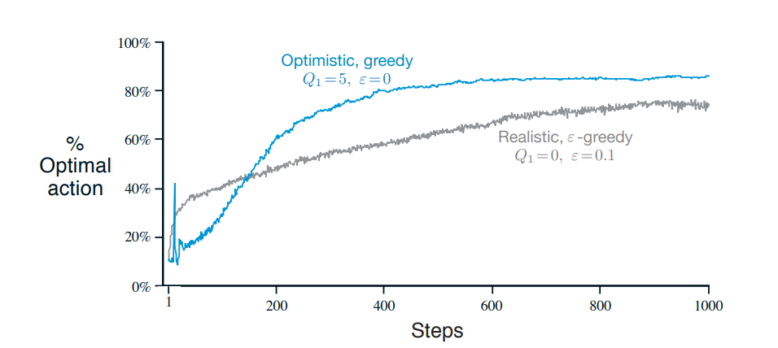
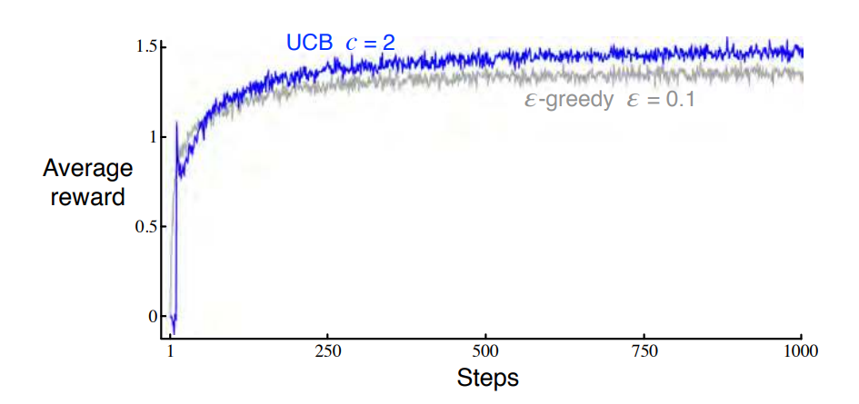
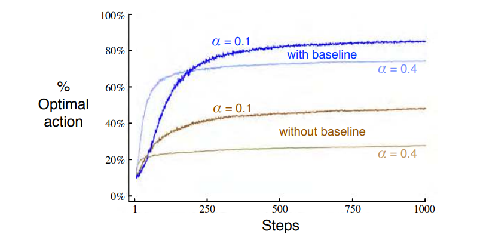
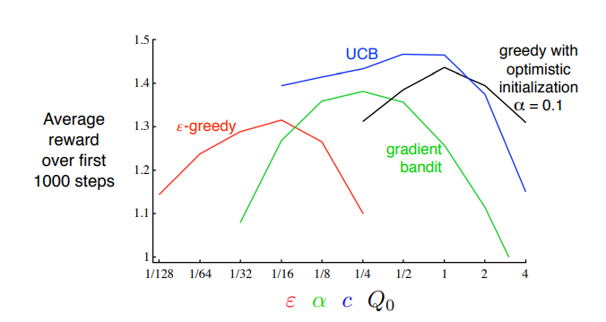

[Aprendizado por Reforço](index.md)

<!-- wiki:original:inicio -->

# Soluções de métodos tabulares

## Bandidos de muitos braços (Multi-armed bandits)

A característica mais importante do Aprendizado por Reforço que a difere de outros tipos de aprendizados é que ela utiliza informações de treino que avalia as ações já tomadas, ou seja, enquanto o Aprendizado Supervisionado dá um feedback instrutivo, isto é, o feedback não depende da ação tomada, no Aprendizado por Reforço, o feedback é instrutivo, ou seja, o feedback depende inteiramente da ação tomada.

Nesse capítulo vamos ver o aspecto do feedback avaliativo simplificado, que não envolve aprender a agir em mais de uma situação, ou seja, teremos sempre apenas um estado, e depois generalizaremos.

## O problema do bandido k-armado

Considere o seguinte problema: você seguidamente tem que escolher entre k opções, ou ações, e depois de cada escolha você recebe uma recompensa de uma distribuição de probabilidade estacionária que depende da sua escolha.

Nota: o jogo da velha, explicado no capítulo passado, não é um problema que se enquadra como bandido k-armado, já que cada estado depende dos anteriores, e cada jogada muda o estado do tabuleiro. Como exemplo simples de um problema do bandido 1-armado, pense apenas num caça níquel, onde só existe uma ação(puxar o braço), as recompensas são sempre diferentes, e só existe um estado possível.

*Figura 2. Caça-níquel*

Nesse problema do bandido k-armado, cada uma das k-ações tem uma média esperada dada a ação selecionada(vamos chamar isso de valor da função). Nós iremos denotar a ação selecionada no tempo $t$ como $A_{t}$, e a sua respectiva recompensa como $R_{t}$. Então, o valor de uma ação arbitrária $a$, denotado $q_{\ast (a)}$, é o valor esperado da recompensa dado que $a$ foi escolhido:

$$
q_{\ast (a)}\dot{=}{\mathbb{E}}\left\lbrack R_{t}~\vert ~A_{t} = a \right\rbrack
$$

Se soubermos o valor de cada ação, então seria trivial para resolver o problema do bandido k-armado: basta selecionar a ação com maior recompensa. Porém, em geral, não sabemos o valor exato da ação, embora possamos ter estimadores. Denotamos o valor estimado do valor de uma ação $a$ no tempo $t$ como $Q_{t}(a)$. Nós claramente gostaríamos que $Q_{t}(a)$ fosse próximo de $q_{\ast (a)}$.

Se mantivermos estimativas dos valores das ações, então, em qualquer tempo $t$, existe pelo menos uma ação cujo valor estimado é o maior. Por isso, chamamos essas de ações gananciosas (greedy actions). Quando selecionamos uma dessas ações, dizemos que estamos explorando(exploiting) o conhecimento atual dos valores das ações.

Se, em vez disso, selecionarmos uma das ações não gananciosas, então dizemos que estamos explorando(exploring), porque permite melhorar sua estimativa do valor dessa ação não gananciosa. A exploração (exploitation) é a escolha correta para maximizar a recompensa esperada em um único passo, mas a exploração (exploration) pode gerar uma recompensa total maior a longo prazo.

Por exemplo, suponha que o valor de uma ação gananciosa seja conhecido com certeza, enquanto várias outras ações são estimadas como quase tão boas, mas com bastante incerteza. A incerteza é tal que pelo menos uma dessas outras ações provavelmente é, na verdade, melhor que a gananciosa, mas o agente não sabe qual, pois não explorou ainda.

Se o agente ainda tiver muitos passos futuros para escolher ações, pode ser melhor explorar as ações não gananciosas e descobrir quais delas são melhores que a gananciosa. A recompensa será menor no curto prazo, durante a exploração, mas maior no longo prazo porque, depois de descobrir as melhores ações, você poderá explorá-las repetidamente. Como não é possível explorar e explorar ao mesmo tempo em uma única escolha de ação, fala-se frequentemente no “conflito entre exploração(exploitation) e exploração(exploration)”.

O livro enfatiza que esse problema de balanceamento entre exploitation e exploration é recorrente, já que não podemos escolher duas ações diferentes ao mesmo tempo. Em geral, existem métodos especificos para rebalancear isso, mas normalmente são necessários fortes afirmações sobre conhecimentos do modelo que são impossíveis de verificar em aplicações completas de Aprendizado por Reforço.

## Métodos baseados em valores de ações

Qual seria uma forma natural de estimar o valor de uma ação selecionada $Q_{t}(a)$? Intuitivamente, uma boa resposta seria a média das recompensas de quando a ação $a$ foi escolhida, ou seja:

$$
Q_{t}(a)\dot{=}\frac{\text{ soma das recompensas quando a é tomada antes de t}}{\text{número de vezes que a foi tomada antes de t }} = \frac{\sum_{i = 1}^{t - 1}R_{i} \cdot \mathbb{1}_{A_{i} = a}}{\sum_{i = 1}^{t - 1}\mathbb{1}_{A_{i} = a}}
$$

onde $\mathbb{1}_{\text{acão}}$ denota a variável aleatória que é 1 se $\text{ação}$ é verdadeiro e 0 caso contrário. Se o denominador for zero, então definimos $Q_{t}(a)$ como quisermos, normalmente 0. Se o denominador tender à infinito, pela Lei dos Grandes Números, $Q_{t(a)}$ converge a $q_{\ast}(a)$. É claro que essa não é a única abordagem para estimar o valor de uma ação, e muito menos a melhor métrica.

A ação mais simples normalmente é apenas selecionar a ação de maior valor, e em caso de empate, sortear, ou ainda selecionar alguma arbitráriamente. Nós escrevemos essa seleção de ação ganansiosa como:

$$
A_{t}\dot{=}\operatorname{argmax}\limits_{a}Q_{t(a)}
$$

onde $\text{argmax}_{a}$ denota a ação $a$ para a qual a expressão acima é maximizada. Ok, mas como explicado na seção anterior, normalmente escolher apenas a melhor ação sempre não é a melhor ideia.

Uma alternativa simples para escolher é se comportar de maneira gananciosa na maior parte do tempo, mas de vez em quando, com uma pequena probabilidade $\varepsilon$, selecionarmos aleatoriamente entre todas as ações com probabilidade igual, independentemente das estimativas de valor das ações. Nós chamamos métodos que usam essa regra de seleção quase-greedy de métodos $\varepsilon$-greedy.

Uma vantagem desses métodos é que, no limite, à medida que o número de passos aumenta, toda ação será amostrada um número infinito de vezes, garantindo assim que todas as estimativas convirjam para o valor verdadeiro. Isso implica que a probabilidade de selecionar a ação ótima convirja para maior que $1 - \varepsilon$ ou seja, para quase certeza.(como?)

## O banco de teste de 10 braços

Para avaliar o efeito de um método totalmente ganancioso de um método $\varepsilon$-ganancioso, nós os compararemos numericamente em um conjunto de problemas. Esse foi um conjunto de 2000 problemas do bandido $k$-armado com $k = 10$. Para cada valor da ação, $q_{\ast}(a) \sim {\mathbb{N}}(0,1)$, $a = 1,\ldots,10$(lembre que como $k = 10$, temos 10 ações possíveis). Então, quando um método de aprendizado era aplicado e selecionava a ação $A_{t}$ no instante $t$, a recompensa real $R_{t} \sim {\mathbb{N}}(q_{\ast}(a),1)$, ou seja, uma distribuição normal centrada em $q_{\ast}(a)$ e variância 1.

*Figura 3. Um exemplo do problema do bandido $10$-armado. O valor real $q_{\ast}(a)$ de cada uma das dez ações foi selecionado de acordo com uma distribuição normal com média zero e variância unitária e as recompensas reais foram selecionadas de acordo com uma distribuição normal de média $q_{\ast}(a)$ e variância unitária, conforme sugerido por essas distribuições em cinza.*

Para qualquer método de aprendizado, nós podemos mensurar a performance e o comportamento realizando 1000 ações para cada bandido $10$-armado. Isso é uma execução, faremos 2000 delas, pois temos 2000 bandidos $10$-armados diferentes e tiraremos a média como estimativa.

A Figura 4 compara um método totalmente ganancioso com outros dois métodos $\varepsilon$-ganancioso($\varepsilon = 0.01$ e $\varepsilon = 0.1$).Todos os métodos performaram usando a média amostral. o gráfico de cima mostra o crescimento dá recompensa média com a experiência dos passos e o de baixo a porcentagem de ações ótimas.

Note como acontece basicamente tudo o que falamos até agora, ou seja, no extremo começo, a ação completamente gananciosa ganha, porém, depois, perde para todos os dois métodos $\varepsilon$-greedy. Além, note que a recompensa média do método completamente ganancioso se estagna em 1, enquanto o método menos ganancioso tem um valor médio de $1,5$, muito próximo do valor máximo da figura 3. Ainda, perceba como a porcentagem de ações ótimas do método ganancioso fica completamente estagnada, enquanto a do $0,1$-greedy chega em valores maiores que 80%.

O autor termina dizendo que em casos determinísticos, ou seja, quando a variância é 0, significa que o valor de todas as ações tem o mesmo valor, logo, o método completamente ganancioso funciona melhor. No caso contrário(não determinístico), temos uma variância(considere uma maior que 1) então usar um método $\varepsilon$-greedy será melhor para otimizar o valor das ações.

Ainda, em casos não estacionários, ou seja, quando o valor das ações pode mudar, significa que o $\varepsilon$-greedy é ainda mais importante, já que fixar-se numa ação que muda de valor é pior, sabendo que ela pode decair ainda mais, e o agente nunca saberá qual é a maior recompensa.

## Implementação incremental

Como computar de maneira eficiente todos esse valores de ações com menos cálculo e memória constante?

Vamos nos concentrar em somente uma ação. Considere que $R_{i}$ denota a recompensa recebida após a $i$ésima seleção dessa ação, e chame de $Q_{n}$ a estimativa do valor da ação depois de ela ser selecionada $n - 1$ vezes. Logo $$Q_{n}\frac{\dot{=}(R_{1} + R_{2} + \ldots R_{n - 1})}{n - 1}.$$

Parando para pensar, isso não resolveria o problema, já que mesmo assim, ao escolher a ação, teríamos que somar tudo novamente, guardar o valor novamente, etc… Mas, não precisamos disso, já que

$$\begin{aligned} Q_{n + 1} & = \frac{1}{n}\sum_{i = 1}^{n}R_{i} \\ & = \frac{1}{n}\left( R_{n} + \sum_{i = 1}^{n - 1}R_{i} \right) \\ & = \frac{1}{n}\left( R_{n} + (n - 1) \cdot \frac{1}{n - 1}\sum_{i = 1}^{n - 1}R_{i} \right) \\ & = \frac{1}{n}\left( R_{n} + (n - 1)Q_{n} \right) \\ & = \frac{1}{n}\left( R_{n} + nQ_{n} - Q_{n} \right) \\ & = Q_{n} + \frac{1}{n}\left\lbrack R_{n} - Q_{n} \right\rbrack \end{aligned}$$

Legal! Conseguimos chegar em uma equação pequena que depende apenas das estimativa da ação passada e da recompensa passada.

Generalizando ainda mais, nós chegamos em uma fórmula interessante:

$\text{NovaEstimativa } \leftarrow \text{ EstimativaAntiga } + \text{ PequenoPasso }\left\lbrack \text{ Alvo } - \text{ EstimativaAntiga } \right\rbrack.$

Que se parece bastante com a fórmula que vimos no Tic-Tac-Toe, mas agora entendemos de onde vêm.

- Colocar aqui o pseudocódigo talvez?

## Monitorando um problema não estacionário

Os métodos discutidos anteriormente foram para problemas de bandidos estacionários, ou seja, problemas em que as recompensas não mudam de acordo com o tempo. No caso não estacionário, talvez seja melhor dar um peso maior às recompensas mais recentes. Uma sugestão para fazer isso é mudando o PequenoPasso(step-size) da atualização da estimativa da recompensa, ou seja:

$$
Q_{n + 1} = Q_{n} + \alpha\left\lbrack R_{n} - Q_{n} \right\rbrack
$$

onde $\alpha \in (0,1\rbrack$ e é constante. Note que essa equação é uma média ponderada das recompensas passadas e da estimativa inicial $Q_{1}$:

$$\begin{aligned} Q_{n + 1} & = Q_{n} + \alpha\left\lbrack R_{n} - Q_{n} \right\rbrack \\ & = \alpha R_{n} + (1 - \alpha)Q_{n} \\ & = \alpha R_{n} + (1 - \alpha)\left\lbrack \alpha R_{n - 1} + (1 - \alpha)Q_{n - 1} \right\rbrack \\ & = \alpha R_{n} + (1 - \alpha)\alpha R_{n - 1} + (1 - \alpha)^{2}Q_{n - 1} \\ & = \alpha R_{n} + (1 - \alpha)\alpha R_{n - 1} + (1 - \alpha)^{2}\alpha R_{n - 2} + \cdots \\ & \quad + (1 - \alpha)^{n - 1}\alpha R_{1} + (1 - \alpha)^{n}Q_{1} \\ & = (1 - \alpha)^{n}Q_{1} + \sum_{i = 1}^{n}\alpha(1 - \alpha)^{n - i}R_{i} \end{aligned}$$

Às vezes vale a pena variar o step-size de ação para ação. Considere que $\alpha_{n}(a)$ o parâmetro step-size na $n$-ésina seleção da ação a. Um resultado conhecido na aproximação estocástica nos dá as condições requeridas para garantir convergência para o valor real da ação com probabilidade 1.

$$
\sum_{n = 1}^{\infty}\alpha_{n}(a) = \infty\text{   e   }\sum_{n = 1}^{\infty}\alpha_{n}(a)^{2} < \infty
$$

A primeira condição garante que os passos sejam grandes o suficiente para eventualmente superar qualquer condição inicial ou flutuações aleatórias. A segunda condição garante que eventualmente os passos sejam pequenos o suficiente para garantir convergência. Geralmente essas condições são pouco usadas na prática pois podem demorar demais.

## Valores Iniciais Ótimos

Todos os métodos discutidos até agora tem uma forte dependência nas estimativas iniciais de recompensa $Q_{1}(a)$. Na linguagem estatística, esses métodos são chamados de $\text{enviesados}$ por suas estimativas iniciais de recompensa. Para métodos que calculam a estimativa pela [\[mediaamostral\]](../implementacao-incremental/index.md#mediaamostral) usando $\alpha_{n}(a) = \frac{1}{n}$, chegamos na fórmula [\[umsobreeni\]](../implementacao-incremental/index.md#umsobreeni), e, após a primeira estimativa, nosso $Q_{n}(a)$ não depende mais diretamente de $Q_{1}$, ou seja, ele não é mais enviesado. Já com outro $\alpha$, no caso, chegamos na fórmula [\[alpha\]](../monitorando-um-problema-nao-estacionario/index.md#alpha), que é diretamente enviesado por $Q_{1}$.

Um enviesamento pode ser bom ou ruim. Suponha que em vez de iniciar a estimativa inicial $Q_{1}(a) = 0$, como fazemos anteriormente, considere que colocaremos todos como $+ 5$(lembre que estávamos usando $q \ast (a) \sim {\mathbb{N}}(0,1)$, ou seja, uma estimativa desse tamanho é bem otimista). Esse otimismo encoraja o agente a explorar, já que de início, todas as estimativas são mais altas do que qualquer valor real da ação. Então, ao escolher certa ação, o agente recebe uma recompensa menor do que o esperado, ficando desapontado e diminuindo o valor da recompensa esperada. Ao escolher a próxima ação, todas as outras têm uma estimativa maior do que a primeira selecionada. Assim, o sistema fará explorará todas as ações, mesmo se sempre selecionarmos a mais gananciosa sempre.

Nós chamamos essa estratégia de Valores Iniciais Ótimos. Vamos comparar esse método com o método $\varepsilon$-greedy explicados anteriormente:

*Figura 5. Efeito da inicialização otimista do valor da ação no banco de teste de 10 braços. Ambos usaram o step-size $\alpha = 0.1$*

Note como o método otimista começa pior, pois o agente fica inicialmente apenas explorando várias ações, mas eventualmente performa melhor porque acaba parando de explorar. Essa estratégia pode ser boa às vezes, mas não é a mais adequada em casos não estacionários(valor das ações muda) pois a exploração de outras ações é temporário. Em geral, qualquer método que depende fortemente de condições iniciais não são muito bons para métodos não estacionários.

## Seleção de Ação por Nível Superior de Confiança

Como dito e reforçado por vezes, exploração é necessário e precisamos que ela aconteça, mas que tal se explorassemos não de forma arbitrária (como no $\varepsilon$-greedy), mas buscando agora selecionar as ações de acordo com a seu potencial de serem ótimas, levando em conta o quão perto a estimativa está perto de ser máxima e também a incerteza de cada estimativa. Um jeito bom de fazer isso é pela fórmula $$A_{t}\dot{=}\operatorname{argmax}\limits_{a}\left\lbrack Q_{t}(a) + c\sqrt{\frac{\ln(t)}{N_{t}(a)}} \right\rbrack,$$ onde $\ln(t)$ significa o logarítmo natural de $t$, $N_{t}(a)$ significa o número de vezes que a ação $a$ foi escolhida antes do tempo $t$, e o número $c > 0$ controla o grau de exploração. Se $N_{t}(a) = 0$, então $a$ é uma ação maximizada.

### de onde vem isso

A ideia do UCB(Upper Confidence Bound), resumidamente, é que o termo da direita é um termo de incerteza que diminui quanto mais você seleciona a ação, e o mesmo termo aumenta quando você não escolhe a ação, fazendo o agente não se esquecer de nenhuma ação.

*Figura 6. Performance média do método UCB para o problema do bandido 10-armado.*

O UCB pode performar bem no testes do bandido 10-armado, mas o autor afirma que em problemas reais com grande espaços de estado ou com problemas não estacionários o método pode não performar bem, porque seria inviável guardar e gerenciar os valoroes de $N_{t}(a)$ e porque simplesmente não faz sentido usar o UCB como confiança da recompensa se as recompensas mudam, respectivamente.

## Algoritmos do Bandido Baseado em gradiente

Nessa seção, vamos considerar aprender uma preferência numérica para cada ação $a$, denotada $H_{t}(a)$. Quanto maior a preferência, mais a ação será tomada, mas a preferência não tem interpretação em termos de recompensa. Perceba que apenas a preferência relativa de uma ação sobre a outra é importante, e ela é definida de acordo com uma $\text{distribuição soft-max}$ como se segue: $$\Pr\left\{ A_{t} = a \right\}\dot{=}\frac{e^{H_{t}(a)}}{\sum_{b = 1}^{k}e^{H_{t}(b)}}\dot{=}\pi_{t}(a)$$

onde $$\pi_{t}(a)$$ é definido como a probabilidade de tomar a ação $a$ no tempo $t$. Inicialmente todas as preferências são as mesmas (ou seja, $H_{1}(a) = 0$, para todo $a$). Logo todas as ações tem mesma probabilidade. Existe uma fórmula natural de aprender melhor as preferências, baseando-se na ideia do gradiente estocástico ascendente:

$$
\begin{aligned} H_{t + 1}\left( A_{t} \right) & \dot{=}H_{t}\left( A_{t} \right) + \alpha\left( R_{t} - {\overset{-}{R}}_{t} \right)\left( 1 - \pi_{t}\left( A_{t} \right) \right),\text{     and} \\ H_{t + 1}(a) & \dot{=}H_{t}(a) - \alpha\left( R_{t} - {\overset{-}{R}}_{t} \right)\pi_{t}(a)\text{               for all a } \neq A_{t} \end{aligned}
$$

onde $\alpha > 0$ é um $\text{step-size}$, e $\overline{R_{t}}$ é a média de todas as recompensas incluindo o tempo $t$. O $\overline{R_{t}}$ funciona como referência, ou seja, se a recompensa é maior do que a média de recompensas, então a preferência para ela aumenta, e vice-versa. As ações não selecionadas se movem na direção oposta.

A Figura 7 mostra o resultados do algoritmo do gradiente ascendente em uma variante do bandido 10-armado onde as recompensas são escolhidas de uma distribução ${\mathbb{N}}(4,1)$. Essa mudança não faz com que o algoritmo que usa a referência (${\overset{-}{R}}_{t}$) sofra algum efeito, mas se a referência for omitida, ou seja, se $$\begin{aligned} H_{t + 1}\left( A_{t} \right) & \dot{=}H_{t}\left( A_{t} \right) + \alpha R_{t}\left( 1 - \pi_{t}\left( A_{t} \right) \right) \end{aligned}$$, a performance será significativamente pior, como mostra a figura.

*Figura 7. Desempenho médio do algoritmo do bandido 10-armado de gradiente com e sem referência quando $q_{\ast}$(a) está perto de 4 e não perto de 0.*

### olhar no livro a explicação e explicar dps

## Pesquisa associativa

Em uma tarefa geral de aprendizado por reforço há sempre mais de uma situação, e o objetivo é aprender a melhor política, ou seja, o mapeamento de situações para as ações que são melhores nessas situações. Até agora, vimos apenas tarefas não-associativas, ou seja, tarefas onde não precisamos associar ações diferentes para situações diferentes.

Como exemplo, suponha que haja várias tarefas diferentes de bandidos k-armados, e que a cada passo você escolha uma delas aleatoriamente. Assim, a tarefa do bandido muda aleatoriamente de um passo para o outro. Isso pareceria para o agente como uma única tarefa não estacionária, cujo verdadeiro valore de ação mudam aleatoriamente.

Agora, suponha, no entanto, que quando uma tarefa é selecionada, o agente recebe uma pista sobre sua identidade (mas não sobre os valores de ação. Agora você pode aprender uma política que associa cada tarefa ao sinal recebido - por exemplo, se vermelho, selecionar o braço 1; se verde, selecionar o braço 2. Com a política correta você pode se sair muito melhor do que se não tivesse nenhuma pista distinguindo uma tarefa de outra.

Esse é um tipo de tarefa de pesquisa assoiativa, onde usa tentativa e erro para pesquisar a melhor ação, e associação das ações com as situações em que são melhores. Esse é um problema que intermedia o problema do bandido k-armado e o problema total do aprendizado por reforço.

## Sumário

Foi apresentado várias formas de balancear exploration e exploitation, com o $\varepsilon$-greedy escolhendo uma ação aleatóriamente por uma pequena fração de tempo, enquanto o método UCB escolhe deterministicamente, mas alcançam a exploração enquanto favoreciam as ações que recebiam menos amostras. O gradiente estimava não valores, mas preferências e definem as melhores ações baseando-se na preferência utilizando a soft-max. Até inicializar as estivativas de recompensa otimistamente causa um bom método de exploração inicial.

É natural se questionar qual é o melhor método. Por isso, o autor fez uma plotagem de um treinamento completo em um problema de bandido k-armado, testando a média dos vários valores dos parâmetros de cada método após mil passos. Olhe:

*Figura 8. Desempenho médio da recompensa de todos os algoritmos do bandido k-armado após mil passos*

No geral, neste problema, o UCB parece apresentar o melhor desempenho.

Todos esses métodos são úteis mas não abrangem a solução de um problema completo de aprendizado por reforço, mas são a base que precisamos aprender. O autor termina a seção falando sobre outra forma de abordar o balanceamento de exploitation e exploration usando um método chamado “Gittins index” que usa distribuições a priori e posteriores, além de priores conjugadas.

------------------------------------------------------------------------

<!-- wiki:original:fim -->

## Percurso de estudo

[Trilha: Revisão geral](../../trilhas/aprendizado-por-reforco/revisao-geral.md) · [Apresentação e contexto da fonte](../../trilhas/aprendizado-por-reforco/revisao-geral.md#apresentacao-original)

- Anterior: [Introdução](introducao.md)
- Próximo: [Processos de Decisão de Markov Finitos](processos-de-decisao-de-markov-finitos.md)
