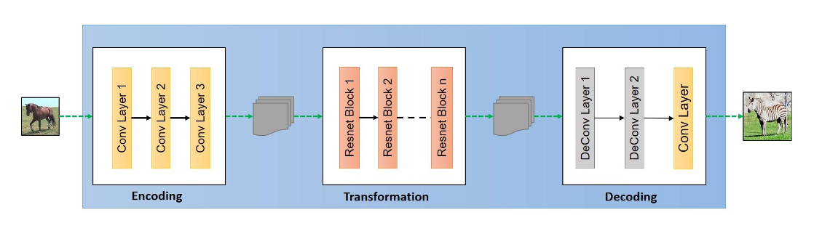
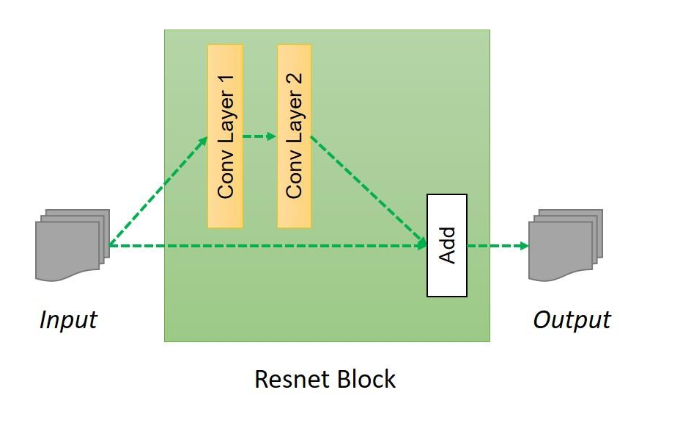
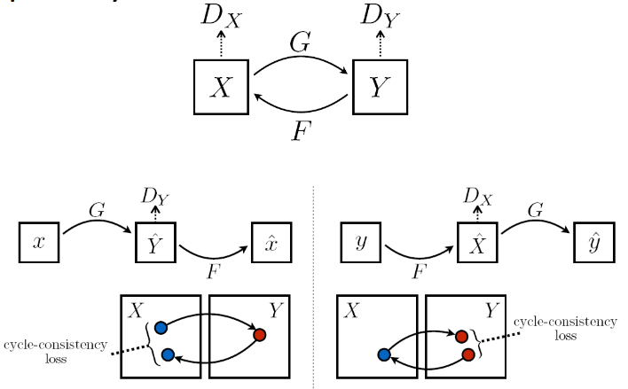

[Aprendizado Profundo](../../index.md) · [Generative Adversarial Networks (GANs)](../index.md)

<!-- wiki:original:inicio -->

# CycleGANs (Tradução sem dados pareados)

## Arquitetura de CycleGANs

Já vimos os tipos de redes dentro dos CycleGANs, mas como elas se comportam internamente? Na verdade utilizamos de algumas arquiteturas clássicas de redes neurais, como **ResNet** e **U-Net**, para construir os geradores e discriminadores. A escolha da arquitetura depende do tipo de dados e da complexidade da tarefa de tradução de imagem.

*Figura 62. Arquitetura dos geradores em CycleGANs*

Dentro do bloco de transformação, é utilizado um bloco de **ResNet** com **residual blocks**, que permite que a rede aprenda funções de mapeamento mais complexas e facilita o treinamento de redes profundas.

*Figura 63. Arquitetura dos discriminadores em CycleGANs*

Já no discriminador, se é utilizada uma estrutura de **PatchGAN**, que classifica cada **patch** da imagem como real ou falsa, em vez de classificar a imagem inteira. Isso permite que o discriminador se concentre em detalhes locais e aprenda a distinguir melhor entre imagens reais e geradas.

*Figura 64. Arquitetura dos discriminadores em CycleGANs*

## Estrutura de pareamento duplo

Para realizar a tradução bidirecional entre dois domínios $X$ e $Y$, a arquitetura utiliza **dois geradores** e **dois discriminadores**

- Gerador $G:X \rightarrow Y$ e Discriminador $D_{Y}$: O gerador $G$ aprende a mapear imagens do domínio $X$ para o domínio $Y$, enquanto o discriminador $D_{Y}$ avalia a autenticidade das imagens geradas em relação às imagens reais do domínio $Y$ (por exemplo, se $X$ são imagens de cavalos e $Y$ são imagens de zebras, $G$ tenta gerar imagens de zebras a partir das de cavalos e $D_{Y}$ avalia se as imagens geradas são realmente imagens **reais** de **zebras**).

- Gerador $F:Y \rightarrow X$ e Discriminador $D_{X}$: O gerador $F$ aprende a mapear imagens do domínio $Y$ para o domínio $X$, enquanto o discriminador $D_{X}$ avalia a autenticidade das imagens geradas em relação às imagens reais do domínio $X$ (por exemplo, se $Y$ são imagens de zebras e $X$ são imagens de cavalos, $F$ tenta gerar imagens de cavalos a partir das de zebras e $D_{X}$ avalia se as imagens geradas são realmente imagens **reais** de **cavalos**).

## Função objetivo completa

Nas cycle GANs, existem algumas losses que vão se agregar, cada uma garantindo que o modelo se comporte como esperamos, vamos passar por cada uma, mostrar o que elas fazem e como se comportam e mostrar a função objetivo final

Mas antes, por que a loss original não garante o comportamento esperado? Acontece que utilizando a perca original, ela sozinha não conseguiria garantir a **correspondência**, ou seja, se eu passar uma imagem de cavalo, ele poderia retornar **qualquer imagem de zebra aleatória**, e não a zebra correspondente àquela pose, iluminação, etc. Então precisamos de uma **loss adicional** que garanta essa correspondência.

### Adversarial Loss

Introduzimos a loss clássica, só que aplicada para **cada uma das transformações**

$$
\mathcal{L}_{\text{GAN}}\left( G,D_{Y},X,Y \right) = {\mathbb{E}}_{y \sim p_{\text{data}(y)}}\left\lbrack \log D_{Y}(y) \right\rbrack + {\mathbb{E}}_{x \sim p_{\text{data }}(x)}\left\lbrack \log(1 - D_{Y}\left( G(x) \right)) \right\rbrack
$$

$$
\mathcal{L}_{\text{GAN}}\left( F,D_{X},Y,X \right) = {\mathbb{E}}_{x \sim p_{\text{data}(x)}}\left\lbrack \log D_{X}(x) \right\rbrack + {\mathbb{E}}_{y \sim p_{\text{data }}(y)}\left\lbrack \log(1 - D_{X}\left( F(y) \right)) \right\rbrack
$$

### Consistency Loss

Outra característica que as cycle GANs devem manter é a consistência, ou seja, se meu modelo gerou uma imagem de cavalo $x$, então o gerador $F$ deve ser capaz de pegar a imagem gerada e transformar de volta na imagem original de cavalo $x$. $$\begin{array}{r} G\left( F(y) \right) \approx y,\forall y \in Y \\ F\left( G(x) \right) \approx x,\forall x \in X \end{array}$$

*Figura 61. Exemplo de consistência em CycleGANs*

A loss de consistência é dada por $$\mathcal{L}_{\text{consistency}}(G,F) = {\mathbb{E}}_{y \sim p_{\text{data }}(y)}⟦\vert G\left( F(y) \right) - y\|_{1}\rbrack + {\mathbb{E}}_{x \sim p_{\text{data }}(x)}⟦\vert F\left( G(x) \right) - x\|_{1}\rbrack$$

### Identity Loss

Também queremos que a rede seja capaz de manter a identidade da imagem, ou seja, se eu passar uma imagem de zebra para o gerador de zebra, ele deve retornar a mesma imagem de zebra, e não uma imagem de cavalo ou uma imagem de zebra alterada. Isso é importante para garantir que a rede não altere imagens que já estão no domínio desejado.

A loss de identidade é dada por $$\mathcal{L}_{\text{identity}}(G,F) = {\mathbb{E}}_{y \sim p_{\text{data }}(y)}⟦\vert G(y) - y\|_{1}\rbrack + {\mathbb{E}}_{x \sim p_{\text{data }}(x)}⟦\vert F(x) - x\|_{1}\rbrack$$

### Loss completa

Reunindo todas as loss juntas, vamos obter a função objetivo completa das CycleGANs, que é uma combinação ponderada das três losses mencionadas: $$\begin{aligned} \mathcal{L}(G,F,D_{X},D_{Y}) = & \lambda_{\text{GAN }}\left\lbrack \mathcal{L}_{\text{GAN}}\left( G,D_{Y},X,Y \right) + \mathcal{L}_{\text{GAN}}\left( F,D_{X},Y,X \right) \right\rbrack \\ & + \lambda_{\text{consistency }}\mathcal{L}_{\text{consistency}}(G,F) \\ & + \lambda_{\text{identity }}\mathcal{L}_{\text{identity}}(G,F) \end{aligned}$$

Dessa forma, podemos reescrever o aprendizado da nossa cycle GAN como $$\min\limits_{G,F}\max\limits_{D_{X},D_{Y}}\mathcal{L}(G,F,D_{X},D_{Y})$$

<!-- wiki:original:fim -->

## Percurso de estudo

[Trilha: A1](../../../../trilhas/aprendizado-profundo/a1.md) · [Apresentação e contexto da fonte](../../../../trilhas/aprendizado-profundo/a1.md#apresentacao-original)

- Anterior: [Aplicações das cGANs](../gans-condicionais-cgans/index.md#aplicacoes-das-cgans)
- Próximo: [Arquitetura de CycleGANs](#arquitetura-de-cyclegans)
