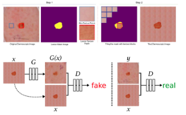

[Aprendizado Profundo](../index.md) · [Generative Adversarial Networks (GANs)](index.md)

<!-- wiki:original:inicio -->

# GANs Condicionais (cGANs)

## Formulação da Loss

Vamos definir nossa condição genérica como $c$, que pode ser um vetor de rótulos, uma imagem ou qualquer outra informação relevante. A função objetivo da cGAN é então modificada para incorporar essa condição: $$\min\limits_{\omega}\max\limits_{\varphi}\left\lbrack {\mathbb{E}}_{(c,y) \sim p_{\text{data}}}\left\lbrack \log D_{\varphi}(c,y) \right\rbrack + {\mathbb{E}}_{z \sim p_{\text{synthetic}}}\left\lbrack \log(1 - D_{\varphi}\left( c,G_{\omega}(c,z) \right)) \right\rbrack \right\rbrack$$

assim, o discriminador sabe a informação de qual classe a imagem pertence, e o gerador sabe qual classe ele deve gerar. Isso permite que o gerador produza amostras específicas de acordo com a condição fornecida.

## Arquitetura Clássica

*Figura 58. Arquitetura de uma cGAN clássica (pix2pix)*

A arquitetura clássica de cGANs é a *pix2pix*, que é uma abordagem de tradução de imagem para imagem supervisionada. Nessa arquitetura, o gerador é tipicamente uma rede do tipo **[U-Net](../segmentacao-semantica/arquiteturas.md#u-net)**, que possui conexões de **skip** entre as camadas correspondentes do encoder e do decoder, permitindo que informações de baixo nível sejam preservadas durante a geração da imagem.

## Aplicações das cGANs

### Sensoriamento remoto

**Problema**: Imagens ópticas de satélite sofrem com cobertura de nuvens, enquanto dados de Radar de Abertura Sintética (SAR) penetram nuvens e funcionam em qualquer condição meteorológica, mas são difíceis de interpretar

**Solução**: O modelo recebe a imagem SAR como condição $x$ e sintetiza a imagem óptica correspondente $G(x)$, permitindo a observação contínua da superfície terrestre mesmo com interferência atmosférica

*Figura 59. Exemplo de aplicação de cGANs em sensoriamento remoto*

### Síntese Controlável de Lesões de Pele para Aumento de Dados

**Desafio**: Falta de dados rotulados e diversidade de formas/texturas para treinar redes de segmentação de câncer de pele.

**Abordagem cGAN**: Utiliza **Curvas de Bézier aleatórias** para gerar a máscara de formato da lesão. Tira retalhos de textura (**texture patches**) para áreas de pele e de lesão. A cGAN sintetiza dermoscopias altamente realistas combinando a forma geométrica e as texturas\[4\].

**Resultado**: O uso dessas amostras sintéticas no treinamento elevou significativamente a acurácia de modelos como U-Net, PSPNet e DeepLabv3

*Figura 60. Exemplo de aplicação de cGANs em síntese controlável de lesões de pele*

<!-- wiki:original:fim -->

## Percurso de estudo

[Trilha: A1](../../../trilhas/aprendizado-profundo/a1.md) · [Apresentação e contexto da fonte](../../../trilhas/aprendizado-profundo/a1.md#apresentacao-original)

- Anterior: [Introdução às GANs](introducao-as-gans.md)
- Próximo: [CycleGANs (Tradução sem dados pareados)](cyclegans-traducao-sem-dados-pareados.md)
