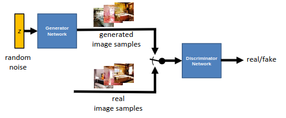

[Aprendizado Profundo](../index.md) · [Generative Adversarial Networks (GANs)](index.md)

<!-- wiki:original:inicio -->

# Introdução às GANs

## Two-player Game

A primeira rede, chamada de **gerador** (Generator), é responsável por gerar novas amostras a partir de uma distribuição simples, enquanto a segunda rede, chamada de **discriminador** (Discriminator), é responsável por distinguir entre amostras reais e amostras geradas pelo gerador.

*Figura 55. Arquitetura de uma GAN*

O objetivo do gerador é gerar imagens cada vez melhores, de forma que ele consiga **enganar** o discriminador, enquanto o objetivo do discriminador é se tornar cada vez melhor em distinguir entre imagens reais e imagens geradas. Esse processo de competição leva a um aprimoramento contínuo de ambas as redes, resultando em um gerador capaz de produzir amostras altamente realistas. Mas vale ressaltar que o objetivo principal é a melhora da rede **geradora**, mas nós aprimoramos a discriminadora também com a intenção de que ela se torne mais forte e assim force a geradora a melhorar ainda mais.

## Função objetivo

Seja $\omega$ e $\varphi$ o conjunto de parâmetros da rede geradora e discriminadora respectivamente, a função objetivo da GAN é dada por um jogo de soma zero (minmax game) que escrevemos da seguinte forma $$\min\limits_{\omega}\max\limits_{\varphi}\left\lbrack {\mathbb{E}}_{x \sim p_{\text{data}}}\left\lbrack \log D_{\varphi}(x) \right\rbrack + {\mathbb{E}}_{z \sim p_{\text{synthetic}}}\left\lbrack \log(1 - D_{\varphi}\left( G_{\omega}(z) \right)) \right\rbrack \right\rbrack$$

onde $D_{\varphi}$ é a função de decisão do discriminador e $G_{\omega}$ é a função de geração do gerador. Essa função é basicamente uma **[entropia cruzada](../../aprendizado-de-maquina/inferencia-variacional.md#secao-34)** entre a classificação do discriminador sobre os dados reais e a sua classificação sobre os dados **gerados pelo gerador**, com a diferença que na entropia cruzada clássica, o sinal negativo é aplicado pra que a otimização vire uma **minimzação** (por isso que na fórmula do GAN a equação está **maximizando** o discriminador e **minimizando** o gerador). Por consequência, nós minimizamos com relação ao gerador para que ele consiga **atrapalhar** a percepção do discriminador.

Na prática computacional, as esperanças são aproximadas pelas médias amostrais dentro de cada mini batch.

## Dinâmica de Treinamento e Ajuste do Gradiente

O treinamento fica alterando entre atualizar os pesos do **discriminador** e os pesos do **gerador**

**Treinamento de uma GAN**

1.  **function** trainGan($G$, $D$) {

    1.  **for each** *epoch* {

        1.  **for** $k$ **do** {

            1.  $\left\{ z^{(1)},\ldots,z^{(m)} \right\} \sim p_{z}$

            2.  $\left\{ x^{(1)},\ldots,x^{(m)} \right\} \sim p_{\text{data}}$

            3.  $\nabla_{\varphi}\frac{1}{m}\sum_{i = 1}^{m}\left\lbrack \log D_{\varphi}\left( x^{(i)} \right) + \log\left( 1 - D_{\varphi}\left( G\left( z^{(i)} \right) \right) \right) \right\rbrack$

        2.  }

        3.  $\left\{ z^{(1)},\ldots,z^{(m)} \right\} \sim p_{z}$

        4.  $\nabla_{\omega}\frac{1}{m}\sum_{i = 1}^{m}\left\lbrack \log\left( 1 - D_{\varphi}\left( G\left( z^{(i)} \right) \right) \right) \right\rbrack$

    2.  }

2.  }

No entanto, essa abordagem precisa de um pequeno ajuste. Acontece que a função $\log(1 - D\left( G(z) \right))$ possui uma região extremamente plana quando $D\left( G(z) \right) \approx 0$, o que faz com que, no inicio do treinamento, o aprendizado seja **extremamente lento**.

Para contornar esse problema, em vez de minimizarmos $\log(1 - D\left( G(z) \right))$, maximizamos $\log(D\left( G(z) \right))$ com Gradient Ascent, fornecendo gradientes fortes para o gerador no início do treinamento, quando ele ainda está produzindo amostras de baixa qualidade.

## Evolução Arquitetural e uso em inferência

**DCGANs (Deep Convolutional GANs)**([Radford et al. 2016](../referencias/index.md#ref-dcgans)), são uma evolução das GANs originais que substituem as camadas totalmente conectadas por arquiteturas convolucionais profundas. No gerador, utilizam-se convoluções transpostas (**deconvs**) onde a maioria das camadas é estabilizada por **Batch Normalization**

*Figura 56. Arquitetura de uma DCGAN*

Uma vez concluído o treinamento, o discriminador é descartado e utiliza-se exclusivamente a rede geradora para sintetizar novas amostras a partir de vetores de ruído $z$

<!-- wiki:original:fim -->

## Percurso de estudo

[Trilha: A1](../../../trilhas/aprendizado-profundo/a1.md) · [Apresentação e contexto da fonte](../../../trilhas/aprendizado-profundo/a1.md#apresentacao-original)

- Anterior: [Motivação e Modelos Generativos](motivacao-e-modelos-generativos.md)
- Próximo: [GANs Condicionais (cGANs)](gans-condicionais-cgans.md)
