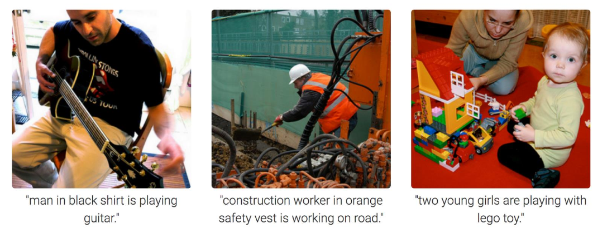

[Aprendizado Profundo](../../index.md) · [Generative Adversarial Networks (GANs)](../index.md)

<!-- wiki:original:inicio -->

# Outras aplicações de GANs

## Síntexe de texto para imagem

*Figura 65. Exemplo de aplicação de GANs em síntese de texto para imagem*

*Figura 66. Exemplo de aplicação de GANs em síntese de texto para imagem*

## Super-resolução de imagens

*Figura 67. Exemplo de aplicação de GANs em super-resolução de imagens*

## The GAN Zoo

Uma coletânia de modelos GAN com diferentes propósitos, para acessar, clique [aqui](https://github.com/hindupuravinash/the-gan-zoo/tree/8849647498ae0906f653be2515393eacc7c3234c)

------------------------------------------------------------------------

<!-- wiki:original:fim -->

## Percurso de estudo

[Trilha: A1](../../../../trilhas/aprendizado-profundo/a1.md) · [Apresentação e contexto da fonte](../../../../trilhas/aprendizado-profundo/a1.md#apresentacao-original)

- Anterior: [Arquitetura de CycleGANs](../cyclegans-traducao-sem-dados-pareados/index.md#arquitetura-de-cyclegans)
- Próximo: [Referências](../../referencias/index.md)
