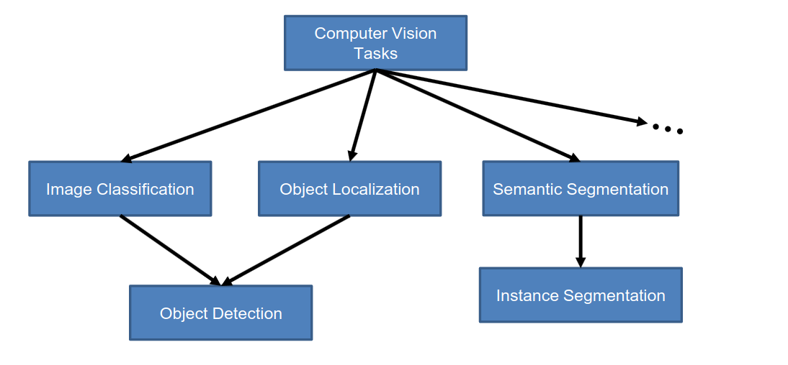

[Aprendizado Profundo](../index.md) · [Object Detection](index.md)

<!-- wiki:original:inicio -->

# Introdução

Dentro da área de visão computacional, podemos fazer algumas distinções de tarefas, veja o gráfico abaixo

*Figura 27. Áreas de visão computacional*

Já vimos segmentação semântica, que é a tarefa de classificar cada pixel da imagem em uma categoria específica. A detecção de objetos, por outro lado, é a tarefa de identificar e localizar objetos específicos dentro de uma imagem, geralmente representados por **bounding boxes**. A detecção de objetos é muito baseada em **regiões** enquanto a segmentação semântica é baseada em **pixels**. A detecção de objetos é fundamental para diversas aplicações, como vigilância, direção autônoma e análise de imagens médicas.

<!-- wiki:original:fim -->

## Percurso de estudo

[Trilha: A1](../../../trilhas/aprendizado-profundo/a1.md) · [Apresentação e contexto da fonte](../../../trilhas/aprendizado-profundo/a1.md#apresentacao-original)

- Anterior: [Object Detection](index.md)
- Próximo: [Métricas de Avaliação](metricas-de-avaliacao.md)
