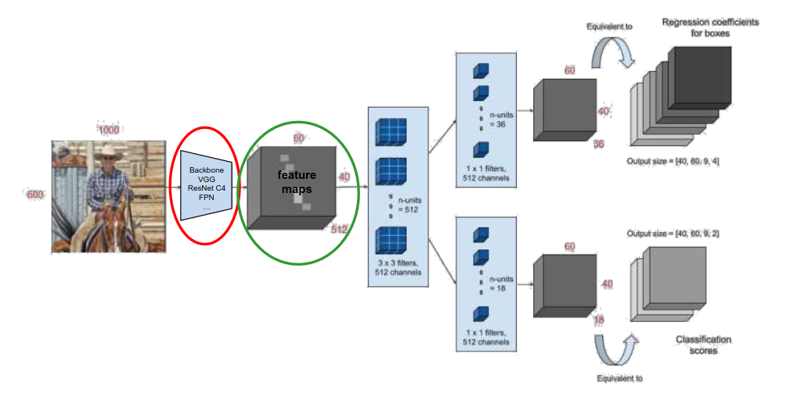
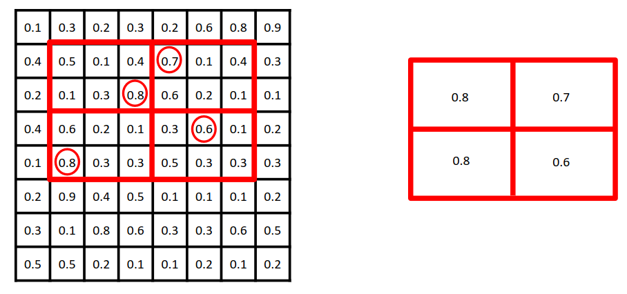
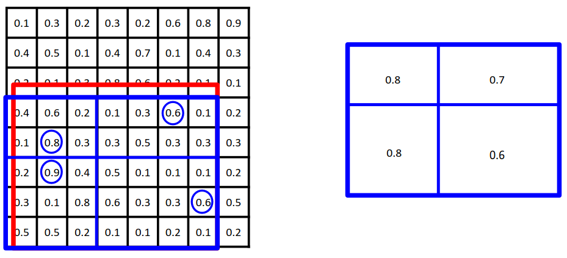
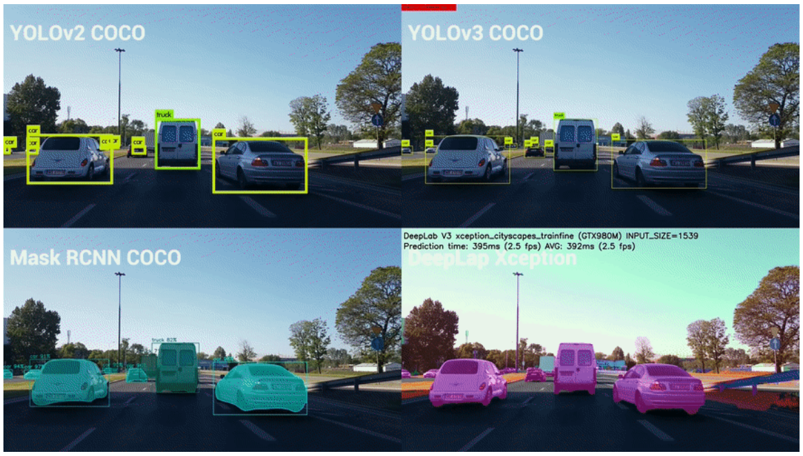

[Aprendizado Profundo](../../index.md) · [Object Detection](../index.md)

<!-- wiki:original:inicio -->

# Redes de Dois Estágios e Segmentação de Instâncias: Mask R-CNN

## Geração de propostas com a RPN (Region Proposal Network)

Antes de mais nada, a **imagem é redimensionada** para caber na rede backbone. Essa rede backbone recebe a imagem e gera um **feature map** que representa as características da imagem. Esse **feature map** é então passado para a **Region Proposal Network (RPN)**, que é responsável por gerar propostas de regiões onde objetos podem estar localizados. A RPN utiliza um conjunto de $k$ **anchor boxes** de diferentes tamanhos e proporções para cobrir uma variedade de objetos possíveis na imagem.

A RPN fica responsável por aprender principalmente duas coisas: A probabilidade de a anchor box conter ou não um objeto e estimar o tamanho/formato da caixa delimitadora do objeto. Primeiro, uma convolução $3 \times 3$ com $512$ filtros é aplicada ao **feature map** da backbone, gerando um **feature map** intermediário.

Em seguida, duas convoluções $1 \times 1$ são aplicadas: uma para prever a probabilidade de cada **anchor box** conter um objeto (**objectness score**), contento um total de $36$ filtros e outra para prever os ajustes necessários para refinar as coordenadas da caixa delimitadora (**bounding box regression**) com $18$ filtros.

*Figura 32. Arquitetura da Mask R-CNN*

Logo após isso, para escolher as melhores propostas de regiões, a RPN aplica a técnica de **Non-Maximum Suppression (NMS)** para eliminar propostas redundantes e manter apenas as mais promissoras. As propostas selecionadas são então passadas para a próxima etapa da Mask R-CNN, onde cada proposta é processada individualmente para prever a classe do objeto, refinar a caixa delimitadora e gerar a máscara binária correspondente.

## Alinhamento de Características com RoIAlign

Temos um problema, o próximo passo (a rede geradora de máscara) espera um **feature map** de tamanho fixo, mas as propostas de regiões geradas pela RPN podem ter tamanhos variados. Para resolver isso, a Mask R-CNN utiliza o **RoIAlign**, que é uma técnica que extrai características de regiões de interesse (RoIs) do **feature map** da backbone, garantindo que cada RoI seja representada por um **feature map** de tamanho fixo.

A primeira abordagem utilizada era a **RoIPooling**, que dividia a região de interesse em uma grade de células e aplicava **max pooling** em cada célula para obter um valor representativo. No exemplo da [\[roi-pooling-example-1\]](#roi-pooling-example-1), temos uma imagem de tamanho $8 \times 8$ e a região vermelha destacada é a região de interesse com tamanho $6 \times 4$, no entanto a rede geradora de máscara espera uma **feature map** de tamanho $2 \times 2$, então dividimos a região de interesse em uma grade de $2 \times 2$ células, e aplicamos **max pooling** em cada célula para obter um valor representativo. O problema é que a divisão da região de interesse em células pode não ser exata, resultando em perda de informações e desajustes na localização das características.

Veja por exemplo a [\[roi-pooling-example-2\]](#roi-pooling-example-2). Nesse caso, a região de interesse (borda vermelha) não cai exatamente na divisão dos pixeis, na verdade ela para na metade de um, e isso **pode acontecer** como já discutimos anteriormente. Nesses casos, o **RoIPooling** arredonda os valores para o inteiro mais próximo (borda azul), resultando em perda de informações e desajustes na localização das características. Para resolver esse problema, a Mask R-CNN utiliza o **RoIAlign**, que utiliza interpolação bilinear para calcular os valores das células da grade, garantindo que as características sejam alinhadas corretamente com a região de interesse.

*Figura 33. Exemplo de RoIPooling com região de interesse alinhada com a grade de células*

*Figura 34. Exemplo de RoIPooling com região de interesse desalinhada com a grade de células*

*Figura 35. Exemplo de RoIAlign com região de interesse alinhada com a grade de células*

## Predições em Paralelo (R-CNN + FCN)

Depois que o **RoIAlign** é aplicado, cada proposta de região é representada por um **feature map** de tamanho fixo. Esse **feature map** é então passado para dois ramos **paralelos** da Mask R-CNN:

*Figura 36. Arquitetura da Mask R-CNN com predições em paralelo*

- **R-CNN**: Responsável por prever a classe do objeto e refinar a caixa delimitadora. Ele utiliza uma série de camadas totalmente conectadas para processar o **feature map** da proposta de região e gerar as predições de classe e caixa.

- **FCN**: Responsável por gerar a máscara binária do objeto. Ele utiliza uma série de camadas convolucionais para processar o **feature map** da proposta de região e gerar a máscara binária correspondente. A saída do FCN é uma máscara de tamanho fixo (por exemplo, $28 \times 28$ pixels) que representa a forma do objeto dentro da caixa delimitadora. Essa máscara é então redimensionada para se ajustar à caixa delimitadora refinada, permitindo que a Mask R-CNN produza uma segmentação precisa da instância do objeto.

*Figura 37. Arquitetura da Mask R-CNN com predições em paralelo*

------------------------------------------------------------------------

<!-- wiki:original:fim -->

## Percurso de estudo

[Trilha: A1](../../../../trilhas/aprendizado-profundo/a1.md) · [Apresentação e contexto da fonte](../../../../trilhas/aprendizado-profundo/a1.md#apresentacao-original)

- Anterior: [Loss Function](../redes-de-estagio-unico-single-shot-a-familia-yolo/index.md#loss-function)
- Próximo: [Recurrent Neural Networks (RNNs)](../../recurrent-neural-networks-rnns/index.md)
