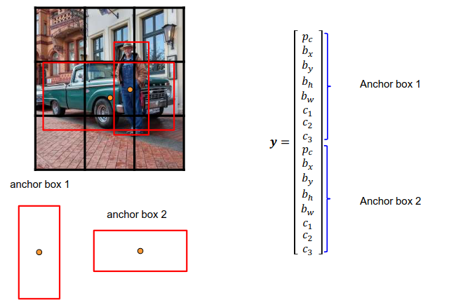

[Aprendizado Profundo](../index.md) · [Object Detection](index.md)

<!-- wiki:original:inicio -->

# Redes de Estágio Único (Single-Shot): A Família YOLO

## Fundamentos do YOLO

Um modelo YOLO (You Only Look Once) divide a imagem em uma grade de células, ele também recebe obrigatoriamente uma imagem quadrada, de lados $n \times n$. Cada célula da grade fica resposável por prever objetos cujo **ponto central** (mid point) caia dentro dos limites dessa célula. Como uma única passada na [CNN](../../aprendizado-de-maquina/convolutional-neural-networks-cnn.md) processa todas as células simultaneamente, o YOLO é extremamente rápido e eficiente, tornando-o adequado para aplicações em tempo real.

## Parametrização do vetor de saída

Para cada célula da grade, o YOLO prevê um vetor de saída que contém informações sobre os objetos detectados. Esse vetor inclui: $$y = \left\lbrack p_{\text{obj}},b_{x},b_{y},b_{h},b_{w},c_{1},c_{2},\ldots,c_{C} \right\rbrack$$

- **$p_{\text{obj}}$**: Probabilidade de que a célula contenha um objeto

- **$\left( b_{x},b_{y},b_{h},b_{w} \right)$**: Coordenadas da caixa delimitadora (x, y, largura, altura). $b_{x},b_{y} \in \lbrack 0,1\rbrack$, representando a posição relativa do centro da caixa em relação à célula. Por exemplo, se $b_{x} = 0.5$ e $b_{y} = 0.5$, então a caixa de âncora está exatamente no centro da célular.$b_{h}$ e $b_{w}$ representam a altura e largura relativas à caixa, mas podem ser maiores que $1$ (a caixa pode ser maior que a célula).

  

  *Figura 28. Exemplo de caixa delimitadora prevista pelo YOLO*

- **$\left( c_{1},c_{2},\ldots,c_{C} \right)$**: Probabilidades de cada classe

## Caixas de Ancoragem (Anchor Boxes)

Para resolver o problema de múltiplos objetos cujos centros caiam na mesma célula ou objetos de proporções muito distintas (como uma pessoa alta e um carro largo), o YOLO utiliza **Anchor Boxes**. Cada célula da grade prevê múltiplos **bounding boxes** associados a modelos geométricos *pré-definidos* (**anchors**). Em vez de prever o formato absoluto da caixa do zero, a rede aprende deslocamentos (**offsets**) para ajustar a posição e a dimensão das **anchor boxes pré-definidas**

*Figura 29. Exemplo de caixas de ancoragem previstas pelo YOLO*

Então nessa nova formulação, o vetor de saída para cada célula da grade se torna: $$y = \begin{pmatrix} \left\lbrack p_{\text{obj}},b_{x},b_{y},b_{h},b_{w},c_{1},c_{2},\ldots,c_{C} \right\rbrack_{anchor\ 1} \\ \left\lbrack p_{\text{obj}},b_{x},b_{y},b_{h},b_{w},c_{1},c_{2},\ldots,c_{C} \right\rbrack_{anchor\ 2} \\ \vdots \\ \left\lbrack p_{\text{obj}},b_{x},b_{y},b_{h},b_{w},c_{1},c_{2},\ldots,c_{C} \right\rbrack_{\text{anchor A}} \end{pmatrix}$$

Vale ressaltar que eu escrevi em forma de matriz, no entanto o mais comum é um vetor contínuo e separamos as anchor boxes pelo padrão da saída, que seria a cada $5 + C$ valores, onde $C$ é o número de classes. Por exemplo, se temos $3$ anchor boxes e $20$ classes, o vetor de saída para cada célula da grade terá tamanho $3 \times (5 + 20) = 75$.

## Supressão Não-Máxima (Non-Maximum Suppression - NMS)

Na prática, é bem fácil perceber que vai acontecer de várias caixas serem selecionadas para o mesmo objeto, e isso é um problema. Para resolver isso, utilizamos a técnica para escolher a caixa que melhor representa o objeto, descartando as demais. A técnica é chamada de **Non-Maximum Suppression (NMS)**, e funciona da seguinte forma:

1.  **Filtragem por confiança**: Descartamos todas as caixas cuja probabilidade de conter um objeto seja menor que um limiar pré-definido (ex: 0.5)

2.  **Seleção da melhor caixa**: Entre as caixas restantes, selecionamos a caixa com a maior probabilidade de conter um objeto (maior pontuação de confiança $p_{\text{obj}}$)

3.  **Eliminação de duplicatas**: Elimina as outras caixas da mesma classe que possuem uma sobreposição com [IoU](../segmentacao-semantica/introducao-e-metricas.md#iou) $\geq 0.5$ com a caixa selecionada

4.  Repete o processo iterativamente para as caixas restantes de cada classe

*Figura 30. Exemplo de supressão não-máxima*

Vale ressaltar que esse **pós-processamento** é feito com **todas** as caixas de ancoragem previstas, tanto as que foram atribuidas dentro de uma mesma célula (uma única célula atribui diferentes anchor boxes pro mesmo objeto) quanto as geradas por células vizinhas (várias células podem prever o mesmo objeto). O objetivo é garantir que cada objeto seja representado por uma única caixa delimitadora final.

## Evolução Arquitetural

### YOLOv1 & YOLO9000

Arquiteturas iniciais, foi na YOLO9000 onde as anchor boxes foram introduzidas e, em vez de prever diretamente prosição e tamanho das caixas, a rede aprende a prever **offsets** para ajustar as **anchor boxes** pré-definidas.

### YOLOv3

Aumento da profundidade da rede, de $53$ camadas para $106$ camadas. Adição de skip connections para melhorar a propagação do gradiente e permitir que a rede aprenda representações mais complexas. Introdução de **multi-scale predictions**, onde a rede prevê caixas em três escalas diferentes, permitindo detectar objetos de tamanhos variados.

*Figura 31. Arquitetura da YOLOv3*

## Loss Function

Não podemos falar de um modelo de rede sem discutir a loss por ela utilizada. A loss do YOLO é composta por três partes principais: a **loss de localização**, a **loss de confiança** e a **loss de classificação**. A **loss de localização** mede o quão bem a rede prevê as coordenadas da caixa delimitadora em relação à caixa real. A **loss de confiança** avalia a precisão da rede em prever se uma caixa contém um objeto ou não. A **loss de classificação** mede a precisão da rede em classificar corretamente o objeto dentro da caixa.

Vamos rapidamente definir que a **predição do modelo** é dada, para a célula $i \in \left\{ 1,\ldots,S^{2} \right\}$ e anchor box $j \in \left\{ 1,\ldots,B \right\}$: $$y_{ij} = \left\lbrack p_{\text{obj}}^{(ij)},b_{x}^{(ij)},b_{y}^{(ij)},b_{h}^{(ij)},b_{w}^{(ij)},c_{1}^{(ij)},c_{2}^{(ij)},\ldots,c_{C}^{(ij)} \right\rbrack$$ e vamos considerar o vetor **ground truth** como $$t_{ij} = \left\lbrack t_{0}^{(ij)},t_{x}^{(ij)},t_{y}^{(ij)},t_{h}^{(ij)},t_{w}^{(ij)},s_{1}^{(ij)},s_{2}^{(ij)},\ldots,s_{C}^{(ij)} \right\rbrack$$ então a loss da YOLO é dada por $$\begin{aligned} \mathcal{L}_{\text{YOLO }} & = \lambda_{\text{coord }}\underset{\text{ Loss de localização}}{\underbrace{\sum_{i = 0}^{S^{2}}\sum_{j = 0}^{B}t_{0}^{(ij)}\left( \left( t_{x}^{(ij)} - b_{x}^{(ij)} \right)^{2} + \left( t_{y}^{(ij)} - b_{y}^{(ij)} \right)^{2} + \left( t_{h}^{(ij)} - b_{h}^{(ij)} \right)^{2} + \left( t_{w}^{(ij)} - b_{w}^{(ij)} \right)^{2} \right)}} \\ \\ & + \lambda_{\text{noobj }}\underset{\text{ Loss de confiança}}{\underbrace{\sum_{i = 0}^{S^{2}}\sum_{j = 0}^{B}\left( 1 - t_{0}^{(ij)} \right)\left( - \log(1 - p_{\text{obj}}^{(ij)}) \right)}} \\ & + \underset{\text{ Loss de classificação}}{\underbrace{\sum_{i = 0}^{S^{2}}\sum_{j = 0}^{B}t_{0}^{(ij)}\left\lbrack - \log(p_{\text{obj}}^{(ij)}) + \sum_{k = 1}^{C}\text{ BCE}\left( c_{k}^{(ij)},s_{k}^{(ij)} \right) \right\rbrack}} \end{aligned}$$

Onde $S$ é a proporção que dividimos os grids da imagem, $B$ é o número de **anchor boxes** por célula, $C$ é o número de classes, $\lambda_{\text{nobj}}$ e $\lambda_{\text{coord}}$ são hiperparâmetros que controlam a importância relativa das diferentes partes da loss.

Vejamos como a loss se comporta. Se uma anchor box **não possui objeto**, então apenas a parte da **loss de confiança** é computada. Quando a probabilidade de que a caixa contenha um objeto é $0$, então a $\log(1 - 0) = 0$, não penalizando a rede, no entanto, se a rede classificou como existindo um objeto, então a loss será alta e irá penalizar a rede. Se uma anchor box **possui objeto**, então apenas as partes da **Loss de Localização** e **Loss de Classificação** são computadas. A **Loss de Localização** mede o quão bem a rede prevê as coordenadas da caixa delimitadora em relação à caixa real, e a **Loss de Classificação** mede a precisão da rede em classificar corretamente o objeto dentro da caixa.

<!-- wiki:original:fim -->

## Percurso de estudo

[Trilha: A1](../../../trilhas/aprendizado-profundo/a1.md) · [Apresentação e contexto da fonte](../../../trilhas/aprendizado-profundo/a1.md#apresentacao-original)

- Anterior: [Métricas de Avaliação](metricas-de-avaliacao.md)
- Próximo: [Redes de Dois Estágios e Segmentação de Instâncias: Mask R-CNN](redes-de-dois-estagios-e-segmentacao-de-instancias-mask-r-cnn.md)
