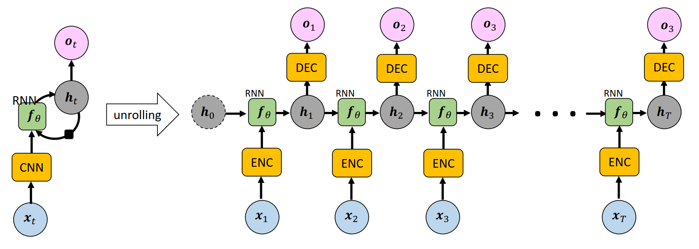

[Aprendizado Profundo](../index.md) · [Recurrent Neural Networks (RNNs)](index.md)

<!-- wiki:original:inicio -->

# Aplicando CNN

Podemos querer utilizar as RNNs para processar sequências de imagens, como em vídeos, onde cada frame é uma imagem. Nesse caso, podemos combinar Convolutional Neural Networks (CNNs) com RNNs para extrair características espaciais das imagens e capturar dependências temporais entre os frames.

*Figura 52. Arquitetura de uma CNN seguida por uma RNN*

O encoder fica responsável por extrair características espaciais de cada frame do vídeo, enquanto a RNN processa essas características ao longo do tempo para capturar a dinâmica temporal do vídeo, já o decoder fica responsável por gerar a saída final. Essa abordagem é útil em tarefas como reconhecimento de ações em vídeos, onde é importante entender tanto o conteúdo visual de cada frame quanto a sequência de eventos ao longo do tempo.

<!-- wiki:original:fim -->

## Conteúdos relacionados

- [Convolutional Neural Networks (CNN) — Aprendizado de Máquina](../../aprendizado-de-maquina/convolutional-neural-networks-cnn.md)

## Percurso de estudo

[Trilha: A1](../../../trilhas/aprendizado-profundo/a1.md) · [Apresentação e contexto da fonte](../../../trilhas/aprendizado-profundo/a1.md#apresentacao-original)

- Anterior: [Gated Recurrent Unit (GRU)](gated-recurrent-unit-gru.md)
- Próximo: [RNN Bidirecionais](rnn-bidirecionais.md)
