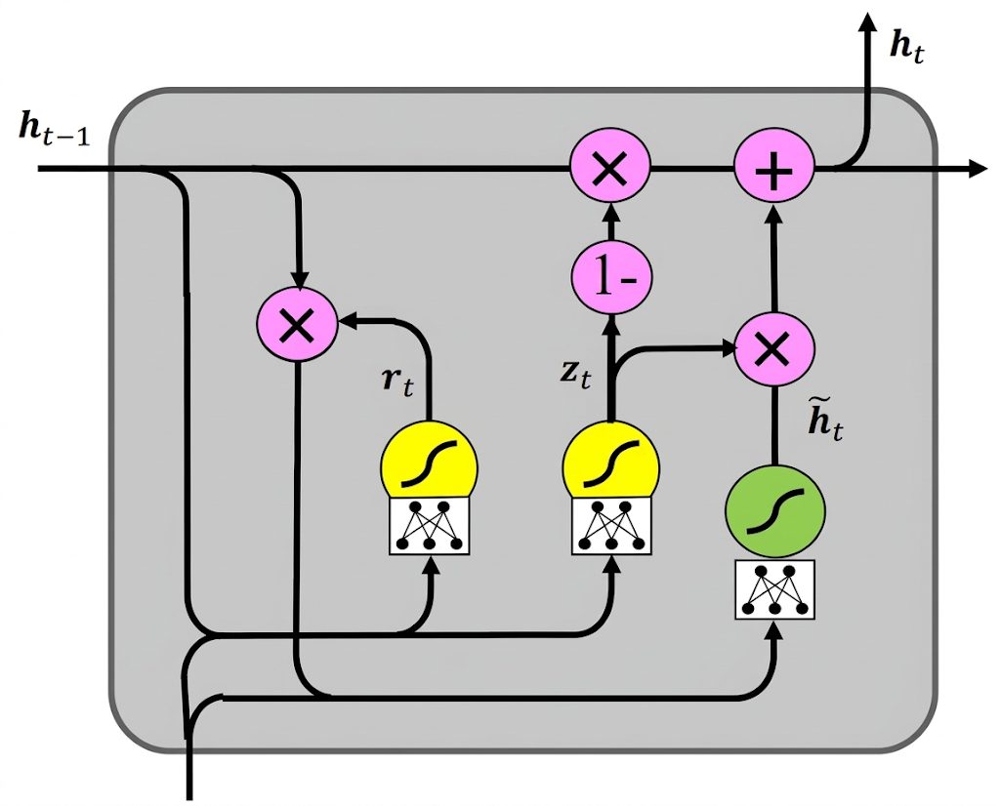

[Aprendizado Profundo](../../index.md) · [Recurrent Neural Networks (RNNs)](../index.md)

<!-- wiki:original:inicio -->

# Gated Recurrent Unit (GRU)

A **Gated Recurrent Unit (GRU)** foi introduzida em $2014$ por Cho et al. como uma variação simplificada da LSTM, também projetada para evitar o problema das dependências de longo prazo (**long-term dependency problem**).

Por ter uma estrutura mais enxuta, a GRU possui menos parâmetros e é ligeiramente mais rápida de treinar do que a LSTM

*Figura 51. Arquitetura de uma célula GRU*

As principais diferenças que ocorrem são a **eliminação do cell state** $c_{t}$ e utilizamos apenas o estado oculto $h_{t}$ e agora são $2$ poras em vez de $3$

- **Porta de atualização ($z_{t}$)**: Determina quanto do novo estado oculto deve ser atualizado com base no novo input

- **Porta de redefinição ($r_{t}$)**: Controla quanto do estado oculto anterior deve ser usado para calcular o novo estado oculto

Para cada passo temporal $t$, dada a entrada $x_{t}$e o estado oculto anterior $h_{t - 1}$, os gates são calculados como: $$\begin{array}{r} z_{t} = \sigma(W_{z}\begin{pmatrix} h_{t - 1} \\ x_{t} \end{pmatrix} + b_{z}) \\ r_{t} = \sigma(W_{r}\begin{pmatrix} h_{t - 1} \\ x_{t} \end{pmatrix} + b_{r}) \end{array}$$

Depois o estado oculto candidato é calculado utilizando a porta de redefinição $r_{t}$ para controlar a influência do estado oculto anterior: $${\widetilde{h}}_{t} = \tanh(W_{h}\begin{pmatrix} r_{t} \odot h_{t - 1} \\ x_{t} \end{pmatrix} + b_{h})$$

E finalmente atualizamos e geramos o novo estado oculto $h_{t}$ utilizando a porta de atualização $z_{t}$: $$h_{t} = z_{t} \odot h_{t - 1} + \left( 1 - z_{t} \right) \odot {\widetilde{h}}_{t}$$

<!-- wiki:original:fim -->

## Percurso de estudo

[Trilha: A1](../../../../trilhas/aprendizado-profundo/a1.md) · [Apresentação e contexto da fonte](../../../../trilhas/aprendizado-profundo/a1.md#apresentacao-original)

- Anterior: [A inovação no Fluxo do Gradiente](../long-short-term-memory-lstm/index.md#a-inovacao-no-fluxo-do-gradiente)
- Próximo: [Aplicando CNN](../aplicando-cnn/index.md)
