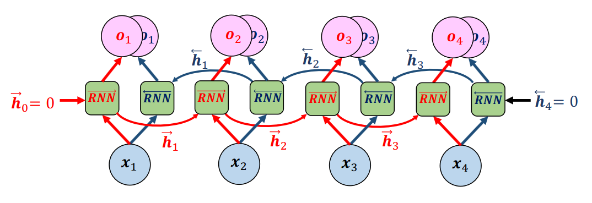

[Aprendizado Profundo](../index.md) · [Recurrent Neural Networks (RNNs)](index.md)

<!-- wiki:original:inicio -->

# RNN Bidirecionais

As RNN padrão utilizam apenas informação do **passado** para prever a saída atual, mas em muitas tarefas, a informação do **futuro** também pode ser útil. As RNN bidirecionais (BRNNs) processam a sequência de dados em duas direções: uma RNN lê a sequência do início ao fim (forward), enquanto outra RNN lê a sequência do fim ao início (backward). As saídas das duas RNNs são então combinadas para formar a saída final.

*Figura 53. Arquitetura de uma RNN Bidirecional*

------------------------------------------------------------------------

<!-- wiki:original:fim -->

## Percurso de estudo

[Trilha: A1](../../../trilhas/aprendizado-profundo/a1.md) · [Apresentação e contexto da fonte](../../../trilhas/aprendizado-profundo/a1.md#apresentacao-original)

- Anterior: [Aplicando CNN](aplicando-cnn.md)
- Próximo: [Generative Adversarial Networks (GANs)](../generative-adversarial-networks-gans/index.md)
