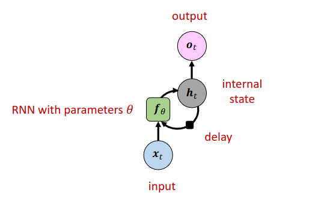
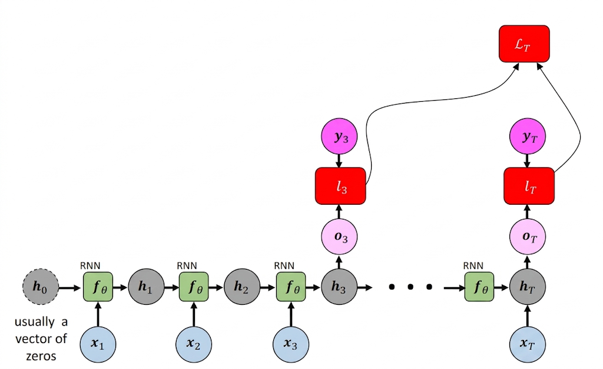
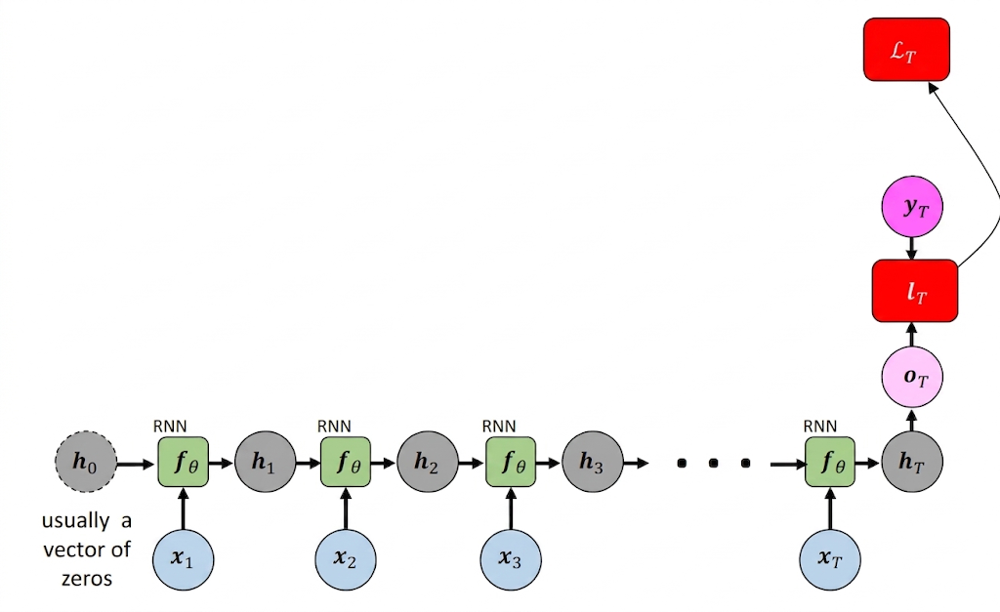

[Aprendizado Profundo](../index.md) · [Recurrent Neural Networks (RNNs)](index.md)

<!-- wiki:original:inicio -->

# Simple RNN (Vanilla RNN)

## Arquitetura

Podemos estruturar uma arquitetura visual fixa para cada um dos passos temporais que a rede recorrente faz

*Figura 41. Arquitetura de uma RNN*

Podemos utilizar uma fórmula **recursiva** para representar a RNN, onde o estado oculto $h_{t}$ é atualizado a cada passo temporal com base no estado oculto anterior $h_{t - 1}$ e na entrada atual $x_{t}$. $$\underset{\text{ Estado Oculto}}{\underbrace{h_{t}}} = f_{\theta}\left( \underset{\text{ Estado Anterior}}{\underbrace{h_{t - 1}}},\underset{\text{ Entrada Atual}}{\underbrace{x_{t}}} \right)$$

e vale ressaltar que o **mesmo conjunto de parâmetros $\theta$** é utilizado em **todos os passos temporais**, diferente de uma rede neural padrão onde **cada camada possui um conjunto de parâmetros diferente**. Isso permite que a RNN generalize melhor para sequências de diferentes comprimentos e capture padrões temporais de forma mais eficiente.

Tomemos a simples RNN $h_{t} = \tanh(W_{hh}h_{t - 1} + W_{xh}x_{t})$ e vamos ver como a recursividade se comporta com $T = 3$ $$\begin{aligned} h_{3} & = \tanh(W_{hh}h_{2} + W_{xh}x_{3}) \\ h_{3} & = \tanh(W_{hh}\left( \tanh(W_{hh}h_{1} + W_{xh}x_{2}) \right) + W_{xh}x_{2}) \\ h_{3} & = \tanh(W_{hh}\left( \tanh(W_{hh}\left( \tanh(W_{hh}h_{0} + W_{xh}x_{1}) \right) + W_{xh}x_{2}) \right) + W_{xh}x_{3}) \end{aligned}$$

## RNN Unroling

Baseado na arquitetura mostrada, podemos escolher que o output da rede seja o **output** de cada passo temporal, ou apenas o **output** do último passo temporal. A primeira abordagem é útil quando queremos prever uma sequência de saídas, enquanto a segunda abordagem é útil quando queremos prever uma única saída baseada em toda a sequência de entradas.

Baseado nisso, conseguimos desenvelopar o parâmetro de tempo da RNN, mostrando como a rede processa cada elemento da sequência ao longo do tempo. Esse processo é conhecido como **unrolling** da RNN, e nos permite visualizar claramente como as informações fluem através da rede em cada passo temporal.

*Figura 42. Desenrolando uma RNN*

## Tipos de mapeamento sequencial

- **Many-to-many**: Existem duas variações, a primeira é quando a entrada e a saída são sequências de comprimentos iguais. Por exemplo, os momentos de um vídeo e a categoria que aquele momento se encaixa (drama, terror, etc.)

  

  *Figura 43. Exemplo de mapeamento many-to-many*

  A segunda variação é quando a entrada e a saída são sequências de comprimentos diferentes. Por exemplo, uma frase em inglês e sua tradução em português.

  

  *Figura 44. Exemplo de mapeamento many-to-many*

- **One-to-many**: Quando o modelo recebe uma única entrada e gera uma sequência de saídas. Por exemplo, uma imagem e a legenda que descreve a imagem.

  

  *Figura 45. Exemplo de mapeamento one-to-many*

- **Many-to-one**: Quando o modelo recebe uma sequência de entradas e gera uma única saída. Por exemplo, uma sequência de palavras e a classificação da sentença.

  

  *Figura 46. Exemplo de mapeamento many-to-one*

<!-- wiki:original:fim -->

## Percurso de estudo

[Trilha: A1](../../../trilhas/aprendizado-profundo/a1.md) · [Apresentação e contexto da fonte](../../../trilhas/aprendizado-profundo/a1.md#apresentacao-original)

- Anterior: [Introdução e Modelagem de Dados Sequenciais](introducao-e-modelagem-de-dados-sequenciais.md)
- Próximo: [Treinamento e Problemas de Gradiente na RNN](treinamento-e-problemas-de-gradiente-na-rnn.md)
