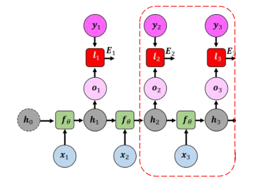

[Aprendizado Profundo](../../index.md) · [Recurrent Neural Networks (RNNs)](../index.md)

<!-- wiki:original:inicio -->

# Treinamento e Problemas de Gradiente na RNN

## Backpropagation Through Time (BPTT)

Como cada célula da RNN é uma camada da rede neural, o processo de unrolling da RNN ao longo do tempo cria uma rede profunda, onde cada passo temporal é tratado como uma camada separada com o diferencial que os mesmos parâmetros são usados em todos os passos.

Em uma tarefa com saída de múltiplos passos temporais (many-to-many), o erro global $E$ é acumulado e calculado a cada instante temporal $t$ $$E = \sum_{t = 1}^{T}E_{t}$$

Para atualizar a matriz de pesos compartilhada $W_{hh}$ precisamos calcular a derivada parcial de $E$ em relação a $W_{hh}$. Pela regra da cadeia, o erro $E_{t}$ em um determinado instante $t$ depende não apenas da célula no instante $t$, mas de toda a história de estados ocultos anteriores $h_{k}\ (k \leq t)$ $$\frac{\partial E}{\partial W_{hh}} = \sum_{k = 1}^{T}\frac{\partial E_{t}}{\partial h_{t}}\frac{\partial h_{t}}{\partial h_{k}}\frac{\partial h_{k}}{\partial W_{hh}}$$

As derivadas da esquerda ($\frac{\partial E_{t}}{\partial h_{t}}$) e direita ($\frac{\partial h_{k}}{\partial W_{hh}}$) são fáceis de visualizar pela relação direta que a função derivada tem com o termo da derivação, no entanto, o termo do meio é um pouco mais complexo, mas ele representa **o fluxo do gradiente retropropagado do passo $t$ até o passo $k$** $$\frac{\partial h_{t}}{\partial h_{k}} = \prod_{j = k + 1}^{t}\frac{\partial h_{j}}{\partial h_{j - 1}}$$

*Figura 47. Fluxo do gradiente retropropagado do passo \$t\$ até o passo \$k\$*

## A matemática dos gradientes explosivos ou desvanecentes

No entanto, essa estrutura pode gerar um grande problema quando a diferença $t - k$ é muito grande. Tomando como base a equação base da RNN $h_{t} = \tanh(W_{hh}h_{t - 1} + W_{xh}x_{t})$, podemos calcular a derivada do estado oculto $h_{j}$ em relação ao estado oculto anterior $h_{j - 1}$ $$\frac{\partial h_{j}}{\partial h_{j - 1}} = \text{ diag}\left( 1 - \tanh^{2}( \cdot ) \right)W_{hh}^{T}$$

então a propagação do gradiente de $h_{0}$ até $h_{t}$ envolve a multiplicação repetida de $t - k$ termos $W_{hh}^{T}$ e da derivada de $\tanh$

Podemos chegar nesse mesmo resultado de uma forma mais matemática fazendo uma análise por SVD. Considere a decomposição SVD da matriz de transição $W_{hh} = U\Sigma V^{T}$ e seja a parcial derivada do estado oculto $h_{j}$ em relação ao estado oculto anterior $h_{j - 1}$ escrita como $$\frac{\partial h_{j}}{\partial h_{j - 1}} = D_{j}W_{hh}^{T}$$

então sabemos que a derivada de $h_{t}$ com relação a um estado oculto anterior $h_{k}$ é dada por $$\frac{\partial h_{t}}{\partial h_{k}} = \prod_{j = k + 1}^{t}D_{j}W_{hh}^{T}$$

vamos então medir a norma $L_{2}$ desse gradiente para entender como ele se comporta $$\left. \frac{\|\left( \partial h_{t} \right)}{\partial h_{k}} \right\|_{2} = \left\| \prod_{j = k + 1}^{t}D_{j}W_{hh}^{T} \right\|_{2}$$

Pela propriedade submultiplicativa das normas matriciais $\| AB\|_{2} \leq \| A\|_{2}\| B\|_{2}$, temos que: $$\left. \frac{\|\left( \partial h_{t} \right)}{\partial h_{k}} \right\|_{2} \leq \prod_{j = k + 1}^{t}\| D_{j}\|_{2}\| W_{hh}^{T}\|_{2}$$

No entanto, temos que $\| D_{j}\|_{2} = \sigma_{\text{max }}\left( D_{j} \right) = \max\limits_{i}\vert 1 - \tanh^{2}\left( z_{ji} \right)\vert  \leq 1$ e $\| W_{hh}^{T}\|_{2} = \sigma_{\text{max }}\left( W_{hh}^{T} \right)$, então $$\begin{aligned} & \left. \frac{\|\left( \partial h_{t} \right)}{\partial h_{k}} \right\|_{2} \leq \prod_{j = k + 1}^{t}1 \cdot \sigma_{\text{max }}\left( W_{hh}^{T} \right) \\ \Rightarrow & \left. \frac{\|\left( \partial h_{t} \right)}{\partial h_{k}} \right\|_{2} \leq \left( \sigma_{\text{max }}\left( W_{hh}^{T} \right) \right)^{t - k} \end{aligned}$$

A conclusão que temos dessa análise é que, se o maior valor singular é menor que 1, então o gradiente vai decair exponencialmente com o aumento da diferença $t - k$, levando ao problema de **vanishing gradient**. Por outro lado, se o maior valor singular é maior que 1, então o gradiente vai crescer exponencialmente com o aumento da diferença $t - k$, levando ao problema de **exploding gradient**.

## Métodos de mitigação

Para mitigar o problema de **exploding gradients** e **vanishing gradients**. A principal técnica utilizada é uma variação do BPTT.

**Truncated BPTT**: No BPTT original, para atualizar o pesos, eu faço o forward pass por TODOS os $T$ passos temporais e retropropago por eles novamente. Nessa versão simplificada, existem dois hiperparâmetros $k_{1}$ e $k_{2}$. Na parte do forward, a rede propaga por apenas $k_{1}$ passos temporais, e na parte do backward, a rede retropropaga por apenas $k_{2}$ passos temporais (obrigatoriamente $k_{2} < k_{2}$). Isso reduz a profundidade da rede e ajuda a evitar o problema de gradientes explosivos ou desvanecentes.

*Figura 48. Exemplo de Truncated BPTT com k1=3 e k2=2*

<!-- wiki:original:fim -->

## Percurso de estudo

[Trilha: A1](../../../../trilhas/aprendizado-profundo/a1.md) · [Apresentação e contexto da fonte](../../../../trilhas/aprendizado-profundo/a1.md#apresentacao-original)

- Anterior: [Tipos de mapeamento sequencial](../simple-rnn-vanilla-rnn/index.md#tipos-de-mapeamento-sequencial)
- Próximo: [Limitações da RNN](../limitacoes-da-rnn/index.md)
