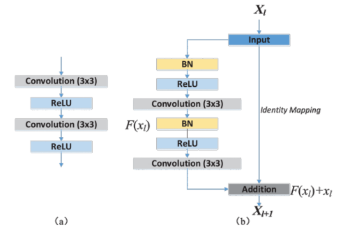
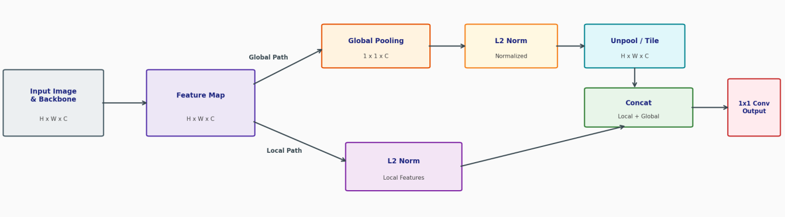
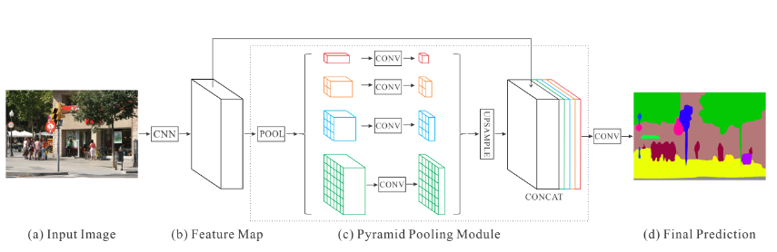
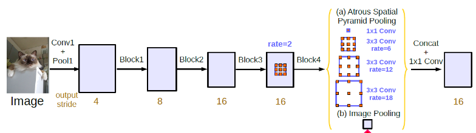
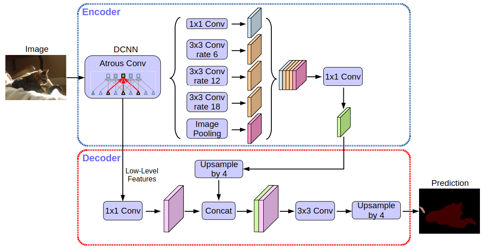

[Aprendizado Profundo](../../index.md) · [Segmentação Semântica](../index.md)

<!-- wiki:original:inicio -->

# Arquiteturas

## SegNet

A SegNet é uma arquitetura de rede neural convolucional projetada para segmentação semântica. Ela segue a arquitetura padrão que já demonstramos utilizando do método de max unpooling para realizar upscaling

*Figura 17. Arquitetura da SegNet*

## U-Net

Já na U-Net, a arquitetura é um pouco diferente, ela utiliza **skip connections** para conectar as camadas de downsampling com as camadas de upsampling, permitindo que a rede utilize informações de diferentes níveis de abstração para melhorar a segmentação.

*Figura 18. Arquitetura da U-Net*

Nas camadas de upsampling, a U-Net utiliza **transpose convolution** para aumentar a dimensionalidade das features unida com um **aumento** nos canais das features. Após o transpose convolution, a U-Net concatena as features da camada correspondente de downsampling, permitindo que a rede utilize informações de diferentes níveis de abstração para melhorar a segmentação, como se ela falasse: “depois de reconstruir a imagem, eu obtive o seguinte mapa de feature, mas lá atrás antes de eu ter feito o downsampling, eu tinha obtido o seguinte mapa de feature, então vou juntar os dois para melhorar a segmentação” (por exemplo, se eu tenho uma imagem 32x32 na escala de cinza, com apenas um canal de cor, na hora do último upsampling, a camada logo após a transpose convolution terá 2 canais “de cor”, que seria o mapa obtido pela rede anteriormente e o mapa obtido na camada de upsampling).

## ResUNet

Na ResUNet, a arquitetura é uma combinação da U-Net com blocos residuais, permitindo que a rede aprenda a diferença entre as features de downsampling e upsampling, melhorando ainda mais a segmentação.

*Figura 19. Arquitetura da ResUNet*

*Figura 20. (a) Bloco padrão da UNet. (b) Bloco residual da ResUNet*

## DeepLab V1 & V2

A DeepLabV1 é uma arquitetura de rede neural convolucional projetada para segmentação semântica, que utiliza **atrous convolution** para aumentar o campo receptivo da rede sem aumentar o número de parâmetros. Ela também utiliza **image pooling** para trazer contexto global da imagem para a rede.

*Figura 21. Arquitetura da DeepLabV1&V2*

Ambas seguem uma arquitetura muito semelhante, diferindo por um único conceito. Na DeepLab V1, passamos a imagem por uma Deep Convolutional Neural Network (DCNN) para extrair features utilizando camadas de Atrous Convolution. Depois, pegamos o score map obtido e aplicamos um processo de **interpolação bilinear** para aumentar a dimensionalidade do score map, e por fim aplicamos o um algoritmo de pós-processamento chamado **Conditional Random Field (CRF)** para refinar a segmentação. Já na DeepLab V2, o processo é o mesmo, mas ao invés de aplicarmos apenas uma Atrous Convolution, aplicamos múltiplas Atrous Convolutions com diferentes **rates** (ASPP).

## PARSENet

Foi na ParseNet que surgiu a ideia do **image pooling**, gerando o contexto global da imagem para a rede, permitindo que ela utilize informações de diferentes níveis de abstração para melhorar a segmentação. Já vimos antes como esse conceito funciona, mas como ele é estruturado dentro da rede?

Primeiro a rede passa por uma rede convolucional padrão, depois o feature map gerado é passado por um **image pooling**, que gera um vetor de características que representa a imagem como um todo. Esse vetor é então redimensionado através de upsampling e concatenado com o feature map original, permitindo que a rede utilize informações de contexto global para melhorar a segmentação.

*Figura 22. Arquitetura simplificada da PARSENet*

## PSPNet

A PSPNet é uma arquitetura de rede neural convolucional projetada para segmentação semântica, que utiliza **pyramid pooling** para capturar informações de diferentes escalas da imagem. Ela também utiliza **atrous convolution** para aumentar o campo receptivo da rede sem aumentar o número de parâmetros.

Primeiro a imagem passa por um processamento em uma CNN, essa rede diminui a imagem original para $1/8$ do seu tamanho original e entra no bloco PSP **único**. Assim como no ASPP a imagem passa por múltiplas convoluções paralelas, no bloco PSP, a imagem passa por múltiplos **average pooling** com diferentes tamanhos de agrupamento:

- **Nível Red ($1 \times 1$)**: Realiza um Global Average Pooling sobre toda a extensão espacial. Gera um único vetor por canal que representa o contexto macro/global da cena inteira

- **Nível Orange ($2 \times 2$)**: Divide o mapa em 4 quadrantes (grade $2 \times 2$) e extrai a média de cada região (contexto regional amplo)

- **Nível Blue ($3 \times 3$)**: Divide o mapa em 9 sub-regiões (grade $3 \times 3$) para capturar um contexto regional médio

- **Nível Green ($6 \times 6$)**: Divide o mapa em 36 sub-regiões (grade $6 \times 6$) para capturar detalhes locais e regionais finos

*Figura 23. Arquitetura da PSPNet*

então através do upsample, cada mapa de pooling é redimensionado para o tamanho original do feature map, e todos os mapas são concatenados, permitindo que a rede utilize informações de diferentes escalas para melhorar a segmentação.

## Deeplab V3 & V3+

A DeepLabV3 foi teve algumas melhorias implementadas. O primeiro ponto foi a remoção do pós-processamento com CRF, que foi substituído por um **upsampling** simples, dessa forma a própria rede consegue aprender a mapear corretamente a segmentação. O segundo ponto foi a implementação do ASPP, que já havíamos comentado anteriormente. E o terceiro ponto foi a implementação, em paralelo com o ASPP, de um **image pooling** para pegar contexto global da rede

*Figura 24. Arquitetura da DeepLabV3*

O **DeepLabv3+** foi projetado para resolver uma limitação fundamental do DeepLabv3: embora o DeepLabv3 capturasse um contexto multi-escala excelente através do ASPP, ele perdia detalhes finos e precisão nas bordas dos objetos devido à redução de resolução espacial (**striding** e **pooling**) no backbone. Para corrigir isso, o DeepLabv3+ combina o melhor de duas abordagens: a extração de contexto do **Spatial Pyramid Pooling (ASPP)** com a capacidade de recuperação de bordas da estrutura **Encoder-Decoder**.

*Figura 25. Arquitetura da DeepLabV3+*

Em vez do upsampling bilinear direto que o V3 fazia, o V3+ agora tem um módulo decoder dedicado, onde ele faz upsampling das características e vai utilizando das features do encoder para refinar a segmentação, especialmente nas bordas dos objetos. Isso permite que o modelo mantenha a precisão espacial enquanto ainda aproveita o contexto global capturado pelo ASPP.

<!-- wiki:original:fim -->

## Conteúdos relacionados

- [Arquiteturas — Aprendizado de Máquina](../../../aprendizado-de-maquina/convolutional-neural-networks-cnn/index.md#arquiteturas)
- [Arquiteturas — Modelagem Informacional](../../../modelagem-informacional/big-data/index.md#arquiteturas)

## Percurso de estudo

[Trilha: A1](../../../../trilhas/aprendizado-profundo/a1.md) · [Apresentação e contexto da fonte](../../../../trilhas/aprendizado-profundo/a1.md#apresentacao-original)

- Anterior: [Ferramentas Fundamentais](../ferramentas-fundamentais/index.md)
- Próximo: [Percas](../percas/index.md)
