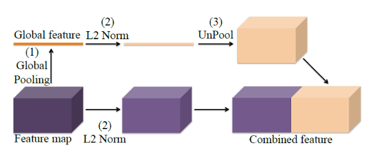
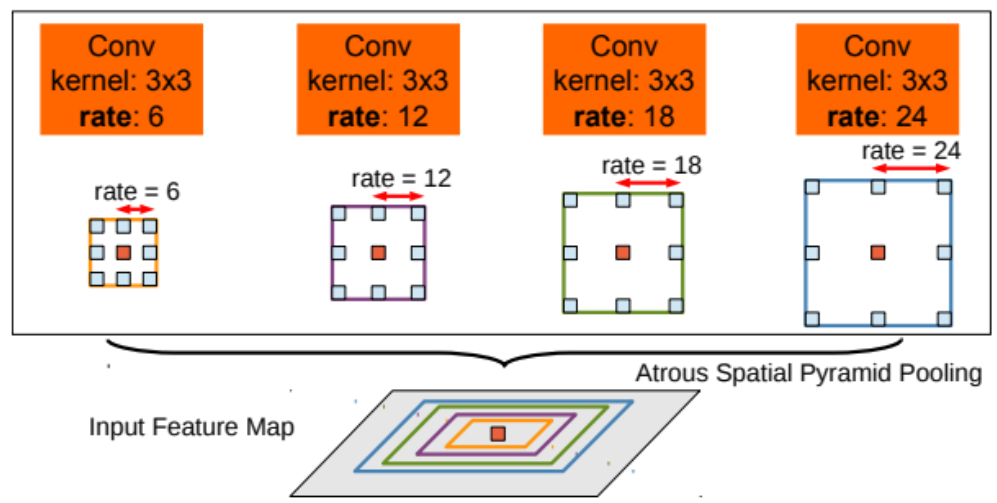
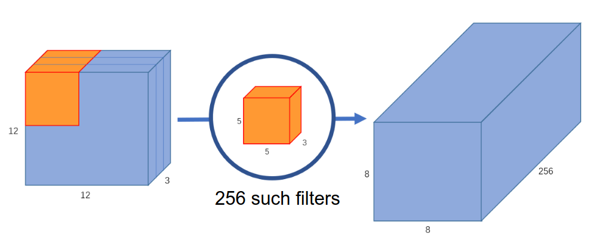

[Aprendizado Profundo](../index.md) · [Segmentação Semântica](index.md)

<!-- wiki:original:inicio -->

# Ferramentas Fundamentais na Segmentação Semântica

## Técnicas de Upsampling

O processo de upsampling é o processo de reconstrução da dimensão original das features internas da rede, que foram reduzidas pelo **downsampling**. Existem diversas técnicas para realizar o upsampling, como o **max unpooling** e a **transpose convolution**, que serão detalhadas a seguir.

### Max Unpooling

Relembrando o que é o **pooling**, ele é uma operação que reduz a dimensionalidade das features internas da rede, geralmente utilizando operações como **max pooling** ou **average pooling**. O **unpooling** é o processo inverso, onde tentamos reconstruir a dimensão original das features a partir das features reduzidas. No entanto, o **unpooling** não é uma operação trivial, pois não temos informações suficientes para reconstruir a dimensão original de forma precisa.

O que acontece é que, **antes** de fazer o **pooling**, nós guardamos os índices dos valores máximos (no caso do **max pooling**), e depois utilizamos esses índices para reconstruir a dimensão original durante o **unpooling**. Essa abordagem é conhecida como **max unpooling**.

*Figura 1 Exemplo de max unpooling*

### Transpose Convolution

A desvantagem do **max unpooling** é que ele depende dos índices dos valores máximos, o que pode limitar a capacidade da rede de aprender representações mais complexas. Uma alternativa é utilizar a **transpose convolution**, também conhecida como **deconvolution**. Essa operação é semelhante à convolução, mas ao invés de reduzir a dimensionalidade das features, ela aumenta.

*Figura 2. Exemplo de transpose convolution*

Como vimos na disciplina de **machine learning**, podemos obter uma matriz de filtro chamada $K_{\text{col}}$ a partir da operação *im2col*, que transforma a imagem em uma matriz de colunas. A **transpose convolution** é basicamente a operação inversa, onde aplicamos a matriz de filtro $K_{\text{col}}$ na matriz obtida anteriormente

Se $X$ é a entrada da convolução e $K$ é o filtro tal que $$Y = X \ast K$$

Já sabemos que $$Y = K_{\text{col }}X_{\text{col }}$$

temos então que a transpose convolution é definida como $$X_{\text{col }} = K_{\text{col}}^{T}Y$$

de tal forma que os $X_{\text{col}}$ são reconstruídos a partir dos $Y$ e do filtro $K_{\text{col}}$ (não de forma perfeita pois há perca de informação na compressão do $X$ para o $Y$, mas o objetivo é que a rede aprenda a reconstruir o $X$ da melhor forma possível)

## Mecanismos de Contexto e Campo Receptivo

Antes de irmos de fato para as arquiteturas, temos que definir um conceito usado em algumas delas, se não vamos interromper o raciocínio no meio do caminho. O conceito é o de **contexto global**, que basicamente é a ideia de que, para classificar um pixel, precisamos levar em consideração não apenas os pixels vizinhos, mas também os pixels mais distantes da imagem. Só que usar filtros maiores consome mais memória, tempo de processamento e não permite que a rede aprenda a extrair características mais complexas.

### Atrous Convolution

Para resolver esse problema, surgiu a ideia de **atrous convolution**, que é uma técnica que permite aumentar o tamanho do filtro sem aumentar o número de parâmetros da rede nem redimensioná-la. A ideia é inserir “buracos” (ou **holes**) entre os pixels do filtro, permitindo que ele “veja” mais pixels da imagem sem aumentar o número de parâmetros.

**Definição: Atrous Convolution**

Dado um filtro $K$ de tamanho $kxk$, e uma feature map $X$, a **atrous convolution** é definida como $$Y(i,j) = \sum_{m = 0}^{k - 1}\sum_{n = 0}^{k - 1}X(i + r \ast m,j + r \ast n)K(m,n)$$ onde $r$ é o **rate** de atrous convolution, que determina o espaçamento entre os pixels do filtro.

*Figura 3. Exemplo de atrous convolution*

### Image Pooling (Global Average Pooling)

Essa é uma abordagem que permite trazer contexto global da imagem para a rede. Pegamos um feature map e aplicamos um average pooling em toda a imagem, obtendo um vetor de características que representa a imagem como um todo. Esse vetor é então redimensionado através de upsampling e concatenado com o feature map original, permitindo que a rede utilize informações de contexto global para melhorar a segmentação.

*Figura 4. Exemplo de image pooling*

## Convoluções Eficientes

Como já discutimos $n$ vezes, as convoluções são operações matemáticas bem caras, e por isso estamos sequer discutindo essas arquiteturas, pois elas são pensadas não somente para a melhor classificação da rede, mas para que possam ser eficientes!

### Atrous Spatial Pyramid Pooling (ASPP)

Esse conceito é bem simples, vimos anteriormente sobre as Atrous Convolution, convoluções espaçadas para obtenção de contexto local da imagem. No entanto, esse passo pode ser tanto benéfico quanto maléfico! Imagine que a feature que queremos identificar é muito grande no conjunto das imagens, se a rate for muito pequena, isso pode prejudicar que os filtros consigam capturar essa feature, e o mesmo vale para features muito pequenas, se a rate for muito grande, isso pode prejudicar que os filtros a visualizem. A ideia do ASPP é justamente utilizar múltiplas rates de atrous convolution, para que possamos capturar features de diferentes tamanhos na imagem, de forma que elas rodem **paralelamente** e depois sejam concatenadas, permitindo que a rede utilize informações de diferentes escalas para melhorar a segmentação.

*Figura 5. Exemplo de atrous spatial pyramid pooling*

### Convolução Normal V.S Separable Convolution & Atrous Separable Convolution

Em uma convolução normal, cada filtro é aplicado a todos os canais da imagem, o que resulta em um grande número de operações. Veja a imagem a seguir, por exemplo

*Figura 6. Exemplo de imagem com 3 canais*

perceba que, ao aplicar o filtro na imagem com 3 canais, toda a informação foi sumarizada em um único canal (assim, se quiséssemos várias feature maps, nós aplicariamos $C$ filtros diferentes para obter $C$ feature maps). Como nosso filtro é $5 \times 5 \times 3$, temos um total de $75$ parâmetros. Como a imagem é de tamanho $12 \times 12$, o filtro vai percorrer a imagem $8 \times 8$ vezes, resultando em um total de $75 \ast 64 = 4800$ operações. Agora imagine o cenário que falei de utilizarmos múltiplos filtros, vamos usar por exemplo $C = 256$

*Figura 7. Exemplo de imagem com 3 canais e 256 filtros*

Nesse exemplo, temos $256$ filtros de tamanho $5 \times 5 \times 3$, resultando em um total de $75 \ast 256 = 19200$ parâmetros. Como a imagem é de tamanho $12 \times 12$, o filtro vai percorrer a imagem $8 \times 8$ vezes, resultando em um total de $19200 \cdot 64 = 1.228.800$ operações. Isso é muito caro computacionalmente, e por isso surgiram as convoluções separáveis.

Agora vamos entender como funciona o processo da **SEPARABLE CONVOLUTION**, ela é divida em 2 etapas, a **depthwise convolution** e a **pointwise convolution**. Na **depthwise convolution**, cada filtro é aplicado a apenas um canal da imagem, resultando em múltiplos feature maps, um para cada canal

*Figura 8. Exemplo de depthwise convolution com 3 canais*

ainda existem os mesmos $75$ parâmetros, já que são $3$ filtros de tamanho $5 \times 5$, mas agora temos $3$ feature maps, um para cada canal. Agora, na **pointwise convolution**, aplicamos um filtro $1 \times 1$ em cada feature map, resultando em múltiplos feature maps, um para cada filtro (no mesmo estilo que o filtro antigo era aplicado na convolução normal)

*Figura 9. Exemplo de pointwise convolution com 3 canais*

Agora temos que nosso número de parâmetros, além dos $75$ do filtro anterior, temos mais esse filtro menor, nos resultando em $78$ parâmetros. O número de multiplicações, na primeira etapa, é $75 \times 8 \times 8 = 4.800$, adicionando com a segunda etapa, temos $4800 + (1 \times 1 \times 3) \times 8 \times 8 = 4.800 + 192 = 4992$. No entanto, para obtermos múltiplos feature maps, vamos utilizar $C = 256$ filtros dos $1 \times 1$ que comentamos, dessa forma:

*Figura 10. Exemplo de pointwise convolution com 3 canais e 256 filtros*

Agora vamos ter que a quantidade de filtros é o filtro inicial mais os $256$ outros filtros, logo: $75 + (1 \times 1 \times 3) \times 256 = 75 + 768 = 843$ parâmetros. E como aumentamos apenas os filtros $1 \times 1$ para obter os nossos $256$ feature maps, o número de multiplicações passa a ser $4800 + (1 \times 1 \times 3) \times (8 \times 8) \times 256 = 4800 + 49152 = 53952$.

Esse conceito pode ser expandido para as convoluções Atrous, de forma que as mudanças necessárias são mínimas, mantendo tracking do rate $r$ conseguimos aplicar o mesmo conceito de **depthwise** e **pointwise** para as convoluções Atrous, resultando em uma redução significativa no número de parâmetros e operações, mantendo a capacidade da rede de capturar informações de diferentes escalas.

## Blocos Residuais

Normalmente, [redes neurais](../../aprendizado-de-maquina/redes-neurais.md) são straight-to-the-point, nós temos a entrada $x$ e a partir disso a rede modela uma função complexa $F$ tal que $$y = F(x)$$

no entanto, pode existir casos em que $y$ é MUITO parecido com $x$ com leves ajustes, e isso, surpreendentemente, pode dificultar muito o aprendizado da rede. Para consertar isso, os chamados **blocos residuais** foram introduzidos, de forma que a rede não aprende a relação direta entre $x$ e $y$, mas sim a **diferença** entre eles (o quão diferente $y$ é de $x$), ou seja, a rede aprende uma função $F$ tal que $$y = F(x) + x$$

O principal motivo dessa abordagem é o **gradiente no [backpropagation](../../aprendizado-de-maquina/redes-neurais.md#secao-27)**. Em redes comuns de deep-learning, o gradiente pode se tornar muito pequeno (ou até mesmo zero) à medida que é propagado para trás, dificultando o aprendizado. Com os blocos residuais, o gradiente pode fluir diretamente através da conexão de atalho, permitindo que a rede aprenda mais facilmente.

<!-- wiki:original:fim -->

## Percurso de estudo

[Trilha: A1](../../../trilhas/aprendizado-profundo/a1.md) · [Apresentação e contexto da fonte](../../../trilhas/aprendizado-profundo/a1.md#apresentacao-original)

- Anterior: [Introdução e Métricas](introducao-e-metricas.md)
- Próximo: [Arquiteturas](arquiteturas.md)
