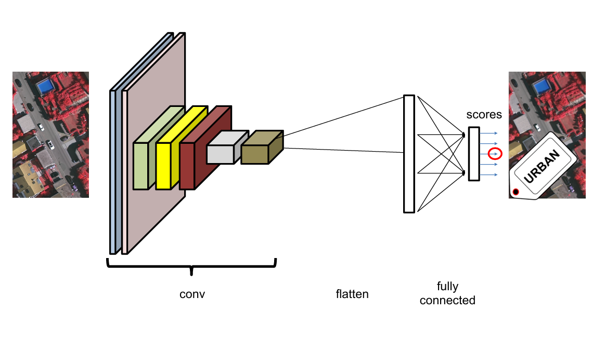
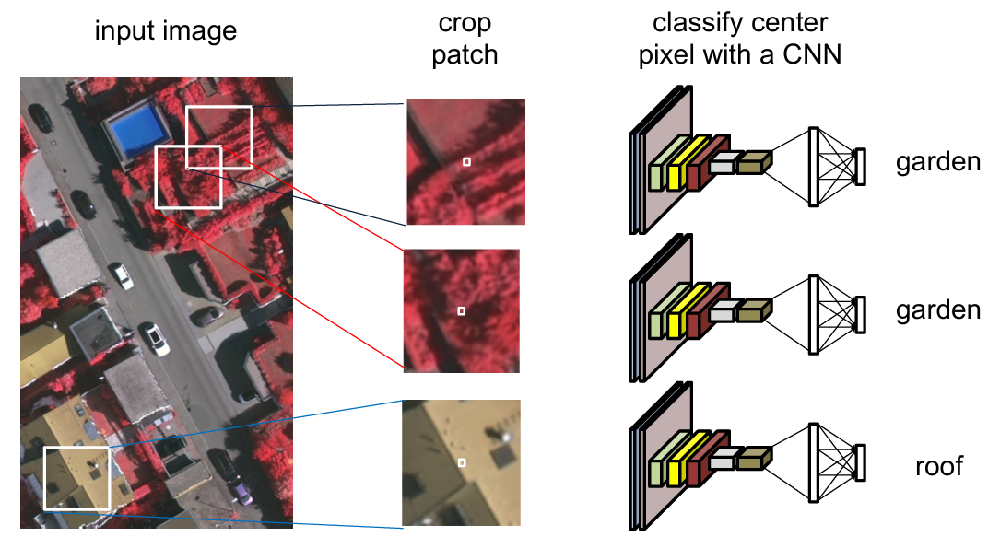
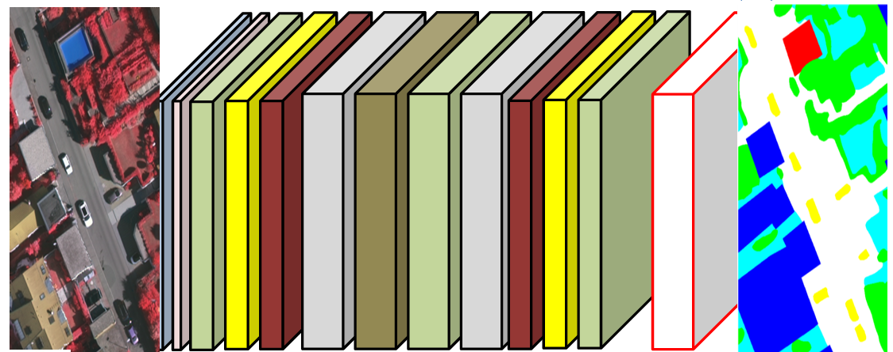
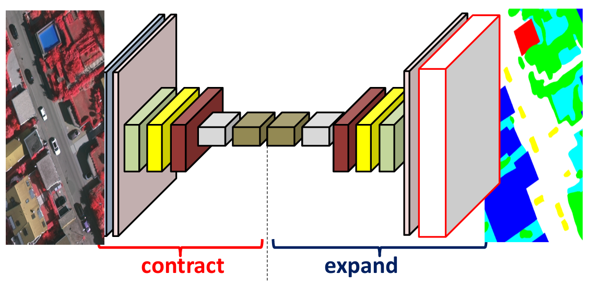

[Aprendizado Profundo](../index.md) · [Segmentação Semântica](index.md)

<!-- wiki:original:inicio -->

# Introdução e Métricas

## Métricas de Avaliação

Podemos utilizar algumas métricas para avaliar a performance de um modelo de segmentação semântica. As métricas mais comuns incluem:

**Definição: Intersection over Union (IoU)**

$$
\text{ IoU } = \frac{\text{ TP }}{\text{TP } + \text{ FP } + \text{ FN}}
$$

**Definição: Precision**

$$
\text{ Precision } = \frac{\text{ TP }}{\text{TP } + \text{ FP}}
$$

**Definição: Average Precision**

Dado que na minha imagem eu tenho mapeado $K$ classes, a métrica de Average Precision (AP) é definida como a média das precisões de cada classe: $$\text{ AP } = \left( \frac{1}{K} \right) \ast \sum_{k = 1}^{K}\text{ Precision}_{k}$$

## Evolução das Abordagens

Vamos relembrar como é estruturada uma [rede convolucional](../../aprendizado-de-maquina/convolutional-neural-networks-cnn.md) padrão para classificação de uma imagem.

*Figura 3. Estrutura de uma rede convolucional padrão*

A imagem passa por uma série de canais de convolução, pooling e normalização, que extraem características relevantes. No final, temos uma camada totalmente conectada que produz a classificação final. Isso nos faz pensar em uma ideia, que tal termos uma janela que percorre a imagem e classifica cada pixel individualmente? Essa abordagem é conhecida como “sliding window” e é uma das primeiras tentativas de segmentação semântica.

*Figura 4. Abordagem de sliding window*

No entanto, essa abordagem é computacionalmente cara e não aproveita o contexto global da imagem. Para superar essas limitações, surgiram as Fully Convolutional Networks (FCNs), que substituem as camadas totalmente conectadas por camadas convolucionais, permitindo que a rede produza mapas de segmentação diretamente.

*Figura 5. Estrutura de uma Fully Convolutional Network (FCN)*

Essa abordagem é interessante, já que permite que a rede aprenda a segmentar a imagem de forma mais eficiente, utilizando o contexto global e local. Além disso, as FCNs podem ser treinadas de forma end-to-end, o que simplifica o processo de treinamento. No entanto , as FCNs são MUITO pesadas, e por isso surgiu a ideia do **downsampling** e **upsampling** dentro da rede, onde basicamente diminuimos os tamanhos das features internas e depois vamos reconstruindo até o tamanho original da imagem. Essa abordagem é conhecida como **encoder-decoder**.

*Figura 6. Estrutura de uma rede encoder-decoder*

<!-- wiki:original:fim -->

## Percurso de estudo

[Trilha: A1](../../../trilhas/aprendizado-profundo/a1.md) · [Apresentação e contexto da fonte](../../../trilhas/aprendizado-profundo/a1.md#apresentacao-original)

- Anterior: [Segmentação Semântica](index.md)
- Próximo: [Ferramentas Fundamentais](ferramentas-fundamentais.md)
