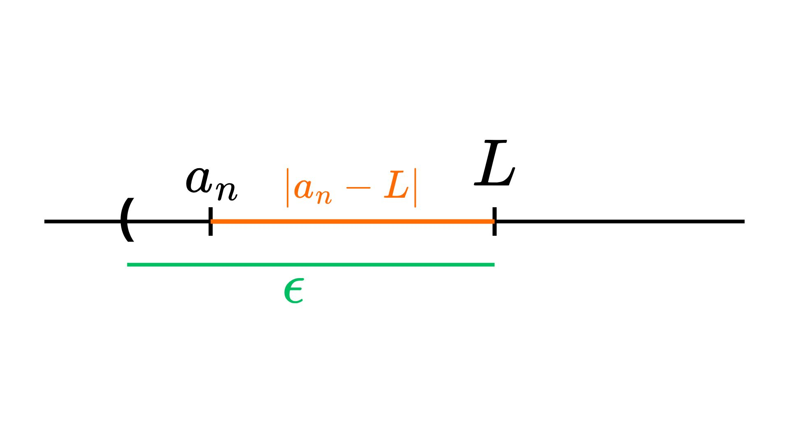

[Cálculo I](index.md)

<!-- wiki:original:inicio -->

# Sequências e limites

O resumo começa com sequências para construir a intuição usada depois em limites de funções. O material original privilegia exemplos e explicações intuitivas.

## O que são sequências?

**Definição: sequência.** Uma sequência é uma função dos naturais nos reais, $f:\mathbb N\to\mathbb R$, cujo valor no índice $n$ se escreve $a_n=f(n)$. Pense nela como uma lista ordenada que segue uma regra.

**Exemplo.** A sequência $1,1/2,1/3,\ldots$ segue $a_n=1/n$. Outra sequência é $1,0,1,0,\ldots$, dada por $a_n=(1+(-1)^{n-1})/2$.

## Sequências limitadas

Uma sequência é **limitada superiormente** quando existe $M\in\mathbb R$ tal que $a_n\le M$ para todo $n$. É **limitada inferiormente** quando existe $m\in\mathbb R$ tal que $a_n\ge m$ para todo $n$. Se ambas as condições valem, ela é limitada.

- $a_n=1/n$ tem limite superior $1$ e inferior $0$.
- $a_n=2n$ é limitada inferiormente por $2$, mas cresce sem limite superior.

Essas cotas não precisam ser termos da sequência. No exemplo $1/n$, nenhum termo é zero, embora zero seja um limite inferior.

## Sequências convergentes

Convergir para $L$ significa que, depois de certo índice, **todos** os termos ficam tão perto de $L$ quanto quisermos. Formalmente,

$$
\forall\varepsilon>0\;\exists n_0\in\mathbb N\;\forall n\ge n_0:\quad |a_n-L|<\varepsilon.
$$

O número $\varepsilon$ define a distância máxima desejada até $L$; $n_0$ marca o ponto a partir do qual essa distância é respeitada. A sequência $1/n$ converge para zero. Já $(-1)^n$ alterna entre $1$ e $-1$ e não converge.

**Teorema.** Toda sequência convergente é limitada. A recíproca falha: $(-1)^n$ é limitada e não converge.

## Primeira noção de limite

Escrevemos $\lim_{n\to\infty}a_n=L$ quando $a_n$ converge para $L$. A notação olha para o comportamento dos termos conforme $n$ cresce, mesmo que nenhum termo seja igual a $L$.

**Convergência de subsequências.** Se a sequência converge, toda subsequência converge para o mesmo limite. Inversamente, se duas subsequências têm limites diferentes, a sequência original não converge. Por exemplo, em $a_n=2^{-n}+(-1)^n$, os termos de índice par se aproximam de $1$ e os de índice ímpar se aproximam de $-1$; logo não há limite único.

## Sequências monótonas

Uma sequência é **crescente** quando $a_n\le a_{n+1}$ e **decrescente** quando $a_n\ge a_{n+1}$ para todo $n$. Por exemplo, $2n$ é crescente e $1/n$ é decrescente.

**Teoremas de convergência.** Se uma sequência crescente é limitada superiormente, ela converge para o supremo dos seus valores. Se uma sequência decrescente é limitada inferiormente, ela converge para o ínfimo:

$$
\lim_{n\to\infty}a_n=\sup\{a_n:n\in\mathbb N\}\quad\text{ou}\quad
\lim_{n\to\infty}a_n=\inf\{a_n:n\in\mathbb N\},
$$

conforme o caso. A cota usada no raciocínio deve ser a **menor** cota superior ou a **maior** cota inferior; uma cota arbitrária não precisa ser o limite.

## Operações básicas com limites

Se $a_n\to a$ e $b_n\to b$, então $a_n+b_n\to a+b$ e $a_nb_n\to ab$. Para quocientes ou recíprocos, também é preciso que o limite do denominador seja **diferente de zero**. Assim, se $b\ne0$, então $1/b_n\to1/b$ e $a_n/b_n\to a/b$ quando as expressões estiverem definidas.

Quando uma sequência cresce sem limite, escrevemos $a_n\to+\infty$; isso descreve divergência, não convergência para um número real. Se $b_n\ge a_n$ a partir de algum índice e $a_n\to+\infty$, também $b_n\to+\infty$. A soma de duas sequências que tendem a $+\infty$ também tende a $+\infty$. Se $c_n\to c$ é finito, então $c_n+a_n\to+\infty$; se $c>0$, vale ainda $c_na_n\to+\infty$. Para $a_n>0$ e $a_n\to+\infty$, temos $1/a_n\to0$; se $a_n\to0^+$, então $1/a_n\to+\infty$.

### Formas indeterminadas

Não se podem aplicar regras aritméticas diretamente a $\infty-\infty$, $0\cdot\infty$, $\infty/\infty$ e $0/0$. Cada forma admite comportamentos distintos:

- Para $a_n=n+c$ e $b_n=n$, a diferença vale $c$; para $a_n=2n$ e $b_n=n$, ela tende a $+\infty$.
- $(1/n)(cn)=c$, enquanto $(1/n)n^2=n\to+\infty$.
- $n/(cn)=1/c$, enquanto $n^2/n=n\to+\infty$.
- $(1/n)/(1/n^2)=n\to+\infty$, enquanto $(1/n^2)/(1/n)=1/n\to0$.

É preciso simplificar a expressão ou usar outra ferramenta antes de concluir o limite.

## Limites de funções

A mesma ideia de aproximação vale quando $x$ se aproxima de um ponto $a$. O limite de $f(x)$ em $a$ é $L$ quando

$$
\forall\varepsilon>0\;\exists\delta>0:\quad
0<|x-a|<\delta\;\Longrightarrow\;|f(x)-L|<\varepsilon.
$$

O intervalo de raio $\delta$ controla a proximidade de $x$ com $a$; o intervalo de raio $\varepsilon$ controla a proximidade de $f(x)$ com $L$. A condição $0<|x-a|$ exclui o próprio ponto $a$: o valor de $f(a)$ pode ser diferente de $L$ ou até estar indefinido.

<!-- wiki:original:fim -->

## Percurso de estudo

[Trilha: A1](../../trilhas/calculo-i/a1.md) · [Apresentação e contexto da fonte](../../trilhas/calculo-i/a1.md#apresentacao-original)
