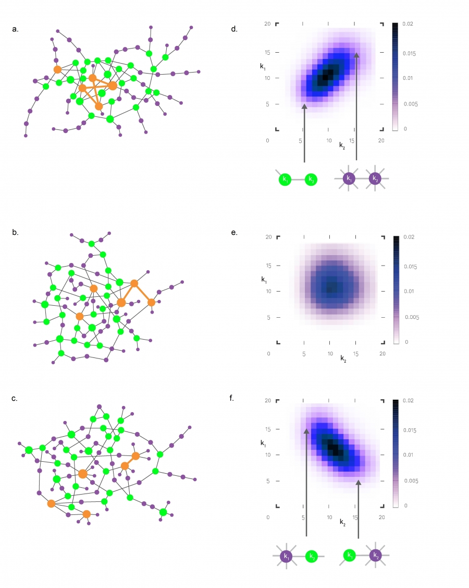
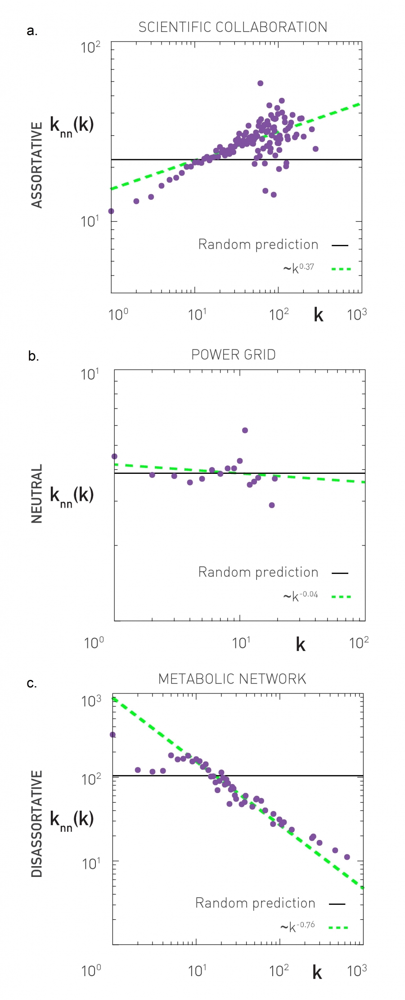

[Ciência de Redes](index.md)

<!-- wiki:original:inicio -->

# Correlação de Graus

## Descobrindo os Critérios

Dado uma rede $G(V,E)$, vamos supor que conhecemos a distribuição dos graus dessa rede (${\mathbb{P}}(\delta(v_{i}) = k) = p(k)$ para simplificação de notação), queremos ver se o grau do nó tem alguma influência em como eles se ligam. Então temos que ver a probabilidade de que um nó de grau $k'$ se ligue com um de grau $k$, ou seja: $${\mathbb{P}}(\left\{ v_{i},v_{j} \right\} \in E~\vert ~\delta(v_{i}) = k,\delta(v_{j}) = k') = p\left( \left\{ k,k' \right\} \in E \right)$$ Vamos escrever dessa forma para simplificar notação. Vamos ter que: $$p\left( \left\{ k,k' \right\} \in E \right) = \frac{kk'}{2\vert E\vert }$$ Onde $k'/2L$ é a probabilidade do meu nó com grau $k$ se ligar com um nó de grau $k'$ e eu multiplico por $k$ pois meu nó possui $k$ arestas ligadas a ele. Essa probabilidade indica que nós com graus maiores tem mais probabilidade de se ligar com outros nós de grau grande

**Definição: Matriz de Correlação por Grau**

A matriz de correlação por grau é a matriz que a entrada $e_{ij}$ é a probabilidade de encontrar nós de graus $i$ e $j$ nas pontas de uma aresta selecionada aleatoriamente

Essa matriz nos tráz informações diretas da relação **linear** entre os nós. Podemos dividir e classificar as redes de 3 formas de acordo com a relação entre seus graus

- **Rede Assortativa:** Nós com graus parecidos intelrigam entre si

- **Redes Neutras:** Os nós não apresentam um padrão para intelirgarem entre si

- **Redes Desassortativas:** Nós com graus maiores se ligam com graus menores e vice-versa

Podemos então avalisar a matriz de covariância ou a correlação entre os dados. Porém a relação entre esses pontos pode não ser linear, o que pode dar falsas impressões sobre a correlação

*Figura 1. Matriz de covariância de graus com 3 redes. A primeira é assortativa, a segunda é neutra e a última é desassortativa*

A matriz de correlação acaba por representar uma distribuição conjunta em $i$ e $j$ de forma que: $$\sum_{i,j}e_{ij} = 1$$

então definindo um pouco melhor essa probabilidade, defina $K$ como a bariável aleatória que representa o grau de um nó selecionado aleatoriamente. Seja também $\left\{ v_{i},v_{j} \right\} \in E$ uma aresta escolhida aleatoriamente dentre todas as do conjunto $E$. Para simplificar notações, também definimos $A = \delta(v_{i})$ e $B = \delta(v_{j})$. Então vamos ter que: $$e_{ij} = {\mathbb{P}}(A = i,B = j) = {\mathbb{P}}(A = i\vert B = j) \cdot {\mathbb{P}}(B = j) = {\mathbb{P}}(B = j\vert A = i) \cdot {\mathbb{P}}(A = i)$$

vamos então calcular cada um desses termos (Até onde for possível). Primeiro vamos calcular ${\mathbb{P}}(A = i)$ $${\mathbb{P}}(A = i) = \frac{iN_{i}}{2\vert E\vert } \times \frac{\frac{1}{N}}{\frac{1}{N}} = \frac{ip(i)}{{\mathbb{E}}\lbrack K\rbrack}$$

onde $N_{i}$ é a quantidade de nós com grau $i$ e eu multiplico por $i$ pois eu posso escolher qualquer uma das $i$ arestas presentes no nó que eu gostaria que fosse escolhido (O de grau $i$). E divido isso pela quantidade total de nós. Eu posso ainda, dividir o termo de cima e o de baixo por $N$, obtendo então a expressão na direita

Se os eventos $A$ e $B$ **não são independentes**, seria necessário saber a distribuição entre eles dois para calcular ${\mathbb{P}}(A = i\vert B = j)$. Porém, se $A$ e $B$ são independentes, então ${\mathbb{P}}(A = i\vert B = j) = {\mathbb{P}}(A = i) \cdot {\mathbb{P}}(B = j)$, então, no caso de $A$ e $B$ independentes, obtemos: $${\mathbb{P}}(A = i\vert B = j) = {\mathbb{P}}(A = i) \cdot {\mathbb{P}}(B = j) = \frac{ip(i)jp(j)}{\left( {\mathbb{E}}\lbrack K\rbrack \right)^{2}}$$

## Average Next Neighbour Degree

É interessante fazer o gráfico de uma matriz de covariância, porém, por ela perder essas informações antes mencionadas, as vezes ela pode ser ineficiente ou ser de difícil leitura se houver muitos vértices, então criamos a seguinte definição:

**Definição: Average Next Neighbour Degree**

Seja $G(V,E)$ uma rede, $A$ a matriz de adjacência da mesma e $v_{i} \in V$, então: $$k_{\text{nn }}\left( v_{i} \right) ≔ \frac{1}{\delta(v_{i})}\sum_{j = 1}^{\vert V\vert }A_{ij}\delta(v_{j})$$

Essa definição é o $k_{\text{nn}}$ para um vértice específico, mas e se quisermos o valor médio dessa medida para nós de grau $k$? $$k_{\text{nn }}(k) = {\mathbb{E}}\left\lbrack B\vert A = k \right\rbrack = \sum_{k'}k'{\mathbb{P}}(B = k'\vert A = k)$$

Podemos ver o que acontece com essa medida quando $A$ e $B$ são independentes, logo, analisar o caso das **redes neutras** $$k_{\text{nn }} = \sum_{k'}k'{\mathbb{P}}(B = k') = \sum_{k'}k'\frac{k'p(k')}{\mathbb{E}}\lbrack K\rbrack = {\mathbb{E}}\frac{\left\lbrack K^{2} \right\rbrack}{\mathbb{E}}\lbrack K\rbrack$$

Perceba que, quando consideramos o caso das redes neutras, **a média dos vizinhos de um nó não depende em quantos nós ele tem ou de informações sobre como o nó se relaciona com os outros, mas única e exclusivamente de características globais da rede**. A mesma lógica vale para as redes assortativas e desassortativas:

- **Assortativas:** A medida tende a crescer conforme aumentamos os valores de $k$ já que quanto maior o grau, maior a probabilidade de os graus se interligarem

- **Desassortativas:** Nós de grau menor tendem a interligar com nós de grau maior, o que acaba por fazer com que as probabilidades sejam altas em valores de $k$ muito pequenos, isso faz com que conforme aumentamos o $k$, o valor da medida diminua

O livro aponta que, de acordo com o gráfico mostrado anteriormente, que podemos aproximar a medida do $k_{\text{nn}}$ como: $$k_{\text{nn }}(k) = \beta k^{\mu}$$

de forma que:

- $\mu > 0 \Rightarrow$ Rede assortativa

- $\mu \approx 0 \Rightarrow$ Rede neutra

- $\mu < 0 \Rightarrow$ Rede desassortativa

## Cutoffs

A gente até agora ta assumindo que as redes analisadas são simples, ou seja, entre dois nós, só pode existir **no máximo** uma aresta. Porém, em algumas redes, quando calculamos o número esperado de arestas entre nós $${\mathbb{E}}_{kk'} = e_{kk'}{\mathbb{E}}\lbrack K\rbrack N$$

esse valor é **maior que $1$**. Então como fazemos para achar o valor de $k$ que faz com que esse valor seja $> 1$?

Primeiro, vamos definir $$r_{kk'} = \frac{E_{kk'}}{m_{kk'}}$$

onde $E_{kk'}$ é o número de arestas entre todos os nós de grau $k$ e de $k'$ e $m_{kk'} = \min\left\{ kN_{k},k'N_{k'},N_{k}N_{k'} \right\}$ é a maior quantidade **possível** de restas que ligam nós de grau $k$ e $k'$. Vou explicar o porquê dessa fórmula para $m_{kk'}$

- Cada nó com grau $k$ só pode se ligar a **no máximo** $k$ nós de grau $k'$, então:

$$
E_{kk'} \leq kN_{k}
$$

- O mesmo argumento vale para os nós de grau $k'$

$$
E_{kk'} \leq k'N_{k'}
$$

- Eu também não consigo ligar mais que o número máximo disponível de pares entre os dois grupos de graus

$$
E_{kk'} \leq N_{k}N_{k'}
$$

Ou seja, temos que $r_{kk'} \leq 1\ \forall k,k'$. Só que como mencionei anteriormente, por conta do valor esperado “não-esperado” de mais que uma aresta entre dois nós, pode ocorrer que $r_{kk'} > 1$, então queremos encontrar $k_{s}$ tal que: $$r_{k_{s}k_{s}} = 1$$

Mas antes de achar $k_{s}$, vamos reescrever $r_{kk'}$ de outra forma e fazer uma análise. Perceba que, quando $k > Np(k')$ ou $k' > Np(k)$, os efeitos das arestas múltiplas aparecem, transformando a expressão em: $$r_{kk'} = \frac{{\mathbb{E}}_{kk'}}{m_{kk'}} = \frac{{\mathbb{E}}\lbrack K\rbrack e_{kk'}}{Np(k)p(k')}$$

Para redes livre-de-escala, as condições são satisfeitas para $k,k' > \left( a\vert V\vert  \right)^{\frac{1}{\gamma + 1}}$ onde $a$ depende de $p(k)$. Só que esse valor é abaixo do cutoff natural, de forma que temos CERTEZA de que, se $k$ e $k'$ são maiores que isso, não podemos garantir que o valor esperado dos links será menor que 1. Olhando o caso específico das redes neutras, sabemos que: $$e_{kk'} = \frac{kk'p(k)p(k')}{{\mathbb{E}}\lbrack K\rbrack^{2}}$$

Logo $r_{kk'}$ vira: $$r_{kk'} = \frac{kk'}{{\mathbb{E}}\lbrack K\rbrack N}$$

Ou seja, chegamos que $k_{s} \propto \left( {\mathbb{E}}\lbrack K\rbrack N \right)^{\frac{1}{2}}$

Tendo isso em mente, conseguimos dividir as **redes livre-de-escala** em dois regimes ao compararmos $k_{\text{max}}$ e $k_{s}$ (Lembrando: $k_{\max} \propto N^{\frac{1}{\gamma - 1}}$)

- **Sem cutoff estrutural:** Para redes aleatórias e livre-de-escala com $\gamma \geq 3$, o expoente de $k_{\max} \leq \frac{1}{2} \Rightarrow k_{\max} \leq k_{s}$, logo os valores esperados dos links entre nós será **sempre** menor ou igual a 1

- **Dissassortividade estrutural:** Para redes livre-de-escala com $\gamma < 3$, temos $- \frac{1}{1 - \gamma} > \frac{1}{2}$, logo $k_{s}$ pode ser menor que $k_{\text{max}}$, logo, há nós entre $k_{s}$ e $k_{\max}$ que podem ter $E_{kk'} > 1$

------------------------------------------------------------------------

<!-- wiki:original:fim -->

## Percurso de estudo

[Trilha: A2](../../trilhas/ciencia-de-redes/a2.md) · [Apresentação e contexto da fonte](../../trilhas/ciencia-de-redes/a2.md#apresentacao-original)

- Próximo: [Percolação e Robustez](percolacao-e-robustez.md)
