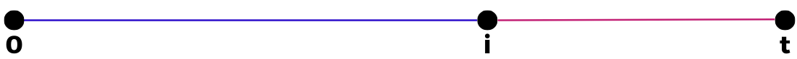

[Ciência de Redes](index.md)

<!-- wiki:original:inicio -->

# Evoluções de Redes

## Anexação Uniforme

Vamos imaginar uma **anexação uniforme**. Nesse caso, cada nó inserido sempre terá um grau de $m$. Ou seja, a **probabilidade** de um link do meu novo nó inserido se interligar ao vértice $v_{i}$ é igual a $m/i$ (A chance de ele se ligar com uma das arestas é $1/i$, logo, como eu posso me ligar com $m$ arestas diferentes, todas independentes entre si, a probabilidade total vai ser $m/i$), logo: $$\delta(v_{j},t = i) ≔ \text{ Grau de }v_{j}\text{ no momento }i$$ Com isso, podemos interpretar esse grau como uma **variável aleatória**. Temos que o grau de $v_{i}$ no momento inicial $i$ é fixa como $m$. Então a quantidade de arestas no momento $i + 1$ pode ser escrita como: $$\delta(v_{i},i + 1) = m + {\mathbb{I}}_{i + 1}(1) + {\mathbb{I}}_{i + 1}(2) + \ldots + {\mathbb{I}}_{i + 1}(m)$$ Onde ${\mathbb{I}}_{j}(k)$ é a variável indicadora que diz se, no momento $j$, a aresta $k$ do **novo nó que está sendo adicionado na rede** foi adicionado ou não no nosso nó. Podemos reescrever como a soma de uma única variável aleatória de distribuição binomial também. Você pode ter reparado que eu utilizei $i$ tanto no $v_{i}$ quanto no $i$. Vou utilizar isso pois eu estou supondo que, na nossa análise, estamos saindo do último nó adiconado (Uma aproximação razoável do modelo real, obviamente que nem todos os nós vão ser adicionados com essa anexação, já que antes de eu iniciar essa abordagem, já vai ter uma rede “preexistente”)

Porém, queremos ter uma **noção** de como isso vai ser ao longo prazo, podemos então tirar a esperança disso. $${\mathbb{E}}\left\lbrack \delta(v_{i},i + 1) \right\rbrack = m + \frac{m}{i}$$ Porém, isso é apenas para um único passo, queremos generalizar para vários passos. Vamos supor então que estamos saindo do $i$-ésimo nó adiconado e estamos no momento $t$: $$\delta(v_{i},t) = m + \sum_{k = i + 1}^{t}\sum_{j = 1}^{m}{\mathbb{I}}_{k}(j)$$ $$\begin{aligned} {\mathbb{E}}\left\lbrack \delta(v_{i},t) \right\rbrack & = m + \sum_{k = i + 1}^{t}\sum_{j = 1}^{m}{\mathbb{E}}\left\lbrack {\mathbb{I}}_{k}(j) \right\rbrack \\ & = m + \sum_{k = i + 1}^{t}\sum_{j = 1}^{m}\frac{j}{k - 1} \end{aligned}$$

$$
\begin{array}{r} {\mathbb{E}}\left\lbrack \delta(v_{i},t) \right\rbrack = m \cdot \sum_{k = i + 1}^{t}\frac{1}{k - 1} \\ {\mathbb{E}}\left\lbrack \delta(v_{i},t) \right\rbrack \approx m + m\ln(\frac{t - 1}{i - 1}) \\ {\mathbb{E}}\frac{\left\lbrack \delta(v_{i},t) \right\rbrack}{m} - 1 \approx \ln(\frac{t - 1}{i - 1}) \\ \exp(\frac{{\mathbb{E}}\left\lbrack \delta(v_{i},t) \right\rbrack - m}{m}) \approx \frac{t - 1}{i - 1} \\ \exp(\frac{- \left( {\mathbb{E}}\left\lbrack \delta(v_{i},t) \right\rbrack - m \right)}{m}) \approx \frac{i - 1}{t - 1} \\ \exp(\frac{- \left( {\mathbb{E}}\left\lbrack \delta(v_{i},t) \right\rbrack - m \right)}{m}) \approx \frac{i}{t} \end{array}
$$

No intervalo $\lbrack 0,t\rbrack$, temos a seguinte estruturação:

*Figura 5. Intervalo de $i/t$*

Então, o que encontramos foi a fração de nós que tem grau maior que $v_{i}$. Então temos que: $${\mathbb{P}}(\delta_{t}\left( v_{i} \right) \leq k) = 1 - e^{\frac{- (k - m)}{m}}$$ Logo, temos uma distribuição **Exponencial**

## Anexação Preferencial

Na anexação **uniforme**, cada novo nó podia se ligar com um dos nós anteriores com mesma probabilidade. Nessa abordagem, os nós de **maior grau** terão uma **maior preferência** para serem escolhidos (Não é uma obrigatoriedade). Podemos expressar, então da seguinte forma. Antes, vamos fazer duas definições rápidas:

**Definição**

Dada uma rede $G(V,E)$, o conjunto $E_{t}$ é definido como o conjunto de arestas da rede no momento $t$

**Definição**

Dado uma rede $G(V,E)$, a função $\delta_{t}:V \rightarrow {\mathbb{N}}$ é a função que retorna o grau de um vértice em um momento $t$ do tempo

Voltando, queremos então, antes de tudo, saber qual que é a probabilidade do nó que vai ser adicionado se ligar com um vértice $v_{i}$, então: $${\mathbb{P}}(\left\{ v_{i},v_{t + 1} \right\} \in E_{t + 1}) = \frac{\delta_{t}\left( v_{i} \right)}{\sum_{j = 1}^{t}\delta_{t}\left( v_{j} \right)}$$

Queremos achar uma distribuição para os graus dos nós. Vamos tentar achar, então, uma taxa de crescimento do grau dos nós: $$\frac{\delta_{t + 1}\left( v_{i} \right) - \delta_{t}\left( v_{i} \right)}{\Delta t} = m \cdot \frac{\delta_{t}\left( v_{i} \right)}{\sum_{j = 1}^{t}\delta_{t}\left( v_{j} \right)} \approx \frac{d\left( \delta_{t}\left( v_{i} \right) \right)}{dt}$$ Porém, sabemos que $\sum_{j = 1}^{t}\delta_{t}\left( v_{j} \right) = 2\vert E_{t}\vert$, então vamos obter: $$\frac{d\left( \delta_{t}\left( v_{i} \right) \right)}{dt} = m \cdot \frac{\delta_{t}\left( v_{i} \right)}{2\vert E_{t}\vert } = m \cdot \frac{\delta_{t}\left( v_{i} \right)}{2tm} = \frac{\delta_{t}\left( v_{i} \right)}{2t}$$

Logo, obtemos uma EDO para resolver. Vamos chamar $\delta_{t}\left( v_{i} \right)$ de $k$ apenas para facilitar a visualização: $$\begin{array}{rlr} \frac{dk}{dt} & = \frac{k}{2t}\text{\quad\quad}\left( \delta_{i}\left( v_{i} \right) = m \right)\frac{\begin{array}{r} \\ (dk) \end{array}}{k} & = \frac{dt}{2t} \\ \int\frac{dk}{k} & = \int\frac{dt}{2t} \\ \ln k & = \frac{1}{2}\ln t + C \\ \delta_{t}\left( v_{i} \right) & = t^{1/2} \cdot D \end{array}$$ Resolvendo para o caso $\delta_{i}(i) = m$, temos: $$\begin{array}{r} m = i^{1/2}D \Rightarrow D = m \cdot i^{- 1/2} \\ \Rightarrow \delta_{t}\left( v_{i} \right) = m\left( \frac{t}{i} \right)^{1/2} \end{array}$$

Queremos então calcular ${\mathbb{P}}(\delta_{t}\left( v_{i} \right) \leq k)$. Na média, todos os nós **posteriores** ao nó $v_{i}$ tem grau menor do que $k$, então precisamos apenas inverter aquela equação de antes, assim, vamos obter: $$\begin{array}{r} \delta_{t}\left( v_{i} \right)^{2} = m^{2}\frac{t}{i} \\ \Leftrightarrow i = \frac{m^{2} \cdot t}{\delta_{t}\left( v_{i} \right)^{2}} \end{array}$$

Assim, conseguimos obter a **fração de nós com grau maior que $v_{i}$**, que são justamente os nós anteriores a ele ($i/t$) que é $m^{2}\delta_{t}\left( v_{1} \right)^{- 2}$. Temos então que: $${\mathbb{P}}(\delta_{t}\left( v_{i} \right) \leq k) = 1 - m^{2}k^{- 2}$$

Temos também que a densidade vai ser: $$f_{K}(k) = 2m^{2}k^{- 3}$$

Percebemos, então, que a variável aleatória $K$, que representa o grau de um nó na rede, tem a distribuição **$\text{Paretto}(2,m)$**. O que, na verdade, faz bastante sentido. A distribuição de Paretto é bastante usada para descrever a concentração de riquezas e, como sabemos bem, o dinheiro costuma se concentrar sempre em quem tem mais dinheiro, então é só imaginar que o grau de um nó representa o quão rica uma pessoa é e bingo, faz todo sentido essa distribuição!

------------------------------------------------------------------------

<!-- wiki:original:fim -->

## Percurso de estudo

[Trilha: A1](../../trilhas/ciencia-de-redes/a1.md) · [Apresentação e contexto da fonte](../../trilhas/ciencia-de-redes/a1.md#apresentacao-original)

- Anterior: [Redes Aleatórias](redes-aleatorias.md)
- Próximo: [Redes Livres de Escala](redes-livres-de-escala.md)
