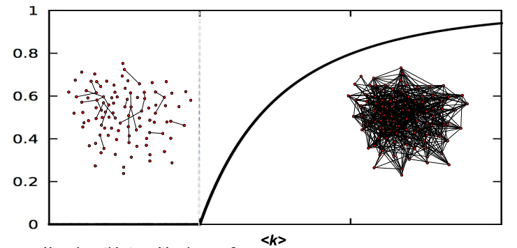
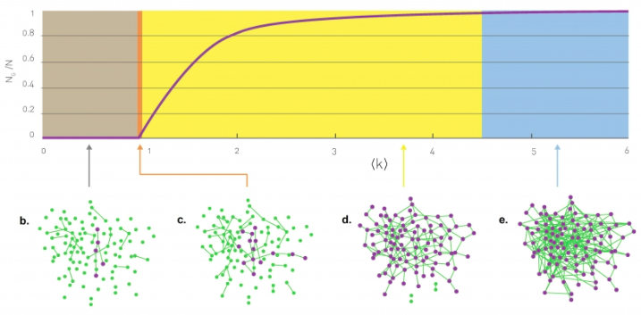

[Ciência de Redes](index.md)

<!-- wiki:original:inicio -->

# Redes Aleatórias

## Ideia Inicial

Também chamadas de **Redes Erdös-Renyi** ou **Redes de Poisson**, são tipos de redes que vão se montando aleatoriamente. Por exemplo, imagine que você está em uma festa e o anfitrião está fornecendo um vinho da melhor qualidade, mas ele não avisou ninguém. Um convidado curioso, por acidente, provou desse vinho e **adorou**, então ele vai contar para as pessoas da festa. A pergunta é, para quem ele vai falar? Ele vai falar para todos? Vai sobrar vinho para você?

Em cima disso conseguimos montar as redes aleatórias, onde cada par de nós (Aresta) é formado de acordo com uma **probabilidade**

**Definição: Rede Aleatória**

Uma rede aleatória é um grafo $G(V,E)$ de $\vert V\vert  = N$ nós onde cada par de nós é conectado por uma probabilidade **$p$**

Considere, agora, uma rede aleatória $G(V,E)$ com $\vert V\vert  = N$. Sendo $L$ a variável aleatória que representa a quantidade de arestas em $E$, queremos descobrir sua distribuição. Como cada aresta tem uma probabilidade $p$ de aparecer, podemos interpretar como ela aparecer ou não sendo uma variável indicadora, de forma que o número total de arestas segue uma distribuição binomial (Soma de variáveis de bernoulli independentes). Ou seja, a probabilidade a quantidade de arestas ser $L = l$ é: $${\mathbb{P}}(L = l) = \begin{pmatrix} \begin{pmatrix} N \\ 2 \end{pmatrix} \\ l \end{pmatrix}p^{l}(1 - p)^{\frac{N(N - 1)}{2} - l}$$ Podemos aplicar a mesma ideia para o grau de um vértice também. Vamos definir que $K$ é a variável aleatória que representa o **grau de um vértice arbitrário**, então: $${\mathbb{P}}(K = k) = \begin{pmatrix} N - 1 \\ k \end{pmatrix}p^{k}(1 - p)^{N - 1 - k}$$ Já que meu vértice pode se ligar a $N - 1$ vértices com probabilidade $p$, então isso vira a soma das variáveis indicadores que são $1$ quando o meu vértice se liga com outro vértice (${\mathbb{P}}({\mathbb{I}} = 1) = p$), de forma que eu tenho a soma de $N - 1$ variáveis de bernoulli independentes

Com isso, nós podemos definir o grau médio de $G$ como ${\mathbb{E}}\lbrack K\rbrack$: $$\delta_{\text{med }}(G) = {\mathbb{E}}\lbrack K\rbrack = (N - 1)p$$

E podemos obter também a variância dos graus $${\mathbb{V}}(K) = (N - 1)p(1 - p)$$

Então, apenas para resumir, temo que: $$\begin{array}{r} L \sim \text{ Bin}\left( \begin{pmatrix} N \\ 2 \end{pmatrix},p \right) \\ K \sim \text{ Bin}(N - 1,p) \end{array}$$

Porém, em redes reais, elas são **esparsas**, ou seja, eu tenho **muitos** nós e graus pequenos ($N \gg {\mathbb{E}}\lbrack K\rbrack$ notação que diz que $N$ é **muito maior** que ${\mathbb{E}}\lbrack K\rbrack$). E lembra qual é a distribuição que é a binomial com $n$ muito grande? Exato, a **Poisson**! Essas redes aleatórias também são chamadas de **redes de poisson**. Vamos, a partir de agora, denotar $\delta_{\text{med }}(G) = {\mathbb{E}}\lbrack K\rbrack = \hat{k}$ $${\mathbb{P}}(\delta(v) = k) = e^{- \hat{k}}\frac{{\hat{k}}^{k}}{k!}$$ Ou seja, para $N$ muito grande e $k$ pequeno com relação a $N$, podemos estimar de forma que: $$K \sim \text{ Poisson}\left( \hat{k} \right)$$

E isso tudo nos dá um resultado bem condizente e intuitivo, que é que, conforme nós aumentamos a probabilidade $p$ de uma aresta existir, então a rede vai ficando cada vez mais densa

## Evolução das Redes Aleatórias

Conforme iniciamos um grafo com um grau médio $0$ e vamos aumentando ele aos poucos, nós percebemos que a partir de um ponto chave, os nós começam a se agrupar em algo que chamamos de **componente gigante**, que seria a maior componente conexa da rede.

*Figura 3. Gráfico que mostra a fração de nós dentro de uma grande componente conexa em função do grau médio*

Quanto $\hat{k} < 1$, então a quantidade de nós na componente gigante é desprezível em relação à quantidade de nós na rede, porém, a partir de $\hat{k} = 1$, isso indica que temos, pelo menos, $\frac{n}{2}$ componentes conexas, o que já começa a fazer uma diferença no gráfico. Esse é um argumento utilizado por Erdös e Renyi em um paper por eles publicado

**Teorema: Ponto Crítico**

Temos uma componente gigante $\Leftrightarrow$ ${\mathbb{E}}\lbrack K\rbrack \geq 1$

**Demonstração**

Dado uma rede $G(V,E)$, vamos definir a fração de nós que **não está** na componente gigante como: $$u = 1 - \frac{N_{G}}{\vert V\vert }$$

De forma que $N_{G}$ é a quantidade de nós dentro dessa componente gigante, vamos definir essa componente como $\Psi \subseteq V$. Se um nó $v_{i} \in \Psi$, então ele deve estar interligado com outro nó $v_{j}$, que também deve satisfazer $v_{j} \in \Psi$. Por isso, se $v_{i} \notin \Psi$, então isso pode ocorrer por duas razões:

- $\left\{ v_{i},v_{j} \right\} \notin E$. A probabilidade de isso acontecer é $1 - p$

- $\left\{ v_{i},v_{j} \right\} \in E$, porém $v_{j} \notin \Psi$. A probabilidade de isso acontecer é $pu$

Então temos: $${\mathbb{P}}(v_{i} \notin \Psi) = 1 - p + pu$$

Então a probabilidade de que $v_{i}$ não esteja linkado a $\Psi$ por qualquer nó é de $(1 - p + pu)^{\vert V\vert  - 1}$, já que temos outros $\vert V\vert  - 1$ nós que poderiam fazer com que $v_{i}$ se interligasse a componente gigante.

Sabemos que $u$ é a fração de nós que não está em $\Psi$, para qualquer $p$ e $\vert V\vert$, a solução da equação <!-- Expressão matemática vazia no original. --> $$u = (1 - p + pu)^{\vert V\vert  - 1}$$

nos dá o tamanho da componente gigante por meio de $N_{G} = \vert V\vert (1 - u)$. Usando $p = \frac{\hat{k}}{\vert V\vert  - 1}$ e tirando $\log$ de ambos os lados, para $\hat{k} \ll \vert V\vert$ (Grau médio **muito** menor que $\vert V\vert$), obtemos: $$\begin{array}{r} \ln(u) \approx \left( \vert V\vert  - 1 \right)\ln\left\lbrack 1 - \frac{\hat{k}}{\vert V\vert  - 1}(1 - u) \right\rbrack \\ \text{Tiramos exponencial e obtemos: } \\ u \approx \exp\left\{ - \frac{\hat{k}}{1 - u} \right\} \end{array}$$

Se denotarmos $S = \frac{N_{G}}{\vert V\vert }$, obtemos que: $$S = 1 - e^{- \hat{k} \cdot S}$$

Agora obtemos o tamanho da componente gigante em função do **grau médio**. O ponto crítico ocorre na mudança de fase do sistema (Tópico mais complicado que não compreendo, estou apenas falando o que o livro do Barabas fala), que é quando os dois lados da igualdade tem a mesma derivada, então: $$\begin{aligned} \frac{d}{dS}\left( 1 - e^{\hat{k}S} \right) & = 1 \\ \hat{k}e^{- \hat{k}S} = 1 \end{aligned}$$ Onde, colocando $S = 0$, descobrimos que o ponto crítico é $\hat{k} = 1$

Na verdade esse resultado é bem intuitivo. Faz sentido dizer que para que uma componente gigante exista, todos os nós precisam ter pelo menos grau 1, já que eles precisam estar conectados com algum outro nó, porém, o que não é muito intuitivo, é que todos eles terem grau 1 é **suficiente** para que a componente gigante apareça

A gente pode reescrever ${\mathbb{E}}\lbrack K\rbrack = 1$ como: $${\mathbb{E}}\lbrack K\rbrack = 1 \Leftrightarrow p(N - 1) = 1 \Leftrightarrow p = \frac{1}{N - 1} \approx N$$ E o que isso significa? Isso mostra outro resultado intuitivo. Quanto maior é minha rede, **menos probabilidade eu preciso para que uma componente gigante apareça**

Algo interessante que podemos fazer é analisar como a proporção $\frac{N_{G}}{N}$ (Porcentagem de nós dentro da componente gigante) se comporta conforme nós aumentamos ${\mathbb{E}}\lbrack K\rbrack$. Nós fazemos isso dividindo esse processo em 4 fases (Ou 4 **regimes**), veja a imagem abaixo:

*Figura 4. Crescimento da compoente conexa em função do grau médio*

### Regime Subcrítico ($0 < \hat{k} < 1$)

Quando $\hat{k} = 0$, temos $N$ nós soltos na rede e conforme aumentamos $\hat{k}$, mas mantemos ele menor que $1$, temos a formação de vários nós soltos e pequenos agrupamentos (Coisa pouca mesmo). Dessa forma, mesmo escolhendo a componente gigante como o maior desses agrupamentos, a proporção $N_{G}/N$ ainda vai ser muito baixa. O Barabás aproxima essa relação como $$\frac{N_{G}}{N} \approx \frac{\ln(N)}{N} \rightarrow 0\text{ quando }N \rightarrow \infty$$ Pois podemos considerar essas componentes menores como várias árvores (Também pequenas)

### Ponto Crítico

É a transição do momento onde não há uma componente gigante para o momento que há uma. Porém o tamanho relativo dela ($N_{G}/N$) ainda é muito próximo de $0$. O livro do Barabás afirma que $N_{G} \approx N^{\frac{2}{3}}$, então $N_{G}$ cresce muito mais devagar se comparado a $N$, logo: $$\frac{N_{G}}{N} \approx N^{- \frac{1}{3}} = O(N)$$

Porém, perceba que o salto de diferença de tamanho pode ser enorme dependendo da rede. Se pegarmos uma rede de tamanho $N = 7 \times 10^{9}$ (Parecido com a rede mundial), para $\hat{k} < 1$, a gente teria que o tamanho da componente gigante era de ordem: $$N_{G} \approx \ln(N) \approx 22.7$$ Em contraste, se $\hat{k} = 1$, então teriamos que $$N_{G} \approx N^{\frac{2}{3}} \approx 3 \times 10^{6}$$ Que é uma diferença notável no tamanho das componentes gigantes

### Regime Supercrítico ($\hat{k} > 1$)

Esse regime tem mais relevância para redes reais, já que a componente gigante começa a se parecer realmente com uma rede. Aqui, o tamanho $N_{G}$ pode ser dado como: $$N_{G} = \left( p - p_{c} \right)N$$ Onde $p_{c} = 1/(N)$. Ou seja, conforme eu aumentar meu grau médio, menor vai ficar meu $p$ e maior será a fração de nós que pertencem à componente gigante. Em resumo, nesse regime, várias componentes conexas coexistem junto da componente gigante, onde a componente gigante é uma rede comum, enquanto as outras componentes conexas são mais prováveis de serem árvores

### Regime Conexo ($\hat{k} > \ln(N)$)

Agora, nesse regime, temos que o grafo é (ou quase) conexo, logo, todos os nós fazem parte da componente conexa (Ou a maioria, logo $N_{G} \approx N$)

**Teorema**

Se $N_{G} \approx N$, o valor de $\hat{k}$ que satisfaz a propriedade de **a maior parte dos nós estarem na componente gigante** é: $$\hat{k} = \ln(N) \Rightarrow p = \frac{\ln(N)}{N}$$

**Demonstração**

Para determinar o valor de $\hat{k}$ no qual a maior parte dos nós fazem parte da componente gigante, temos que saber a probabilidade de que um **nó aleatório não tenha um link para a componente gigante**, e isso é: $$(1 - p)^{N_{G}} \approx (1 - p)^{N}$$ Já que eu tenho exatamente $N_{G}$ nós na componente gigante e eu não quer me ligar com nenhum deles. Novamente, tomando ${\mathbb{I}}_{k}$ sendo a variável indicadora de que um nó $k$ **não** na componente gigante ($1$ quando ele não está), temos que a **quantidade de nós que não estão na componente gigante** tem uma distribuição **binomial** com parâmetros $N$, $(1 - p)^{N}$, então, se considerarmos $L_{G}$ sendo essa quantidade, temos que: $${\mathbb{E}}\left\lbrack L_{G} \right\rbrack = {N(1 - p)}^{N} = {N\left( 1 - \frac{Np}{N} \right)}^{N} \approx Ne^{- Np}$$ Queremos então chegar no ponto em que temos, para um $p$ suficientemente próximo de $1$, que apenas 1 único nó esteja fora da componente conexa, então gostaríamos de analisar em que ponto: $${\mathbb{E}}\left\lbrack L_{G} \right\rbrack = 1 \Leftrightarrow Ne^{- Np} = 1$$ Logo, tirando $\ln$ em ambos os lados, chegamos que: $$p = \frac{\ln(N)}{N}$$ Ou seja $$\hat{k} = \ln(N)$$

Esse resultado é de grande impacto! Quando analisamos muitas das redes reais, a maioria segue esse padrão de $\hat{k} = \ln(N)$, logo, as **redes reais são supercríticas**. Veja a tabela presente no livro do Barabás:

| **Rede** | **N** | **L** | ${\mathbb{E}}\lbrack K\rbrack$ | $\ln(N)$ |
|----|----|----|----|----|
| Internet | $192244$ | $609066$ | $6.34$ | $12.17$ |
| Power Grid | $4,941$ | $6,594$ | $2.67$ | $8.51$ |
| Science Collaboration | $23,133$ | $94,437$ | $8.08$ | $10.05$ |
| Actor Network | $702,388$ | $29,397,908$ | $83.71$ | $13.46$ |
| Protein Interactions | $2,018$ | $2,930$ | $2.90$ | $7.61$ |

Tabela de redes no Barabás

## Distribuição de tamanhos de Cluster

Queremos também ter uma noção da probabilidade de um nó $v_{i}$ qualquer estar em um cluster (Grupo de nós na rede) de tamanho $s$. No livro do Newman, ele nos mostra que essa probabilidade é: $${\mathbb{P}}(v_{i} \in \Psi_{\vert \Psi\vert  = s}) = e^{- \delta_{\text{med }}(G) \cdot s}\frac{\left( \delta_{\text{med }}(G) \cdot s \right)^{s - 1}}{s!}$$

## Mundos pequenos

Mundos pequenos (Small worlds) são grafos em que, independente da quantidade de vértices, a distância entre dois nós aleatórios costuma ser muito pequeno. Um exemplo é um modelo que cada nó representa todas as pessoas do mundo e as arestas indicam se elas já interagiram e se conhecem ou não (Impressionantemente), tanto que existe a teoria dos 6 graus de distância entre as pessoas

[*Vídeo sobre o assunto (Clique aqui)*](https://youtu.be/TcxZSmzPw8k?si=jXPDJE_SWwNys4YM)

E se quisermos ter uma noção de o quão **não-relacionadas** duas pessoas são em uma rede social? Podemos calcular sua distância, obviamente, mas alguns algoritmos ficam computacionalmente inviáveis. Podemos então estimar uma distância média entre dois nós selecionados aleatoriamente no grafo.

Tendo uma rede $G(V,E)$ com grau médio $\hat{k} = {\mathbb{E}}\lbrack K\rbrack$, é intuitivo pensar que cada nó tem, em média: $$\begin{aligned} & \hat{k}\text{ nós a }1\text{ unidade de distância } \\ & {\hat{k}}^{2}\text{ nós a }2\text{ unidades de distância } \\ & \vdots \\ & {\hat{k}}^{d}\text{ nós a }d\text{ unidades de distância } \end{aligned}$$ Então é plausível dizer que a quantidade média de nós presentes até uma distância $d$ de um nó qualquer é expresso como: $$N(d) = \sum_{i = 0}^{d}{\hat{k}}^{i} = \frac{{\hat{k}}^{d + 1} - 1}{\hat{k} - 1}$$

Sabemos que esse valor não pode ter valores arbitrários, ele não passa de $\vert V\vert  = N$, então podemos encontrar o grau médio que satisfaz esse o valor. Assim, fazemos: $$\frac{{\hat{k}}^{d + 1} - 1}{\hat{k} - 1} \approx N$$

Assumindo que $\hat{k} \gg 1$, podemos desprezar os termos $- 1$, assim vamo obter que: $$d_{\text{max }} \approx \frac{\ln(N)}{\ln(\hat{k})}$$

Que é a representação matemática do problema dos minimundos. Porém, isso também traz uma interpretação muito interessante.

Porém, aqui a gente ta vendo o **diâmetro** da rede, e nós comentamos anteriormente sobre **a distância entre dois nós aleatórios**. Impressionantemente, essa aproximação também é válida para essa ocasião. Denotando essa distância média, temos que a característica dos minimundos é: $$\hat{d} \approx \frac{\ln(N)}{\ln(\hat{k})}$$

Mas por que isso acontece? Falando de um jeito mais intuitivo, essa aproximação de $d_{\text{max}}$ costuma funcionar mais para a média do caminho entre dois nós aleatórios pois, em redes reais, o $d_{\text{max}}$ é dado por um único caminho ou pouquissimos caminhos daquele tamanho, enquanto $\hat{d}$ é ponderado em todos os nós. Além de que essa fórmula traz algumas intuições interessantes. Ela mostra que a distância média entre os nós aumenta conforme aumentamos o tamanho da rede, mesmo que não linearmente ou exponencialmente. E mostra também com o termo $1/\ln(\hat{k})$ que, quanto mais densa é minha rede, menor vai ser a distância média

## Coeficiente de Clustering

Indica o quão agrupado um nó está dentro de uma rede. O grau de um nó não fala nada sobre a relação entre seus vizinhos, e é aí que o coeficiente de clustering entra

**Definição: Coeficiente de Clustering**

Dado uma rede $G(V,E)$, o coeficiente de clustering de um nó $v_{i} \in V$ é definido como: $$\text{ Cluster}\left( v_{i} \right) ≔ \frac{2 \cdot {\mathbb{L}}(v_{i})}{\delta(v_{i})\left( \delta(v_{i}) - 1 \right)}$$ Onde ${\mathbb{L}}(v_{i})$ é quantas arestas **entre si** os **vizinhos** de $v_{i}$ possuem e $\frac{\delta(v_{i})(\delta(v_{i}) - 1)}{2}$ é a quantidade **máxima** de arestas que poderiam estar interligando os vizinhos de $v_{i}$ (Quantidade de arestas em um grafo completo $K_{\delta(v_{i})}$)

Vamos tomar ${\mathbb{L}}(v_{i})$ como sendo a variável aleatória que indica quantas arestas os vizinhos de $v_{i}$ tem entre si. Novamente, como sempre, tomamos a variável indicadora ${\mathbb{I}}_{k}$ como sendo a variável indicadora que diz se a aresta $k$ faz parte desse grupo de links entre os vizinhos do nó $v_{i}$. Sabemos que ${\mathbb{P}}(I_{k} = 1) = p$, então ${\mathbb{L}}(v_{i})$ seria uma binomial, mas qual seria o parâmetro da quantidade? Quantas variáveis indicadoras ${\mathbb{I}}_{k}$ eu tenho que somar? Se pararmos para pensar, o **máximo** de links que podem existir entre os vizinhos de $v_{i}$ é o grafo completo formado por todos eles, então, no final, temos que: $${\mathbb{L}}(v_{i}) \sim \text{ Bin}\left( \begin{pmatrix} \hat{k} \\ 2 \end{pmatrix},p \right)$$ Então, no final, vamos ter que: $${\mathbb{E}}\left\lbrack {\mathbb{L}}(v_{i}) \right\rbrack \approx p\frac{\delta(v_{i})\left( \delta(v_{i}) - 1 \right)}{2} \Rightarrow \text{ Cluster}\left( v_{i} \right) = p = \frac{{\mathbb{E}}\lbrack K\rbrack}{\vert V\vert }$$

Só que sabemos que, em redes aleatórias, para que esse número seja alto, a probabilidade em si das arestas tem que ser alto, porém, se $p$ é alto, então a rede aleatória em si será um grande aglomerado, seria um único cluster enorme. Essa característica é um forte indicativo, por exemplo, de que redes como as **redes sociais** **não são** redes aleatórias. O livro do Barabás mostra um experimento e mostra que, em redes reais, o coeficiente de clustering é muito maior do que o esperado em redes aleatórias, de forma que, em redes reais, esse coeficiente costuma ser bastante independente de $N$, diferente do que encontramos agora há pouco

## Grau Máximo e Grau Mínimo

Dependendo do contexto analisado, pode ser de grande interesse saber os valores esperados do **maior grau** de uma rede e do **menor grau**. Para descobrir o **maior grau**, precisamos que, na rede, tenhamos **no máximo** um nó com grau maior que $k_{\text{max}}$. Isso significa que a área do gráfico da distribuição **em frente** a $k_{\max}$ é aproximadamente 1: $$\begin{array}{r} N \cdot {\mathbb{P}}(K \geq k_{\max}) \approx 1 \\ N \cdot \left( 1 - {\mathbb{P}}(K < k_{\max}) \right) \approx 1 \end{array}$$

E podemos usar um argumento análogo, afirmando que deveríamos ter, no máximo, apenas um nó com grau menor que $k_{\min}$, então teríamos: $$N \cdot {\mathbb{P}}(K \leq k_{\min} - 1) = 1$$ Assim resolvemos as duas equações para achar $k_{\min}$ e $k_{\max}$

## Conclusão

Como conclusão, temos que redes aleatórias **não representam bem as redes da vida real**. Não existem redes na natureza que são corretamente descritas como **redes aleatórias**. Então por que estudar elas? Na verdade, veremos posterioremente que, mesmo elas sendo erradas e irrelevantes, elas são **muito úteis**

------------------------------------------------------------------------

<!-- wiki:original:fim -->

## Percurso de estudo

[Trilha: A1](../../trilhas/ciencia-de-redes/a1.md) · [Apresentação e contexto da fonte](../../trilhas/ciencia-de-redes/a1.md#apresentacao-original)

- Anterior: [Medidas de Centralidade](medidas-de-centralidade.md)
- Próximo: [Evoluções de Redes](evolucoes-de-redes.md)
