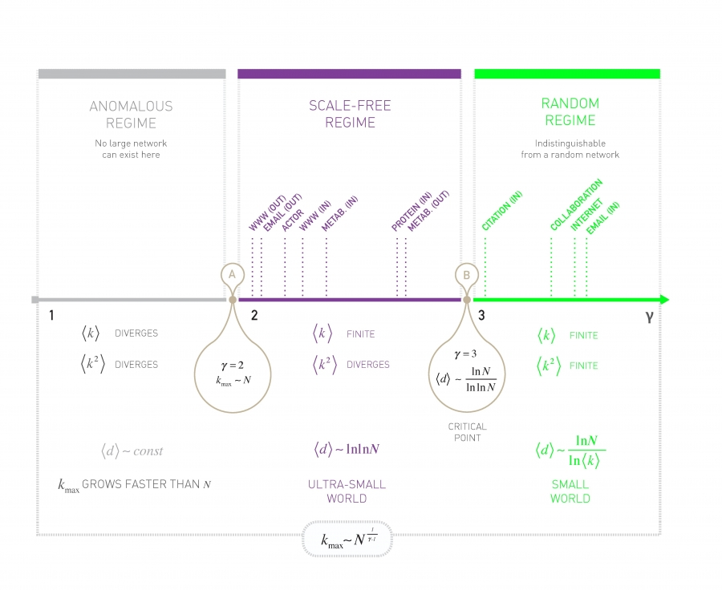

[Ciência de Redes](index.md)

<!-- wiki:original:inicio -->

# Redes Livres de Escala

## Formalismo Discreto

Para cálculos analíticos, é interessante deixar que os graus possam assumir qualquer tipo de valor real (Mesmo que apenas os naturais sejam possíveis). Seja $K$ a variável aleatória que indica o grau de um vértice escolhido aleatoriamente, temos que: $${\mathbb{P}}(K = k) = Ck^{- \gamma}$$

Normalizando, temos: $$\begin{array}{r} \int_{k_{\min}}^{\infty}{\mathbb{P}}(K = k)dk = 1 \\ \Rightarrow C = (\gamma - 1)k_{\min}^{\gamma - 1} \end{array}$$

Então temos que a distribuição segue a P.M.F: $${\mathbb{P}}(K = k) = (\gamma - 1)k_{\min}^{\gamma - 1}k^{- \gamma}$$

## Centros

Vamos analisar a seguinte imagem:

*Figura 8. Distribuição de Poisson e Distribuição de Potência*

A gente pode analisar em 3 pontos principais:

- Antes de $\hat{k}$ a rede livre de escala é maior, ou seja, há mais nós com grau pequeno nela do que na poisson

- Na vizinhança de $\hat{k}$, a poisson é maior, logo, existe um excesso de nós com grau $\hat{k}$ na rede Poisson

- Depois a rede livre de escala volta a ser maior

Isso significa que, em redes livre de escala, temos altas chances, ou de obter **um nó com grau muito grande (Hub)** ou obter vários nós com grau pequeno

### Maior Centro

Também chamados de **hubs**, são os nós mais centrais, aqueles que representam uma maior importância dependendo do contexto, aqui, sendo aqueles com o maior grau. Podemos querer saber como eles se comportam nessas redes livres de escala! Para isso, temos que calcular qual é o maior grau da distribuição $k_{\text{max}}$, também chamado de corte natural da distribuição. Representa o tamanho esperado do maior hub. Antes de partir para o caso complicado geral de $p(k) = Ck^{- \gamma}$, vamos primeiro fazer um caso mais simples, vamos fazer para a **exponencial**: $$p(k) = Ce^{- \lambda k}$$ Para uma rede com grau mínimo $k_{\min}$, temos que a normalização vai ficar: $$\int_{k_{\min}}^{\infty}p(k)dk = 1 \Rightarrow C = \lambda e^{\lambda k_{\min}}$$ Agora, para saber $k_{\max}$, fazemos o mesmo processo que vimos antes, vamos supor que, em uma rede com $N$ nós, o valor esperado do grau para o regime $\left( k_{\max},\infty \right)$ seja $1$, ou seja: $$\begin{array}{r} {\mathbb{E}}\left\lbrack K\vert k > k_{\max} \right\rbrack = 1 \Rightarrow N \cdot {\mathbb{P}}(K \geq k_{\max}) = 1 \\ \Leftrightarrow \int_{k_{\max}}^{\infty}p(k)dk = \frac{1}{N} \end{array}$$

Resolvendo a integral, vamos obter: $$k_{\max} = k_{\min} + \frac{\ln(N)}{\lambda}$$

Essa equação nos indica algo interessante. $\ln(N)$ é uma função que cresce devagar conforme $N \rightarrow \infty$, já que a sua derivada tende a $0$, então quanto maior o $N$, mais devagar a função vai crescer. Ou seja, isso indica que, conforme o $N$ cresce, o grau máximo e mínimo não diferem tanto!

Esse cálculo pra distribuição de Poisson é um pouquinho mais evoluído, mas a gente chega que o resultado é muito parecido e que $N$ cresce mais lentamente ainda

Agora, para as redes livre de escala, resolvendo [relação entre $k_{\min}$ e $k_{\max}$](#kmin-and-kmax-equation), a gente obtém: $$k_{\max} = k_{\min} \cdot N^{\frac{1}{\gamma - 1}}$$

Ou seja, quanto maior é minha rede, maior vai ser o tamanho do meu centro (Maior é o grau do nó com mais graus). Isso é um resultado bem intuitivo, na verdade! Lembra que nós começamos dando o contexto da rede da internet (WWW)? Se pararmos para pensar, conforme as pessoas criam páginas na internet, elas tendem a colocar links para páginas famosas na internet, ou que tem alguma relevância em **comunidades**, ou seja, quanto mais links referenciando uma página, mais páginas vão referenciar ela, de forma que, quanto mais páginas vão sendo criadas, maior vai ser a quantidade de links referenciando páginas famosas ou reconhecidas!

## Significado de Livre de Escala

Antes de entender o significado desse termo, vamos nos familiarizar com alguns conceitos. Vimos em probabilidade o conceito de **momentos**. O $n$-ésimo momento da [distribuição dos graus](modelo-biaconi-barabasi.md#secao-34) (Levando em conta a variável aleatória $K$ que é o grau de um vértice aleatório) é: $${\mathbb{E}}\left\lbrack K^{n} \right\rbrack = \sum_{i = k_{\min}}^{\infty}k^{n} \cdot {\mathbb{P}}(K = k) = \int_{k_{\min}}^{\infty}k^{n}p(k)dk$$

Resolvendo a integral, vamos obter: $${\mathbb{E}}\left\lbrack K^{n} \right\rbrack = C\frac{k_{\max}^{n - \gamma + 1} - k_{\min}^{n - \gamma + 1}}{n - \gamma + 1}$$

Sabemos que, normalmente, $k_{\min}$ é fixo enquanto $k_{\max}$ aumenta confirme $N \rightarrow \infty$. Então vamos fazer uma análise mais detalhada sobre essa fórmula para o $n$-ésimo momento

- Se $n - \gamma + 1 \leq 0$, então $k_{\max}^{n - \gamma + 1} \rightarrow 0$ quando $N \rightarrow \infty$ (Ou $1$ quando a equação é igual a $0$). Então todos os momentos que satisfazem $n < \gamma - 1$ são **finitos**

- Do contrário, se $n - \gamma + 1 > 0$, então $k_{\max}^{n - \gamma + 1} \rightarrow \infty$ quando $N \rightarrow \infty$, então os momentos que satisfazem $n > \gamma - 1$ **divergem**

Agora a gente pode tentar entender melhor o que esse **sem escala** significa. Vamos pegar uma rede de Poisson, sabemos que ${\mathbb{E}}\lbrack K\rbrack = \hat{k}$ e que $\sigma_{k} = \sqrt{\hat{k}}$ (Desvio padrão dos graus). Pela desigualdade de Chebyshev: $${\mathbb{P}}(\vert K - \hat{k}\vert  \geq h\sigma_{k}) \leq \frac{1}{h^{2}}$$

Que que isso quer dizer? O que quero dizer é que, em redes de Poisson, a chance de os graus estárem a $h$ desvios padrões da média é **no máximo** $1/h^{2}$. Isso é um indicativo grande de que a média dos graus serve como uma “escala”, de forma que temos uma noção do quão longe desse valor podemos estar caso escolhemos um nó aleatório.

Porém, em redes livres de escala em que o segundo momento diverge? Isso significa que, quando eu pego um nó aleatoriamente nessa rede, eu não sei o que esperar, a diferença dele para a média pode ser arbitrariamente grande ou pequena, não temos como ter ideia, ou seja, **não há uma escala para comparação**

É claro que a divergência de ${\mathbb{E}}\left\lbrack K^{2} \right\rbrack$ só acontece no limite $N \rightarrow \infty$, mas isso ainda tem uma relevância para redes finitas. Vamos pegar o caso da rede de internet novamente, sabemos que a quantidade de documentos (Nós) está na casa dos bilhões ou trilhões, o que indica que temos uma variância MUITO GRANDE, ou seja, mesmo tendo uma variância finita e, no concreto, tenhamos uma escala, ela é quase irrelevante, já que, ao pegarmos um documento aleatório, ele pode estar sendo citado por apenas dois outros documentos, ou ser citado por bilhões de documentos (Como google, facebook, etc.)

## Propriedade *Ultra Small*

Essa propriedade dos centros faz levantar uma pergunta: Será que os centros afetam a propriedade dos minimundos? (Distância média). Se formos parar para tentar ter uma visão intuitiva, faz sentido dizer que elas afetam. Se eu tenho nós que se ligam em **MUITOS** outros nós (Os centros), então faz sentido dizer que a probabilidade de a distância entre dois outros nós quaisquer ser pequena é bem alta. Na verdade essa visão intuitiva está **correta**. As distâncias em uma rede **livre de escala** são menores do que em [redes aleatórias](redes-aleatorias.md) equivalentes. Nós temos a seguinte relação: Seja D a variável aleatória que representa a distância entre dois nós aleatórios na rede $${\mathbb{E}}\lbrack D\rbrack = \begin{cases} \text{ const }\text{\quad\quad} & \gamma = 2 \\ \ln(\ln(N))\text{\quad\quad} & 2 < \gamma < 3 \\ \frac{\ln(N)}{\ln(\ln(N))}\text{\quad\quad} & \gamma = 3 \\ \ln(N)\text{\quad\quad} & \gamma > 3 \end{cases}$$

Vamos falar um pouco sobre cada um desses *regimes*

### Regime Anômalo ($\gamma = 2$)

De acordo com a equação [relação para o maior hub](#biggest-hub-relation), quando $\gamma = 2$, o maior hub (Maior centro) vai crescer linearmente com relação a $N$, ou seja, o tamanho do caminho entre dois nós aleatórios não depende de $N$ já que essa relação linear indica que todos os nós vão estar conectados ao mesmo hub central

### Super minimundo ($2 < \gamma < 3$)

Nesse regmie, como previsto pela relação [distância média em redes ultra small](#average-path-distance-ultra-small-networks), a dsitância fica em relação a $\ln(\ln(N))$, que é um crescimento absurdamente lento comparado a $\ln(N)$ obtido em redes aleatórias. Essas redes são chamadas de **Ultra Small** por que os hubs reduzem o tamanho dos caminhos **muito**, já que eles se ligam com milhares de nós com baixo grau

### Ponto Crítico ($\gamma = 3$)

Aqui o segundo momento já não diverge mais, então é um ponto teórico de bastante interesse. Aqui o termo $\ln(N)$ encontrado nas redes aleatórias volta, mas tem uma correção com $\ln(\ln(N))$ ainda

### Minimundo ($\gamma > 3$)

Aqui o termo $\ln(N)$ volta! Isso mostra um indicativo que para essas redes, mesmo a presença de hubs ainda existindo, eles não são grandes o suficiente para influenciar na distância entre os nós, sendo desprezíveis praticamente ao afetarem a distância

*Figura 9. Distância média em função da quantidade de nós e distribuição das distâncias para $N = 10^{2}$, $N = 10^{4}$ e $N = 10^{6}$*

Essa imagem presente no livro do barabasi mostra a prograssão das distâncias médias conforme aumentamos a quantidade de nós. Perceba que, para $N$ não muito grandes, como $N = 10^{4}$, as distribuições (E a distância média) não tem tanta diferença assim, porém com $N = 10^{6}$, ja da para notar diferenças atenuadas. Isso também é um indicativo de que, quanto maior o expoente da rede livre de escala, maior é a distância média entre dois nós

## O Papél do Expoente do Grau

Se pararmos para analisar redes na vida real, vamos perceber que $\gamma$ varia de rede para rede, isso nos leva a intuitivamente querer saber como $\gamma$ influencia nas redes reais. Na maioria das redes reais, temos que $\gamma > 2$, o que também gera a pergunta: Por quê?

*Figura 10. Regimes de $\gamma$*

### Regime Anômalo ($\gamma \leq 2$)

Nesse regime, o expoente $1/(\gamma - 1)$ é maior que $1$, ou seja, o número de links conectados ao maior hub cresce **mais rápido que o próprio número de links em si**, além de que ${\mathbb{E}}\lbrack K\rbrack$, sendo K a variável aleatória do grau dos nós, também diverge. O que isso indica? Isso mostra que, redes livre de escala **sem links múltiplos**, ou seja, a existência de várias arestas que ligam os mesmos dois nós, **não podem existir**

### Regime Livre de Escala ($2 < \gamma < 3$)

Aqui, o primeiro momento converge enquanto o segundo diverge, o que faz a gente cair na situação que ja comentei anteriormente de os graus serem arbitrariamente grandes, porém, que a distância entre dois nós cresce **muito** devagar, os já mencionado **Ultra Small Worlds**

### Regime de Rede Aleatória ($\gamma > 3$)

Como indicado relação [distância média em redes ultra small](#average-path-distance-ultra-small-networks), e por motivos práticos também, nesse regime, as propriedades das redes livres de escala não são muito diferentes das propriedades das redes aleatórias. Isso pois, como ja comentado, o grau dos nós decaem rapido o suficiente para que os hubs, mesmo os maiores, não sejam tão numerosos ao ponto de que afetem muito a distância média entre os nós

Na prática, costuma-se observar que, para que os hubs venham a influenciar na distância média, $k_{\max}$ tem que ser, pelo menos, umas $10^{2}$, $10^{3}$ vezes maior que $k_{\min}$. Na prática a gente pode reformular a relação [relação para o maior hub](#biggest-hub-relation) como: $$N = \left( \frac{k_{\max}}{k_{\min}} \right)^{\gamma - 1}$$

E isso daria uma relação de quantos nós precisamos para que começássemos a registrar a propriedade da rede livre de escala. Por exemplo, vamos supor que queremos saber quantos nós precisamos para começar a ver essa propriedade em redes de $\gamma = 5$ (E, por exemplo, $k_{\min} = 1$ e $k_{\max} = 10^{2}$), então deveríamos ter $N > 10^{8}$, e são poucas as redes, na prática, com um tamanho absurdo desses!

------------------------------------------------------------------------

<!-- wiki:original:fim -->

## Percurso de estudo

[Trilha: A1](../../trilhas/ciencia-de-redes/a1.md) · [Apresentação e contexto da fonte](../../trilhas/ciencia-de-redes/a1.md#apresentacao-original)

- Anterior: [Evoluções de Redes](evolucoes-de-redes.md)
- Próximo: [Modelo Biaconi-Barabási](modelo-biaconi-barabasi.md)
