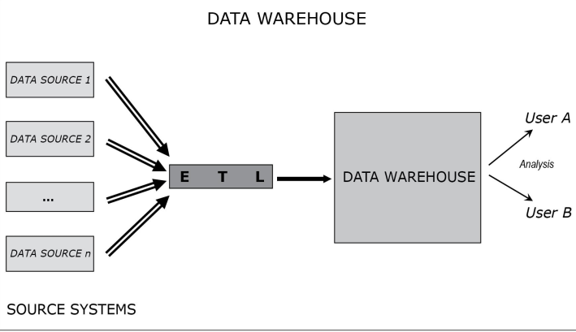
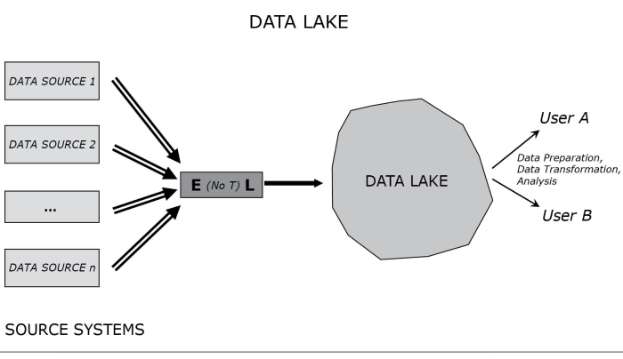
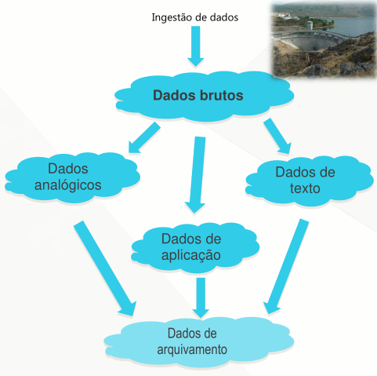

[Modelagem Informacional](index.md)

<!-- wiki:original:inicio -->

# Big Data

## Introdução

Na primeira parte do curso, nós vimos uma expansão dos conceitos de Banco de Dados, como eles eram expandidos dependendo da sua finalidade. Vimos a extensão de bancos operacionais para bancos analíticos (Data Warehouses) e sua estruturação e aqui não será diferente! Porém, antes de entender como estruturar novos dados, temos que entender os tipos de dados que vamos armazenar nessa parte do curso

Quando vamos trabalhar com conjuntos de dados, podemos categorizar eles em 3 tipos

- Bancos operacionais

- Data Warehouses

- Big Data

E é exatamente essa terceira que iremos abordar. Big Data são os conjuntos de dados em corporações que tem grande volume e diversificação, além de rápido crescimento. Não são modelados formalmente para consulta e recuperação e não são acompanhados de metadados detalhados

Ou seja, são aqueles tipos de dados que não são bem estruturados. Podemos fazer uma sub-divisão também nessa classificação:

- **Não-estruturados**: Não tem metadados detalhados, exemplo: Documentos de Texto

- **Semi-estruturados**: Possuem alguns metadados, mas não o suficiente para descrever completamente o dado num todo, exemplo: Mensagens de texto (Você tem estruturas de destinatário, remetente, horário, etc., mas o texto da mensagem em si não tem uma estruturação)

A gente pode tentar descrever Big Data com o que chamamos de V’s. Porém, essa descrição não é algo $100\%$, já que esse conteúdo e o que é ou não um dado de Big Data vai bastante do contexto e da interpretação

- **Volume**

- **Variedade** (Fontes)

- **Velocidade** (Entrada dos dados)

- **Veracidade** (Qualidade)

- **Variabilidade** (Interpretação)

- **Value**

- **Visualization** (Elaborada e complexa)

**Definição: Big Data**

Grandes volumes de conjuntos de dados diversificados e de crescimento rápido que, quando comparados com bancos operacionais ou data warehouses:

- Consideravelmente menos estruturados (Poucos ou nenhum metadado)

- No geral: $+$Volume, $+$Velocidade, $+$Variabilidade

- Mais problemas na qualidade dos dados (Veracidade)

- Maiores as gamas de interpretações (Variabilidade)

- Abordagem mais exploratória e experimental para gerar Valor

- Se beneficia mais com visualizações elaboradas e inovadoras

## MapReduce e Hadoop

Certo, mas se Big Data são dados não-estruturados, o que podemos fazer para lidar com eles? É uma selva sem lei? Na verdade não, existem algumas alternativas! É aí que entram abordagens como **MapReduce**, que se divide em duas etapas:

1.  **Map** $\rightarrow$ Mapeia cada registro em um par chave-valor

2.  **Reduce** $\rightarrow$ Reúne todos os registros com a mesma chave e gera uma única para cada chave

E o Hadoop é uma implementação OpenSource do MapReduce. O melhor meio de entender o MapReduce é com um exemplo:

**Exemplo: Contagem de Palavras**

Vamos imaginar que temos um repositório com milhares de documentos e queremos contar a quantidade de palavras de cada um, será que há um meio de agilizar esse processo? Ou eu vou ter que passar os documentos 1 por 1? Com o MapReduce, esse problema fica computacionalmente viável e eficiente!

*Figura 1. MapReduce no contexto de contagem de palavras*

Nós passamos um ou mais documentos para nosso MapReduce, então ele divide (Seja por linha, parágrafo, etc., na nossa imagem de exemplificação, está separando por linha), e cada divisão é enviada para um node (Fase Split), onde cada node está fazendo o mapeamento das palavras em pares de chave e valor independentemente (Como se cada node fosse um computador separado), então pegamos aqueles valores que possuem chaves iguais (No nosso caso, todas as contagens de cada palavra), e então fazemos o processo de combinar todas em um único par chave-valor de acordo com o contexto. No nosso caso, vamos somar todos os valores para obter todas as quantidades de repetição daquela palavra, obtendo no final, a contagem total de todas as palavras

## Data Lake

Certo, então como que deve ser o processo de tratamento de um problema envolvendo Big Data? Algo muito errado, mas comum, que acontece, é tratar o problema de Big Data como algo separado e distinto, mas ele ta incluso em todo um contexto de problema de dados, na verdade, o mesmo vale para os bancos operacionais e data warehouses! A empresa sempre deve analisar quais tipos de dados são adequados para cada conjunto de dados e fazer sua estruturação e planejamento tendo isso em mente

Certo, dito isso, uma dúvida vem na mente. Os dados operacionais tem seus bancos de dados próprios, os analíticos são extraídos dos data warehouses, e o big data, onde fica?

**Definição: Data Lake**

Grande pool de dados não-estruturados (Até o momento da consulta). Dados brutos em seu formato nativo até necessário

- Esquema sob-demanda

- Usuários devem transformar os dados antes da análise

*Figura 2. Estrutura e fluxo dos dados em um ecossistema Data Warehouse*

*Figura 3. Estrutura e fluxo dos dados em um ecossistema Data Lake*

Como falamos, Big Data não é estruturado, então não há transformação dos dados ao serem colocados no Data Lake

*Figura 4. Descrição da melhor solução de repositório de dados para seu problema baseado em características do mesmo*

## Caracterização

Após toda essa caracterização de um Data Lake, é interessante compararmos lado a lado com os bancos operacionais e data warehouses, então, a partir dos V definidos anteriormente, vamos montar tabelas de comparações para termos uma noção das diferenças entre os bancos operacionais, data warehouses e data lakes:

|  |  |  |  |
|:--:|:--:|:--:|:--:|
| **Característica** | **Bancos Operacionais** | **Data Warehouse** | **Data Lakes / Big Data** |
| **Variedade** | Baixa (Homogênea) | Moderada a Alta (Integrada) | Extremamente Alta (Heterogênea) |
| **Velocidade** | Alta (Transacional em Tempo Real/Quase Real) | Baixa (Processamento em Lotes/Agendado) | Altíssima (Streaming Contínuo e Lotes Massivos) |
| **Volume** | Baixo a Moderado | Alto (Histórico Agregado) | Massivo (Petabytes/Exabytes) |
| **Veracidade** | Mais Alta (Garantida por ACID) | Alta (Garantida por ETL/Limpeza) | Baixa a Moderada (Bruteza, Inconsistência Inerente) |
| **Valor** | Baixo (Tático e Imediato) | Alto (Estratégico, Histórico) | Altíssimo (Preditivo, Inovação, MLOps) |
| **Variabilidade** | Muito Baixa (Estável, Esquema Fixo) | Baixa (Controlada via ETL) | Alta (Inconsistente, Mudança Contínua de Estrutura) |
| **Visualização** | Simples (Detalhada, Telas de Sistema) | Direta (BI Tools, Dashboards) | Complexa (Exploratória, Requer Processamento Prévio) |

## Ferramentas para Big Data

Eu comentei um pouco antes sobre o MapReduce e sua implementação, o Hadoop, mas existem várias abordagens para processamento de grandes volumes de dados

|  |  |  |
|:--:|:--:|:--:|
| **Ferramenta** | **O que é** | **Papel no Data Lake/Big Data** |
| **Hadoop** | Um **framework** de código aberto para armazenamento e processamento distribuído. | É o **sistema operacional** do Big Data. Fornece a base para construir o Data Lake. |
| **HDFS** | **Hadoop Distributed File System** | É o **sistema de arquivos** primário do Hadoop. Permite armazenar dados brutos e massivos de forma tolerante a falhas. É o **coração do armazenamento** do Data Lake. |
| **Gremlin** | Uma linguagem de consulta (**traversal language**) para **Bancos de Dados de Grafo**. | Usado para **analisar relacionamentos complexos**. É a linguagem mais **eficiente** para consultas que “caminham” por conexões profundas. |
| **Pachyderm** | Uma plataforma de **Data Versioning** e orquestração de **pipelines**. | Garante a **reprodutibilidade e governança** no **Data Lake** e em projetos de **Machine Learning** (MLOps). |
| **Contêiner** | Tecnologia para empacotar código e todas as suas dependências (Ex: Docker, Kubernetes). | Usado para **implantar** serviços de processamento de forma **isolada, escalável e portátil** dentro de um **cluster** de **Big Data**. |
| **Splunk** | Plataforma para **coletar, indexar e analisar dados de log, métricas e eventos** gerados por máquinas. | Otimizado para **observabilidade, segurança e solução de problemas**. Excelente para dados de **alta velocidade** (logs). |
| **Hive** | Um **software** que facilita a consulta e análise de grandes conjuntos de dados armazenados no HDFS. | Fornece uma camada de **SQL** sobre o Hadoop. Permite que analistas de dados consultem o Data Lake sem escrever código MapReduce/Spark. |

## Os SGBDs

Além de ferramentas para utilizar dentro de um Data Lake, também podemos inserir os tipos de SGBDs, já que antes, vimos apenas os Transacionais (Otimizados para OLTP) e Analíticos (Otimizados para OLAP)

|  |  |  |  |
|:--:|:--:|:--:|:--:|
| **Tipo de SGBD** | **Finalidade** | **Armazenamento** | **Característica Chave** |
| **Transacional** | OLTP (**Online Transaction Processing**): Suporte a operações diárias. | Row Store (Baseado em Linhas). | Garante **ACID** e alta concorrência de escritas. |
| **Analítico** | OLAP (**Online Analytical Processing**): Consultas complexas em grandes volumes de dados históricos. | Column Store (Baseado em Colunas). | Otimizado para **leituras rápidas** e agregações em muitas linhas. |
| **Cluster** | Arquitetura que distribui dados e processamento por múltiplos servidores (nós). | Distribuído/Particionado. | Oferece **alta escalabilidade horizontal** e tolerância a falhas. |
| **Row Store** | Armazena registros completos em blocos contínuos. | Linha por Linha. | **Eficiente para inserir ou atualizar** um registro completo (transações). |
| **Column Store** | Armazena valores de uma coluna juntos em blocos contínuos. | Coluna por Coluna. | **Eficiente para analisar** poucas colunas em milhões de linhas. Permite alta **compressão**. |

## Arquiteturas

Aqui eu falei e falei sobre Data Lakes, que eles são desestruturados e muitas outras características. Então um data lake é um banco sem nenhuma estrutura e com um monte de dado jogado? Negativo. Se isso ocorre, ele pode virar um **Data Swamp**

**Definição: Data Swamp**

Um **Data Swamp** é um Data Lake que não teve uma arquitetura para lidar com os dados, seja a falta de pré-processamento, falta total de metadados, entre outras características

Então imagine um Data Swamp como um Data Lake em que não da pra fazer nada. Imagine, por exemplo, um Data Lake com vários registros bancários, porém, os arquivos não tem nome padronizado, fica IMPOSSÍVEL de, por exemplo, pegar os registros entre os anos $x$ e $y$, na verdade é praticamente impossível pegar qualquer informação, então já virou um Data Swamp.

Para evitar esse tipo de problema, surgem alguns autores com sugestões de infrestrutura para os bancos:

### Modelo Zaloni (Zonas)

A abordagem recomenda organizar o data lake em quatro zonas e uma sandbox. Em todas as zonas, os dados são rastreados, validados, catalogados, os metadados atribuídos e refinados. Esses recursos e as zonas em que ocorrem os processamentos ajudam os usuários e moderadores a entender em que estágio os dados estão e quais medidas foram aplicadas a eles até o momento. Os usuários podem acessar os dados em qualquer uma dessas zonas, desde que tenham acesso baseado em função apropriada. Ou seja, essa arquitetura foca na **limpeza e curadoria** dos dados

1.  **Zona de Landing (Landing Zone / Brutalidade)**

    - Propósito: Recebe os dados de todas as fontes em seu formato bruto (original).

    - Característica: Armazenamento temporário. Os dados não são limpos ou transformados neste estágio e medidas de segurança são aplicadas.

2.  **Zona Bruta (Raw Zone / Bronze)**

    - Propósito: Armazenamento permanente dos dados brutos e originais.

    - Característica: Os dados são imutáveis. Serve como fonte de verdade (Source of Truth) para qualquer reprocessamento futuro. Governança de Metadados (catalogação) se inicia aqui.

3.  **Zona de Curadoria (Curated Zone / Silver)**

    - Propósito: Transformação, limpeza, padronização e enriquecimento dos dados.

    - Característica: Aplicação do pré-processamento. Os dados estão prontos para análise.

4.  **Zona de Serviço (Service Zone / Gold)**

    - Propósito: Preparação final para consumo, muitas vezes com modelagem dimensional (como a de um Data Warehouse).

    - Característica: Otimizada para desempenho de consulta. Usada por ferramentas de BI e aplicações finais.

### Arquitetura Inmon (Dados)

Antes, precisamos contextualizar o cenário, Inmon dizia que em um Data Lake puro, apenas Cientistas de Dados (Profissionais escassos) conseguem extrair algum tipo de valor, o que os torna muito requisitados, até mesmo depois de contratados, por questões internas. Então que tal montar uma arquitetura em que todos conseguem gerar algum tipo de valor? Para isso, precisamos de alguns ingredientes:

- **Metadados**: Usado para decifrar os dados encontrados no Data Lake.

- **Mapa de integração**: Demonstra como os dados podem ser integrados no Data Lake. Como vencer os “silos” isolados de dados.

- **Contexto**: A capacidade de estabelecer relações entre os diversos tipos de dados depende de um contexto.

- **“Metaprocesso”**: A credibilidade dos dados depende, em parte, da capacidade de rastrear tudo o que for pertinente à geração dos dados.

Então, de acordo com esses ingredientes, temos duas categorizaçẽos dos dados:

- **Dados analógicos**: Dados de telemetria (e.g. GPS), dados gerados por máquinas. Desde log de reatores nucleares até o uso de CPU de um celular. Em geral, são dados volumosos e repetitivos. Tipicamente, apenas os outliers são alvo de interesse.

- **Dados de aplicação**: São os dados gerados a partir da execução de uma aplicação ou transação, e enviados ao Data Lake. Quando qualquer evento relevante ao negócio ocorre, o evento é medido através da aplicação e o dado é criado. Estrutura uniforme. E.g. prever separação do casal.

- **Dados textuais**: Também está ligado a aplicação, contudo não possui estrutura uniforme. Esse dado é chamado de “não-estruturado” porque pode assumir qualquer forma. Algumas ferramentas: GATE e Doccano.

e quanto a repetição

- **Dados não-repetitivos**: Não possuem um padrão específico de fácil identificação (Exemplo: Imagens)

- **Dados repetitivos**: Podem facilmente ser classificados e absorvidos a medida que são conhecidos

A partir dessas definições e categorizações, criamos os **Lagos** (**Data Ponds**), que são containers que separam os dados:

*Figura 5. Esquema vizual dos lagos*

Então podemos ver as características comuns a todas as lagoas

- **Pond descriptor**: Contém uma descrição do conteúdo recebido: frequência de atualização, descrição da origem, volume de dados, critérios de seleção, critérios de sumarização, critérios de organização e descrição dos relacionamentos entre os dados.

- **Pond target**: Trata-se do tema que irá moldar os dados para atingir objetivos de negócio, e.g. “perfil de cliente”, “registros de vendas”, “análise de click stream”. É o meio pelo qual é estabelecida a relação com o tema de negócio.

- **Pond data**: Trata do mecanismo de armazenamento do pond. É comum usar “schema-on-read”, no entanto é bom observar o trade-off: facilidade gravar vs facilidade de ler os dados.

- **Pond metadata**: Características físicas dos dados no pond. Esse metadado é dependente do meio físico nativo do dado. E.g. se o dado veio de um SGBD, muitas dessas características serão herdadas no pond, tais como, chaves e índices.

- **Pond metaprocess**: Descrição da transformação que é realizada nos dados brutos, para que tornem-se úteis aos analistas de negócio. Também pode-se descrever processos que ocorreram antes do dado chegar no pond.

- **Pond transformation criteria**: Descrição dos critérios usados no processo de transformação. No caso dos dados analógicos poderia ser: “se a temperatura do tanque for maior do que 50°C, capture o registro”, por exemplo.

------------------------------------------------------------------------

<!-- wiki:original:fim -->

## Percurso de estudo

[Trilha: A2](../../trilhas/modelagem-informacional/a2.md) · [Apresentação e contexto da fonte](../../trilhas/modelagem-informacional/a2.md#apresentacao-original)

- Próximo: [Nuvem](nuvem.md)
