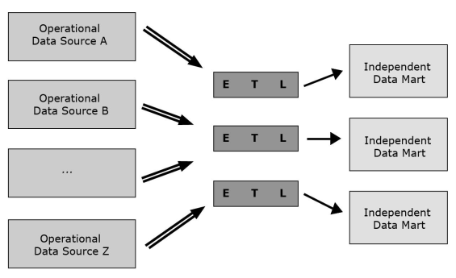
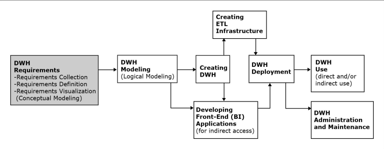
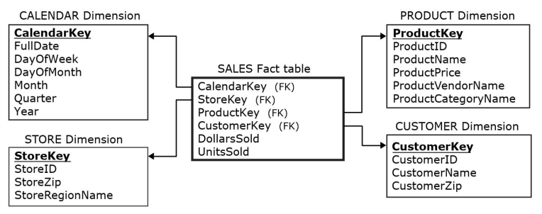
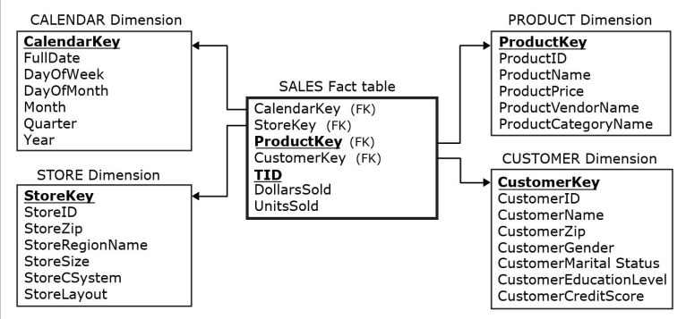
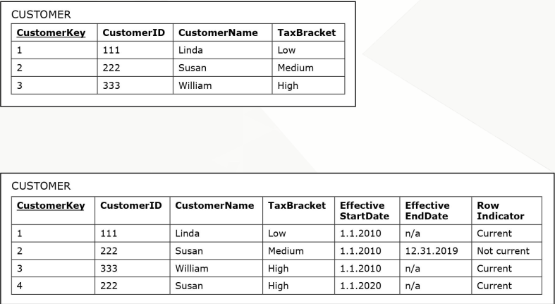
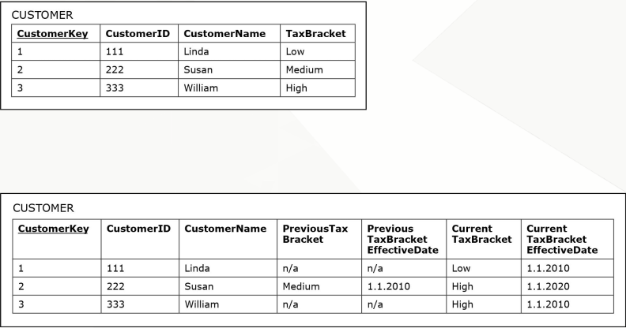
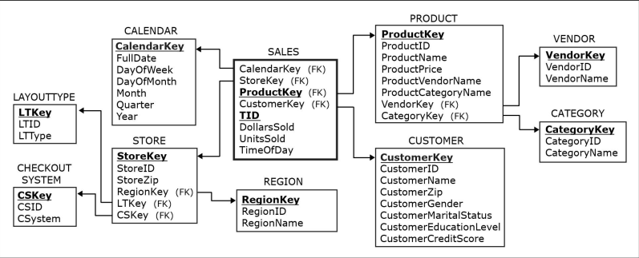

[Modelagem Informacional](../index.md)

<!-- wiki:original:inicio -->

# Data Warehouses

## Abordagens de Datawarehouses

Vimos esse meio de se criar o Data Warehouse utilizando dos modelos estrela e floco de neve, porém, existem alguns métodos para abordar os Data Warehouses de formas diferentes. Porém, quando falamos de formas diferentes, não estamos dizendo que, por exemplo, se escolhermos uma dessas formas, automaticamente não podemos usar um modelo estrela, mas são algumas abordagens extras que podemos integrar dependendo do contexto

### Data Warehouses Normalizados

Data warehouses utilizando de práticas-padrão de modelagem ER, de forma que ele mesmo serve como fonte para outros Data Warehouses que utilizam da modelagem dimensional e Data Marts dentro da empresa

*Figura 16. Data Warehouse Normalizado*

### Data Warehouse em Modelo Dimensional

Foi o que vimos na criação de Data Warehouses até esse momento, dividido em tabelas de dimensões e tabelas de fatos, onde um fato representa um acontecimento de interesse dentro do contexto do negócio e as dimensões são informações externas ao fato, mas que tem participação interna à ele

### Data Marts Independentes

É quando vários **Data Marts** são criados em instâncias e setores diferentes da empresa, todos independentes um do outro. Consequentemente, isso faz com que **vários ETL’s** sejam criados

*Figura 17. Data Marts Independentes*

Essa abordagem é considerada inferior, já que inviabiliza uma análise **direto-ao-ponto** de toda a empresa e a existência de **vários** ETL’s **não relacionados**

------------------------------------------------------------------------

## Como um Data Warehouse é estruturado?

*Figura 6. Passo-a-passo da montagem de um Data Warehouse*

### DWH Requirements

Elicitação de requisitos, definições e visualização – deve especificar as capacidades e funcionalidades desejadas do futuro DW

- Os requisitos são embasados nas necessidades analíticas que podem ser supridas pelos dados dos sistemas de origem disponíveis, tanto internos quanto externos

- A coleta de requisitos é feita através de entrevistas com vários stakeholders

- Além das entrevistas, métodos adicionais para elicitação de requisitos podem ser usados, tais como grupos focais, surveys, observações de processos existentes, etc

- A coleta de requisitos deve ser definida e escrita claramente em um documento, e então visualizada como um modelo de dados conceitual.

### DWH Modeling

Modelagem do data warehouse (modelagem lógica do DW) – criação do modelo de dados do DW que é implementável em um SGBD

- Logo após a etapa de coleta de requisitos inicia-se a modelagem do DW, de onde serão criados modelos implementáveis no SGBD escolhido.

- O Modelo de dados lógico ou modelo de dados de implementação leva em conta a lógica particular do software de gerenciamento de banco de dados escolhido.

### Creating DWH

Criação do DW – usar um SGBD para implementar o modelo de dados do DW

- Tipicamente, os data warehouses são implementados usando os mesmos SGBDs dos bancos operacionais, tais como MS SQL, Oracle,

- No entanto, existem SGBDs especializados em processar grandes volumes de dados, tais como Teradara e Vertica

### ETL Infraestructure

- Criar procedimentos e códigos para:

  - Extração automática de dados relevantes das fontes de dados operacionais

  - Transformação dos dados extraídos, de forma que a qualidade seja assegurada e a estrutura seja aderente ao modelo de DW implementado

  - A carga contínua dos dados transformados para dentro do data warehouse

- Devido à quantidade de detalhes que devem ser considerados, a criação da infraestrutura ETL costuma ser a parte que mais consome tempo e recursos do processo de desenvolvimento do data warehouse.

### Developing Front-End Applications

Desenvolvimento de aplicações front-end (BI) - projetar e criar aplicativos para uso indireto pelos usuários finais

- Os aplicativos front-end estão incluídos na maioria dos DW e são frequentemente chamados de aplicativos de inteligência de negócios (BI)

- Os aplicativos front-end contêm interfaces (como formulários e relatórios) acessíveis por meio de um mecanismo de navegação (como um menu)

### DWH Deployment

Liberar o DW e seus aplicativos front-end (BI) para uso dos usuários finais

### DWH Use

Uso do data warehouse - a leitura dos dados no data warehouse

- Uso indireto

  - Via front-end (BI) applications

- Uso direto

  - Via SGBD

  - Via OLAP (BI) tool

### SWH Administration and Maintenance

Administração e manutenção do data warehouse - realizar atividades que dão suporte ao usuário final do DW, incluindo o tratamento de questões técnicas, tais como:

- Fornecer segurança para as informações contidas no data warehouse

- Garantir espaço suficiente no disco rígido para o conteúdo do data warehouse

- Implementar os procedimentos de backup e recuperação

## Como um fato se organiza?

Uma tabela de fatos tem:

- Chaves-estrangeiras conectando a tabela de fato para as tabelas de dimensões

- As medidas relacionadas ao sujeito da análise

*Figura 8. Exemplo do Esquema Estrela nas lojas zagi*

Os principais pontos a se destacar é que, no modelo estrela, nós não colocamos o **id** do modelo relacional como a chave-primária da dimensão. Por quê? Por conta que **não há normalização**, por conta disso, podem aparecer chaves-primárias repetidas, algo que **não pode acontecer**. Então criamos as **chaves substitutas** (Surrogate keys), que são chaves que não se repetem na tabela de dimensão (Não são as mesmas chaves do modelo transacional). Porém, o mesmo não acontece na tabela de fatos, ela não possui uma surrogate key, então o que diferencia um fato dos demais?

*Figura 9. Exemplo correto do modelo dimensional das lojas zagi*

Podemos ter algumas abordagens **arbitrárias** para identificar os fatos. Por exemplo, na imagem acima, nós diferenciamos dois fatos pelo **id da transação** e pela **surrogate key** do produto, já que um produto comprado só pode estar associado a **uma única transação**. Eu também poderia identificar um fato utilizando uma **chave composta** das **chaves-estrangeiras** das dimensões (Tem alguns problemas e questionamentos para esse exemplo em específico, mas vamos supor que não precisa de alterações a mais)

## Detalhamento de Fatos

Antes disso, precisamos entender melhor sobre a **granularidade** da tabela. A granularidade e refere a o que uma única linha de uma tabela se refere. Tabelas de fato com um refinamento alto de granularidade expressam um único fato, enquanto tabelas com granularidade maior expressam, em suma, um conjunto de fatos agrupado. Por conta desse detalhamento v.s agrupamento, ambas possuem suas vantagens e desvantagens

Com base na granularidade da tabela, podemos classificá-la em duas:

- **Line-item detailed fact table**: Cada linha representa uma linha de item de uma transação em particular

- **Transaction-level detailed fact table**: Cada linha representa uma transação em particular

Um exemplo fica melhor de compreender

**Exemplo**

Vamos imaginar que temos um negócio de aluguel de carro, e que nós alugamos o carro de forma que o nosso cliente pode escolher alguns acessórios a mais (Por exemplo, ele vai pagar $R\$ 40,00$ adicionais para colocar uma cadeirinha de bebê). Como cada transação pode ter características diferentes, faz sentido que cada fato de transação tenha uma especificação dizendo os itens específicos que foram juntos, então teríamos uma **line-item detailed fact table**.

Mas vamos supor que você não da essa opção aos clientes, e eles tenham que escolher baseado em categorias (Por exemplo, a categoria A é mais barata, não tem ar-condicionado, não tem gps, entre outras coisas e eu tenho outras categorias também), então não faz muito sentido adicionar **na tabela fatos** todas as coisas inclusas nas categorias, e sim adicionar isso na **dimensão** do fato, já que não é algo que varia de fato para fato. Nesse caso, teríamos uma **transaction-level detailed fact table**

## Dimensões Lentamente Alteráveis

Normalmente as dimensões não conseguem mudar, porém, alguns casos elas podem. Por exemplo, o preço de um produto pode variar. O que fazemos nesses casos? Essas dimensões são chamadas de **dimensões lentamente alteráveis**. Então vamos temos 3 abordagens diferentes:

### Tipo 1

Eu vou mudar o valor na própria tabela de dimensão, ou seja, o novo valor substitui o antigo. Não preserva uma história dessa dimensão

*Figura 12. Exemplo onde o Imposto de Susan é alterado para **Alto***

### Tipo 2

Cria uma nova entrada na dimensão usando uma nova **surrogate key** toda vez que o valor muda. Usado em casos que eu quero preservar a história do meu sistema. Porém eu preciso de um método para indicar qual entrada está **vigente**, então utilizamos atributos como **timestamps**

*Figura 13. Exemplo criando uma nova linha de Susan. Dependendo da situação que você se encontra, pode ser plausível **não utilizar** colunas de identificação temporal*

### Tipo 3

Agora adicionamos uma nova coluna de “anterior” e de “atual” para cada coluna que pode ser alterada. Aplicável quando há uma quantidade limitada de alterações possíveis em uma coluna (Por exemplo, se eu tenho uma única coluna de “anterior” e uma única coluna de “novo”, então sempre que eu atualizo a minha dimensão, eu eu vou perder a informação anterior à anterior da que eu atualizei agora, ou seja, se eu tinha que `anterior=1` e `atual=2` e eu atualizo novamente, então vou obter `anterior=2` e `atual=3`, de forma que eu perco o $1$)

*Figura 14. Exemplo registrando apenas duas mudanças. Dependendo da situação, você também pode **não fazer** colunas de **identificação temporal***

## Galáxia de Estrelas

É um modelo que contém **vários fatos** que compartilham **dimensões** entre si

*Figura 10. Modelo ZAGI adaptado*

*Figura 11. Galáxia ZAGI*

## Modelo Dimensional

Vimos na disciplina de banco de dados sobre **modelos relacionais**, porém, estudiosos, posteriormente, perceberam que esse modelo é ineficiente para **análise de dados**, então foram criados modelos diferentes para a criação desses bancos. Então como podemos fazer?

- **Kimbal**: Star Schema (Mais utilizado)

- **Inmon**: Floco de neve

O método do **Kimbal** é o mais utilizado na prática, pois ele é uma versão não-normalizada do **Inmon**, já que, em um Data Warehouse, a normalização aparenta ser desnecessária, já que todas as entradas são apenas de leitura

Antes nós montávamos como **entidade** e **relacionamentos**, agora, nossos elementos são:

- **Dimensões**

- **Fatos**

**Exemplo**

Dentro da nossa loja, queremos criar um dashboard para gerenciar e entender as devoluções dos produtos feitos. De um modo bem simples, vamos ter o fato **Devolução**, ela ocorreu e pronto, mas o que ela engloba que não está necessariamente dentro do fato da devolução? Temos o produto, temos o calendário (Quando a devolução foi feita) e tem o motivo da devolução (Tem mais coisas, mas vamos simplificar por aqui). A primeira vista, essas coisas estão dentro da devolução, correto? Mas se pararmos para pensar, vários produtos podem ser devolvidos de maneiras independentes, assim como nem toda devolução tem um motivo diferente

**Definição: Tabela de Dimensões**

Contém descrições de negócios, organização, ou empresas no qual o sujeito da análise pertence. As colunas na tabela dimensional costumam ter informações descritivas, como textos (e.g, `product_color`, `product_description`, `client_name`). Essas informações providenciam uma base para a análise do sujeito

**Definição: Tabelas de Fatos**

Contém medidas relacionadas ao sujeito da análise e chaves-estrangeiras que ligam os fatos às tabelas de dimensões. As medidas na tabela de fatos costumam ser numéricas com intenção de análises computacionais e matemáticas

## Modelo Floco de Neve (Snowflake)

Como dito anteriormente, a grande diferença dele pro anterior (Modelo estrela) é a presença de **normalização**, já que é muito defendido que normalização não é algo muito necesário para análise de dados

*Figura 15. Exemplo do Modelo Floco de Neve*

## O que é?

Antes de adentrar no conceito de um Data Warehouse, vamos ter algumas definições antes

**Definição: Dado Operacional**

Informações com pouco tempo de vida, utilizados essencialmente para o dia a dia e funcionamento do sistema, tem alta frequência e vão se atualizando conforme o tempo passa. Usado por diversos funcionários em setores diferentes e é orientado à aplicação

**Definição: Dado Analítico**

Informações duradouras, que não se atualizam frequentemente e nem tem alta frequência de acesso. Redundância não é um problema, utilizado por um grupo ninchado de pessoas. Orientado ao assunto/contexto

A definição pode não ser muito clara, mas podemos imaginar um comparativo. Pense nos dados operacionais como um registro de diário, enquanto os dados analíticos são um livro de história. Os dados operacionais são frequentes, e não representam uma importância a longo prazo, por exemplo, o preço de um produto que está sendo passado no caixa, enquanto os dados analíticos representam um marco da empresa, como por exemplo, o lucro total da empresa na semana $x$.

Vamos também definir melhor:

**Definição: Orientado à Aplicação/Application Oriented**

Dados projetados para suportar processos do dia a dia da organização. Estrutura de dados otimizada para inserções, atualizações e consultas rápidas de informações atuais com foco em transações (OLTP – Online Transaction Processing).

**Exemplo**

Sistema bancário para processar depósitos/saques, sistema hospitalar para registrar consultas.

**Definição: Orientado ao Assunto/Subject Oriented**

Dados projetados para analisar informações de um assunto de negócio específico (clientes, vendas, faturamento, estoque, etc.). Dados integrados e organizados de forma a responder perguntas estratégicas. Foco em análise histórica e tendências (OLAP – Online Analytical Processing). Normalmente são read-only (só leitura, não ficam sendo atualizados a todo instante).

**Exemplo**

DW que reúne anos de dados de vendas para gerar relatórios, dashboards ou prever demanda.

Imagine que você está fazendo o sistema, você sabe que seus dados precisam ser bem estruturados, o foco do seu sistema é ser duradouro e bem manutenível além de promover uma segurança boa, então seus dados vão ser **application-oriented**, de forma que você faz questão de deixar tudo muito bem-estruturado e separado. Porém imagine que o foco do seu sistema é responder perguntas de negócio de forma rápida e eficiente, por exemplo: “Quanto minha empresa faturou nos últimos 3 meses?”, dificilmente você vai se importar que as informações do banco que você está consultando estejam todas na norma 3, ou separadas direitinho com as chaves-estrangeiras bem definidas e organizadas, o importante é você responder a pergunta de forma rápida e eficiente, então você vai estruturar esse banco de forma a atingir esse objetivo, então seus dados são **subject-oriented**

Com isso em mente, agora podemos entender o que são Data Warehouses

**Definição: Data Warehouse**

Um Data Warehouse é um **repositório estruturado** de dados **integrados**, **orientados ao assunto**, **com informações sobre toda a empresa**, **históricos** e **variantes com o tempo**. O propósito de um Data Warehouse é a extração de **dados analíticos**. Pode armazenar dados detalhados e/ou resumidos

De forma resumida, um Data Warehouse também é um banco de dados, porém, estruturado e com um objetivo totalmente diferente dos bancos convencionais que estudamos na disciplina de **banco de dados**. Mas o que compõe um Data Warehouse? No núcleo, ele em si é apenas esse banco de dados diferenciado, porém, como funciona o sistema? Como é estruturado um projeto/sistema em que um Data Warehouse é incluído?

*Figura 5. Ecossistema Data Warehouse*

Todas as definições abaixo são referentes a elementos apresentados na imagem como componentes de um ecossistema de Data Warehouse

**Definição: Sistemas de Origem**

Sob o contexto de DW, os sistemas de origem são bases de dados operacionais e outros repositórios de dados (qualquer conjunto de dados usado para proposta operacional) que provê informação analítica útil para assuntos de análise. Cada unidade de armazenamento de dados operacionais que é usada como sistema de origem tem duas finalidades:

- A própria finalidade operacional

- Ser a fonte do DW

Sistemas de origem podem incluir fontes internas e externas

**Definição: Infraestrutura de ETL**

Facilita a leitura dos dados dos sistemas de origem para o Data Warehouse. O ETL (Extract, Transform, Load) tem as seguintes tarefas:

- Extrair dados analiticamente úteis das origens operacionais

- Transformar tais dados de forma aderente a estrutura de “orientação-ao-assunto” do modelo do DW (ao mesmo tempo que assegura a qualidade dessa transformação)

- Carregar os dados transformados e com qualidade assegurada para o destino “target” data warehouse

**Definição: Data Warehouse**

As vezes referenciado como “target system”. Um DW típico lê as informações analiticamente úteis dos sistemas de origem de forma periódica ou contínua ,provendo sempre dados atualizados para análise

**Definição: Aplicações Front-end**

De forma similar aos bancos operacionais, as aplicações “front-end” permitem o acesso indireto dos usuários aos dados

Como vimos, um data warehouse tem informações sobre **toda** uma empresa, podendo gerar análises sobre todos os seus departamentos. Mas e se isso for um comportamento indesejado? Eu quero ter uma análise detalhada, mas focar apenas no meu departamento e evitar que os outros vejam informações que não deveriam ou informações que possam atrapalhar nas suas análises, então aí entram os Data Marts

**Definição: Data Mart**

Os Data Marts Seguem os mesmos princípios de um DW ,mas possuem um escopo mais limitado, geralmente ligado a um uso mais departamental, e não de forma abrangente à empresa conforme um DW.

- **Data Mart independente**: Lobo solitário, criado como se fosse um DW. Um DM independente tem os próprios sistemas de origem e infraestrutura de ETL

- **Data Mart dependente**: Não possui os próprios sistemas de origem. Os dados são lidos de um DW

## Star Schema

*Figura 7. Exemplo de estruturação em **Esquema Estrela***

Os **Fact Measures** são informações dentro do fato que **não se aplicam em nenhuma dimensão**

**Exemplo**

Queremos criar o fato **venda**, ele engloba as dimensões de **produto**, **cliente**, **loja**, **calendário** e **vendedor**. Porém, não faz sentido, por exemplo, colocar a quantidade de produtos comprados em **nenhuma dimensão**, ou o **valor total da compra**, de forma que essas informações são localizadas única e exclusivamente no fato

Vale ressaltar que, dado a dimensão $i$, a sua chave-primária **não é a mesma chave-primária do modelo relacional**, pois a repetição dos registros pode ocorrer sem problema nenhum. Como aplicar chaves-primária nas dimensões e nos fatos será visto posteriormente

<!-- wiki:original:fim -->

## Percurso de estudo

[Trilha: A1](../../../trilhas/modelagem-informacional/a1.md) · [Apresentação e contexto da fonte](../../../trilhas/modelagem-informacional/a1.md#apresentacao-original)

- Anterior: [Modelagem Informacional de Requisitos (MIR)](../modelagem-informacional-de-requisitos-mir/index.md)
- Próximo: [Como um fato se organiza?](#como-um-fato-se-organiza)
