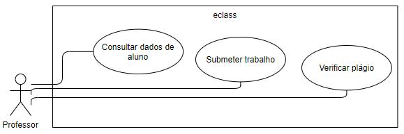
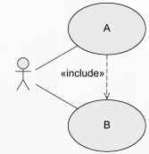
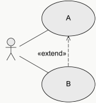
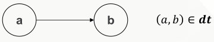
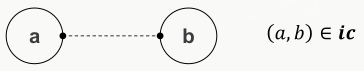
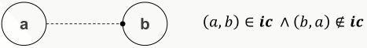
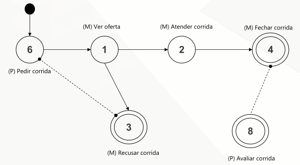

[Modelagem Informacional](index.md)

<!-- wiki:original:inicio -->

# Modelagem Informacional de Requisitos (MIR)

------------------------------------------------------------------------

Muitos (incluindo eu) entraram na matéria sem ter uma noção bem do que ela se tratava (Eu perdi as primeiras aulas, então ficou ainda pior). Mas saímos da matéria de Banco de Dados, ainda mexemos com eles, mas antes, estudávamos como eles eram armazenados, o que era necessário para se ter um local estruturado para seu armazenamento. Agora, vamos estudar como eles são usados, como podemos utilizar eles de forma eficiente a responder nossas dúvidas e ser utilizados em sistemas que iremos desenvolver.

Quando estamos montando um sistema, estamos interessados, principalmente em aplicações complexas, em saber exatamente o fluxo de informações. Quando o meu usuário fizer uma ação X no meu sistema, que informações eu preciso enviar para ele? Que informações ele vai me mandar? E para onde essas informações vão? Pensando nisso, foi criado o **Diagrama de Uso**

**Definição: Diagrama de Uso**

Um diagrama de uso descreve as expectativas do público-alvo do meu projeto e clarifica o processo de identificação de requisitos. Pode responder as perguntas:

- O que está sendo descrito? Que sistema está sendo modelado?

- Quem interage com meu sistema?

- O que os **atores**(papéis) podem fazer?

**Exemplo**

*Figura 1. Exemplo de Diagrama de Uso*

**Definição: Ator**

Elementos fora do sistema que tem alguma importância no ecossistema do projeto

**Definição: Caso de Uso**

Descrevem as funcionalidades esperadas de um sistema em desenvolvimento. Descrevem as expectativas da parte interessada no sistema.

Um ator interage com um caso de uso quando:

- Utilizam dos **casos**

- São utilizados pelos **casos**

Também podemos classificar os meus **atores**:

- **Humano**

- **Não-humano**

- **Primário**

  - Principal beneficiado da execução do **caso de uso**

- **Secundário**

  - Não recebe benefícios diretos

- **Ativo**

  - Inicia diretamente o **caso de uso**

- **Passivo**

  - Propicia funcionalidades para a execução do **caso de uso**

Podemos também classificar as formas de como os atores se relacionam com os casos de uso

*Figura 2. Necessita que **(B)** seja executado antes de **(A)***

*Figura 3. **(A)** pode executar sozinho e decide se **(B)** vai executar ou não, sendo **(B)** uma extensão (das funcionalidades) do caso **(A)***

Assim, conseguimos montar uma pequena estruturação para os Casos de Uso

- **Nome**

- **Descrição**

- **Pre-condições**: Pré-requisitos para que o caso de uso funcione corretamenteo

- **Pós-condições**: Estado esperado do sistema após a execução do caso de uso

- **Situações de erro**: Erros relevantes

- **Estado do sistema na decorrência de um erro**

- **Atores que comunicam com o caso de uso**

- **Gatilho de acionamento**: Eventos que executam o caso de uso

- **Processo Principal**

- **Processos Alternativos**: Possiveis desvios do processo principal

**Definição: Informação**

Dado interpretado segundo um contexto

**Definição: Processo**

Conjunto de atividades logicamente organizadas e condicionais, cuja execução visa alcançar um objetivo determinado

**Definição: Comportamento**

Trajetória percorrida por um processo. Todo efeito observável no ambiente externo do processo

Porém esse esquema de modelagem tem alguns pontos negativos e limitações:

- Ênfase excessiva no detalhamento do comportamento sistêmico

- Falta de regra objetiva para orientar os níveis de abstração

- Insuficiente detalhamento da informação que flui entre o sistema e o ambiente

Surge então o MIR para que possa consertar esses problemas, surgindo como uma especialização do Diagrama de Uso. Essa solução leva alguns princípios em consideração

- Focar nos objetivos

- Atribuir níveis de abstração aos objetivos

- Focar no detalhamento da informação

**Definição: Objetivo Informacional**

Objetivos dos atores que geram eventos externos que exigem **intervenção atômica** do sistema com trocas de informação capazes de mudar o estado do ambiente, do sistema ou de ambos

**Definição: Intervenção Atômica**

Se processa sem interrupções ou temporizadores. Uma vez concluída, coloca o sistema em estado de espera para o próximo evento

Então montamos uma tabelinha de forma que cada coluna representa um ator e cada linha um objetivo informacional associado ao ator

**Exemplo: MOBI Taxi**

A cooperativa MOBITAXI deseja construir um aplicativo de celular para atender seus passageiros. Todos os motoristas e clientes precisam estar cadastrados com nome, número de telefone e endereço. O passageiro pode chamar o táxi de qualquer local dentro do estado do Rio de Janeiro. A posição (GPS) do celular do cliente indicará o local aonde o motorista deverá buscá-lo. Para evitar concorrência predatória entre os colegas taxistas e diminuir o tempo de espera do cliente, o sistema deverá escolher e direcionar a corrida ao motorista mais próximo. Ao final da corrida, o valor será debitado do cartão de crédito do cliente e creditado na conta do motorista. Sabe-se de 1% de todas as corridas são da administração. O cliente ainda poderá avaliar a corrida pontuando-a entre 0-5, além de escrever um comentário. A administração da cooperativa poderá “solicitar” a saída de motoristas mal avaliados

Estes são os requisitos do meu sistema (Banco de Dados):

1.Manter cadastro de motoristas e colaboradores (nome, celular e endereço), um motorista pode possuir mais de um veículo, assim como pode emprestá-lo;

2.Manter cadastro de veículos (marca, modelo, ano, placa), um veículo pode ser conduzido por mais de um motorista;

3.Manter cadastro de clientes (nome, celular e endereço), um cliente pode possuir mais de um endereço;

4.Manter cadastro de viagens feitas pelo cliente, que só pode avaliar um motorista por corrida;

5.Manter registro de créditos da cooperativa, considerando que 1% dos créditos sustentam a administração;

6.A administração da MOBITAXI pode fazer uma avaliação dos motoristas a partir da \#viagens realizadas e da pontuação dada pelos clientes. Além de poder acessar os contadores básicos: \#motoristas, \#clientes, e \#viagens por mês

Agora que temos toda a contextualização, podemos fazer a minha tabela

| **Motorista** | **Passageiro** | **Administração** |
|----|----|----|
| \(1\) Ver oferta de corrida | \(6\) Pedir corrida | \(10\) Cadastrar Motorista |
| \(2\) Atender corrida | \(7\) Cancelar corrida | \(11\) Cadastrar Admin |
| \(3\) Recusar corrida | \(8\) Avaliar corrida | \(12\) Cadastrar Veículo |
| \(4\) Fechar corrida | \(9\) Atualizar cadastro | \(13\) Avaliar Motorista |
| \(5\) Atualizar cadastro |  | \(14\) Administrar Caixa |

Com todos os meus objetivos informacionais bem-definidos, eu vou agora especificá-los ainda mais através da criação de uma interface informacional para **cada um deles**

**Definição: Interface Informacional**

Define os fluxos de informação que entram e saem durante o processamento do objetivo pelo sistema e divide em duas etapas:

1.  Especificação dos fluxos

    - Explicito detalhadamente as informações que fluem no objetivo, seja elas sendo recebidas por ele ou sendo enviadas para outro objetivo

2.  Dicionários de itens elementares

    - Detalha as propriedades das informações que estão circulando no objetivo especificado

**Exemplo: MOBI Taxi**

Ainda utilizando da tabela que montamos anteriormente, vamos fazer as interfaces informacionais dos objetivos (1) e (2).

**Ator: Motorista \| Objetivo 1: Ver oferta de Corrida**

$\leftarrow$ **`oferta_corrida = id_cliente + nome_cliente + avaliação_cliente + ponto_partida_gps + dt_hr_pedido`**

- Descrição: Informações de um passageiro pedindo uma corrida.

- Propósito: Dar ao motorista a opção de aceitar ou não a corrida.

- Frequência: 100/dia

**Ator: Motorista \| Objetivo 2: Atender Corrida**

$\rightarrow$ **`aceite_corrida = id_motorista + nome_motorista + localização_gps + dt_hr_aceite`**

- Descrição: Uma vez que o motorista aceitou a corrida, o tempo começa a contar até chegar ao passageiro e nenhum outro motorista pode pegar a mesma corrida.

- Propósito: Informar ao sistema a posição, as informações do motorista e a previsão de chegada ao passageiro.

- Frequência: 100/dia

A seta $\rightarrow$ apontando para dentro do texto significa que a informação está sendo **enviada para o sistema**, enquanto a seta $\leftarrow$ apontando para fora do texto quer dizer que a informação está sendo **recebida** pelo ator. Com as interfaces criadas, podemos agora fazer os dicionários elementares de cada interface. Farei apenas da interface informacional (1)

**Ator: Motorista \| Objetivo 1: Ver Oferta de Corrida**

| **Nome** | **Descrição** | **Tipo** | **Domínio** |
|----|----|----|----|
| `Id_cliente` | Id do cliente | `Num. Sequencial natural` | Gerado automaticamente |
| `Nome_cliente` | Nome do cliente | `Str` |  |
| `Avaliação_cliente` | Média de avaliação do cliente por outros motoristas | `Num. Natural` | $\left\{ 1..5 \right\}$ |
| `Ponto_partida_gps` | Posição geográfica (Lat/Long) do passageiro pedindo corrida | `Float` | Coordenadas WGS 84 |
| `Dt_hr_pedido` | Data e hora em que o passageiro fez o pedido | `Timestamp` |  |

E para finalizar, temos os objetivos organizacionais

**Definição: Objetivo Organizacional**

Uma sequência admissível de objetivos informacionais, representando uma linha de trabalho/objetivo de negócio relevante no domínio da aplicação para um ou mais atores

**Definição**

Sequências admissíveis de objetivos informacionais:

 Sequência de Objetivos Informacionais em relação de dependência temporal (**dt**). Isso significa que o objetivo **b** só poderá ser executando quando **a** terminar de executar

 Sequencia de objetivos informacionais em relação de incompatibilidade (**ic**). Isso significa que o evento **a** não ocorre se **b** ocorrer e vice-versa

 Sequencia de objetivos informacionais em relação de incompatibilidade **ic** em apenas um sentido. Isso significa que, se **a** acontecer, **b** não pode ocorrer, porém o contrário não vale

**Exemplo: MOBI Taxi**

**Atender Passageiro**

*Figura 4. Exemplo de Objetivo Organizacional*

- \(6\) $\rightarrow$ (1): O motorista só pode ver a oferta após o passageiro pedir a corrida

- \(6\) o—o (1): Não é possível recusar uma corrida sem que ela seja feita e um motorista não consegue recusar a corrida diretamente sem sequer a vê-la

- \(8\) —o (4): Não posso avaliar uma corrida que ainda não foi concluída, porém, mas o motorista pode fechar corridas independentemente do passageiro avaliá-la ou não

------------------------------------------------------------------------

<!-- wiki:original:fim -->

## Percurso de estudo

[Trilha: A1](../../trilhas/modelagem-informacional/a1.md) · [Apresentação e contexto da fonte](../../trilhas/modelagem-informacional/a1.md#apresentacao-original)

- Próximo: [Data Warehouses](data-warehouses.md)
