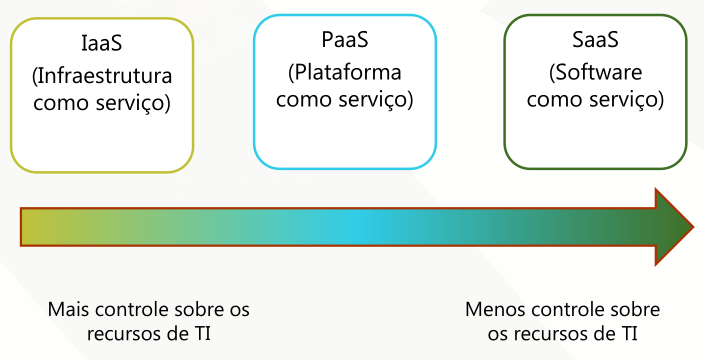

[Modelagem Informacional](index.md)

<!-- wiki:original:inicio -->

# Nuvem

## Os 5 pilares

Conforme o NIST (National Institute of Standards and Technology):

- **Self-Service On-Demand (Autoatendimento sob Demanda)**: O consumidor pode provisionar unilateralmente recursos de computação (como tempo de servidor e armazenamento) automaticamente, sem intervenção humana do provedor de serviços.

- **Broad Network Access (Acesso Amplo à Rede)**: Os recursos estão disponíveis em toda a rede (internet) e podem ser acessados por mecanismos padrão usando diversas plataformas (laptops, celulares, etc.).

- **Resource Pooling (Agrupamento de Recursos)**: Os recursos de computação são agrupados (o pool compartilhado) para atender a múltiplos consumidores usando um modelo multi-tenant (multilocatário). Os recursos são dinamicamente atribuídos e reatribuídos conforme a demanda.

- **Rapid Elasticity (Elasticidade Rápida)**: A capacidade de provisionamento de recursos pode ser rapidamente e elasticamente liberada e expandida, muitas vezes automaticamente, para corresponder à demanda. Para o consumidor, os recursos parecem ilimitados.

- **Measured Service (Serviço Medido)**: Os sistemas de nuvem controlam e otimizam o uso de recursos através de medição (monitoramento) em algum nível de abstração. Isso permite a transparência para o provedor e para o consumidor, possibilitando o modelo de pagamento pelo uso (pay-as-you-go).

## Modelos de Serviço

Estes definem o que o provedor gerencia e o que o consumidor é responsável por gerenciar (conforme detalhado no resumo anterior, mas reforçando o slide):

- **IaaS (Infrastructure as a Service)**: Você gerencia o SO, aplicações e dados. A nuvem fornece a infraestrutura (servidores, redes).

- **PaaS (Platform as a Service)**: Você gerencia apenas as aplicações e dados. A nuvem fornece a plataforma completa (runtime, SO, middleware).

- **SaaS (Software as a Service)**: Você apenas usa a aplicação. A nuvem gerencia tudo

*Figura 6. Modelos de serviços conforme o acesso do usuárioaos recursos de TI*

## Modelos de Implantação

Estes definem onde e como a infraestrutura de nuvem está hospedada:

- **Nuvem Pública**: A infraestrutura de nuvem é para uso aberto e geral pelo público. É de propriedade, gerenciamento e operação de uma organização vendedora de serviços de nuvem.

- **Nuvem Privada**: A infraestrutura de nuvem é operada exclusivamente para uma única organização. Pode ser gerenciada pela própria organização ou por terceiros e pode existir on-premise (na própria empresa) ou fora dela.

- **Nuvem Híbrida**: É uma composição de duas ou mais nuvens (privada, pública, ou comunitária) que permanecem entidades únicas, mas são interligadas por tecnologia padronizada ou proprietária que permite a portabilidade de dados e aplicações.

- **Nuvem Comunitária**: A infraestrutura de nuvem é compartilhada por várias organizações com interesses comuns (ex: um consórcio universitário, agências governamentais).

**Exemplo: Experiência positiva com nuvem pública**

Você cria um MVP e verifica rapidamente se a sua ideia funciona ou não. Rapidamente você monta um ambiente na nuvem e valida a sua ideia

**Exemplo: Experiência negativa com nuvem pública**

Você não faz uma previsão de custos aderente ao seu MVP ou a sua necessidade. Você também esquece de monitorar os custos. Rapidamente você pode ser surpreendido com um custo exorbitante e não previsto. Algo que não ocorreria num ambiente on-premise

## Visão Geral e Infraestrutura Global da AWS

A infraestrutura global da AWS foi projetada para oferecer um ambiente de computação em nuvem **flexível, confiável, escalável e seguro**, com desempenho de rede global de alta qualidade.

### Componentes da Infraestrutura

A infraestrutura é organizada nos seguintes níveis geográficos e técnicos:

1.  **Regiões da AWS (Regions):**

    - Áreas geográficas distintas que fornecem redundância total.

    - Cada Região contém duas ou mais **Zonas de Disponibilidade (AZs)**.

    - **Fatores de seleção:** Governança de dados/requisitos legais, proximidade com clientes (baixa latência), serviços disponíveis e custos.

2.  **Zonas de Disponibilidade (AZs):**

    - Partições totalmente isoladas da infraestrutura, projetadas para isolamento de falhas.

    - Consistem em **Datacenters** distintos e são interconectadas por redes privadas de alta velocidade.

    - A AWS recomenda a replicação de dados e recursos entre AZs para garantir resiliência.

3.  **Datacenters:**

    - Instalações físicas onde os dados residem e o processamento ocorre (50.000 a 80.000 servidores).

    - Projetados para segurança, com energia, redes e conectividade redundantes.

4.  **Pontos de Presença (PoPs):**

    - A rede global inclui **187 Pontos de Presença** (incluindo caches regionais).

    - Usados com o **Amazon CloudFront** (CDN) para armazenar conteúdo em cache próximo aos usuários, melhorando a performance e reduzindo a latência.

### 1.2 Recursos da Infraestrutura

A arquitetura da AWS incorpora características essenciais:

- **Elasticidade e Escalabilidade**: Permitem a adaptação dinâmica da capacidade.

- **Tolerância a Falhas**: Continua funcionando corretamente na presença de falha devido à redundância.

- **Alta Disponibilidade**: Garante alto desempenho operacional com tempo de inatividade mínimo.

## 2. Categorias e Serviços Fundamentais da AWS

Os serviços da AWS são agrupados em categorias principais.

|  |  |
|:--:|:--:|
| **Categoria Principal** | **Serviços Fundamentais (Exemplos)** |
| Computação | Amazon EC2, AWS Lambda, Amazon ECS/EKS/Fargate, AWS Elastic Beanstalk |
| Armazenamento | Amazon S3, Amazon EBS, Amazon EFS, Amazon S3 Glacier |
| Bancos de Dados | Amazon RDS, Amazon Aurora, Amazon DynamoDB, Amazon Redshift |
| Redes e Entrega de Conteúdo | Amazon VPC, Elastic Load Balancing, AWS Direct Connect, Amazon CloudFront, Amazon Route 53 |
| Segurança, Identidade e Conformidade | AWS IAM, AWS KMS, AWS Shield, Amazon Cognito |
| Gerenciamento e Governança | AWS Management Console, Amazon CloudWatch, AWS Trusted Advisor, AWS Config |

### 2.1 Detalhamento dos Serviços Principais

|  |  |  |
|:--:|:--:|:--:|
| **Serviço** | **Conceito** | **Funcionalidade Principal** |
| Amazon EC2 | **IaaS (Computação em Nuvem)** | Instâncias de máquinas virtuais configuráveis para executar aplicações com controle total do sistema operacional e infraestrutura. |
| AWS Lambda | **Computação Sem Servidor (FaaS)** | Executa funções acionadas por eventos, sem necessidade de provisionar servidores. Pagamento apenas pelo tempo de execução. |
| Amazon ECS | **Orquestração de Contêineres** | Gerencia contêineres Docker em clusters altamente escaláveis e integrados com outros serviços da AWS. |
| Amazon EKS | **Kubernetes Gerenciado** | Executa e gerencia clusters Kubernetes com alta disponibilidade, segurança e integração nativa com AWS. |
| AWS Fargate | **Execução Serverless para Contêineres** | Permite rodar contêineres sem gerenciar servidores ou clusters. O usuário define apenas recursos de CPU e memória. |
| AWS Elastic Beanstalk | **PaaS (Plataforma Gerenciada)** | Implanta e gerencia automaticamente aplicações (EC2, ELB, autoscaling) sem necessidade de configurar infraestrutura manualmente. |
| Amazon S3 | **Armazenamento de Objetos** | Armazenamento durável e escalável para qualquer tipo de dado, com 99.999999999% de durabilidade. |
| Amazon EBS | **Armazenamento em Bloco** | Volumes persistentes anexáveis a instâncias EC2, com suporte a snapshots, alta performance e criptografia. |
| Amazon EFS | **Sistema de Arquivos NFS Gerenciado** | Sistema de arquivos elástico e distribuído, acessado simultaneamente por múltiplas instâncias EC2. |
| Amazon S3 Glacier | **Arquivamento de Baixo Custo** | Armazenamento extremamente barato para dados acessados raramente, com tempos de recuperação variáveis. |
| Amazon RDS | **Banco de Dados Relacional Gerenciado** | Automatiza backup, patching, escalabilidade e manutenção para SGBDs como MySQL, PostgreSQL, MariaDB, Oracle e SQL Server. |
| Amazon Aurora | **Banco Relacional de Alta Performance** | Compatível com MySQL e PostgreSQL, com performance superior e replicação distribuída. |
| Amazon DynamoDB | **Banco NoSQL (Chave-Valor e Documento)** | Banco de baixa latência, totalmente gerenciado e escalável automaticamente. |
| Amazon Redshift | **Data Warehouse** | Armazena e analisa dados em larga escala com processamento analítico massivamente paralelo (MPP). |
| Amazon VPC | **Rede Virtual Isolada** | Permite criar redes privadas dentro da AWS, com controle de sub-redes, rotas, segurança e IPs. |
| Elastic Load Balancing (ELB) | **Balanceamento de Carga** | Distribui tráfego automaticamente entre múltiplas instâncias e zonas de disponibilidade. |
| AWS Direct Connect | **Conexão Dedicada** | Cria uma conexão privada entre o data center do cliente e a AWS, reduzindo latência e aumentando segurança. |
| Amazon CloudFront | **CDN (Content Delivery Network)** | Entrega conteúdo globalmente com baixa latência e alta velocidade através de edge locations. |
| Amazon Route 53 | **DNS Gerenciado** | Serviço de registro, roteamento e verificação de saúde de domínios altamente disponível e escalável. |
| AWS IAM | **Gerenciamento de Identidade e Acessos** | Define permissões e autenticação para usuários, grupos, funções e serviços. |
| AWS KMS | **Gerenciamento de Chaves Criptográficas** | Cria e controla chaves de criptografia para proteger dados em repouso e em trânsito. |
| AWS Shield | **Proteção DDoS** | Protege aplicações contra ataques DDoS automaticamente, com camadas Standard e Advanced. |
| Amazon Cognito | **Gerenciamento de Autenticação de Usuários** | Cria autenticação e gerenciamento de usuários para apps web e mobile (sign-up, sign-in, MFA). |
| AWS Management Console | **Interface de Gerenciamento** | Console web para gerenciar todos os recursos da AWS de forma centralizada. |
| Amazon CloudWatch | **Monitoramento e Observabilidade** | Coleta métricas, logs e eventos para monitoramento de recursos e aplicações. |
| AWS Trusted Advisor | **Otimização de Recursos** | Analisa a conta e recomenda melhorias de custo, segurança, performance e tolerância a falhas. |
| AWS Config | **Governança e Conformidade** | Monitora configurações dos recursos e avalia conformidade em relação a regras definidas. |

<!-- wiki:original:fim -->

## Conteúdos relacionados

- [Modelos de Serviço — Modelagem Informacional](#modelos-de-servico)

## Percurso de estudo

[Trilha: A2](../../trilhas/modelagem-informacional/a2.md) · [Apresentação e contexto da fonte](../../trilhas/modelagem-informacional/a2.md#apresentacao-original)

- Anterior: [Big Data](big-data.md)
