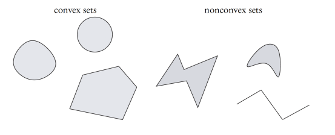
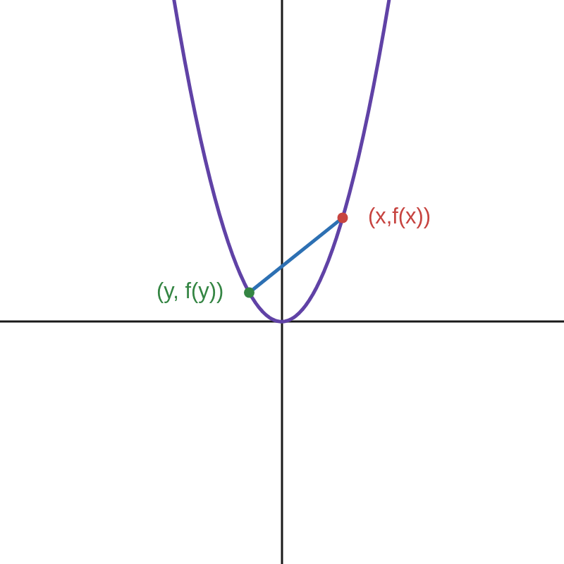
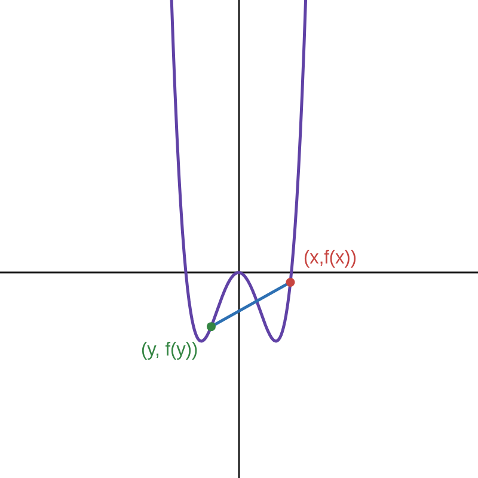
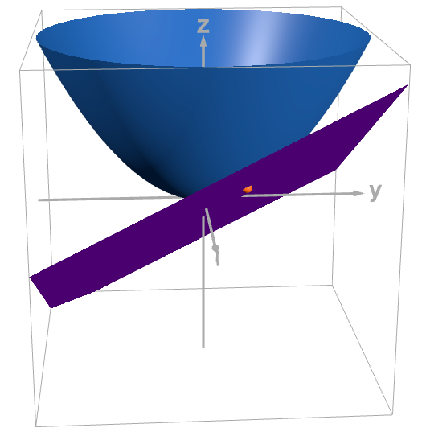
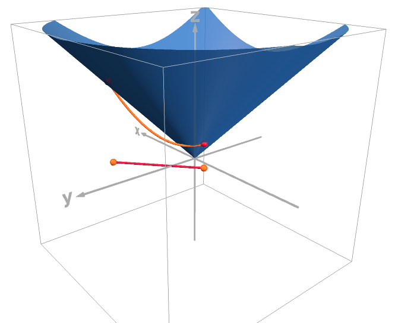
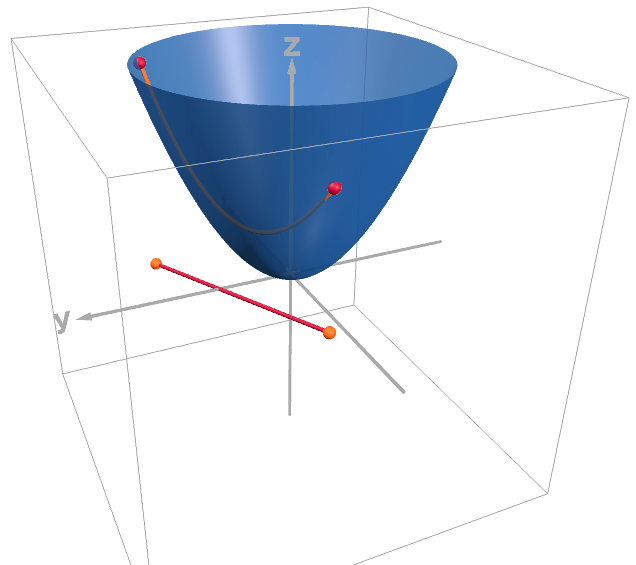
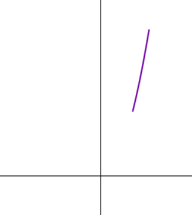
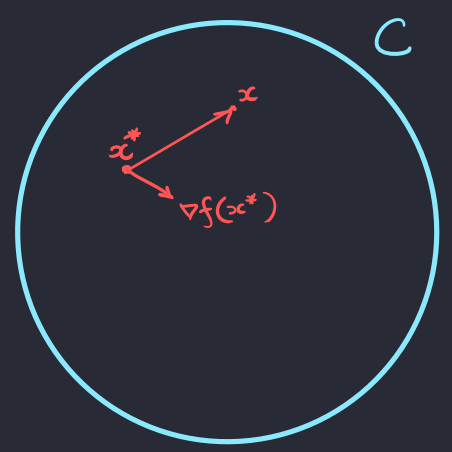
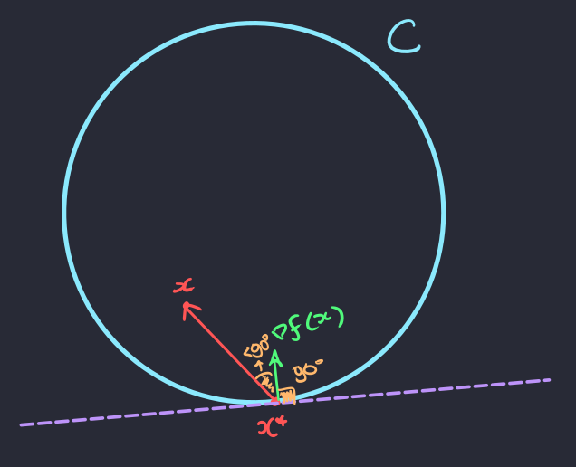

[Otimização para Ciência de Dados](index.md)

<!-- wiki:original:inicio -->

# Otimização Convexa

## Convexidade

**Definição: Conjunto convexo**

Um conjunto $C \subseteq {\mathbb{R}}^{n}$ é dito convexo se $$\forall x,y \in C \land \forall\lambda \in (0,1)\text{ vale }\lambda x + (1 - \lambda)y \in C$$

Ou seja, se eu pego dois pontos dentro do conjunto $C$ e fizer uma reta que interliga eles, todos os pontos nessa reta devem estar dentro de $C$

*Figura 6. Exemplo de figuras convexas e não-convexas retirado das anotações do professor*

Porém, outra definição muito importante são as de **funções convexas**

**Definição: Funções convexas**

Uma função $f:C \subseteq {\mathbb{R}}^{n} \rightarrow {\mathbb{R}}$ com $C$ convexo é dita convexa se: $$\forall x,y \in C \land \forall\lambda \in (0,1)\text{ vale }f\left( \lambda x + (1 - \lambda)y \right) \leq \lambda f(x) + (1 - \lambda)f(y)$$

**Definição: Funções estritamente convexas**

Uma função $f:C \subseteq {\mathbb{R}}^{n} \rightarrow {\mathbb{R}}$ com $C$ convexo é dita estritamente convexa se: $$\forall x,y \in C \land \forall\lambda \in (0,1)\text{ vale }f\left( \lambda x + (1 - \lambda)y \right) < \lambda f(x) + (1 - \lambda)f(y)$$

Mas o que isso quer dizer? Quer dizer que eu vou pegar o segmento entre meus pontos $x$ e $y$ e vou aplicar a função neles, depois eu vou pegar o segmento de reta entre $f(x)$ e $f(y)$ e comparar. Todos os pontos nesse segmento de reta tem que estar acima dos pontos da curva que eu fiz antes

Antes de continuar, vamos definir um conjunto simplex, que utilizaremos bastante daqui pra frente:

**Definição: Conjunto simplex**

O conjunto simplex $\Delta_{k}$ é definido como: $$\Delta_{k} ≔ \left\{ \lambda \in {\mathbb{R}}_{+}^{k}/\sum_{i = 1}^{k}\lambda_{i} = 1 \right\}$$

Existe um teorema que mostra que isso vale não só para a combinação de dois pontos, mas para a combinação de quaisquer $n$ pontos

**Teorema: Teorema de Jenssen**

Seja $f:C \subseteq {\mathbb{R}}^{n} \rightarrow {\mathbb{R}}$, com $C$ convexo, uma função convexa. Então dados quais quer coleção $\left\{ x_{i} \right\}_{i = 1}^{k} \subset C$ de pontos de $C$ e qualquer $\lambda \in \Delta_{k}$: $$f\left( \sum_{i = 1}^{k}\lambda_{i}x_{i} \right) \leq \sum_{i = 1}^{k}\lambda_{i}f\left( x_{i} \right)$$

**Demonstração**

Faremos por indução. O caso base $k = 1$ é bem óbvio. Agora vamos supor que vale para $k$. Sejam $\left\{ x_{i} \right\}_{i = 1}^{k + 1} \subset C$ e $\lambda \in \Delta_{k + 1}$. Para facilitar, definamos: $$z ≔ \sum_{i = 1}^{k + 1}\lambda_{i}x_{i}$$ Se $\lambda_{k + 1} = 1$, então $\sum_{i = 1}^{k}\lambda_{i} = 0$; Como $\lambda_{i} \geq 0\ \forall i \in \lbrack k\rbrack$, tem-se que $\lambda_{i} = 0$. Nesse caso, $x_{k + 1} = z$ e a desigualdade é imediata Se $\lambda_{k + 1} < 1$. Nesse caso, $$z = \lambda_{k + 1}x_{k + 1}\sum_{i = 1}^{k}\lambda_{i}x_{i} = \lambda_{k + 1}x_{k + 1} + \left( 1 - \lambda_{k + 1} \right)\underset{v}{\underbrace{\sum_{i = 1}^{k}\frac{\lambda_{i}}{1 - \lambda_{k + 1}}x_{i}}}$$ E é bem fácil de ver que $$\sum_{i = 1}^{k}\frac{\lambda_{i}}{1 - \lambda_{k + 1}} = 1$$ Como $C$ é convexo e $\left\{ x_{i} \right\}_{i = 1}^{k} \subset C$, então temos que: $$\frac{1}{1 - \lambda_{k + 1}}\sum_{i = 1}^{k}\lambda_{i}x_{i} \in C$$ Isso é um teorema que vou enunciar posteriormente e demonstrar também. Como $x_{k + 1} \in C$, pela convexidade de $f$, $$\begin{array}{r} f(z) = f\left( \left( 1 - \lambda_{k + 1} \right)v + \lambda_{k + 1}x_{k + 1} \right) \leq \left( 1 - \lambda_{k + 1} \right)f(v) + \lambda_{k + 1}f\left( x_{k + 1} \right) \\ = \left( 1 - \lambda_{k + 1} \right)f\left( \sum_{i = 1}^{k}\frac{\lambda_{i}}{1 - \lambda_{k + 1}}x_{i} \right) + \lambda_{k + 1}f\left( x_{k + 1} \right) \\ \leq \left( 1 - \lambda_{k + 1} \right)f\left( \sum_{i = 1}^{k}\frac{\lambda_{i}}{1 - \lambda_{k + 1}}f\left( x_{i} \right) \right) + \lambda_{k + 1}f\left( x_{k + 1} \right) \\ = \sum_{i = 1}^{k + 1}f\left( x_{i} \right) \end{array}$$

**Teorema**

Seja $C \subset {\mathbb{R}}^{n}$ convexo, dados quaisquer coleção $\left\{ x_{i} \right\}_{i = 1}^{k} \subset C$ de pontos em $C$ e qualquer $\lambda \in \Delta_{k}$, então: $$\sum_{i = 1}^{k}\lambda_{i}x_{i} \in C$$

**Demonstração**

Caso base: $k = 2$ é trivial. Vamos supor que vale para um determinado $k$, então: $$\sum_{i = 1}^{k}\mu_{i}x_{i} \in C$$ Para qualquer $\mu \in \Delta_{k}$. Já que esse ponto está em $C$, vamos pegar um novo vetor $x_{k + 1}$ ainda em $C$. Já que ambos os vetores estão em $C$ e ele é convexo, vale: $$\forall\alpha \in (0,1),\ \alpha\sum_{i = 1}^{k}\mu_{i}x_{i} + (1 - \alpha)x_{k + 1} \in C$$ Porém, perceba que $$\alpha\sum_{i = 1}^{k}\mu_{i} + (1 - \alpha) = \alpha + 1 - \alpha = 1$$ Ou seja, se eu denotar $\lambda \in {\mathbb{R}}^{k + 1}$ de tal forma que $\lambda_{i} = \alpha\mu_{i}$ para $i \in \lbrack k\rbrack$ e $\lambda_{k + 1} = 1 - \alpha$ eu obtenho uma coleção de números tal que $\lambda \in \Delta_{k}$ e uma coleção $\left\{ x_{i} \right\}_{i = 1}^{k + 1}$ tal que: $$\sum_{i = 1}^{k + 1}\lambda_{i}x_{i} \in C$$

### Caracterização de convexidade de primeira ordem

Funções convexas podem ser não-diferenciáveis. Funções convexas diferenciáveis possuem uma caracterização importante: hiperplanos tangentes ao seu gráfico são sempre estimativas abaixo da função.

**Teorema: Desigualdade do gradiente**

Seja $f:C \subset {\mathbb{R}}^{n} \rightarrow {\mathbb{R}}$ com $C$ convexa e $f$ continuamente diferenciável, então: $$f\text{ convexa } \Leftrightarrow \forall x,y \in C,\ f(x) + \nabla{f(x)}^{T}(y - x) \leq f(y)$$

**Demonstração**

$( \Longrightarrow )$ Suponha que f seja convexa. Sejam $x,y \in C \land \lambda \in \lbrack 0,1\rbrack$. A desigualdade enunciada vale trivialmente se $x = y$. Iremos então assumir que $x \neq y$. Da convexidade de $f$, $$f\left( \lambda x + (1 - \lambda)y \right) \leq \lambda f(x) + (1 - \lambda)f(y)$$

implicando que

$$\frac{f\left( x + \lambda(y - x) \right) - f(x)}{\lambda} \leq f(y) - f(x)$$ Tomando $\lambda \rightarrow 0^{+}$, obtemos $$f'(x;y - x) = \lim\limits_{\lambda \rightarrow 0^{+}}\frac{f\left( x + \lambda(y - x) \right) - f(x)}{\lambda} \leq f(y) - f(x)$$

Como f é continuamente diferenciável, $f'(x;y - x) = \nabla{f(x)}^{T}(y - x)$ e a desigualdade segue.

$( \Longleftarrow )$ Assuma que a desigualdade vale. Sejam $x,y \in C$ e $\lambda \in (0,1)$. Defina $z = \lambda x + (1 - \lambda)y$. Temos: $$x - z = z - (1 - \lambda)y - z = (1 - \lambda)(\lambda)(y - z)$$ À seguir, usaremos a desigualdade nos pares $(x,z)$ e $(y,z)$. Temos $$f(z) + \nabla{f(z)}^{T}(x - z) \leq f(x)$$ $$f(z) + \nabla{f(z)}^{T}(y - z) \leq f(y)$$ Multiplicando-se a primeira desigualdade por $(\lambda)(1 - \lambda)$ e usando a igualdade na segunda desigualdade, obtemos $$\frac{\lambda}{1 - \lambda}f(z) + \frac{\lambda}{1 - \lambda}\nabla{f(z)}^{T}(x - z) \leq \frac{\lambda}{1 - \lambda}f(x)$$ $$f(z) - \frac{\lambda}{1 - \lambda}\nabla{f(z)}^{T}(x - z) \leq f(y)$$ Somando-se as duas desigualdades acima obtemos $$\frac{\lambda}{1 - \lambda}f(z) + f(z) \leq \frac{\lambda}{1 - \lambda}f(x) + f(y)$$ Isto é $$f(z) \leq \lambda f(x) + (1 - \lambda)f(y)$$ Segue que $f$ é convexa

**Teorema: Desigualdade do gradiente estrito**

Seja $f:C \subset {\mathbb{R}}^{n} \rightarrow {\mathbb{R}}$ com $C$ convexa e $f$ continuamente diferenciável, então: $$f\text{ estritamente convexa } \Leftrightarrow \forall x,y \in C,\ f(x) + \nabla{f(x)}^{T}(y - x) < f(y)$$

**Demonstração**

Anáogo ao [\[gradient-inequality\]](#gradient-inequality)

*Figura 9. Função $f(x,y) = 1.3x^{2} + 1.27y^{2}$ e um plano tangente à curva*

A gente pode usar os teoremas anteriores pra caracterizar as funções quadráticas e quando elas são convexas

**Teorema: Convexidade da quadrática**

Seja $f:{\mathbb{R}}^{n} \rightarrow {\mathbb{R}}$ uma função quadrática: $$f(x) = x^{T}Ax + 2b^{T}x + c$$ Onde $A$ é simétrica. Então: $$f\text{ (estritamente) convexa } \Leftrightarrow A \succeq 0(A \succ 0)$$

**Demonstração**

A prova para o caso Pelo [\[gradient-inequality\]](#gradient-inequality) e sabendo que $\nabla f(x) = 2(Ax + b)$, temos que $f$ é convexa $\Leftrightarrow$ $$\forall x,y \in {\mathbb{R}}^{n},y^{T}Ay + 2b^{T}y + c \geq x^{T}Ax + 2b^{T}x + c + 2(Ax + b)^{T}(y - x)$$ Rearranjando, obtemos: $$\forall x,y \in {\mathbb{R}}^{n}(y - x)^{T}A(y - x) \geq 0 \Rightarrow A \succeq 0$$

**Teorema: Monotonicidade do gradiente**

Seja $f:C \subset {\mathbb{R}}^{n} \rightarrow {\mathbb{R}}$ continuamente diferenciável, então: $$f\text{ convexa em }C \Leftrightarrow \forall x,y \in C,\ \left( \nabla f(x) - \nabla f(y) \right)^{T}(x - y) \geq 0$$

**Demonstração**

$( \Longrightarrow )$ Assuma que $f$ é convexa sobre $C$. Por [\[gradient-inequality\]](#gradient-inequality): $$\begin{array}{r} f(x) \geq f(y) + \nabla{f(y)}^{T}(x - y) \\ f(y) \geq f(x) + \nabla{f(x)}^{T}(y - x) \end{array}$$ Somando ambas as igualdades, obtemos [\[gradient-monotonicity-equation\]](#gradient-monotonicity-equation)

$( \Longleftarrow )$ Suponha que [\[gradient-monotonicity-equation\]](#gradient-monotonicity-equation) seja válida e sejam $x,y \in C$, vamos definir a função: $$g(t) ≔ f\left( x + t(y - x) \right),\text{\quad\quad}t \in \lbrack 0,1\rbrack$$ Pelo Teorema Fundamental do Cálculo: $$\begin{array}{r} f(y) = g(1) = g(0) + \int_{0}^{1}g'(t)dt \\ = f(x) + \int_{0}^{1}(y - x)^{T}\nabla f\left( x - t(y - x) \right)d \\ = f(x) + (y - x)^{T}\nabla f(x) + \int_{0}^{1}(y - x)^{T}\left( \nabla f\left( x - t(y - x) \right) - \nabla f(x) \right)d \\ = f(x) + (y - x)^{T}\nabla f(x) + \frac{1}{t}\int_{0}^{1}t(y - x)^{T}\left( \nabla f\left( x - t(y - x) \right) - \nabla f(x) \right)d \\ \geq f(x) + (y - x)^{T}\nabla f(x) \end{array}$$ Onde utilizamos [\[gradient-monotonicity-equation\]](#gradient-monotonicity-equation) na última desigualdade

### Caracterizações de convexidade de segunda ordem

**Teorema: Caracterização de convexidade de segunda ordem**

Seja $f:C \subset {\mathbb{R}}^{n} \rightarrow {\mathbb{R}}$ duas vezes continuamente diferenciável sobre um conjunto convexo C, então: $$f\text{ convexa em }C \Leftrightarrow \forall x \in C,\ \nabla^{2}f(x) \succeq 0$$

**Demonstração**

$( \Longleftarrow )$ Suponha que $\nabla^{2}f(x) \succeq 0$ para todo $x \in C$. Sejam $x,y \in C$. Pelo teorema de aproximação linear, existe $\xi \in \lbrack x,y\rbrack \subset C$ tal que $$f(y) = f(x) + \nabla f(x)^{T}(y - x) + (y - x)^{T}\nabla^{2}f(\xi)(y - x)$$

Como $\nabla^{2}f(\xi) \succeq 0$, segue que $$f(y) = f(x) + \nabla f(x)^{T}(y - x)$$

Como o argumento vale para todo $x,y \in C$, provamos que $f$ e convexa em $C$ pelo [\[gradient-inequality\]](#gradient-inequality).

$( \Longrightarrow )$ Suponha que $f$ é convexa em $C$. Sejam $x \in C$ e $d \in {\mathbb{R}}^{n}$ com $\| d\| = 1$. Sendo C aberto, existe $\varepsilon > 0$ tal que $x + \lambda d \in C$ para todo $0 < \lambda < \varepsilon$. Para tal $\lambda$, segue do [\[gradient-inequality\]](#gradient-inequality) $$f(x + \lambda d) \geq f(x) + \lambda\nabla f(x)^{T}d$$

Além disso, pelo teorema de aproximação quadrática: $$f(x + \lambda d) = f(x) + \lambda\nabla{f(x)}^{T}d + \frac{\lambda^{2}}{2}d^{T}\nabla^{2}f(x)d + o\left( \lambda^{2}\| d\|^{2} \right)$$

Combinando as expressões, obtemos, para todo $\lambda \in (0,\varepsilon)$ $$\frac{\lambda^{2}}{2}d^{T}\nabla^{2}f(x)d + o\left( \lambda^{2} \right) \geq 0$$ Isso é: $$d^{T}\nabla^{2}f(x)d + \frac{o\left( \lambda^{2} \right)}{\lambda^{2}} \geq 0$$ Fazendo com que $\lambda \rightarrow 0$, temos: $$d^{T}\nabla^{2}f(x)d \geq 0$$ Ou seja, $\nabla^{2}f(x) \succeq 0,\ \forall x$

**Teorema: Caracterização de convexidade de segunda ordem**

Seja $f:C \subset {\mathbb{R}}^{n} \rightarrow {\mathbb{R}}$ duas vezes continuamente diferenciável sobre um conjunto convexo C, então: $$\forall x \in C,\ \nabla^{2}f(x) \succ 0 \Rightarrow f\text{ estritamente convexa em }C$$

A volta na questão anterior não vale, por exemplo, $f(x) = x^{4}$ tem mínimo em $0$, mas $f''(0) = 0$

### Convexidade forte

Vimos o conceito de convexidade aplicando a condição de pontos numa reta estarem acima da curva da função. Mas e se uma forma mais curvada ainda tivesse em cima da função?

**Definição: Convexidade forte**

Uma função $f:C \subset {\mathbb{R}}^{n} \rightarrow {\mathbb{R}}$ com $C$ convexo é $\mu$-fortemente convexa ($\mu$ \> 0) se: $$\begin{array}{r} \forall x,y \in C \land \forall\lambda \in \lbrack 0,1\rbrack, \\ f\left( \lambda x + (1 - \lambda)y \right) + \frac{\mu}{2}\lambda(1 - \lambda)\| y - x\|^{2} \leq \lambda f(x) + (1 - \lambda)f(y) \end{array}$$

Mas o que diabos isso significa? A gente agora, em vez de checar se os pontos na reta $t\left( x,f(x) \right) + (1 - t)\left( y,f(y) \right)\ \left( t \in \lbrack 0,1\rbrack \right)$, imagine que tem uma cordinha entre esses dois pontos, a gravidade vai afetar ela e ela vai ficar curvada, e $\mu$ dita o quão curvada a cordinha está. Se os pontos nessa cordinha estão acima da curva para todos os pontos na curva, então a função é $\mu$-fortemente convexa

**Teorema: Desigualdade do gradiente: fortemente convexa**

Seja $f:C \subset {\mathbb{R}}^{n} \rightarrow {\mathbb{R}}$ continuamente diferenciável e $C$ convexo. Temos: $$f\ \mu\text{-fortemente convexa } \Leftrightarrow \forall x,y \in C,\ f(x) + \nabla{f(x)}^{T}(y - x) + \frac{\mu}{2}\| y - x\|^{2} \leq f(y)$$

**Teorema: Caracterização de convexidade forte de segunda ordem**

Seja $f:C \subset {\mathbb{R}}^{n} \rightarrow {\mathbb{R}}$ duas vezes continuamente diferenciável e $C$ convexo. Então: $$f\ \mu\text{-fortemente convexa } \Leftrightarrow \nabla^{2}f(x) - \mu I \succ 0$$

## Otimização sobre conjuntos convexos

Com toda essa bagagem, conseguimos finalmente aplicar a otimização de $f$ em uma restrição convexa $C$ $$\min\limits_{x \in C}f(x)$$

### Condição de primeira ordem: Caso geral

Vamos primeiramente ver uma condição sobre funções generalizadas. Algo que faz sentido pensar quando estamos sendo restringidos, é pensar que não necessariamente meu máximo ou mínimo vai ter derivada igual a 0, veja o exemplo:

*Figura 12. Exemplo de restrição: $f(x) = x^{2}$ com $x \in \lbrack 2,3\rbrack$*

**Teorema: Condição de primeira ordem: Caso restrito**

Seja $f:C \subset {\mathbb{R}}^{n} \rightarrow {\mathbb{R}}$ continuamente diferenciável em $C$ convexo e fechado, então: $$x^{\ast} \in C\text{ mínimo local } \Rightarrow \forall x \in C,\ \nabla{f\left( x^{\ast} \right)}^{T}\left( x - x^{\ast} \right) \geq 0$$

**Demonstração**

Precisamos do seguinte lema: Seja $f:U \rightarrow {\mathbb{R}}$ função continuamente diferenciável sobre um aberto $U \subset {\mathbb{R}}^{n}$. Se para algum $x \in U$ e $d \neq 0$ tem-se $$\nabla f(x)^{T}d < 0$$ então existe $\varepsilon > 0$ tal que para todo $t \in (0,\varepsilon)$, $x + td \in U$ e $$f(x + td) < f(x)$$

Continuemos a demonstração do teorema original. Assuma por contradição que exista $x \in C$ tal que $\nabla f\left( x^{\ast} \right)^{T}\left( x - x^{\ast} \right) < 0$. Temos então que, para $d ≔ x - x^{\ast},f'\left( x^{\ast};d \right) = \nabla f\left( x^{\ast} \right)^{T}\left( x - x^{\ast} \right) < 0$. Segue do lema anterior, que existe $\varepsilon \in (0,1)$ tal que $$\forall t \in (0,\varepsilon),f\left( x^{\ast} + td \right) < f\left( x^{\ast} \right)$$ Sendo $C$ convexo, segue que $x^{\ast} + td = (1 - t)x^{\ast} + tx \in C$. Concluímos então que $x^{\ast}$ não é um ponto de mínimo local de $f$ em $C$ — uma contradição.

Mas o que esse teorema quer dizer??? Vamos por partes. Lembra do cosseno entre dois vetores $v$ e $u$? $$\cos(\theta) = \frac{u^{T}v}{\| u\|\| v\|}$$

Ou seja, quando o sinal do ângulo entre eles depende única e exclusivamente de $u^{T}v$. Lembre que, se $\theta \in \left\lbrack - \frac{\pi}{2},\frac{\pi}{2} \right\rbrack$ então $\cos(\theta) \geq 0$ e se $\theta \in \left\lbrack \frac{\pi}{2},\frac{3\pi}{2} \right\rbrack$ então $\cos(\theta) \leq 0$. Mas o que isso quer dizer? Espera mais um pouco. Lembra que vimos em cálculo 2 que o vetor gradiente indica a direção no domínio que eu devo seguir para que **a função aumente**? Show, agora a gente pode entender o que o teorema quer dizer para nós.

Vamos considerar o caso mais básico, quando $x^{\ast}$ não ta na fronteira de $C$

*Figura 13. Ponto mínimo $x^{\ast} \in C$*

Na imagem temos o vetor gradiente e o vetor $x - x^{\ast}$. Quando variamos o nosso ponto $x$, podemos claramente perceber que o vetor $x - x^{\ast}$ faz vários ângulos com o gradiente, só que se o gradiente for desça forma, ao andarmos na direção oposta ao gradiente, nossa função vai diminuir, ou seja, $x^{\ast}$ não pode ser um ponto de mínimo! O que isso quer dizer? Que meu gradiente é 0!

Mas e se $x^{\ast}$ estiver na minha fronteira?

Perceba que na primeira figura, se eu vejo o ângulo do gradiente com qualquer outro ponto no meu conjunto eu tenho menos que 90 graus, ou seja, o meu gradiente aponta para **dentro do conjunt**, de forma que a única maneira de diminuir mais a função é **saindo da restrição**. Na outra figura isso é melhor ilustrado. Veja que existem vetores no conjunto que fazem mais que 90 graus com o vetor gradiente, ou seja, o vetor gradiente ta para fora do conjunto $C$, de forma que eu consigo andar na direção $- \nabla^{2}f\left( x^{\ast} \right)$ para que diminua ainda mais a função, ou seja, $x^{\ast}$ não seria um mínimo

Esse teorema nos da motivação para uma definição

**Definição: Ponto estacionário**

Seja $f:C \subset {\mathbb{R}}^{n} \rightarrow {\mathbb{R}}$ com $C$ convexo e fechado, chamamos $x^{\ast} \in C$ de ponto estacionário quando $$\forall x \in C,\ \nabla f\left( x^{\ast} \right)\left( x - x^{\ast} \right) \geq 0$$

### Condições de primeira ordem: Caso convexo

**Teorema**

Seja $f:C \subset {\mathbb{R}}^{n} \rightarrow {\mathbb{R}}$ continuamente diferenciável e convexa com $C$ convexo e fechado e $x^{\ast} \in C$, então: $$x^{\ast}\text{ mínimo global } \Leftrightarrow x^{\ast}\text{ é ponto estacionário }$$

**Demonstração**

Precisamos provar apenas $( \Longleftarrow )$ do [\[first-order-condition-convex-set\]](#first-order-condition-convex-set). Seja $x^{\ast} \in C$ um ponto estacionário de $f$ em $C$. Obtemos que, para todo $x \in C$, $$f(x) \geq f\left( x^{\ast} \right) + \nabla f\left( x^{\ast} \right)^{T}\left( x - x^{\ast} \right) \geq f\left( x^{\ast} \right)$$ onde a primeira desigualdade segue da desigualdade do gradiente ([\[gradient-inequality\]](../convexidade/index.md#gradient-inequality)) e a segunda desigualdade segue de que $x^{\ast}$ é ponto estacionário. Sendo que $$\forall x \in C,\ f(x) \geq f\left( x^{\ast} \right)$$ segue que $x^{\ast} \in C$ é ponto de mínimo global de $f$ em $C$.

------------------------------------------------------------------------

<!-- wiki:original:fim -->

## Percurso de estudo

[Trilha: A1](../../trilhas/otimizacao-para-ciencia-de-dados/a1.md) · [Apresentação e contexto da fonte](../../trilhas/otimizacao-para-ciencia-de-dados/a1.md#apresentacao-original)

- Anterior: [Otimização Irrestrita](otimizacao-irrestrita.md)
- Próximo: [Otimização com restrições lineares](otimizacao-com-restricoes-lineares.md)
