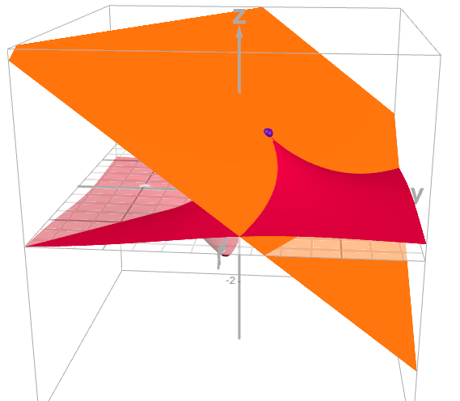
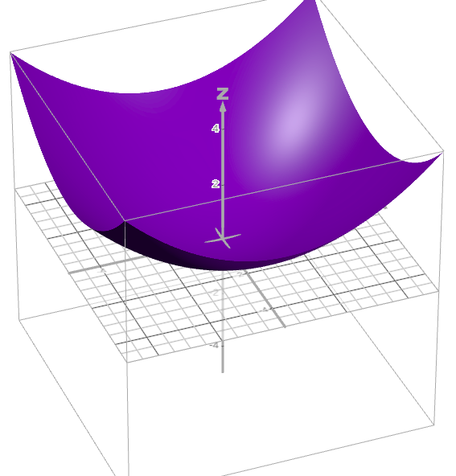

[Otimização para Ciência de Dados](../index.md)

<!-- wiki:original:inicio -->

# Otimização Irrestrita

## Introdução

Otimização é um ramo da matemática preocupada em resolver problemas em que você possui várias opções de escolha, de forma que cada uma tem o custo associado, e queremos escolher a escolha com menor custo possível, ou seja, queremos resolver: $$\min\limits_{x \in C}f(x)$$ Com $f:C \subseteq {\mathbb{R}}^{n} \rightarrow {\mathbb{R}}$ sendo a **função objeto** e C sendo o **conjunto viável**.

## Definições e Revisões de Cálculo

Nesse capítulo, vamos rever alguns conceitos de cálculo e introduzir a otimização irrestrita, onde queremos trabalhar em uma função $f$ sem nenhuma restrição

**Definição: Ponto de Mínimo**

Seja $f:C \subseteq {\mathbb{R}}^{n} \rightarrow {\mathbb{R}}$

- $x^{\ast} \in C$ é um **ponto de mínimo global** de $f$ em $C \Leftrightarrow$ $$\forall x \in C,\text{       }f\left( x^{\ast} \right) \leq f(x)$$

- $x^{\ast} \in C$ é um **ponto de mínimo global estrito** de $f$ em $C \Leftrightarrow$ $$\forall x \in C,\text{       }f\left( x^{\ast} \right) < f(x)$$

- $x^{\ast} \in C$ é um **ponto de mínimo local** de $f$ em $C \Leftrightarrow$ $$\exists r > 0 \land \forall x \in C \cap B\left( x^{\ast},r \right),\text{       }f\left( x^{\ast} \right) \leq f(x)$$

- $x^{\ast} \in C$ é um **ponto de mínimo local estrito** de $f$ em $C \Leftrightarrow$ $$\exists r > 0 \land \forall x \in C \cap B\left( x^{\ast},r \right)\backslash\left\{ x^{\ast} \right\},\text{       }f\left( x^{\ast} \right) < f(x)$$

**Definição: Bola**

Uma bola $B \subset {\mathbb{R}}^{n}$ de raio $r > 0 \in {\mathbb{R}}$ e centro $p \in {\mathbb{R}}^{n}$ é o conjunto: $$B(p,r) = \left\{ x \in {\mathbb{R}}/\| x - p\| \leq r \right\}$$

Ou seja, qual é a diferença dos dois? Pontos de mínimo globais são menores que todo e qualquer outro ponto no domínio $C$ da função, enquanto os pontos locais são os menores em uma determinada vizinhança, a partir do ponto de mínimo local em questão, qualquer direção que eu tomar eu vou começar a subir o valor de $f$, mesmo que existam pontos em outros locais do domínio que sejam menores que o ponto de mínimo local que eu estava analisando

Agora vamos lembrar algumas coisas que vimos em cálculo (Alguns teoremas que são apenas revisão não serão demonstrados)

**Definição: Derivada direcional**

Dada $f:{\mathbb{R}}^{n} \rightarrow {\mathbb{R}}$ e $d \neq 0 \in {\mathbb{R}}^{n}$ e $\| d\| = 1$. Se $$\exists\lim\limits_{t \rightarrow 0^{+}}\frac{f(x + td) - f(x)}{t}$$ Isso é chamado de derivada direcional de $f$ na direção $d$ ($\frac{df}{dd}$)

**Definição: Gradiente**

Dada $f:{\mathbb{R}}^{n} \rightarrow {\mathbb{R}}$ e $\exists\frac{\partial f}{\partial x_{i}}$, $i = 1,\ldots,n$, o vetor gradiente de $f$ é definido como: $$\nabla f(x) = \begin{pmatrix} \frac{\partial f}{\partial x_{1}} \\ \frac{\partial f}{\partial x_{2}} \\ \vdots \\ \frac{\partial f}{\partial x_{n}} \end{pmatrix}$$

**Definição: Continuamente Diferenciável**

Uma função $f:{\mathbb{R}}^{n} \rightarrow {\mathbb{R}}$ é continuamente diferenciável se: $$\forall x \in {\mathbb{R}}^{n},\ \exists\frac{\partial f}{\partial x_{i}}(x)$$ e $\frac{\partial f}{\partial x_{i}}$ são contínuas $\forall i$

**Teorema: Aproximação de Primeira Ordem**

Quando $f$ é continuamente diferenciável, em uma vizinhança de um ponto $x$ podemos mostrar que: $$\forall d \in {\mathbb{R}}^{n}\text{ com }\| d\| = 1\text{\quad\quad}\ \frac{df}{dd} = \nabla{f(x)}^{T}d$$ e, além disso, temos: $$\forall y \in {\mathbb{R}}^{n}\text{ na vizinhança }\text{\quad\quad}f(y) = f(x) + \nabla{f(x)}^{T}(y - x) + o\left( \| y - x\| \right)$$ Onde $o:{\mathbb{R}}_{+} \rightarrow {\mathbb{R}}$ satisfaz $\lim\limits_{t \rightarrow 0^{+}}\frac{o(t)}{t} = 0$

Apenas para relembrar, esse teorema está nos dando uma forma de aproximar uma função:

*Figura 1. Função $f(x,y) = \frac{x + y}{x^{2} + y^{2} + 1/5}$*

Perceba que, próximo do ponto, a distância entre os pontos da curva e os do plano não são tão grandes, por isso que definimos a aproximação linear como mostrado anteriormente

**Definição: Funções duas vezes continuamente diferenciáveis**

Podemos também expressar uma definição similar para uma função $f:C \rightarrow R$<!-- Expressão matemática vazia no original. --> definida num conjunto $C \subset {\mathbb{R}}^{n}$. Dizemos que $f:C \rightarrow R$<!-- Expressão matemática vazia no original. --> é duas continuamente diferenciável em $C$ se existe $U \supset C$ conjunto aberto tal que existem todas derivadas parciais de primeira e segunda ordem em todo ponto $x \in U$ e, além disso, as funções $\frac{\partial^{2}f}{\partial x_{i}\partial x_{j}}:U \rightarrow {\mathbb{R}}$ são contínuas

**Definição: Matriz Hessiana**

Seja $f:U \rightarrow {\mathbb{R}}$ com $U \subset {\mathbb{R}}$ e duas vezes continuamente diferenciável, a matriz hessiana de $f$ no ponto $x \in U$ é definida como: $$\nabla^{2}f(x) ≔ \begin{pmatrix} \frac{\partial^{2}f}{\partial x_{1}^{2}} & \frac{\partial^{2}f}{\partial x_{1}\partial x_{2}} & \ldots & \frac{\partial^{2}f}{\partial x_{1}\partial x_{n}} \\ \frac{\partial^{2}f}{\partial x_{2}\partial x_{1}} & \frac{\partial^{2}f}{\partial x_{2}^{2}} & \ddots & \vdots \\ \vdots \\ \frac{\partial^{2}f}{\partial x_{n}\partial x_{1}} & \frac{\partial^{2}f}{\partial x_{n}\partial x_{2}} & \ldots & \frac{\partial^{2}f}{\partial x_{n}^{2}} \end{pmatrix}$$

Perceba que $\nabla^{2}f(x)$ é simétrica

**Teorema: Aproximação Linear**

Seja $f:U \rightarrow {\mathbb{R}}$ uma função duas vezes continuamente diferenciável e $U \subseteq {\mathbb{R}}^{n}$, e seja $x \in U$ e $r > 0$ tais que $B(x,r) \subset U$ então: $$\begin{array}{r} \forall y \in B(x,r)\ \exists\xi \in \lbrack x,y\rbrack\text{ tal que } \\ f(y) = f(x) + \nabla{f(x)}^{T}(y - x) + \frac{1}{2}(y - x)^{T}\nabla^{2}f(\xi)(y - x) \end{array}$$

**Teorema: Aproximação de Segunda Ordem**

Seja $f:U \rightarrow {\mathbb{R}}$ uma função duas vezes continuamente diferenciável e $U \subseteq {\mathbb{R}}^{n}$, e seja $x \in U$ e $r > 0$ tais que $B(x,r) \subset U$ então: $$\begin{array}{r} \forall y \in B(x,r)\text{ vale } \\ f(y) = f(x) + \nabla{f(x)}^{T}(y - x) + \frac{1}{2}(y - x)^{T}\nabla^{2}f(x)(y - x) + o\left( \| y - x\|^{2} \right) \end{array}$$

## Soluções Locais: Condições de primeira ordem

Agora podemos começar a brincadeira. Quando falamos de condições de primeira ordem, estamos nos referindo a condições relacionadas a derivadas de primeiro grau, ou seja, funções que são continuamente diferenciáveis. Antes eu comentei que estávamos interessados em minimizar funções num conjunto $C$, porém, vamos primeiro ver sobre otimização **irrestrita**, ou seja, problemas do tipo: $$\min\limits_{x \in {\mathbb{R}}^{n}}f(x)$$

Lembram que o vetor gradiente indica a direção que minha função tá crescendo? Quando estamos procurando um mínimo local, faz sentido dizer que a função cresça pra todos os lados, correto? Então faz sentido dizer que isso vai me dar um vetor gradiente $0$ (Apenas uma intuição)

**Teorema: Condições de primeira ordem**

Seja $f:U \rightarrow {\mathbb{R}}$ uma função definida no conjunto aberto $U \subset {\mathbb{R}}^{n}$. Se $x^{\ast} \in U$ é um mínimo local de $f$ e todas as derivadas parciais de $f$ existem, então $$\nabla f\left( x^{\ast} \right) = 0$$

**Demonstração**

Seja $i \in \lbrack n\rbrack$ e defina a função $g(t) = f(x^{\ast} + te_{i}$. Temos que $g$ é diferenciável em $0$ e $$g'(0) = \frac{\partial f}{\partial x_{i}}\left( x^{\ast} \right)$$. Sendo $x^{\ast}$ um ponto ótimo local de $f$ , segue que $0$ é um ponto ótimo local de $g$; portanto $0 = g'(0) = \frac{\partial f}{\partial x_{i}}\left( x^{\ast} \right)$. O argumento vale para todo $i \in \lbrack n\rbrack$, implicando que $\nabla f\left( x^{\ast} \right) = 0$

Esse teorema não vale na volta, já que, como vimos antes em cálculo, pontos de máximo e de sela também possuem essa característica, isso nos leva a criar a definição:

**Definição: Ponto estacionário**

Seja $f:U \rightarrow {\mathbb{R}}$ uma função definida no conjunto aberto $U \subset {\mathbb{R}}^{n}$ e todas as derivadas parciais de $f$ existem, então chamamos $x^{\ast} \in U$ de ponto estacionário de $f$ em $U$ se $$\nabla f\left( x^{\ast} \right) = 0$$

## Soluções Locais: Condições de segunda ordem

Nas anotações, o professor generaliza o conceito de que, se $x$ é estacionário e $f''(x) > 0$ então $x$ é mínimo local.

**Definição: Positividade e Negatividade de uma matriz**

Seja $A$ uma matriz simétrica:

- Dizemos que $A$ é positiva semidefinida, denotando-s por $A \succeq 0 \Leftrightarrow \forall x \in {\mathbb{R}}^{n},\ x^{T}Ax \geq 0$

- Dizemos que $A$ é positiva definida, denotando-s por $A \succ 0 \Leftrightarrow \forall x \in {\mathbb{R}}^{n},\ x^{T}Ax > 0$

- Dizemos que $A$ é negativa semidefinida, denotando-s por $A \preceq 0 \Leftrightarrow \forall x \in {\mathbb{R}}^{n},\ x^{T}Ax \leq 0$

- Dizemos que $A$ é negativa definida, denotando-s por $A \prec 0 \Leftrightarrow \forall x \in {\mathbb{R}}^{n},\ x^{T}Ax < 0$

- Dizemos que $A$ é indefinida, quando $\exists x,y \in {\mathbb{R}}^{n}$ tal que $x^{T}Ax > 0$ e $y^{T}Ay < 0$

Nas anotações do professor ele traz alguns conceitos que vimos em álgebra linear, mas eu não vou os abordar aqui.

**Teorema: Condições necessárias de segunda ordem**

Seja $f:U \rightarrow {\mathbb{R}}$ com $U \subset {\mathbb{R}}^{n}$ e suponha que $f$ é duas vezes continuamente diferenciável sobre $U$ e seja $x^{\ast} \in U$, então:

1.  Se $x^{\ast}$ é mínimo local, então $\nabla^{2}f\left( x^{\ast} \right) \succeq 0$

2.  Se $x^{\ast}$ é máximo local, então $\nabla^{2}f\left( x^{\ast} \right) \preceq 0$

**Demonstração**

Vamos apenas provar o item $1$ já que a prova para o $2$ é análoga (Basta aplicar a demonstração na função $- f$).

Sendo $x^{\ast}$ um ponto de mínimo local, $\exists B\left( x^{\ast},r \right) \subset U$ tal que: $$\forall x \in B\left( x^{\ast},r \right)\text{\quad\quad}f(x) \geq f\left( x^{\ast} \right)$$ Seja $0 \neq d \in {\mathbb{R}}^{n}$. Para todo $0 < \alpha < \frac{r}{\| d\|}$, vamos definir: $$x_{\alpha}^{\ast} ≔ x^{\ast} + \alpha d$$ $$x_{\alpha}^{\ast} \in B\left( x^{\ast},r \right) \Rightarrow f\left( x_{\alpha}^{\ast} \right) \geq f\left( x^{\ast} \right)$$ Pelo [\[linear-approximation\]](../definicoes-e-revisoes-de-calculo/index.md#linear-approximation), $\exists\xi_{\alpha} \in \left\lbrack x^{\ast},x_{\alpha}^{\ast} \right\rbrack$ tal que $$f\left( x_{\alpha}^{\ast} \right) - f\left( x^{\ast} \right) = \nabla{f\left( x^{\ast} \right)}^{T}\left( x_{\alpha}^{\ast} - x^{\ast} \right) + \frac{1}{2}\left( x_{\alpha}^{\ast} - x^{\ast} \right)^{T}\nabla^{2}f\left( \xi_{\alpha} \right)\left( x_{\alpha}^{\ast} - x^{\ast} \right)$$ Como $x^{\ast}$ é estacionário, temos: $$f\left( x_{\alpha}^{\ast} \right) - f\left( x^{\ast} \right) = \frac{\alpha^{2}}{2}d^{T}\nabla^{2}f\left( \xi_{\alpha} \right)d$$ Combinando as equações [\[minimal-on-ball-condition\]](#minimal-on-ball-condition) e [\[final-condition-to-minimal-point\]](#final-condition-to-minimal-point), temos que, para todo $\alpha \in \left( 0,\frac{r}{\| d\|} \right)$: $$d^{T}\nabla^{2}f\left( \xi_{\alpha} \right)d \geq 0$$ Usando de que $\xi_{\alpha} \rightarrow x^{\ast}$ quando $\alpha \rightarrow 0^{+}$ e por continuidade da Hessiana, segue: $$d^{T}\nabla^{2}f\left( x^{\ast} \right)d \geq 0$$ Isso é válido pois eu assumi um $d$ genérico

Perceba que essa condição é necessária, mas não é suficiente. Por exemplo, a função $f(x) = x^{3}$ é tal que $f'(0) = 0$, $f''(0) = 0$, porém, não é um ponto de máximo nem de mínimo.

**Teorema: Condições suficientes de segunda ordem**

Seja $f:U \rightarrow {\mathbb{R}}$ com $U \subset {\mathbb{R}}^{n}$ e suponha que $f$ é duas vezes continuamente diferenciável sobre $U$ e seja $x^{\ast} \in U$ um ponto estacionário de $f$ em $U$, então:

- Se $\nabla^{2}f\left( x^{\ast} \right) \succ 0$ então $x^{\ast}$ é um ponto de mínimo local estrito

- Se $\nabla^{2}f\left( x^{\ast} \right) \prec 0$ então $x^{\ast}$ é um ponto de máximo local estrito

**Demonstração**

Provaremos apenas o primeiro item. O segundo segue do primeiro aplicado em $- f$

Seja $x^{\ast} \in U$ um ponto estacionário de $f$ em $U$ tal que $\nabla^{2}f\left( x^{\ast} \right) \succ 0$. Como a Hessiana é contínua, segue que $\exists B\left( x^{\ast},r \right) \subset U$ tal que $\nabla^{2}f\left( x^{\ast} \right) \succ 0\ \forall x \in B\left( x^{\ast},r \right)$. Pelo [\[linear-approximation\]](../definicoes-e-revisoes-de-calculo/index.md#linear-approximation), segue que $\forall x \in B\left( x^{\ast},r \right)\ \exists\xi \in \left\lbrack x^{\ast},x \right\rbrack \subset B\left( x^{\ast},r \right)$ tal que: $$f(x) - f\left( x^{\ast} \right) = \nabla{f\left( x^{\ast} \right)}^{T}\left( x - x^{\ast} \right) + \frac{1}{2}\left( x - x^{\ast} \right)^{T}\nabla^{2}f(\xi)\left( x - x^{\ast} \right)$$ Como $x^{\ast}$ é estacionário, $\nabla f\left( x^{\ast} \right) = 0$. Segue também que $\nabla^{2}f(\xi) \succ 0\ \forall x \in B\left( x^{\ast},r \right)$. Isso significa que $$\forall x \neq x^{\ast},\text{\quad\quad}f(x) > f\left( x^{\ast} \right)$$ Ou seja, $x^{\ast}$ é mínimo local estrito

Para clarear um pouco sobre a demonstração, os passos mais confusos pode ser a conclusão final. Principalmente essa conclusão $\nabla^{2}f(\xi) \succ 0$. Vamos tentar abstrair isso isso com $f:{\mathbb{R}}^{2} \rightarrow {\mathbb{R}}$. Pega um ponto de mínimo estrito local, e faz uma bola em volta dele, todo ponto dentro daquele lugar vai ter hessiana positiva por conta da continuidade da Hessiana. Como assim? Imagina que a Hessiana é uma função ${\mathbb{R}} \rightarrow {\mathbb{R}}$, como ela é uma função contínua, não faz sentido eu mudar a entrada da função e ela bruscamente trocar de positivo pra negativo, certo? Claro que em um certo ponto, ela passa pelo 0 e o sinal troca, mas eu consigo aumentar minha bola até um pouquinho antes disso acontecer

*Figura 2. Desenho de domínio qualquer de uma função $f$*

A partir dessa linha amarela, os pontos vão ter hessiana negativa e, em cima dela, eles tem hessiana igual a 0, ou seja, então eu consigo criar uma bola $B\left( x^{\ast},r \right)$ de forma que ela não ultrapasse a linha amarela

*Figura 3. Desenho de domínio qualquer de uma função $f$ com uma bola $B$*

Ou seja, eu sei que todos os pontos dentro dessa bola tem Hessiana positiva. Depois disso, eu apenas utilizo do [\[linear-approximation\]](../definicoes-e-revisoes-de-calculo/index.md#linear-approximation) para chegar na desigualdade $f(x) > f\left( x^{\ast} \right)$

Um teorema parecido pode ser usado para pontos que tem gradiente $0$, mas que não são nem máximo nem mínimo (Como vimos em $f(x) = x^{3}$)

**Definição: Ponto de Sela**

Seja $f:U \rightarrow {\mathbb{R}}$ definida num conjunto aberto $U \subset {\mathbb{R}}^{n}$. Suponha que $f$ é duas vezes continuamente diferenciável. $x^{\ast} \in U$ é ponto de sela de $f$ em $U$ se ele é um ponto estacionário, mas não é nem ponto de máximo nem ponto de mínimo

**Teorema: Condições suficientes para pontos de sela**

Seja $f:U \rightarrow {\mathbb{R}}$ com $U \subset {\mathbb{R}}^{n}$ e suponha que $f$ é duas vezes continuamente diferenciável sobre $U$ e seja $x^{\ast} \in U$ um ponto estacionário de $f$ em $U$, se $\nabla^{2}f\left( x^{\ast} \right)$ é indefinda, então $x^{\ast}$ é ponto de sela

**Demonstração**

Seja $\nabla^{2}f\left( x^{\ast} \right)$ é indefinida. Portanto, $\nabla^{2}f\left( x^{\ast} \right)$ possui auto-valor positivo $\lambda_{1}$ associado ao auto-vetor $v_{1}$ com norma $\| v_{1}\| = 1$. Sendo $U$ aberto, existe $r > 0$ tal que $x^{\ast} + \alpha v_{1} \in U$ para todo $\alpha \in (0,r)$. Pelo [\[second-order-approximation\]](../definicoes-e-revisoes-de-calculo/index.md#second-order-approximation) e usando que $\nabla f\left( x^{\ast} \right) = 0$, sabemos que existe uma função $o:{\mathbb{R}}_{+} \rightarrow {\mathbb{R}}$ satisfazendo: $$\lim\limits_{t \rightarrow 0^{+}}\frac{o(t)}{t} = 0$$ tal que para todo $\alpha \in (0,r)$: $$\begin{array}{r} f\left( x^{\ast} + \alpha r \right) = f\left( x^{\ast} \right) + \frac{\alpha^{2}}{2}v_{1}^{T}\nabla^{2}f\left( x^{\ast} \right)v_{1} + o\left( \alpha^{2}\| v_{1}\|^{2} \right) \\ = f\left( x^{\ast} \right) + \frac{\lambda_{1}\alpha^{2}}{2}\| v_{1}\|^{2} + o\left( \alpha^{2}\| v_{1}\|^{2} \right) \\ = f\left( x^{\ast} \right) + \frac{\lambda_{1}\alpha^{2}}{2} + o\left( \alpha^{2} \right) \end{array}$$ Segue da equação [\[o-function-property\]](#o-function-property) que $\exists\varepsilon_{1} \in (0,r)$ tal que: $$\forall\alpha \in \left( 0,\varepsilon_{1} \right),\text{\quad\quad}g\left( \alpha^{2} \right) > \frac{- \left( \lambda_{1}\alpha^{2} \right)}{2}$$ Portanto, $$\forall\alpha \in \left( 0,\varepsilon_{1} \right),\text{\quad\quad}f\left( x^{\ast} + \alpha v_{1} \right) > f\left( x^{\ast} \right)$$ Ou seja, $x^{\ast}$ não pode ser máximo local sobre $U$. Um argumento análogo dizendo que $\exists\lambda_{2} < 0$ sendo $\lambda_{2}$ um autovalor da hessiana pode ser usado para mostrar que $x^{\ast}$ também não pode ser mínimo local

Essa prova parece complicada, então vou dar uma noção mais intuitiva. Vimos em álgebra linear que uma matriz é positiva definida se, e somente se, todos os seus autovalores são maiores que $0$ (O mesmo para matrizes negativas definidas), e que se elas possuem um autovalor positivo e outro negativo, então ela é indefinida. Mas o que isso me diz intuitivamente? Lembra que, se uma matriz tem multiplicidade algébrica igual a multiplicidade geométrica em todos os autovalores, então a gente pode dividir ela como: $$\nabla^{2}f(x) = Q^{T}\Lambda Q$$ $Q$ é ortogonal pois $\nabla^{2}f(x)$ é simétrica (Teorema Espectral). Mas o que isso significa? De uma maneira intuitiva, isso significa que os autovetores indicam direções ortogonais e o autovalor indica se a hessiana está crescendo ou diminuindo **naquela direção**, então se ela é indefinida em um ponto de sela, quer dizer que eu tenho direções que a hessiana tanto cresce como diminui, como ela cresce e diminui em direções diferentes partindo do mesmo ponto, ele não é nem máximo, nem mínimo

*Figura 4. Função $f(x,y) = ax^{2} + by^{2}$. Ponto laranja é ponto de sela (Ponto (0,0,0))*

## Existência de pontos ótimos

Até agora estávamos assumindo que pontos ótimos existiam, mas e se eles não existem?

**Definição: Conjunto fechado**

Um conjunto $C$ é fechado se seu complementar $C^{c}$ é aberto

**Definição: Conjunto limitado**

Um conjunto $C$ é limitado se $\exists r > 0$ tal que $C \subset B(0,r)$

**Definição: Conjunto compacto**

Um conjunto $C$ é compacto se é fechado e limitado

**Teorema: Weierstrass**

Seja $C \subset {\mathbb{R}}^{n}$ um conjunto compacto e $f:C \rightarrow {\mathbb{R}}$, então $f$ possui um ponto de mínimo global e de máximo global em $C$

Quando o conjunto não é compacto, o teorema de Weierstrass não garante a existência, então podemos usar essa outra definição:

**Definição: Coercividade**

Seja $f:{\mathbb{R}}^{n} \rightarrow {\mathbb{R}}$. A função é dita coerciva se: $$\lim\limits_{\| x\| \rightarrow \infty}f(x) = \infty$$

Ou seja, todo e qualquer vetor que eu pegar e aumentar seu tamanho, a função aumenta junto, formando o que parece uma grande bacia, onde você coloca água e ela nunca vaza

*Figura 5. Exemplo de função coerciva $f(x,y) = 0.1x^{2} + 0.1y^{2}$*

**Teorema: Existência de soluções: Coercividade**

Seja $f:{\mathbb{R}}^{n} \rightarrow {\mathbb{R}}$ uma função contínua e coerciva e $C \subset {\mathbb{R}}^{n}$ um conjunto fechado não-vazio. Então f tem um mínimo global em C

**Demonstração**

Seja $x_{0} \in C$ um ponto arbitrário. Como f é coerciva, segue que existe $M > 0$ tal que $$f(x) > f\left( x_{0} \right)\text{ para todo }x\text{ tal que }\| x\| > M$$ Temos que $x^{\ast}$ é um ponto de mínimo global de $f$ sobre $C$. Portanto $f\left( x^{\ast} \right) \geq f\left( x_{0} \right)$. Segue da afirmação em diplay que o conjunto de mínimos globais de $f$ sobre $C$ é exatamente o conjunto de mínimos globais de $f$ sobre $C \cap B(0,M)$. O conjunto $C \cap B(0,M)$ é fechado e limitado, portanto compacto. Segue do Teorema de Weierstrass que $f$ possui ponto de mínimo global sobre $C \cap B(0,M)$, e portanto, sobre $C$ também

## Condições para soluções globais

**Teorema**

Seja $f:{\mathbb{R}}^{n} \rightarrow {\mathbb{R}}$ duas vezes continuamente diferenciável. Suponha que: $$\nabla^{2}f(x) \succeq 0,\ \forall x \in {\mathbb{R}}^{n}$$ Então, em todo ponto estacionário de $f$, esse ponto é um mínimo global

**Demonstração**

Pelo [\[linear-approximation\]](../definicoes-e-revisoes-de-calculo/index.md#linear-approximation), seja $x^{\ast} \in {\mathbb{R}}^{n}$ um ponto estacionário em $f$ e $\forall x \in {\mathbb{R}}^{n}$: $$f(x) - f\left( x^{\ast} \right) = \frac{1}{2}\left( x - x^{\ast} \right)^{T}\nabla^{2}f(\xi)\left( x - x^{\ast} \right)$$ Porém, vale que $\forall x,\ \nabla^{2}f(\xi) \succeq 0$. Temos então que: $$\forall x \in {\mathbb{R}}^{n},\ f(x) \geq f\left( x^{\ast} \right)$$ Logo, $x^{\ast}$ é ponto de mínimo global em $f$

## Funções quadráticas

Um conjunto interessante de funções com algumas propriedades convenientes são as funções quadráticas

**Definição: Função quadrática**

Uma função é quadrática quando $\exists A \in {\mathbb{R}}^{n \times n}\text{ simétrica},b \in {\mathbb{R}}^{n},c \in {\mathbb{R}}$ tal que a função $f:{\mathbb{R}}^{n} \rightarrow {\mathbb{R}}$ pode ser expressa como: $$f(x) = x^{T}Ax + 2b^{T}x + c$$

**Teorema: Derivadas de uma quadrática**

Seja $f$ uma função quadrática como na [\[quadratic-function\]](#quadratic-function), temos que: $$\begin{array}{r} \nabla f(x) = 2(Ax + b) \\ \nabla^{2}f(x) = 2A \end{array}$$

**Demonstração**

Sabemos que $f(x) = x^{T}Ax + 2b^{T}x + c$. Vamos definir que $x_{i}$ é a $i$-ésima entrada de $x$. Vamos primeiro calcular uma derivada parcial genérica de $f$. Como a derivada é uma operação linear, eu vou ver cada componente separadamente. $$x^{T}Ax = \begin{pmatrix} x_{1} & \ldots & x_{n} \end{pmatrix}\begin{pmatrix} a_{11} & \ldots & a_{1n} \\ \vdots & \ddots & \vdots \\ a_{n1} & \ldots & a_{nn} \end{pmatrix}\begin{pmatrix} x_{1} \\ \vdots \\ x_{n} \end{pmatrix} = \begin{pmatrix} x_{1} & \ldots & x_{n} \end{pmatrix}\begin{pmatrix} \sum_{k = 1}^{n}a_{1k}x_{k} \\ \vdots \\ \sum_{k = 1}^{n}a_{nk}x_{k} \end{pmatrix}$$

Para facilitar nossa vida, vamos definir $$\alpha_{j} = \sum_{k = 1}^{n}a_{jk}x_{k}$$. Então: $$f(x) = \alpha_{1}x_{1} + \ldots + \alpha_{n}x_{n} + 2\left( b_{1}x_{1} + \ldots + b_{n}x_{n} \right) + c$$ Agora podemos tirar a derivada de $f(x)$ em $x_{j}$, mas antes, perceba que: $$\frac{\partial\alpha_{i}}{\partial x_{j}} = a_{ij}$$ Agora sim: $$\frac{\partial f}{\partial x_{j}} = x_{1}\frac{\partial\alpha_{1}}{\partial x_{j}} + \ldots + \frac{\partial}{\partial x_{j}}\left( \alpha_{j}x_{j} \right) + \ldots + x_{n}\frac{\partial\alpha_{n}}{\partial x_{j}} + 2b_{j}\frac{\begin{array}{r} \\ (\partial f) \end{array}}{\partial x_{j}} = x_{1}a_{1j} + \ldots + \frac{\partial\alpha_{j}}{\partial x_{j}}x_{j} + \alpha_{j} + \ldots + x_{n}a_{nj} + 2b_{j}\frac{\begin{array}{r} \\ (\partial f) \end{array}}{\partial x_{j}} = \sum_{k = 1}^{n}a_{jk}x_{k} + \sum_{k = 1}^{n}a_{kj}x_{k} + 2b_{j}$$

Como $A$ é simétrica, podemos reescrever isso como: $$\frac{\partial f}{\partial x_{j}} = 2\left( \sum_{k = 1}^{n}a_{kj}x_{k} + b_{j} \right)$$

Ou seja, o gradiente da função é: $$\nabla f(x) = 2(Ax + b)$$

E para a hessiana é bem mais fácil, dado o item anterior, basta que tiremos a derivada novamente para $x_{i}$: $$\frac{\partial^{2}f}{\partial x_{j}\partial x_{i}} = 2a_{ij}$$ Ou seja: $$\nabla^{2}f(x) = 2A$$

**Teorema: Pontos estacionários e ótimos de função quadrática**

Seja uma função $f$ definida na [\[quadratic-function\]](#quadratic-function), então:

1.  $x$ é ponto estacionário $\Leftrightarrow Ax = - b$.

2.  Suponha que $A \succeq 0$. Então $x$ é ponto de mínimo global $\Leftrightarrow Ax = - b$.

3.  Suponha que $A \succ 0$. Então $x = - A^{- 1}b$ é ponto de mínimo global estrito.

**Demonstração**

1.  Segue imediatamente da fórmula do gradiente.

2.  Suponha que $A \succeq 0$. Da f́ormula da Hessiana, segue que $\nabla^{2}f(x) \succeq 0\ \forall x \in {\mathbb{R}}^{n}$. O resultado segue então do [\[sufficient-condition-global-minimum\]](../condicoes-para-solucoes-globais/index.md#sufficient-condition-global-minimum) e item 1.

3.  Suponha que $A \succ 0$. Então $x = - A^{- 1}b$ é a única solução de $Ax = - b$. Segue do item (ii) que $x = - A^{- 1}b$ é o único ponto de mínimo global de $f$ e, portanto, mínimo global estrito.

**Teorema: Coercividade de funções quadráticas**

Seja função $f$ definida como na [\[quadratic-function\]](#quadratic-function). Então $f$ é coerciva $\Leftrightarrow A \succ 0$.

**Demonstração**

Precisamos do seguinte lema: Seja $A \in {\mathbb{R}}^{n \times n}$ simétrica, então $\forall x \neq 0 \in {\mathbb{R}}^{n \times n}$ $$\lambda_{\text{min }}(A) \leq \frac{x^{T}Ax}{\| x\|^{2}} \leq \lambda_{\text{max }}(A)$$ (Pode-se demonstrar pelo teorema espectral)

Agora podemos começar a prova:

$( \Longleftarrow )$ Suponha que $A \succ 0$. Denote $\alpha ≔ \lambda_{\text{min }}(A)$. Pelo lema àcima e Cauchy-Schwarz, segue que, para todo $x \in {\mathbb{R}}^{n}$, $$f(x) = x^{T}Ax + 2b^{T}x + c \geq \alpha\| x\|^{2} - 2\| b\|\| x\| + c$$ Segue que $f(x) \rightarrow \infty$ quando $\| x\| \rightarrow \infty$; isto é, $f$ é coerciva.

$( \Longrightarrow )$ Suponha que $f$ é coerciva. Suponha que $A$ tenha auto-valores negativos. Portanto, existem $v \neq 0$ e $\lambda < 0$ tais que $Av = \lambda v$. Portanto, para todo $\alpha \in {\mathbb{R}}$, $$f(\alpha v) = \lambda\| v\|^{2}\alpha^{2} + 2\left( b^{T}v \right)\alpha + c \rightarrow \infty\text{ quando }\alpha \rightarrow \infty$$

Isto contradiz a hipótese de coercividade. Portanto, A possui todos auto-valores não-negativos. Provaremos agora que $0$ não é auto-valor de $A$, provando que $A \succ 0$. Assuma que exista $v\not{} = 0$ tal que $Av = 0$. Então, para todo $\alpha \in {\mathbb{R}}$, $$f(\alpha v) = 2\left( b^{T}v \right)\alpha + c.$$ Temos que: $$f(\alpha v) \rightarrow \begin{cases} c\text{ quando }\alpha \rightarrow \infty\text{ se }b^{T}v = 0 \\ - \infty\text{ quando }\alpha \rightarrow - \infty\text{ se }b^{T}v > 0 \\ \infty\text{ quando }\alpha \rightarrow \infty\text{ se }b^{T}v < 0 \end{cases}$$ Em qualquer caso a coerção é violada, portanto, $0$ não pode ser autovalor de $A$

------------------------------------------------------------------------

<!-- wiki:original:fim -->

## Percurso de estudo

[Trilha: A1](../../../trilhas/otimizacao-para-ciencia-de-dados/a1.md) · [Apresentação e contexto da fonte](../../../trilhas/otimizacao-para-ciencia-de-dados/a1.md#apresentacao-original)

- Próximo: [Otimização Convexa](../otimizacao-convexa/index.md)
