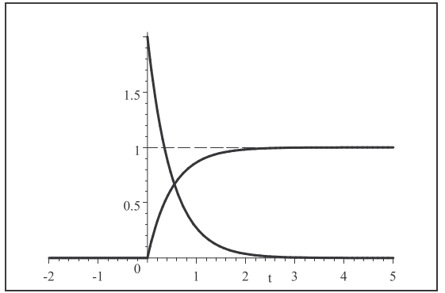

[Probabilidade](index.md)

<!-- wiki:original:inicio -->

# Distribuições Contínuas

## Distribuição Uniforme

Uma v.a contínua $X$ tem distribuição uniforme no intervalo $\lbrack a,b\rbrack$ se sua PDF for da forma:

$$
f_{X}(\varphi) = \begin{cases} 0\text{, }\text{ se }\varphi < a \\ \frac{1}{b - a}\text{, }\text{ se }a \leq \varphi \leq b \end{cases}
$$

Desta forma sua CDF é:

$$
F_{X}(\varphi) = \begin{cases} 0\text{, }\text{ se }\varphi < a \\ \frac{\varphi - a}{b - a}\text{, }\text{ se }a \leq \varphi \leq b \\ 1\text{, }\text{ se }\varphi > b \end{cases}
$$

O seguinte teorema é extremamente importante:

**Teorema**

(Universalidade da Uniforme)  
Se $X$ é uma v.a contínua com PDF $f_{X}$ e CDF $F_{X}$, então $Y = F_{X}(X)$ é uma uniforme em $\lbrack 0,1\rbrack$, ou seja: $Y \sim U\lbrack 0,1\rbrack$

**Demonstração**

$$
F_{Y}(y) = P(Y \leq y) = P\left( F_{X}(X) \leq y \right) = P\left( X \leq F_{X}^{- 1}(y) \right) = F_{X}\left( F_{X}^{- 1}(y) \right) = y
$$

Logo $Y$ é uma uniforme em $\lbrack 0,1\rbrack$.

### Esperança

Com $X \sim U\lbrack a,b\rbrack$, temos

$$
E(X) = \int_{- \infty}^{\infty}\varphi f_{X}(\varphi)d\varphi = \int_{a}^{b}\varphi\left( \frac{1}{b - a} \right)d\varphi = \frac{a + b}{2}
$$

### Variância

Com $X \sim U\lbrack a,b\rbrack$, temos:

$$\begin{array}{r} E\left( X^{2} \right) = \int_{- \infty}^{\infty}\varphi^{2}f_{X}(\varphi)d\varphi = \int_{a}^{b}\varphi^{2}\left( \frac{1}{b - a} \right)d\varphi = \left( \frac{1}{b - a} \right)\int_{a}^{b}\varphi^{2}d\varphi \\ = \left( \frac{1}{b - a} \right)\left\lbrack \frac{\varphi^{3}}{3} \right\rbrack_{a}^{b} = \left( \frac{1}{b - a} \right)\left\lbrack \frac{b^{3} - a^{3}}{3} \right\rbrack = \frac{b^{2} + ab + a^{2}}{3} \end{array}$$ 

E a variância fica:

$$V(X) = E\left( X^{2} \right) - {E(X)}^{2} = \frac{b^{2} + ab + a^{2}}{3} - \left( \frac{a + b}{2} \right)^{2} = \frac{(b - a)^{2}}{12}$$ 

## Distribuição Exponencial

Uma v.a contínua $X$ tem distribuição exponencial se sua PDF for da forma:

$$
f_{X}(\varphi) = \begin{cases} 0\text{, }\text{ se }\varphi < 0 \\ \lambda e^{- \lambda\varphi}\text{, }\text{ se }\varphi \geq 0 \end{cases}
$$

$\lambda > 0$ é o parâmetro da distribuição. A CDF é dada por:

$$
F_{X}(\varphi) = \begin{cases} 0\text{, }\text{ se }\varphi < 0 \\ 1 - e^{- \lambda\varphi}\text{, }\text{ se }\varphi \geq 0 \end{cases}
$$

*Figura 1. PDF e CDF Da Exponencial com $\lambda = 2$*

Isto também é útil:

**Proposição**

Se $X \sim \text{Expo}(\lambda)$, $Y = aX$, então $Y \sim \text{Expo}(\frac{\lambda}{a})$

**Demonstração**

Pela [propriedade da derivada da inversa](variaveis-aleatorias-continuas.md#propriedade_derivada_inversa), temos:

$$
\begin{array}{r} f_{Y}(y) = \frac{f_{X}(\varphi)}{h'(\varphi)} \\ h'(\varphi) = a \\ \varphi = h^{- 1}(y) = \frac{y}{a} \end{array}
$$

Então:

$$
\begin{array}{r} f_{Y}(y) = \frac{\lambda e^{- \lambda\left( \frac{y}{a} \right)}}{a} = \left( \frac{\lambda}{a} \right)e^{- \lambda\left( \frac{y}{a} \right)} \\ F_{Y}(y) = 1 - e^{- \lambda\left( \frac{y}{a} \right)} \end{array}
$$

O que conclui a prova.

**Corolário**

Se $X \sim \text{Expo}(\lambda)$, então $\lambda X \sim \text{Expo}(1)$

### Esperança

Com $X \sim \text{Expo}(\lambda)$

$$
E(X) = \int_{- \infty}^{\infty}\varphi f_{X}(\varphi)d\varphi = \int_{0}^{\infty}\varphi\lambda e^{- \lambda\varphi}d\varphi = \frac{1}{\lambda}
$$

### Variância

Com $X \sim \text{Expo}(\lambda)$, temos:

$$E\left( X^{2} \right) = \int_{- \infty}^{\infty}\varphi^{2}f_{X}(\varphi)d\varphi = \int_{0}^{\infty}\varphi^{2}\lambda e^{- \lambda\varphi}d\varphi = \frac{2}{\lambda^{2}}$$ 

E a variância fica:

$$V(X) = E\left( X^{2} \right) - {E(X)}^{2} = \frac{2}{\lambda^{2}} - \left( \frac{1}{\lambda} \right)^{2} = \frac{1}{\lambda^{2}}$$ 

### Perda de Memória

Uma v.a $X$ tem a propriedade de **perda de memória** se: $$P\left( X > s + t~\vert ~X > s \right) = P(X > t)$$ Isto é, a probabilidade de $X$ ser maior que $s + t$, dado que já passou $s$, é a mesma que a probabilidade de $X$ ser maior que $t$.

**A distribuição exponencial é a única distribuição contínua que tem a propriedade de perda de memória.**

## Distribuição Gamma

### A função Gamma

A função $\Gamma$ é definida como:

$$
\Gamma(\varphi) = \int_{0}^{\infty}t^{\varphi - 1}e^{- t}dt
$$

As propriedades abaixo serão muito úteis:

**Propriedade**

$$
n \in {\mathbb{N}} \Rightarrow \Gamma(n) = (n - 1)!
$$

**Propriedade**

$$
\Gamma(\varphi + 1) = \varphi\Gamma(\varphi),\forall\varphi > 0.
$$

Alguns valores úteis de $\Gamma$ são:

$$
\begin{array}{r} \Gamma(\frac{1}{2}) = \sqrt{\pi} \\ \Gamma(\frac{3}{2}) = \left( \frac{1}{2} \right)\sqrt{\pi} \\ \Gamma(\frac{5}{2}) = \frac{3}{4}\sqrt{\pi} \\ \Gamma(\frac{7}{2}) = \frac{15}{8}\sqrt{\pi} \\ \Gamma(1) = 1 \\ \Gamma(2) = 1 \\ \Gamma(3) = 2 \\ \Gamma(4) = 6 \\ \Gamma(5) = 24 \\ \vdots \end{array}
$$

### A distribuição Gamma

Uma variável aleatória $X$ tem distribuição gamma com parâmetros $\alpha,\lambda > 0$ se sua PDF é dada por:

$$
f_{X}(\varphi) = \begin{cases} 0\text{, }\text{ se }\varphi < 0 \\ \frac{\lambda^{\alpha}}{\Gamma(\alpha)}\varphi^{\alpha - 1}e^{- \lambda\varphi}\text{, }\text{ se }\varphi \geq 0 \end{cases}
$$

#### Esperança

A esperança de $Z \sim \Gamma(\alpha,\lambda)$ é:

$$
E(Z) = \int_{- \infty}^{\infty}\varphi f_{Z}(\varphi)d\varphi = \int_{0}^{\infty}\varphi\frac{\lambda^{\alpha}}{\Gamma(\alpha)}\varphi^{\alpha - 1}e^{- \lambda\varphi}d\varphi = \frac{1}{\Gamma(\alpha)}\int_{0}^{\infty}(\lambda\varphi)^{\alpha}e^{- \lambda\varphi}d\varphi
$$

Fazendo $x = \lambda\varphi$, temos:

$$
E(Z) = \frac{1}{\Gamma(\alpha)}\int_{0}^{\infty}x^{\alpha}e^{- x}\frac{dx}{\lambda} = \frac{1}{\lambda\Gamma(\alpha)}\Gamma(\alpha + 1) = \frac{\alpha}{\lambda}
$$

#### Variância

Dada $Z \sim \Gamma(\alpha,\lambda)$:

$$
\begin{array}{r} E\left( Z^{2} \right) = \frac{1}{\lambda\Gamma(\alpha)}\int_{0}^{\infty}(\lambda x)^{\alpha + 1}e^{- \lambda x}dx = \left( \frac{1}{\lambda^{2}}\Gamma(\alpha) \right)\int_{0}^{\infty}x^{\alpha + 1}e^{- x}dx \\ = \left( \frac{1}{\lambda}\Gamma(\alpha) \right)\Gamma(\alpha + 2) = \frac{\alpha(\alpha + 1)}{\lambda^{2}} \end{array}
$$

E a variância fica:

$$
V(Z) = E\left( Z^{2} \right) - {E(Z)}^{2} = \frac{\alpha(\alpha + 1)}{\lambda^{2}} - \left( \frac{\alpha}{\lambda} \right)^{2} = \frac{\alpha}{\lambda^{2}}
$$

Isso também pode ser útil:

**Proposição**

Se $X \sim \Gamma(\alpha,\lambda)$ e $Z = \lambda X$, então $Z \sim \Gamma(\alpha,1)$

**Demonstração**

Pela [propriedade da derivada da inversa](variaveis-aleatorias-continuas.md#propriedade_derivada_inversa), temos:

$$
\begin{array}{r} f_{Z}(z) = \frac{f_{X}(\varphi)}{h'(\varphi)} \\ h'(\varphi) = \lambda \\ \varphi = h^{- 1}(z) = \frac{z}{\lambda} \end{array}
$$

Então:

$$
f_{Z}(z) = \frac{\frac{\lambda^{\alpha}}{\Gamma(\alpha)}\left( \frac{z}{\lambda} \right)^{\alpha - 1}e^{- \lambda\left( \frac{z}{\lambda} \right)}}{\lambda} = \left( \frac{1}{\Gamma(\alpha)} \right)z^{\alpha - 1}e^{- z}
$$

Assim $Z \sim \Gamma(\alpha,1)$.

## Distribuição Normal

$X$ v.a contínua tem distribuição normal com média $\mu$ e variância $\sigma^{2}$ se sua PDF é dada por:

$$
f_{X}(\varphi) = \frac{1}{\sigma\sqrt{2\pi}}e^{- \frac{(\varphi - \mu)^{2}}{2\sigma^{2}}}
$$

Note que $f(\mu + a) = f(\mu - a)$, então a PDF é simétrica em torno de $\mu$ (a média).

A PROPOSIÇÃO ABAIXO É MUITO IMPORTANTE PARA RESOLVER PROBLEMS COM A NORMAL:

**Proposição**

Se $X \sim N\left( \mu,\sigma^{2} \right)$, então $Z = \frac{X - \mu}{\sigma} \sim N(0,1)$

**Demonstração**

Pela [propriedade da derivada da inversa](variaveis-aleatorias-continuas.md#propriedade_derivada_inversa), temos:

$$
\begin{array}{r} f_{Z}(z) = \frac{f_{X}(\varphi)}{h'(\varphi)} \\ h'(\varphi) = \frac{1}{\sigma} \\ \varphi = h^{- 1}(z) = \mu + \sigma z \end{array}
$$

Então:

$$
\begin{array}{r} f_{Z}(z) = \left( \frac{1}{\sigma\sqrt{2\pi}} \right)\frac{e^{- \frac{(\mu + \sigma z - \mu)^{2}}{2\sigma^{2}}}}{\frac{1}{\sigma}} \\ = \frac{1}{\sqrt{2\pi}}e^{- \frac{z^{2}}{2}} \end{array}
$$

Logo $Z \sim N(0,1)$.

A [proposição da normal](#proposicao_magia_normal) é muito útil para resolver problemas com uma tabela de valores da FDA de $N(0,1)$.

### Esperança

Com $X \sim N\left( \mu,\sigma^{2} \right)$, temos:

$$
E(X) = \int_{- \infty}^{\infty}\varphi f_{X}(\varphi)d\varphi = \int_{- \infty}^{\infty}\varphi\left( \frac{1}{\sigma\sqrt{2\pi}} \right)e^{- \frac{(\varphi - \mu)^{2}}{2\sigma^{2}}}d\varphi = \mu
$$

### Variância

Com $X \sim N\left( \mu,\sigma^{2} \right)$, temos: $$E\left( X^{2} \right) = \int_{- \infty}^{\infty}\varphi^{2}f_{X}(\varphi)d\varphi = \int_{- \infty}^{\infty}\varphi^{2}\left( \frac{1}{\sigma\sqrt{2\pi}} \right)e^{- \frac{(\varphi - \mu)^{2}}{2\sigma^{2}}}d\varphi = \mu^{2} + \sigma^{2}$$

Logo a variância fica:

$$
V(X) = E\left( X^{2} \right) - {E(X)}^{2} = \mu^{2} + \sigma^{2} - \mu^{2} = \sigma^{2}
$$

## Taxa de Falhas

**Definição**

Seja $T$ o tempo de vida de um equipamento, ou seja o instante da sua primeira falha, cuja FDS é $F(t)$. A **confiabilidade** do equipamento é dada por:

$$
R(t) = P(T > t) = 1 - F(t)
$$

**Definição**

A **taxa média de falhas** de um equipamento num intevalo $\lbrack t,t + \Delta t\rbrack$, é a probabilidade de ele falhar nos próximos $\Delta t$, dado que ainda não falhou:

$$
\begin{array}{r} \text{ TMF } = \frac{P\left( T \leq t + \Delta t~\vert ~T > t \right)}{\Delta}t = \frac{P(T \leq t + \Delta t)}{\Delta t \cdot P(T > t)} = \frac{F(t + \Delta t) - F(t)}{\Delta t\left\lbrack 1 - F(t) \right\rbrack} \\ = \frac{R(t + \Delta t) - R(t)}{R(t) \cdot \Delta t} \end{array}
$$

Quando $\Delta t \rightarrow 0$, obtemos a **taxa de falhas**: $$\text{ TF } = \lim\limits_{\Delta t \rightarrow 0}\frac{R(t + \Delta t) - R(t)}{R(t) \cdot \Delta t} = \frac{- R'(t)}{R(t)}$$

<!-- wiki:original:fim -->

## Percurso de estudo

[Trilha: A2](../../trilhas/probabilidade/a2.md) · [Apresentação e contexto da fonte](../../trilhas/probabilidade/a2.md#apresentacao-original)

- Anterior: [Variáveis Aleatórias Contínuas](variaveis-aleatorias-continuas.md)
- Próximo: [Variáveis Aleatórias Contínuas Bidimensionais](variaveis-aleatorias-continuas-bidimensionais.md)
