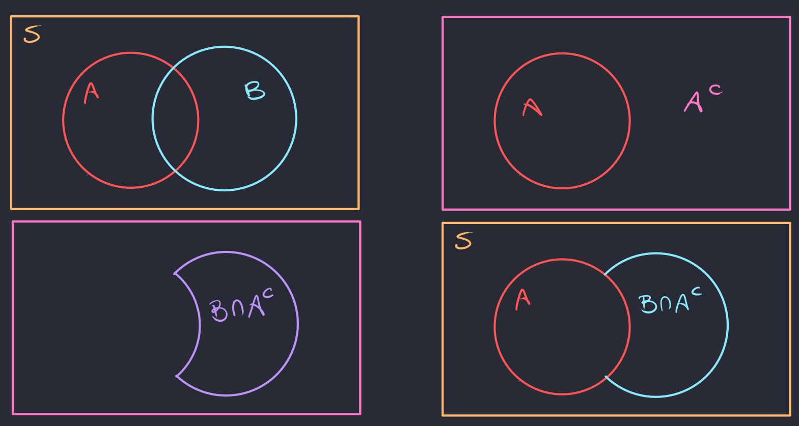

[Probabilidade](index.md)

<!-- wiki:original:inicio -->

# Primeiros passos em Probabilidade

## Fundamentos

### Naive Definition

Antes de vermos propriedades teoremas e definições difíceis, vamos começar com uma definição **super simples** do que é uma probabilidade. Intuitivamente, a probabilidade é a chance de um evento ocorrer. Se eu repetir um experimento $x$ vezes, quantas dessas $x$ vezes o evento ocorreu? Com essa noção mais prática de probabilidade, podemos fazer a seguinte definição

**Definição: Naive Probability Definition**

Seja $S$ o conjunto de **todas** as possíveis saídas de um experimento, e $E$ é um possível **acontecimento** dentro do experimento, então a probabilidade de $E$ ocorrer é

$$
{\mathbb{P}}(E) = \frac{\vert E\vert }{\vert S\vert }
$$

Essa definição mostra a probabilidade do evento ocorrer como uma fração, onde o numerador são **todas as formas que o evento pode ocorrer** sobre **todos os eventos possíveis de ocorrer**. Por exemplo, se eu jogar um dado justo, todos os valores possíveis são $S = \left\{ 1,2,3,4,5,6 \right\}$, a chance de sair evento *“caiu $2$”* seria $E = \left\{ 2 \right\}$, então a probabilidade de cair $2$ seria

$$
{\mathbb{P}}(E) = \frac{\vert E\vert }{\vert S\vert } = \frac{1}{6}
$$

### Conjuntos

Dada essa definição ingênua de probabilidade, podemos começar a pensar em como formalizar isso utilizando a ideia de **conjuntos**! Na verdade essa é a formalização mais básica de probabilidade. Vamos enunciar algumas definições então.

**Definição: Espaço Amostral**

O espaço amostral $S$ é o conjunto de **todos os resultados possíveis** de um experimento aleatório.

**Definição: Evento**

Um evento $E$ é um subconjunto do espaço amostral $S$, ou seja, $E \subseteq S$.

Essa definição de $E$ parece bem simples, mas se pararmos para pensar, um evento nada mais é que um conjunto de resultados possíveis de um experimento aleatório. Voltando ao exemplo do dado, se o meu espaço amostral é $S = \left\{ 1,2,3,4,5,6 \right\}$, faz sentido afirmar que *“cair $3$”* é um evento. Porém, falar *“cair o número $7$”* não faz sentido, pois $7$ não está no espaço amostral, logo, não é um **evento**.

**Corolário**

Dado $S$ um espaço amostral e $A,B \subseteq S$ sendo eventos em $S$, temos que

1.  $A \cup B$ é o evento onde **ou** $A$ **ou** $B$ ocorrem.

2.  $A \cap B$ é o evento onde **ambos** $A$ **e** $B$ ocorrem.

3.  $A^{c}$ é o evento onde $A$ **não** ocorre.

**Exemplo**

Dada uma moeda, jogamos ela $10$ vezes (cada jogada é **independente**), então, se for **cara**, é $1$ e se for coroa é $0$. Escrevemos então a jogada como uma sequência de $10$ bits, onde cada bit é $0$ ou $1$.

$$
(1,0,0,1,1,0,1,0,0,1)
$$

 vejamos algums eventos:

- Jogada $i$ ser cara e o resto ser coroa

$$
A_{i} = \left\{ (\ldots,1,\ldots)\text{ tal que }1\text{ está na posição }i\text{ e }i \in \left\{ 1,2,\ldots,10 \right\} \right\}
$$

- Ao menos uma jogada ser cara

$$
B = \cup_{i = 1}^{10}A_{i}
$$

- Todas as jogadas são cara

$$
C = \cap_{i = 1}^{10}A_{i}
$$

**Teorema: Lei de De Morgan**

Dado $S$ um espaço amostral e $A,B \subseteq S$ sendo eventos em $S$, temos que

1.  $(A \cup B)^{c} = A^{c} \cap B^{c}$

2.  $(A \cap B)^{c} = A^{c} \cup B^{c}$

**Demonstração**

Para a primeira igualdade, temos que provar que $(A \cup B)^{c} \subseteq A^{c} \cap B^{c}$ e depois $A^{c} \cap B^{c} \subseteq (A \cup B)^{c}$. Para a primeira parte, seja

$$
x \in (A \cup B)^{c} \Leftrightarrow x \notin A \cup B
$$

 logo, $x \notin A$ e $x \notin B$, ou seja, $x \in A^{c}$ e $x \in B^{c}$, então $x \in A^{c} \cap B^{c} \Rightarrow (A \cup B)^{c} \subseteq A^{c} \cap B^{c}$. Para a volta, seja $x \in A^{c} \cap B^{c}$, então $x \in A^{c}$ e $x \in B^{c}$, ou seja, $x \notin A$ e $x \notin B$, então $x \notin (A \cup B)$, ou seja, $A^{c} \cap B^{c} \subseteq (A \cup B)^{c}$.

Para a segunda igualdade, faremos o mesmo raciocínio. Seja $x \in (A \cap B)^{c}$ então $x \notin A \cap B$, ou seja, $x$ não ocorre **simultaneamente** em $A$ e $B$, logo $x \notin A$ **ou** $x \notin B$, ou seja, $x \in A^{c}$ **ou** $x \in B^{c}$, então $x \in A^{c} \cup B^{c} \Rightarrow (A \cap B)^{c} \subseteq A^{c} \cup B^{c}$. Para a volta, seja $x \in A^{c} \cup B^{c}$, então $x \in A^{c}$ **ou** $x \in B^{c}$, ou seja, $x \notin A$ **ou** $x \notin B$, logo $x \notin (A \cap B)$, ou seja, $A^{c} \cup B^{c} \subseteq (A \cap B)^{c}$.

## Propriedades da Probabilidade

A definição ingênua é útil, mas ela tem suas limitações. Definir uma probabilidade como

$$
{\mathbb{P}}(E) = \frac{\vert E\vert }{\vert S\vert }
$$

 exige que **duas** condições sejam satisfeitas:

1.  O espaço amostral $S$ deve ser **finito**.

2.  Todos os elementos do espaço amostral $S$ devem ser **equiprováveis**, ou seja, todos os elementos do espaço amostral devem ter a mesma chance de ocorrer.

Ambas as condições são muito restritivas, e é fácil pensar em situações onde essas condições não são satisfeitas. Por exemplo, se eu jogar uma moeda **viciada**, onde a chance de sair cara é $0.7$ e a chance de sair coroa é $0.3$, então o espaço amostral é $S = \left\{ \text{cara},\text{ coroa} \right\}$, mas os elementos do espaço amostral não são equiprováveis, logo, a definição ingênua não se aplica. Outro exemplo é se meu experimento for a quantidade de vezes que jogo uma moeda até cair cara, nesse caso, o espaço amostral é infinito, logo, a definição ingênua não se aplica.

A saída é mudar a pergunta. Em vez de dizer **como** calcular uma probabilidade, enunciamos **regras** que **toda e qualquer probabilidade razoável segue**.

$$
\begin{array}{r} {\mathbb{P}}(\varnothing) = 0\text{\quad\quad}{\mathbb{P}}(S) = 1\text{\quad\quad}{\mathbb{P}}(A) \geq 0 \\ {\mathbb{P}}(\bigcup_{n = 1}^{\infty}A_{n}) = \sum_{n = 1}^{\infty}{\mathbb{P}}(A_{n})\text{\quad\quad} \rightarrow A_{i} \cap A_{j} = \varnothing\quad\forall i \neq j \end{array}
$$

Com essas regras em mentes, conseguimos derivar as principais propriedades da probabilidade.

**Teorema**

$$
{\mathbb{P}}(A^{c}) = 1 - {\mathbb{P}}(A)
$$

**Demonstração**

$$
\begin{array}{r} 1 = {\mathbb{P}}(S) \Leftrightarrow 1 = {\mathbb{P}}(A^{c} \cup A) \\ \Leftrightarrow 1 = {\mathbb{P}}(A^{c}) + {\mathbb{P}}(A) \Leftrightarrow {\mathbb{P}}(A^{c}) = 1 - {\mathbb{P}}(A) \end{array}
$$

**Teorema**

Se $A \subseteq B$, então ${\mathbb{P}}(A) \leq {\mathbb{P}}(B)$

**Demonstração**

Montamos $B$ como $A \cup \left( B \cap A^{c} \right)$, se montarmos dessa forma, $A$ e $\left( B \cap A^{c} \right)$ são disjuntos. Antes de prosseguirmos, aqui está uma figura que ilustra a situação

*Figura 1. Ilustração da relação entre os conjuntos $A$ e $B$*

Dito isso, podemos então escrever:

$$
{\mathbb{P}}(B) = {\mathbb{P}}(A \cup \left( B \cap A^{c} \right)) = {\mathbb{P}}(A) + {\mathbb{P}}(B \cap A^{c}) \geq {\mathbb{P}}(A)
$$

**Teorema: Princípio da Inclusão-Exclusão**

$$
{\mathbb{P}}(A \cup B) = {\mathbb{P}}(A) + {\mathbb{P}}(B) - {\mathbb{P}}(A \cap B)
$$

**Demonstração**

Montamos $A \cup B$ como $A \cup \left( B \cap A^{c} \right)$, se montarmos dessa forma, $A$ e $\left( B \cap A^{c} \right)$ são disjuntos.

Dito isso, podemos então escrever:

$$
{\mathbb{P}}(A \cup B) = {\mathbb{P}}(A) + {\mathbb{P}}(B \cap A^{c})
$$

Temos então que mostrar que

$$
{\mathbb{P}}(B \cap A^{c}) = {\mathbb{P}}(B) - {\mathbb{P}}(A \cap B)
$$

 para isso, vamos mostra que, $\left( B \cap A^{c} \right) \cup (A \cap B) = B$. Para provar isso, vamos mostrar que $\left( B \cap A^{c} \right) \cup (A \cap B) = B \cap \left( A \cup A^{c} \right)$. Se $x \in B$, então $x \in A$ **ou** $x \notin A$, logo, $x \in S$, dessa forma

$$
x \in B \cap \left( A \cup A^{c} \right) \Leftrightarrow x \in B \cap S \Leftrightarrow x \in B
$$

 e temos que $B \cap A^{c}$ e $A \cap B$ são disjuntos, logo

$$
\begin{array}{r} {\mathbb{P}}(B) = {\mathbb{P}}(\left( B \cap A^{c} \right) \cup (A \cap B)) = {\mathbb{P}}(B \cap A^{c}) + {\mathbb{P}}(A \cap B) \\ \Leftrightarrow \\ {\mathbb{P}}(B \cap A^{c}) = {\mathbb{P}}(B) - {\mathbb{P}}(A \cap B) \end{array}
$$

**Teorema**

$$
\begin{aligned} {\mathbb{P}}(A \cup B \cup C) = & {\mathbb{P}}(A) + {\mathbb{P}}(B) + {\mathbb{P}}(C) \\ - & {\mathbb{P}}(A \cap B) - {\mathbb{P}}(A \cap C) - {\mathbb{P}}(B \cap C) \\ + & {\mathbb{P}}(A \cap B \cap C) \end{aligned}
$$

**Demonstração**

Derivado direto da outra propriedade. Defina

$$
D = A \cup B
$$

 então pelo [princípio da inclusão-exclusão](#inclusion-exclusion), temos que

$$
{\mathbb{P}}(A \cup B \cup C) = {\mathbb{P}}(D \cup C) = {\mathbb{P}}(D) + {\mathbb{P}}(C) - {\mathbb{P}}(D \cap C)
$$

 substituindo ${\mathbb{P}}(D)$ e ${\mathbb{P}}(D \cap C)$, temos que

$$
\begin{aligned} {\mathbb{P}}(A \cup B \cup C) = & {\mathbb{P}}(A) + {\mathbb{P}}(B) - {\mathbb{P}}(A \cap B) \\ + & {\mathbb{P}}(C) - {\mathbb{P}}(A \cap C) - {\mathbb{P}}(B \cap C) \\ + & {\mathbb{P}}(A \cap B \cap C) \end{aligned}
$$

A ideia desses teoremas é que, quando contamos os eventos, podemos acabar contando **duas vezes** os eventos que estão em comum, então precisamos subtrair esses eventos que estão em comum. Só que conforme adicionamos mais e mais eventos, podemos acabar subtraindo **demais** os eventos que estão em comum, então precisamos adicionar de volta esses eventos. E assim por diante, até que tenhamos contado todos os eventos corretamente.

## Eventos Independentes

Dois eventos $A$ e $B$ são independentes se a ocorrência de um não afeta a probabilidade do outro. De imediato, não vamos ver a definição formal de independência, que é fácil, mas vamos nos manter na **intuição**. A independência de dois eventos é perceptível quando **a ocorrência de um evento não influencia na saída de outro**. Por exemplo, se eu jogar um dado e uma moeda, a saída do dado não influencia na saída da moeda, logo, os eventos são independentes. Agora vamos supor que eu estou lançando **dois dados**, no entanto, a saída do segundo é somada à saída do primeiro. Nesse caso, a saída do segundo dado **depende** da saída do primeiro, logo, os eventos **não são** independentes.

## Problema do Aniversário

Que tal resolvermos um problema bem paradoxal para estimular nosso pensamento **probabilistico**? O problema do aniversário é o seguinte: qual a probabilidade de, em um grupo de $k$ pessoas, **pelo menos** duas delas fazerem aniversário no mesmo dia? Parece que para que isso aconteça, o grupo precisa ser grande, mas não é bem assim. Antes de resolvermos o problema, vou enunciar um teorema que será útil para provar o caso mais óbvio.

**Teorema: Princípio da Casa dos Pombos**

Se $n$ pombos são colocados em $m$ casas, e $n > m$, então **pelo menos** uma casa terá mais de um pombo.

Agora podemos enunciar as etapas da resolução do problema! Primeira coisa que fazemos é **remover as restrições**. Uma delas é o dia $29$ de fevereiro, que só ocorre em anos bissextos, então vamos **desconsiderar** esse dia. Outro ponto é que **cada dia** tem a **mesma chance** de ocorrer e são eventos **independentes**.

Para o caso de termos mais pessoas que dis do ano, pelo [princípio da casa dos pombos](#pidgeon-hole-principle), sabemos que **pelo menos** duas pessoas vão fazer aniversário no mesmo dia, logo a probabilidade será $1$.

Agora vamos analisar o caso geral para $k \leq 365$. Nessa situação, o mais fácil é calcular a probabilidade do evento **contrário**, ou seja, a probabilidade de que **todos do grupo tem aniversários diferentes**.

$$
{\mathbb{P}}(\text{todos diferentes}) = \frac{365}{365} \cdot \frac{364}{365} \cdot \frac{363}{365}\ldots \cdot \frac{365 - k + 1}{365} = \frac{\frac{365!}{(365 - k)!}}{365^{k}}
$$

Aqui, nós vamos no racicínio que o primeiro aniversariante tem $365$ opções, o segundo tem $364$ opções, o terceiro tem $363$ opções e assim por diante, até que o último aniversariante tenha $365 - k + 1$ opções. Como cada pessoa tem $365$ opções, então o número total de possibilidades é $365^{k}$. Logo, a probabilidade de **pelo menos** duas pessoas fazerem aniversário no mesmo dia é

$$
{\mathbb{P}}(\text{pelo menos dois iguais}) = 1 - {\mathbb{P}}(\text{todos diferentes}) = 1 - \frac{\frac{365!}{(365 - k)!}}{365^{k}}
$$

Quando $k = 23$, a probabilidade de que **pelo menos** duas pessoas façam aniversário no mesmo dia é de aproximadamente $50\%$.
<!-- wiki:original:fim -->

## Percurso de estudo

[Trilha: A1](../../trilhas/probabilidade/a1.md) · [Apresentação e contexto da fonte](../../trilhas/probabilidade/a1.md#apresentacao-original)

- Anterior: [Combinatória](combinatoria.md)

- Próximo: [Probabilidade Condicional](probabilidade-condicional.md)
