[Projeto e Análise de Algoritmos](index.md)

<!-- wiki:original:inicio -->

<a id="secao-20"></a>

# Algoritmos de Ordenação


<a id="bubble-sort"></a>
<a id="secao-21"></a>

## Bubble Sort

O algoritmo bubble sort (ordenação por flutuação) é uma das soluções mais simples para o problema de ordenação. A solução consiste em inverter (trocar) valores de posições adjacentes sempre que `v[i + 1] < v[i]`. Essa operação é executada para cada posição $0 \leq i < n - 1$ ao percorrer a sequência. Observe que ao percorrer a sequência j = n − 1 vezes executando esse procedimento atingimos a sequência ordenada.

**Exemplo**

Considere o seguinte array:


*Figura 14. Lista para exemplo do algoritmo Bubble Sort*

E a execução do código decorrerá da forma:

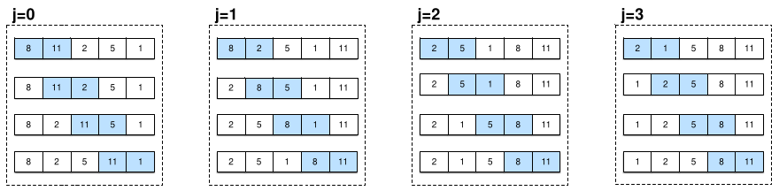

*Figura 15. Fluxo de código do algoritmo Bubble Sort*

Então, a ideia é percorrer cada item da lista e, sempre que um elemento a esquerda é maior que o elemento a direita, os dois trocam de posição

**IMPLEMENTAÇÃO**

``` cpp
#define swap(v, i, j) { int temp = v[i]; v[i] = v[j]; v[j] = temp; }

void bubbleSort(int v[], int n) {
  for (int j = 0; j < n - 1; j++) {
    for (int i = 0; i < n - 1; i++) {
      if (v[i] > v[i + 1]) {
        swap(v, i, i + 1);
      }
    }
  }
}
```

O algoritmo é executado $n - 1$ vezes e, a cada iteração do for de fora, ele executa $n - 1$ subprocessos, logo, no final teremos um total de $T(n) = \Theta(n^{2})$ de complexidade (tanto melhor quanto pior caso, já que independentemente da lista os dois fors vão até $n - 1$).

Porém, fazendo uma otimização no algoritmo:

**IMPLEMENTAÇÃO OTIMIZADA**

``` cpp
void bubbleSortOptimized(int v[], int n) {
  for (int j = 0; j < n - 1; j++) {
    bool swapped = false;
    for (int i = 0; i < n - 1; i++) {
      if (v[i] > v[i + 1]) {
        swap(v[i], v[i + 1]);
        swapped = true;
      }
    }
    if (!swapped) { break; }
  }
}
```

Essa otimização checa se dentro do loop maior houve alguma troca, se não houve nenhuma, então o algoritmo é encerrado, pois significa que está ordenado. Ao fazer isso, a complexidade do melhor caso desce para $\Theta(n)$.

<a id="selection-sort"></a>
<a id="secao-22"></a>

## Selection Sort

No selection sort, fazemos uma busca em **cada posição** pelo $i$-ésimo valor que **deveria** estar naquela posição


*Figura 16. Exemplificação do algoritmo Selection Sort*

Dada uma posição $i$, e assumindo que todas as posições anteriores já estão ordenadas, o algoritmo irá procurar dentre as próximas $n - i$ posições um valor menor que o da posição $i$. Se isso acontece, significa que esse valor deveria estar na posição que $i$, e então trocamos de posição.

**Exemplo**

Considere o caso:

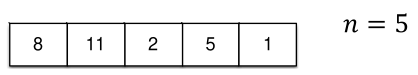

*Figura 17. Lista para exemplo do algoritmo Selection Sort*

E assim, o fluxo durante a execução do programa será:


*Figura 18. Fluxo do código do algoritmo Selection Sort*

**IMPLEMENTAÇÃO**

``` cpp
void selectionSort(int v[], int n) {
  for (int i = 0; i < n - 1; i++) {
    int minInx = i;
    for (int j = i + 1; j < n; j++) {
      if (v[j] < v[minInx]) {
        minInx = j;
      }
    }
    swap(v, i, minInx);
  }
}
```

No primeiro for, pegamos o índice `i`, e no segundo loop passamos em todos os índices a frente de `i`, e se for menor que o `v[i]`(ou algum que foi substituído), realiza a troca depois de todas as verificações. Dessa forma, sempre pegamos o menor valor de da lista do índice `i` para frente.

Para avaliar o desempenho, podemos montar seu custo total percebendo que, a cada iteração, o algoritmo avalia um elemento a menos, de forma que podemos expressar a **função de complexidade** como: $$\begin{aligned} T(n) & = (n - 1) + (n - 2) + \ldots + 1 + 0 \\ & = \sum_{i = 0}^{n - 1}i = \frac{n(n - 1)}{2} \end{aligned}$$ Ou seja, obtemos que $T(n) = \Theta(n^{2})$, que também é a complexidade no melhor caso, já que, novamente, os fors dependem totalmente de $n$.

<a id="insertion-sort"></a>
<a id="secao-23"></a>

## Insertion Sort

Parecido com o algoritmo de **Selection Sort**, que acabamos de ver. Porém, a ideia é fixar uma posição $i$ e avaliar o valor naquela posição, procurando dentre as posições $\lbrack 0,i - 1\rbrack$ qual deveria ser a posição que o valor da posição $i$ deveria estar:

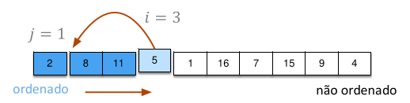

*Figura 19. Exemplificação do algoritmo Insertion Sort*

**Exemplo**

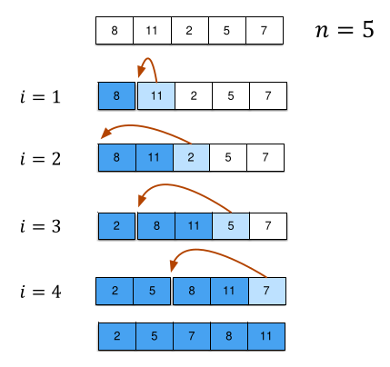

*Figura 20. Exemplo do algoritmo Insertion Sort*

**IMPLEMENTAÇÃO**

``` cpp
void insertionSort(int v[], int n) {
  for (int i = 1; i < n; i++) {
    int currentValue = v[i];
    int j;
    for (j = i - 1; j >= 0 && v[j] > currentValue; j--) {
      v[j + 1] = v[j]; 
    }
    v[j + 1] = currentValue;
  }
}
```

O loop externo começa no segundo elemento porque o primeiro já forma uma sublista ordenada. A cada iteração, o valor `v[i]` é guardado em `currentValue`. O loop interno percorre da direita para a esquerda os elementos da sublista ordenada, deslocando todos os valores maiores que `currentValue` uma posição à direita. O algoritmo para quando encontramos um elemento menor ou igual a `currentValue` ou quando chegamos ao início do vetor. Assim, a posição `j+1` é o local correto para inserir o `currentValue`, garantindo que, ao final da iteração, os elementos de `v[0..i]` estejam ordenados. A complexidade desse algoritmo também é expressa na forma: $$T(n) = \sum_{j = 1}^{n - 1}j = \frac{n(n - 1)}{2} = \Theta(n^{2})$$ já que o loop de dentro apresenta um range parecido com o do algoritmo Selection Sort. Perceba que, no melhor caso, $T(n) = \Theta(n)$, pois o loop de dentro sempre será quebrado em $O(1)$.

<a id="mergesort"></a>
<a id="secao-24"></a>

## Mergesort

A ideia do algoritmo consiste em dividir a sequência em duas partes, executar chamadas recursivas para cada sub-sequência, até que o tamanho das sequências sejam tão pequenas que caiam no caso trivial de se ordenar, e juntá-las (merge) de forma ordenada. Esse algoritmo depende de um algoritmo auxiliar de intercalação (merge)

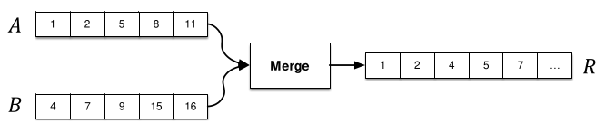

*Figura 21. Exemplificação do algoritmo Mergesort*

**FUNÇÃO DE INTERCALAÇÃO**

``` cpp
void merge(int v[], int startA, int startB, int endB) {
  int r[endB - startA];
  int aInx = startA;
  int bInx = startB;
  int rInx = 0;
  while (aInx < startB && bInx < endB) {
    if (v[aInx] <= v[bInx]) {
      r[rInx++] = v[aInx++];
    } else {
      r[rInx++] = v[bInx++];
    }
  }
  while (aInx < startB) { 
    r[rInx++] = v[aInx++]; 
  }
  while (bInx < endB) {
    r[rInx++] = v[bInx++]; 
  }
  for (aInx = startA; aInx < endB; ++aInx) {
    v[aInx] = r[aInx - startA];
  }
}
```

- Nota: em qualquer código `vector[índice++]`, o ++ incrementa automaticamente o índice depois da ação especificada, enquanto `vector[++índice]` incrementa antes.

Cria-se um vetor r do tamanho da lista passada antes da separação, e definimos alguns inteiros para não alterarmos os tamanhos originais e conseguirmos saber o que estamos fazendo com a lista. Sabemos que no vetor `v`, a parte `startA` até `startB - 1` está ordenada corretamente, e o mesmo vale para `startB` até `endB`.

O primeiro while serve para usar a ordem criada nas duas subsequências a nosso favor, ou seja, verificamos até alguma das duas chegar em seu tamanho final e, enquanto isso não acontece, comparamos cada elemento inicial de cada sub-sequência, e sabendo que estão ordenadas, não precisamos verificar outros elementos. O vetor `r` fica completamete ordenado, mas em caso de alguma contagem de índice(`aIdx` ou `bIdx`) acabar antes de outra, significa que alguns elementos do outro índice não foram passados para `r` ainda, e é para isso que servem os outros dois whiles no final. Por fim, o último for serve apenas para passar os elementos na ordem correta de `r` para o vetor original e ainda não ordenado `v`.

Os 3 whiles somam $n$ operações, e o for final outras $n$. Logo, a complexidade é $$T(n) = \Theta(n)$$

Agora que temos uma função que junta duas listas ordenadamente, conseguimos fazer o mergeSort. O algoritmo consiste em dividir a sequência do vetor $V$ em duas subsequências $A$ e $B$, fazendo isso recursivamente até que $V$ esteja ordenado.

**IMPLEMENTAÇÃO**

``` cpp
void mergeSort(int v[], int startInx, int endInx) {
  if (startInx < endInx - 1) {
    int midInx = (startInx + endInx) / 2;
    mergeSort(v, startInx, midInx);
    mergeSort(v, midInx, endInx);
    merge(v, startInx, midInx, endInx);
  }
}
```

Olhando o algoritmo, note que ele chama a recursão do mergeSort até que a diferença entre os dois index sejam um, portanto essa recursão acontece até que tenhamos $n$ listas de tamanho $1$, e o merge fará todo o trabalho de “ordenar”. Olhe o exemplo:

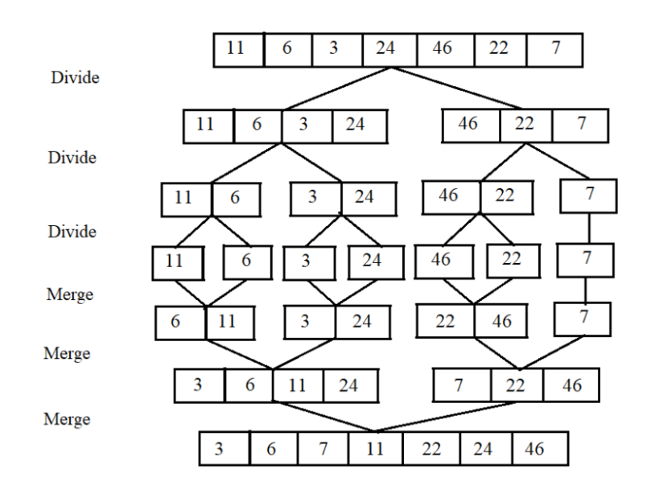

*Figura 22. Exemplo do algoritmo MergeSort*

Podemos então avaliar a função de complexidade: $$T(n) = 2T\left( \frac{n}{2} \right) + n$$

E já vimos em capítulos anteriores que isso é $T(n) = \Theta(n\log(n))$. Perceba que ele não compara todos os pares mesmo no pior caso, porém, ele exige um espaço de memória $O(n)$ **adicional** para a ordenação.

<a id="quicksort"></a>
<a id="secao-25"></a>

## Quicksort

É uma ideia parecida com o mergesort, mas contém um algoritmo auxiliar específico, com exceção também que buscamos um algoritmo que não necessite dos $O(n)$ de espaço adicional. O algoritmo escolhe um elemento, o qual chamamos de **pivô**, e separa em duas partições: Os elementos maiores e menores que o **pivô**.


*Figura 23. Exemplificação do algoritmo Quicksort*

Então resumimos o problema do particionamento como:

Dada uma sequência $v$ e um intervalo $\lbrack p,\ldots,r\rbrack$ transponha elementos desse intervalo de forma que ao retornar um índice $j$ (pivô) tenhamos: $$v\lbrack p,\ldots,j - 1\rbrack \leq v\lbrack j\rbrack \leq v\lbrack j + 1,\ldots,r\rbrack$$

Temos a seguinte implementação para o partition:

------------------------------------------------------------------------

**IMPLEMENTAÇÃO**

<a id="partition"></a>

``` cpp
#define swap(v, i, j) { int temp = v[i]; v[i] = v[j]; v[j] = temp; }
int partition(int v[], int p, int r) {
  int pivot = v[r];
  int j = p;
  for (int i=p; i < r; i++) {
    if (v[i] <= pivot) {
      swap(v, i, j);
      j++;
    }
  }
  swap(v, j, r);
  return j;
}
```

Olhando para o algoritmo temos `r`, que é o índice da lista que vamos ordenar em função, temos também `p`, que é o índice de onde vamos começar a ordenar, e `j`, que será a quantidade a partir de `p` de elementos menores que `v[r]`. No caso, ordenaremos para a sublista `v[p, ..., r]` em função de `v[r]`.

Fazemos um for de `p` até `r`, e se `v[i]` for menor que o pivô, trocamos o elemento indexado em `i` com o em `j`. Como `j` só é incrementado quando acha um valor menor, então o que estamos fazendo é separando uma área para os elementos menores que `v[r]` enquanto deixamos que os maiores continuem em suas posições(a menos de troca com menores). No final, trocamos o `v[r]` com a última incrementação de `j`, deixando menores a esquerda e maiores a direita. Retorna a posição correta de `v[r]`.

Como a sequência de $n$(a real é que a sequência é definida por `p` e `r`, mas normalmente esses valores serão o início e o fim da lista, respectivamente) elementos é percorrida uma única vez executando operações constantes, temos que $T(n) = \Theta(n)$

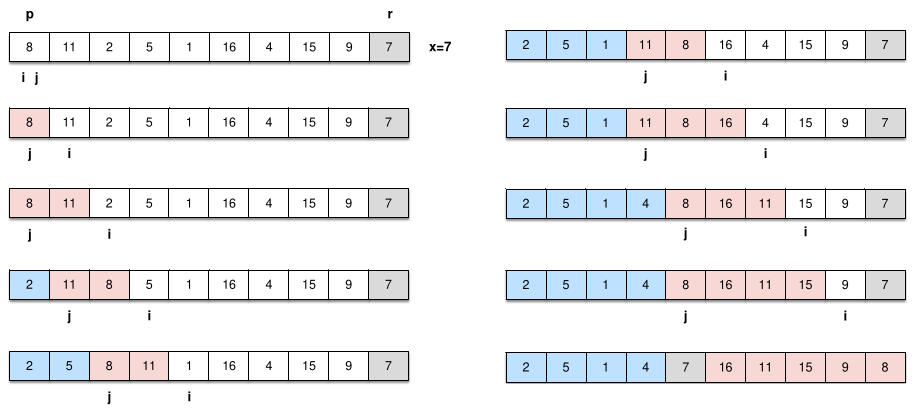

*Figura 24. Exemplo do algoritmo Partition*

Agora que temos a base, vamos para o algoritmo principal!

------------------------------------------------------------------------

**IMPLEMENTAÇÃO**

``` cpp
void quicksort(int v[], int p, int r) {
  if (p < r) {
    int j = partition (v, p, r);
    quicksort(v, p , j - 1);
    quicksort(v, j + 1, r);
  }
}
quicksort(v, 0, n - 1);
```

Funciona da seguinte forma: enquanto tivemos mais de um elemento na lista(isso que o if verifica), particionamos em cima de algum elemento da lista, e fazemos a mesma coisa recursivamente para a parte a esquerda e a direita da lista, com o elemento de j já ordenado.

Note que, se sempre pegarmos um elemento do muito ruim, a complexidade do algoritmo irá aumentar. Por isso, temos algumas formas de escolher o elemento para ordenar em função:

1.  Podemos permutar a entrada do vetor;

2.  Sortear algum índice aleatório.

Dessa forma aumentamos a probabilidade da partição ser razoavelmente equilibrida na média.

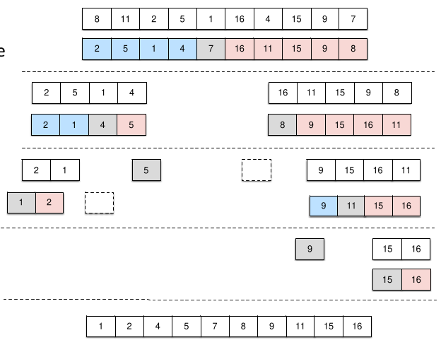

*Figura 25. Exemplo do algoritmo quicksort*

Temos que sua função de complexidade é tal que: $$\begin{aligned} T(n) & = T(j) + T(n - j - 1) + n \\ & = T(0) + 1 + 2 + 3 + \ldots + (n - 1) + n \\ & = \frac{n(n + 1)}{2} \\ & = \Theta(n^{2}) \end{aligned}$$ onde $j$ é o índice do primeiro elemento particionado.

O pior caso acontece quando o pivô é o último/primeiro elemento e ele é o maior/menor elemento, já que uma partição fica vazia

Já o melhor caso ocorre quando o algoritmo sempre divide todas as partições ao meio $$T(n) = 2T\left( \frac{n}{2} \right) + n = \Theta(n\log(n))$$

Já o caso médio ocorre quando o algoritmo divide em partições de tamanho diferente. Imagine que o algoritmo divide em partições do tipo $0.1n$ e $0.9n$ $$T(n) = T\left( \frac{n}{10} \right) + T\left( \frac{9n}{10} \right) + n$$

Podemos avaliar como $\Theta(n\log(n))$, ou seja, é o mesmo caso do melhor caso possível, mas tem uma constante maior. Então, conseguimos perceber que o desempenho do algoritmo depende da **escolha do pivô**. O pior caso é $\Theta(n^{2})$, porém só ocorre em casos muito extremos.

<a id="heapsort"></a>
<a id="secao-26"></a>

## Heapsort

O algoritmo Heapsort consiste em organizar os elementos em um heap binário e reinseri-los utilizando uma estratégia semelhante à do algoritmo de ordenação por seleção.

O heap (monte) é uma estrutura de dados capaz de representar um vetor sob a forma de uma árvore binária, que apresenta as seguintes propriedades:

- É uma árvore quase completa

- Todos os níveis devem estar preenchidos exceto pelo último.

- É mínimo ou máximo

  - Heap mínimo – cada filho será maior ou igual ao seu pai.

  - Heap máximo – cada filho será menor ou igual ao seu pai.

Por enquanto, vamos considerar os **heaps máximos**. A altura de um **heap** com $n$ nós é dada por $\left\lfloor {\log_{2}(n)} \right\rfloor$. Podemos representar um heap utilizando um **array**, de forma que ele segue as seguintes regras:

- O índice $1$ é a raíz da árvore

- O pai de qualquer índice $p$ é $\frac{p}{2}$, com exceção do nó raíz

- O filho esquerdo de um nó $p$ é $2p$

- O filho esquerdo de um nó $p$ é $2p + 1$

Essa abordagem de implementação elimina a necessidade de ponteiros para o pai e para os filhos.

<a id="heap-example"></a>


*Figura 26. Exemplo de HEAP*

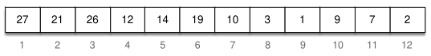

*Figura 27. Representação do [exemplo de heap](#heap-example) como vetor*

Podemos ordenar uma árvore em um heap caso as propriedades do vetor não sejam satisfeitas. Para isso, utilizamos o algoritmo **max-heapify**

- Assume-se que as sub-árvores do nó são heaps-máximos(ou mínimos no outro caso).

- Caso $v\lbrack p\rbrack$ seja menor que $v\lbrack 2p\rbrack$ ou $v\lbrack 2p + 1\rbrack$ escolhe o maior e executa a troca.

- Em seguida executa max-heapify recursivamente no nó filho alterado.

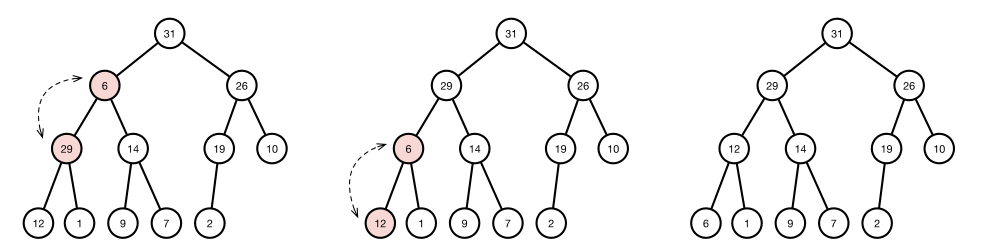

*Figura 28. Visualização do algoritmo max-heapify*

**IMPLEMENTAÇÃO**

``` cpp
void heapify(int v[], int n, int i) {
  int inx = i;
  int leftInx = 2 * i + 1;    
  int rightInx = 2 * i + 2;
  if ((leftInx < n) && (v[leftInx] > v[inx])) {
    inx = leftInx;
  }
  if ((rightInx < n) && (v[rightInx] > v[inx])) {
    inx = rightInx;
  }
  if (inx != i) {
    swap(v, i, inx);
    heapify(v, n, inx);
  }
}
```

Os índices da esquerda e da direita são criados como $2 \ast i + 1$ e $2 \ast i + 2$, em vez de $2 \ast i$ e $2 \ast i + 1$ por causa da indexação inicial de vetores nas linguagens. o inteiro `i` é o índice do nó que queremos corrigir.

Na primeira verificação vemos se o índice a esquerda que calculamos existe(sendo menor que $n$) e se o filho a esquerda do elemento `i` é maior. Fazemos a mesma coisa só que com o filho a direita de `v[i]`(note que a verificação do da direita compara não só com o pai, mas também com o filho a esquerda).

Se o índice mudou, ou seja, se algum filho é maior que o pai, então trocamos o pai pelo maior filho e fazemos heapify novamente.

A complexidade desse algoritmo é $T(n) = O\left( \log n \right)$, pela propriedade do heap que é criado como uma árvore quase completa, com a altura crescendo proporcionalmente com o número de elementos.

Agora, vamos aprender a construir esse heap:

**IMPLEMENTAÇÃO**

``` cpp
void buildHeap(int v[], int n) {
  for (int i=(n/2-1); i >= 0; i--) {
    heapify(v, n, i);
  }
}
```

Bom, não é nada muito difícil. Todos os nós depois de $\frac{n}{2}$ são folhas, logo, como o heapify garante a propriedade de heap para o nó i e sua subárvore, “afundando” o valor de `v[i]` se necessário, fazemos um for que ordenará desde a raiz até o último pai, garantindo a propriedade do heap por construção.

Vamos ver a complexidade do buildHeap:

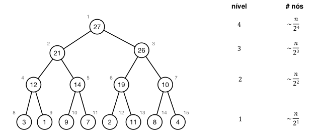

*Figura 29. Aproximação de um algoritmo heapsort*

Cada nível $i$, de baixo para cima, tem aproximadamente $n/2^{i}$ nós, ou seja, o custo total vai ser: $$T(n) = \sum_{i = 1}^{\log(n)}i \cdot \frac{n}{2^{i}} = O(n)$$

pois o somatório converge. Agora, dado o devido contexto sobre os **heaps**, vamos voltar para o algoritmo de **heapsort**. Esse algoritmo tem dois passos principais:

1.  Organizar o vetor de entradas em um **heap**

2.  Ordenar os elementos executando os seguintes passos para $v\lbrack n,\ldots,1\rbrack$:

    - Trocar o elemento atual $v\lbrack i\rbrack$ pela raíz $v\lbrack 1\rbrack$ ($v\lbrack 1\rbrack$ é o maior elemento do heap)

    - Corrigir o **heap** usando o **heapify** para a raíz

Dessa forma ignoramos a parte já ordenada que colocamos de `v[i]` para frente e fazemos heapify com o restante da lista.

**IMPLEMENTAÇÃO**

``` cpp
void heapSort(int v[], int n) {
  buildHeap(v, n);
  for (int i=n-1; i > 0; i--) {
    swap(v, 0, i);
    heapify(v, i, 0);
  }
}
```

Para analisar o desempenho, podemos fazer o seguinte:

- **Construção do heap**: Executa um **heapify** em um vetor de $\approx n/2$ posições, logo $O\left( n\log(n) \right)$

- **Ordenação**: Executa o **heapify** para cada elemento em um vetor de $n - 1$ posições, logo, temos um $O\left( n\log(n) \right)$

No final, somando tudo, temos que $T(n) = \Theta(n\log(n))$.

<a id="counting-sort"></a>
<a id="secao-27"></a>

## Counting Sort

O algoritmo de ordenação por contagem consiste em computar para cada elemento quantos elementos menores existem na lista, pois, sabendo que o elemento $v_{i}$ possui $j$ elementos menores do que ele, podemos definir sua posição final como $j + 1$

Vamos enunciar novamente nosso problema:

Desejamos ordenar os elementos do vetor $v\lbrack 0,\ldots,n - 1\rbrack$ considerando as seguintes restrições:

- Os elementos são números inteiros.

- Os números estão presentes no intervalo $\lbrack 0,\ldots,k - 1\rbrack$

- O universo possui tamanho $k$.

- $k$ é pequeno


*Figura 30. Array de Exemplo*

Nesse exemplo, temos um total de $11$ elementos e $6$ opções entre eles (os elementos vão de $0$ à $5$)


*Figura 31. Array de frequência de cada número $f$*

Criamos então um a **sequência auxiliar** de tamanho $k$. Nessa sequência, cada índice representa um elemento específico do array e os elemento representam **quantas vezes esses elementos aparecem na lista original**. Com essa sequência $f$, vamos gerar **outra** sequência auxiliar $sf$, de tal forma que: $$sf_{i} = \sum_{j = 0}^{i - 1}f\lbrack j\rbrack = f\lbrack i - 1\rbrack - sf\lbrack i - 1\rbrack\text{\quad\quad}(i > 0)$$ Ou seja, o elemento $i$ de $sf$ é a **quantidade de elementos menores que $i$**

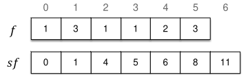

*Figura 32. Segunda lista auxiliar $sf$*

Então, utilizando $sf$, podemos criar uma nova lista ordenada, de forma que o elemento $i \in \lbrack 0,k\rbrack$ estará localizado no índice $sf_{i}$

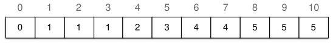

*Figura 33. Lista ordenada*

**IMPLEMENTAÇÃO**

``` cpp
void countingSort(int v[], int n, int k) {
  int fs[k + 2];                 //+1 indexação de arrays +1  de fs[0] = 0
  int temp[n];
  for (int j = 0; j < k + 2; j++) {
    fs[j] = 0;
  }
  for (int i = 0; i < n; i++) {
    fs[v[i] + 1] += 1;            //note que fs[0] = 0
  }
  for (int j = 1; j <= k; j++) {
    fs[j] += fs[j - 1];
  }
  for (int i = 0; i < n; i++) {
    int j = v[i];
    temp[fs[j]] = v[i];
    fs[j]++;
  }
  for (int i = 0; i < n; i++) {
    v[i] = temp[i];
  }
}
```

Criamos o vetor da soma de frequências com $k + 1$ entradas, e o vetor temp, que servirá para ordenar depois das frequências contadas. O primeiro for simplesmente preenche cada elemento de `fs` como $0$. O segundo for conta quantas vezes cada valor aparece (armazenando em `fs[v[i] + 1]`).

O terceiro loop somará todas as frequências anteriores para definir a posição correta dos elementos de índice $j$, transformando `fs` em um array de prefixos acumulados. No quarto loop pegamos j que é o valor de `v[i]` e vemos qual o começo desse valor na lista de frequências, e adicionamos no lugar certo de temp graças a isso. Após, incrementamos o valor de `fs[j]`, pois, se o mesmo número aparecer, ele deve ir no próximo elemento depois do adicionado na iteração.

Por fim, o último loop apenas passa a lista ordenada em `temp` para `v`.

Podemos avaliar o desempenho do algoritmo Counting Sort através da seguinte função: $$\begin{aligned} f(n,k) & = c_{1}k + c_{2}n + c_{3}k + c_{4}n + c_{5}n \\ & = \left( c_{1} + c_{3} \right)k + \left( c_{2} + c_{4} + c_{5} \right)n \\ & = \Theta(k + n) \end{aligned}$$

Exige $O(n + k)$ de espaço adicional. Portanto, se k for muito pequeno a complexidade será $\Theta(n)$. É considerado um algoritmo eficiente para ordenar sequências com elementos repetidos.

<a id="radix-sort"></a>
<a id="secao-28"></a>

## Radix Sort

O algoritmo Radix sort consiste em ordenar os elementos de uma sequência digito à digito, do menos significativo para o mais significativo. Considera que cada elemento é uma sequência com $w$ dígitos (Todos os elementos precisam ter $w$ dígitos). Embora o termo dígito remeta à números do conjunto $\left\{ 0,1,\ldots,9 \right\}$, podemos utilizar qualquer valor que possa ser mapeado em um inteiro


*Figura 34. Radix Sort exemplo*

**IMPLEMENTAÇÃO**

``` cpp
void radixSort(unsigned char * v[], int n, int W, int K) {
  int fp [K + 1];
  unsigned char* aux[n];
  for (int w = W - 1; w >= 0; w--) {
    for (int j = 0; j <= K; j++) { fp[j] = 0; }
    for (int i = 0; i < n; i++) {
      fp[v[i][w] + 1] += 1;
    }
    for (int j = 1; j <= K; j++) { fp[j] += fp[j - 1]; }
    for (int i = 0; i < n; i++) {
      int j = v[i][w];
      aux[fp[j]] = v[i];
      fp[j]++;
    }
    for (int i = 0; i < n; i++) { v[i] = aux[i]; }
  }
}
```

Note que esse código é literalmente o Counting Sort só que para cada “dígito” do elemento. Portanto, a explicação do código está uma seção acima.

Podemos avaliar o desempenho do algoritmo Radix Sort através da seguinte função: $$\begin{aligned} f(n,k,w) & = w\left( c_{1}k + c_{2}n + c_{3}k + c_{4}n + c_{5}n \right) \\ & = w\left( \left( c_{1} + c_{3} \right)k + \left( c_{2} + c_{4} + c_{5} \right)n \right) \\ & = \Theta(w(k + n)) \end{aligned}$$ Exige $O(n + k)$ de espaço adicional. Se $k$ e $w$ forem pequenos a complexidade pode ser avaliada como $\Theta(n)$.

<a id="bucket-sort"></a>
<a id="secao-29"></a>

## Bucket Sort

Esse algoritmo vai utilizar de hash tables para fazer ordenação de números potencialmente uniformes. Vamos pegar uma sequência de números **fracionários** $v$ com $n$ elementos e dividí-la em $n$ grupos (baldes).

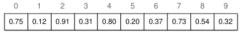

*Figura 35. Lista de valores em $\lbrack 0,1)$ para exemplificação do algoritmo Bucketsort*

Vamos pressupor que os valores estão **todos** normalizados entre $\lbrack 0,1\rbrack$

- Criar um vetor $b$ com tamanho $n$

  - Cada elemento de $b$ é uma lista encadeada

- Para cada elemento $v\lbrack i\rbrack$

  - Inserir em $b$ na posição $\left\lfloor {n \cdot v\lbrack i\rbrack} \right\rfloor$

- Para cada lista $b\lbrack i\rbrack$

  - Ordenar os seus elementos utilizando algum algoritmo conhecido

    - Ex: Insertion Sort

- Para cada lista $b\lbrack i\rbrack$

  - Para cada elemento $j$ de $b\lbrack i\rbrack$

    - Inserir na lista original $v$

``` cpp
void bucketSort(float v[], int n) {
  vector<float> b[n];
  for (int i = 0; i < n; i++) {
    int inx = n * v[i];
    b[inx].push_back(v[i]);
  }
  for (int i = 0; i < n; i++) {
    insertionSort(b[i]);
  }
  int index = 0;
  for (int i = 0; i < n; i++) {
    for (int j = 0; j < b[i].size(); j++) {
      v[index++] = b[i][j];
    }
  }
}
```

O algoritmo inicia criando um vetor `b`(um array de n buckets, e cada bucket é um std::vector) de tamanho `n`, e após declara um **inteiro**(vai servir como a função piso) e multiplica o elemento no índice `i` por `n`, Exemplo: `v[i] = 0.23` e `n = 10`, então `inx = 2`.

Após adicionar cada elemento à seu respectivo bucket, ordena cada bucket com o algoritmo insertionSort e, por fim, faz dois fors, percorrendo cada bucket no de fora e cada elemento do bucket no de dentro, e como estão ordenados, apenas os adiciona na lista original.

Podemos avaliar o desempenho do algoritmo através da seguinte função: $$T(n) = \Theta(n) + \sum_{i = 0}^{n - 1}n_{i}^{2}$$ Portanto, temos que:

- O melhor caso é $\Theta(n)$ - cada balde recebe exatamente um elemento.

- O pior caso é $\Theta(n^{2})$ - um único balde recebe n elementos.

- O caso médio é $\Theta(n)$ - considerando a [distribuição uniforme](../probabilidade/distribuicoes-continuas.md#secao_dist_uniforme) esperada, poucos elementos caem no mesmo balde.

- Exige $O(n)$ de espaço adicional.

------------------------------------------------------------------------

<!-- wiki:original:fim -->


## Percurso de estudo

[Trilha: A1](../../trilhas/projeto-e-analise-de-algoritmos/a1.md) · [Apresentação e contexto da fonte](../../trilhas/projeto-e-analise-de-algoritmos/a1.md#apresentacao-original)

- Anterior: [Tabela Hash](tabela-hash.md)
- Próximo: [Algoritmos de Seleção](algoritmos-de-selecao.md)
