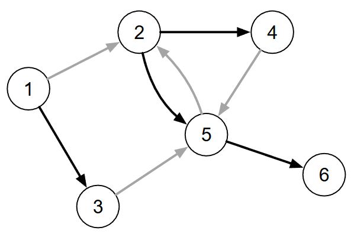
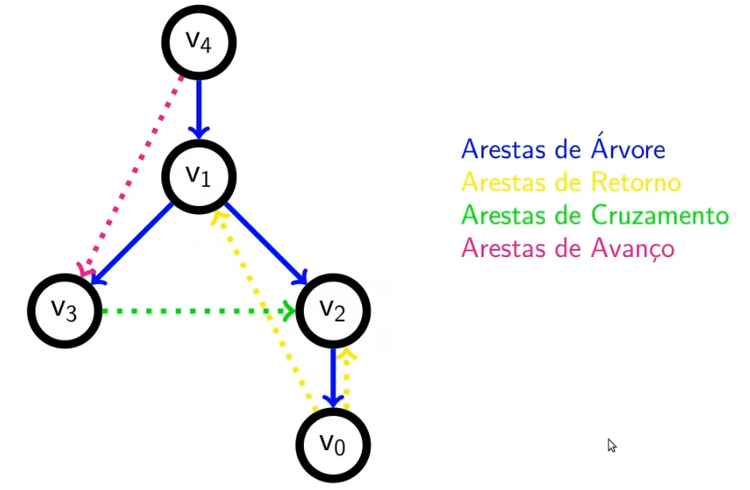

[Projeto e Análise de Algoritmos](index.md)

<!-- wiki:original:inicio -->

<a id="secao-18"></a>

# Busca em Grafos


<a id="dfs"></a>
<a id="secao-19"></a>

## DFS

O algoritmo de **busca em profundidade (Depth First Search)** consiste em visitar todos os vértices ao menos uma vez e levantar propriedades sobre a estrutura do grafo

Vamos começar identificando a ordem de descoberta dos vértices (ou pré-ordem). Em **C++:**

Esse código assume a existência de tipos como ‘vertex’, ‘EdgeNode” e variáveis de membro como ‘m_numVertices” e ‘m_edges’, que seriam parte de uma classe de Grafo. Ele usa algumas funções que não definiu antes, e eu não vou ficar tentando entender isso agora :p

``` cpp
void dfs(int * preOrder) {
    int counter = 0;
    for (vertex v=0; v < m_numVertices; v++) {
        preOrder[v] = -1;
    }
    for (vertex v=0; v < m_numVertices; v++) {
        if (preOrder[v] == -1) {
            dfsRecursive(v, preOrder, counter);
        }
    }
}

void dfsRecursive(vertex v1, int * preOrder, int & counter) {
    preOrder[v1] = counter++;
    EdgeNode * edge = m_edges[v1];
    while (edge) {
        vertex v2 = edge->otherVertex();
        if (preOrder[v2] == -1) {
            dfsRecursive(v2, preOrder, counter);
        }
        edge = edge->next();
    }
}
```

Implementação em Python:

Intuitiva com a ideia, inicia a lista de descoberto como $- 1$ e se o vértice é $- 1$ (ainda não descoberto), realiza a busca profunda partindo desse vértice, e atualizando a lista ``preorder`` da ordem que foi a partir do primeiro ``v``.

``` py
def dfs_preorder(adj_list):
    num_vertices = len(adj_list)
    preorder = [-1] * num_vertices
    counter = 0 
    for v in range(num_vertices):
        if preorder[v] == -1: 
            counter = dfs_recursive(v, preorder, counter, adj_list)
    return preorder

def dfs_recursive(v_atual, preorder, counter, adj_list): #Auxiliar
    preorder[v_atual] = counter
    counter += 1
    for v_vizinho in adj_list[v_atual]:
        if preorder[v_vizinho] == -1:
            counter = dfs_recursive(v_vizinho, preorder, counter, adj_list)
    return counter
```

Voltando ao exemplo inicial, veja como seria o algoritmo:


*Figura 27. Exemplo da execução do algoritmo DFS para o mesmo grafo*

À esquerda, os parênteses indicam as arestas visitadas e a lista da ordem de visita. A interpretação de ``preorder`` é: o vértice $1$ foi o primeiro a ser visitado, o vértice $3$ foi o segundo, o $5$ o terceiro e assim sucessivamente.

Dizemos então que um vértice $v$ é **visitado** quando ``preOrder\[v\]`` é consultado e que um vértice $v$ é **descoberto** quando ``preOrder\[v\]`` é definido (a busca pode iniciar em qualquer vértice).

A abordagem de tentar percorrer a partir de cada vértice garante que todos os vértices serão inspecionados, mesmo que o grafo não seja conexo. Além disso, um grafo pode apresentar múltiplas sequências de pré-ordem (depende da ordem em que as arestas são inspecionadas).

Falando de complexidade, sabemos pelo algoritmo que cada vértice será processado uma única vez, e em cada vértice são verificadas cada $g_{s}\left( v_{i} \right)$ arestas. Sabendo que isso soma $\vert E\vert$, fica claro que temos uma complexidade de $\Theta(\vert V\vert  + \vert E\vert )$ usando [lista de adjacências](grafos.md#secao-12), e $\Theta(\vert V\vert ^{2})$ para matriz de adjacência.

<a id="grafo-topologico"></a>
<a id="secao-20"></a>

## Grafo topológico

Um **grafo topológico** é um grafo que admite uma ordenação dos vértice de forma que para toda aresta $\left( v_{i},v_{j} \right)$ temos que $i < j$.


*Figura 28. Exemplo da grafo topológico (Note que se os vértices forem dispostos em ordem crescente toda aresta irá apontar para o sentido de crescimento dos números).*

Algumas propriedades de grafos topológicos:

- Não apresentam ciclos;

- Todo vértice é:

  - o término de um caminho que começa numa fonte;

  - a origem de um caminho que termina num sorvedouro;

- Se um grafo é topológico, podem existir várias numerações topológicas diferentes;

Como verificar se um grafo $G = (V,E)$ possui numeração topológica e determiná-la?

Podemos eliminar uma fonte $g_{e}\left( v_{k} \right) = 0$ de $G$ produzindo um subgrafo $G'$, e repetindo o procedimento sobre ele. Se redumovermos a fonte inicial, isso provavelmente vai criar (caso não tenhamos outra) outra fonte. Se não criar, isso significa que o restante dos vértices estão presos em um ciclo. Numere os vértices removidos, e, se todos eles forem removidos, a numeração é topológica.

**Nota:** O exercício de como fazer o algoritmo que verifica a topologia do grafo está na pasta Exercises.

Uma **floresta radicada** é um grafo topológico sem vértices com grau de entrada maior que 1

As fontes de uma floresta radicada são as raízes das árvores, e os sorvedouros são folhas.

A floresta gerada pela execução do algoritmo de busca em profundidade também é chamada de floresta DFS (essa floresta é também um grafo gerador).



*Figura 29. Exemplo de floresta radicada (a raiz no 2 foi proposital)*

<a id="dfs-modificado"></a>
<a id="secao-21"></a>

## DFS modificado

Dado que o grau de entrada de cada vértice é no máximo $1$, podemos representar a floresta DFS como um vetor de pais (parents). Portanto, o algoritmo pode ser modificado para gerar a árvore DFS da seguinte forma:

Esse código assume a existência de tipos como ‘vertex’, ‘EdgeNode” e variáveis de membro como ‘m_numVertices” e ‘m_edges’, que seriam parte de uma classe de Grafo.

Esse código é bem parecido com o DFS anterior, a menos da marcação para ``parents``.

``` cpp
void dfs(int * preOrder, int * parents) {
    int counter = 0;
    for (vertex v=0; v < m_numVertices; v++) {
        preOrder[v] = -1;
        parents[v] = -1;
    }

    for (vertex v=0; v < m_numVertices; v++) {
        if (preOrder[v] == -1) {
            parents[v] = v; 
            dfsRecursive(v, preOrder, counter, parents, 0);
        }
    }
}


void dfsRecursive(vertex v1, int * preOrder, int & counter, int * parents, int level=0) {
    preOrder[v1] = counter++;
    EdgeNode * edge = m_edges[v1];
    while (edge) {
        vertex v2 = edge->otherVertex();
        if (preOrder[v2] == -1) {
            parents[v2] = v1; // Set parent first
            dfsRecursive(v2, preOrder, counter, parents, level + 1);
        }
        edge = edge->next();
    }
}
```

Focando na função ``dfs_parents``, e, usando lista de adjacência, criamos a lista de ordem e de pais, e o ``counter``(para marcação de pré-ordem) como $0$. Para cada item da ordem do vértice, se a pré-ordem for $- 1$, ou seja, se não tivermos descoberto o vértice ainda (procurando vértices de partida), então ele é marcado como item de partida (se referenciando ``parents\[i\] = i``). Após isso para cada vértice de partida, iniciamos a marcação.

No ``dfs_recursive_parents``, incrementamos o ``counter`` a cada uso da função (para atualizar o ``preorder``), e a cada filho da lista de adjacências, marca o vértice atual como pai (apenas se esse filho não tiver sido visitado, ignorando filhos já visitados por “outros pais”).

``` py
def dfs_recursive_parents(v_atual, preorder, parents, counter, adj_list):
    preorder[v_atual] = counter
    counter += 1
    for v_vizinho in adj_list[v_atual]:
        if preorder[v_vizinho] == -1:
            parents[v_vizinho] = v_atual  
            counter = dfs_recursive_parents(v_vizinho, preorder, parents, counter, adj_list)

    return counter

def dfs_parents(adj_list):
  num_vertices = len(adj_list)
  preorder = [-1] * num_vertices
  parents = [-1] * num_vertices
  counter = 0

  for v in range(num_vertices):
      if preorder[v] == -1:
          parents[v] = v   
          counter = dfs_recursive_parents(v, preorder,parents, counter, adj_list)
  return preorder, parents
```

Como isso funcionaria no exemplo que já vimos até agora?


*Figura 30. Exemplo do algoritmo ``dfs_parents`` para o grafo de exemplo.*

um vértice é **exaurido** (essa definição não é minha e não está nos slides do Thiago) no momento em que a busca já explorou todos os caminhos possíveis que saem daquele vértice.

Uma outra informação que podemos gerar a partir da execução de um DFS é a ordem em que os vértices são exauridos (essa sequência é conhecida como pós-ordem).

O algoritmo de DFS pode ser modificado de forma que registre o momento em que o algoritmo termina a avaliação do vértice, da seguinte forma:

``` cpp
void dfs(int * preOrder, int * postOrder,
         int * parents) {
    int preCounter = 0;
    int postCounter = 0;
    for (vertex v=0; v < m_numVertices; v++) {
        preOrder[v] = -1;
        parents[v] = -1;
        postOrder[v] = -1;
    }

    for (vertex v=0; v < m_numVertices; v++) {
        if (preOrder[v] == -1) {
            parents[v] = v;
            dfsRecursive(
                v, preOrder, preCounter,
                postOrder, postCounter, parents);
        }
    }
}

void dfsRecursive(vertex v1, int * preOrder, int & preCounter, int * postOrder,
                  int & postCounter, int * parents) {
    preOrder[v1] = preCounter++;
    EdgeNode * edge = m_edges[v1];
    while (edge) {
        vertex v2 = edge->otherVertex();
        if (preOrder[v2] == -1) {
            parents[v2] = v1;
            dfsRecursive(v2, preOrder, preCounter,
                         postOrder, postCounter, parents);
        }
        edge = edge->next();
    }
    postOrder[v1] = postCounter++;
}
```

Note que ele é o mesmo algoritmo que o do DFS modificado, a menos de uma declaração da lista de pós-ordem e preenchimento no fim do while, após exaurir o vértice. Note que

``` py
def dfs_recursive_full(v_atual, preorder, postorder, parents, pre_counter, post_counter, adj_list):
    preorder[v_atual] = pre_counter
    pre_counter += 1
    for v_vizinho in adj_list[v_atual]:
        if preorder[v_vizinho] == -1:
            parents[v_vizinho] = v_atual
            pre_counter, post_counter = dfs_recursive_full(v_vizinho, preorder, postorder, parents, pre_counter, post_counter, adj_list)
    postorder[v_atual] = post_counter
    post_counter += 1
    return pre_counter, post_counter

def dfs_full(adj_list):
    num_vertices = len(adj_list)
    preorder = [-1] * num_vertices
    postorder = [-1] * num_vertices
    parents = [-1] * num_vertices
    pre_counter = 0
    post_counter = 0
    for v in range(num_vertices):
        if preorder[v] == -1:
            parents[v] = v  
            pre_counter, post_counter = dfs_recursive_full(v, preorder, postorder, parents, pre_counter, post_counter, adj_list)
return preorder, postorder, parents
```

Focando na pós-ordem, como seria a execução desse algoritmo nos grafos que vimos até agora?


*Figura 31. Exemplo do algoritmo ``dfs_parents_full`` para o grafo de exemplo.*

<a id="propriedades-uteis-advindas-do-dfs"></a>
<a id="secao-22"></a>

## Propriedades úteis advindas do DFS

Algumas delas já vimos: ordenação topológica, floresta DFS, etc. Vamos ver outras

O **intervalo de vida (lifespan)** de um vértice no contexto da busca ocorre entre o momento que ele é descoberto e o momento em que ele é exaurido. Ele não pode ser definido como ``(preOrder\[v\], postOrder)``, pois são numerações independentes (isso APENAS no algoritmo passado, normalmente o lifespan é definido dessa forma).

Considere dois vértices $v_{1}$ e $v_{2}$.

- Se $v_{1}$ é descoberto antes de $v_{2}$, então $v_{1}$ é exaurido:

  - Antes de $v_{2}$ ser descoberto ($v_{2}$ não tem nenhum parentesco próximo de $v_{1}$, por isso $v_{1}$ e seus filhos são vistos, $v_{1}$ é exaurido e só depois $v_{2}$ é descoberto);

  - Depois de $v_{2}$ ser exaurido (para o caso em que $v_{2}$ é filho de $v_{1}$, que acontece porque na chamada recursiva o filho tem que ser limpo primeiro).

Como podemos representar o intervalo de vida da execução do DFS no grafo a seguir?


*Figura 32. Exemplo do mapeamento do lifespan no grafo de exemplo.*

À esquerda temos a aresta escolhida e ao lado a iteração anterior (começando do vértice 1). a listagem à direita da escolha à esquerda é o histórico da chamada de funções para o vértice i. A lista em baixo representa visualmente o lifespan de cada vértice.

Dado dois vértices $v_{1}$ e $v_{2}$ de uma floresta radicada produzida pro uma execução DFS, o relacionamento desses dois vértices pode ser:

- Ancestral: $v_{1}$ é ancestral de $v_{2}$ se, para chegar em $v_{2}$, o algoritmo DFS “passou por” $v_{1}$ primeiro. (lifespan de $v_{2}$ contido no lifespan de $v_{1}$);

- Descendente: É o oposto de ancestral. $v_{2}$ é descendente de $v_{1}$ se $v_{1}$ for seu ancestral.;

- Primo descreve qualquer par de vértices que não tem relação de ancestralidade (lifespans disjuntos).

Primos ainda podem ser comparados:

- $v_{1}$ é primo mais velho de $v_{2}$ se:

  - ``preOrder\[v1\] \< preOrder\[v2\]``

- $v_{1}$ é primo mais novo de $v_{2}$ se:

  - ``preOrder\[v1\] \> preOrder\[v2\]``

Arestas que não pertencem à floresta DFS podem ser classificados de acordo com o grau do parentesco:

- Uma aresta é de retorno caso $v_{j}$ seja ancestral de $v_{i}$;

- Uma aresta é de avanço caso $v_{j}$ seja descendente de $v_{i}$;

- Uma aresta é cruzada caso $v_{j}$ seja primo de $v_{i}$.

Algumas outras características:

- Vértices de arestas cruzadas podem estar em diferentes árvores da floresta;

- Arestas cruzadas são sempre de um primo mais novo para um primo mais velho;

- Grafos não-orientados não possuem arestas cruzadas.

**Problema:** Dada uma aresta não pertencente à floresta DFS, como determinar algoritmicamente se:

- É uma aresta de avanço:

  - se o intervalo de $v_{j}$ está contido no intervalo de $v_{i}$, ou seja:

  - `preOrder[vi] < preOrder[vj] AND postOrder[vi] > postOrder[vj]`

- É uma aresta de retorno:

  - se o intervalo de $v_{j}$ contém o intervalo de $v_{i}$, ou seja:

  - `preOrder[vi] > preOrder[vj] AND postOrder[vi] < postOrder[vj]`

- É uma aresta cruzada:

  - se o intervalo de $v_{j}$ ocorre antes do intervalo de $v_{i}$, ou seja:

  - `preOrder[vi] > preOrder[vj] AND postOrder[vi] > postOrder[vj]`



*Figura 33. Exemplo de arestas de avanço, retorno e cruzada.*

**Nota:** essas propriedades para as arestas que não são da árvore são apenas quando usamos o `preOrder` e o `postOrder` com a contagem junta, ou seja, dependentes, da forma:

``` py
## Índices:     0  1  2  3  4
pre_order  = [ 4, 2, 3, 7, 1]
post_order = [ 5, 9, 6, 8, 10]
```

Nesse caso, as definições valem do jeito que foram passadas.

Algumas outras propriedades:

- Um grafo é acíclico se e somente se possuir uma numeração topológica.

- Grafos acíclicos também são chamados de **DAGs** (Direct acyclic graphs).

- Uma floresta radicada é um DAG sem vértices com grau de entrada maior que 1.

- Uma árvore radicada é um DAG em que exatamente um vértice tem grau de entrada zero, e os demais grau de entrada 1.

**Problema:** Como determinar se um grafo $G = (V,E)$ possui ao menos um ciclo?

Basta executar a busca DFS e procurar por uma aresta de retorno comparando os intervalos de vida encontrados para cada vértice. Veja o código em C++:

``` cpp
bool hasCycle(int * preOrder, int * postOrder) {
dfs(preOrder, postOrder);
for (vertex v1=0; v1 < m_numVertices; v1++) {
    EdgeNode * edge = m_edges[v1];
    while(edge) {
        vertex v2 = edge->otherVertex();
        if (preOrder[v1] > preOrder[v2]
            && postOrder[v1] < postOrder[v2]) {
            return true;
        }
        edge = edge->next();
    }
}
return false;
}
```

**Implementação em Python:**

Indo para Python, vamos considerar que passamos as listas de preorder e postorder:

``` py
def has_cycle(adj_list, preorder, postorder):
    num_vertices = len(adj_list)
    for v1 in range(num_vertices):
        for v2 in adj_list[v1]:            
            if preorder[v1] > preorder[v2] and postorder[v1] < postorder[v2]:
                return True
    return False
```

<a id="bfs"></a>
<a id="secao-23"></a>

## BFS

O algoritmo de busca em largura (BFS - Breadth First Search) é uma outra estratégia de varredura em um grafo. A ideia principal é:

Percorrer o grafo por camadas, ou seja:

- Inicia visitando um grafo $v_{0}$;

- Visita seus vértices adjacentes;

- Visita os adjacentes dos adjacentes (que ainda não foram visitados);

- Continua até todos os vértices terem sido visitados.

Assim como o DFS, define a ordem de descoberta dos vértices.


*Figura 34. Exemplo do algoritmo BFS (note que cada nível está de uma cor).*

Uma implementação comum desse algoritmo utiliza uma fila para armazenar os vértices descobertos que ainda não foram explorados. Vamos ver o código:

``` cpp
void bfs(vertex v0, int * order) {
    queue<int> queue;
    int counter = 0;
    for (int i=0; i < m_numVertices; i++) {
        order[i] = -1;
    }
    order[v0] = counter++;
    queue.push(v0);
    while (!queue.empty()) {
        int v1 = queue.front();
        queue.pop();
        EdgeNode * edge = m_edges[v1];
        while (edge) {
            vertex v2 = edge->otherVertex();
            if (order[v2] == -1) {
                order[v2] = counter++;
                queue.push(v2);
            }
            edge = edge->next();
        }
    }
}
```

Essa função recebe um vértice inicial `v[0]` e um ponteiro para a lista de ordem que será dada a ele. Inicia-se também uma fila (estrutura de dados que vimos em ED) e um counter que vai determinar a posição de cada vértice (a ordem). Após preencher a lista de ordem como -1, ele marca a posição do elemento `v[0]` na lista de ordem e faz o push de $v_{0}$ na fila.

Continuando, enquanto a fila não for vazia, chamamos de $v_{1}$ o primeiro item da fila, o retiramos da fila e pegamos sua lista de adjacência. Enquanto tiverem vértices nessa lista, pegamos o vértice do outro lado da aresta ($v_{2}$) e verificamos se ele não está na lista de ordem (já visitado). Caso já não tenha sido visitado, ele é adicionado na fila, e passamos para o próximo vértice.

O que podemos ver aqui é que a utilização da fila como estrutura de dados para esse algoritmo faz total diferença, já que isso faz com que, começando do vértice $v_{0}$, passamos por todos os seus filhos, e o uso da fila faz com que apenas os próximos $i$ a serem visitados sejam exatamente os $i$ filhos de $v_{0}$, e assim sucessivamente, trazendo uma busca em nível. Observe que essa implementação númera apenas os vértices a partir de $v_{0}$ (funciona bem quando você sabe que é um grafo com apenas uma componente conexa e com $v_{0}$ como raiz).

Como faríamos para garantir um algoritmo que numera todos os vértices?

``` cpp
void bfsForest(int * order) {
    int counter = 0;
    for (int i=0; i < m_numVertices; i++) { order[i] = -1; }
    for (int i=0; i < m_numVertices; i++) {
        if (order[i] != -1) { 
            continue; 
            }
        order[i] = counter++;
        queue<int> queue;
        queue.push(i);
        while (!queue.empty()) {
            int v1 = queue.front();
            queue.pop();
            EdgeNode * edge = m_edges[v1];
            while(edge) {
                vertex v2 = edge->otherVertex();
                if (order[v2] == -1) {
                    order[v2] = counter++;
                    queue.push(v2);
                }
                edge = edge->next();
            }
        }
    }
}
```

O que muda desse algoritmo para o anterior é simplesmente a inicialização, pois agora nos baseamos no número de vértices para preencher a ordem como $- 1$ e além disso, fazemos um for para passar por todos os vértices. Mas a ideia é a mesma, pois dentro desse for continuamos se ele já foi visitado, e se não foi, marcamos sua posição, e fazemos a mesma verificação para a lista de adjacências dele.

Legal, temos um array (`order`) que mostra a ordem de visitação, mas isso não me mostra exatamente como chegar de um vértice a outro diretamente. E se marcassemos o pai de cada vértice?

``` cpp
void bfs(vertex v0, int * order, int * parent) {
    queue<int> queue;
    int counter = 0;
    for (int i=0; i < m_numVertices; i++) {
        order[i] = -1;
        parent[i] = -1;
    }
    order[v0] = counter++;
    parent[v0] = v0;
    queue.push(v0);
    while (!queue.empty()) {
        int v1 = queue.front();
        queue.pop();
        EdgeNode * edge = m_edges[v1];
        while (edge) {
            vertex v2 = edge->otherVertex();
            if (order[v2] == -1) {
                order[v2] = counter++;
                parent[v2] = v1;
                queue.push(v2);
            }
            edge = edge->next();
        }
    }
}
```

Note que precisamos voltar com o $v_{0}$, já que marcar o vértice no caminho mais curto vindo da origem sem uma origem não faz muito sentido.

Ele é exatamente igual o algoritmo anterior, a menos do vetor `parents`, que inicialment é declarado como $- 1$ para todo vértice e, quando entra no if do não visitado, é marcado que $v_{1}$ é seu pai. Simples assim!

Analisando a complexidade (do último algoritmo), passamos por um for no número de vértices ($O(V)$), depois fazemos um while na queue. Como a queue terá no máximo tamanho $\vert V\vert$, pois o if verifica se já foi adicionado, e no while de dentro passamos por cada aresta de $v_{i}$ (que sabemos que $\sum_{i = 1}^{\vert V\vert }g_{s}\left( v_{i} \right) = \vert E\vert$), temos uma complexidade de no máximo $\Theta(V + E)$ ao utilizar lista de adjacências.

Ao utilizar matriz de adjacências, teríamos que buscar cada ligação de cada vértice sem receber uma lista pronta com isso, o que traria uma complexidade de $\Theta(V^{2})$. Ainda, para grafos densos, ambas as estruturas de dados traria uma complexidade de $\Theta(V^{2})$.

**Implementação em Python**

Vamos implementar os dois últimos algoritmos, pois são os mais completos. Forest:

``` py
from collections import deque

def bfs_forest (list_adj):
    num_vertices = len(list_adj)
    counter = 0
    order = [-1] * num_vertices
    for i in range(num_vertices):
        if order[i] != -1:
            continue
        fila = deque()
        order[i] = counter
        counter += 1
        fila.append(i)
        while fila:
            v1 = fila.popleft()
            for vizinho in list_adj[v1]:
                if order[vizinho] == -1:
                    order[vizinho] = counter
                    counter += 1
                    fila.append(vizinho)

    return order
```

Note que ambos precisam de usar deque(fila com ponteiros para início e fim) para funcionarem com as mesmas complexidades. BFS:

``` py
from collections import deque

def bfs (v0, list_adj):
    num_vertices = len(list_adj)
    fila = deque()
    counter = 0
    order = [-1] * num_vertices
    parent = [-1] * num_vertices

    order[v0] = counter
    counter += 1
    parent[v0] = v0
    fila.append(v0)
    while fila:
        v1 = fila.popleft()
        for vizinho in list_adj[v1]:
            if order[vizinho] == -1:
                order[vizinho] = counter 
                counter += 1
                parent[vizinho] = v1
                fila.append(vizinho)
    return parent, order
```

Fim! Mas agora, como achar o menor caminho em um grafo??

------------------------------------------------------------------------

<!-- wiki:original:fim -->


## Percurso de estudo

[Trilha: A2](../../trilhas/projeto-e-analise-de-algoritmos/a2.md) · [Apresentação e contexto da fonte](../../trilhas/projeto-e-analise-de-algoritmos/a2.md#apresentacao-original)

- Anterior: [Grafos](grafos-a2.md)
- Próximo: [Menor caminho em Grafos](menor-caminho-em-grafos-a2/index.md)
