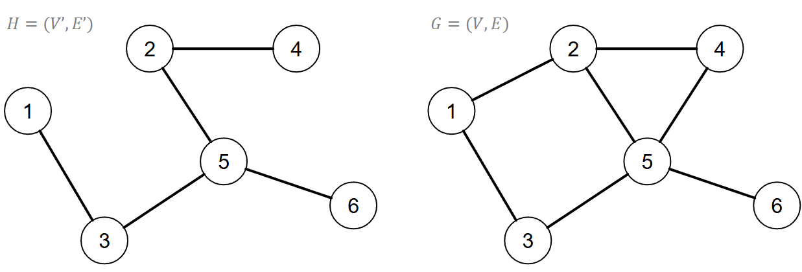
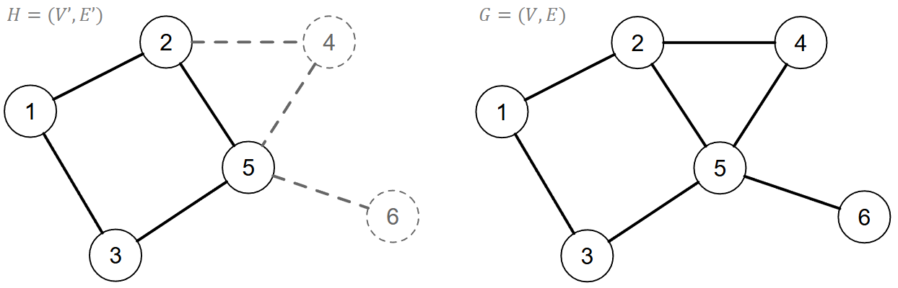
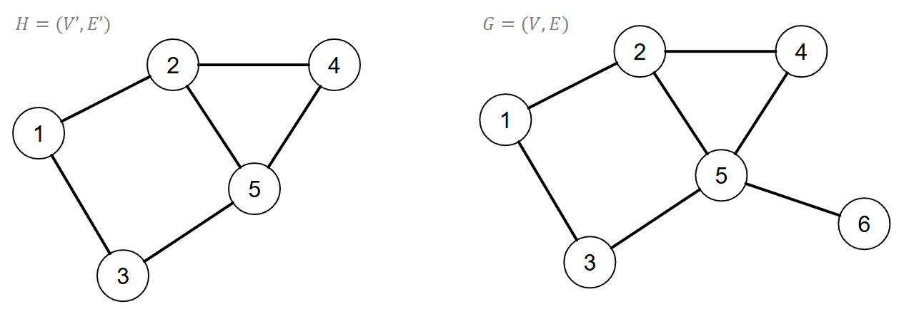
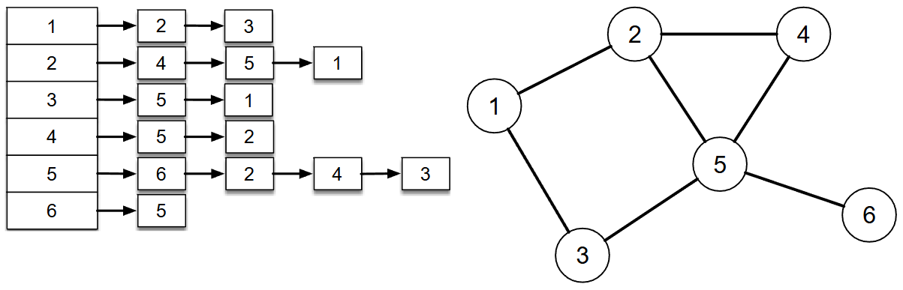

[Projeto e Análise de Algoritmos](index.md)

<!-- wiki:original:inicio -->

# Grafos

## Relembrando conceitos

- $V \rightarrow$ vértices;

- $E \rightarrow$ arestas;

- Uma aresta é definida pelo par $\left( v_{i},v_{j} \right)$;

- O **tamanho** de um grafo é definido por $\vert V\vert  + \vert E\vert$, onde $\vert .\vert$ é a cardinalidade (quantidade de elementos);

- Dado $e = \left( v_{i},v_{j} \right)$, $v_{i}$ e $v_{j}$ são **extremos** da aresta se $e$ é incidente em $v_{i}$ e $v_{j}$, e $v_{i}$ e $v_{j}$ é incidente em $e$;

- Vértices relacionados por uma aresta são **adjacentes**;

- Duas arestas são **paralelas** se incidem ao mesmo vértice;

- **Laço** $= \left( v_{i},v_{i} \right)$;

- $\sum_{i = 1}^{\vert V\vert }g\left( v_{i} \right) = 2\vert E\vert$, onde $g\left( v_{i} \right)$ é o **grau** do vértice $i$;

- Um grafo é **completo** se cada vértice possuir todos os demais adjacentes à ele;

- O número de arestas em um grafo completo é definido por: $\frac{\vert V\vert \left( \vert V\vert  - 1 \right)}{2}$ (observe que isso é ligeiramente menor que $\frac{\left( \vert V\vert  \right)^{2}}{2}$;

- Um grafo é **regular** se todos os vértices possuírem o mesmo grau (ou $k$-regular , para grau $k$);

- O número de arestas em um grafo $k$-regular é $\vert V\vert \frac{k}{2}$

- Um grafo é **denso** se o seu tamanho for proporcional ao quadrado do número de vértices ($\vert V\vert  + \vert E\vert  \propto \vert V\vert ^{2}$), e é esparso se $\left( \vert V\vert  + \vert E\vert  \right) \propto \vert V\vert$.

- O grafo $H = G(V',E')$ é um **subgrafo** de $G = (V,E)$ se $V' \subseteq V$ e $E' \subseteq E$.

- O grafo $H = G(V',E')$ é um **subgrafo gerador** de $G = (V,E)$ se $H$ for um subgrafo de $G$ e $V' = V$.

**Exemplo**

*Figura 18. Exemplo de subgrafo gerador.*

- O grafo $H = G(V',E')$ é um **grafo induzido** de $G = (V,E)$ se $E'$ for definido por todas as arestas de $E$ adjacentes a um par de vértices $V'$.

**Exemplo**

*Figura 19. Exemplo de grafo induzido (os vértices escolhidos foram $\left\{ 1,2,3,5 \right\}$ e as arestas(e vértices) que não são desses vértices não aparecem no subgrafo induzido).*

- O grafo $H = G(V',E')$ é um **grafo próprio** de $G = (V,E)$ se $H \subset G$.

**Exemplo**

*Figura 20. Exemplo de grafo próprio (note que é $\subset$, não $\subseteq$. Então, um subgrafo próprio é um subgrafo menor, e não igual ao grafo original).*

- Um **caminho** $P$ em $G(V,E)$ consiste em uma sequência de $n$ vértices, finita e não vazia tal que $v_{i + 1}$ é adjacente a $v_{i}$.

- Um caminho é **simples** se não possuir vértices repetidos.

- Um caminho é **fechado** se $v_{1} = v_{n}$.

- O **comprimento** de um caminho é definido pelo número de arestas do caminho.

- Um grafo $G = (V,E)$ é **conexo** se para qualquer par de vértices existe um caminho em $G$.

- Quando um grafo não é conexo podemos segmentá-lo em **componentes conexos** (um par está no mesmo componente se existe um caminho).

- Um grafo $G(V,E)$ é uma **árvore** se $G$ for conexo e acíclico (possui $\vert V\vert  - 1$ arestas, a remoção de qualquer aresta torna o grafo não-conexo e para todo par de vértices existe um único caminho);

- Um grafo $G(V,E)$ é uma **floresta** se for um grafo acíclico;

- Um grafo é **planar** se puder ser representado graficamente em um plano de tal forma que não haja cruzamento de arestas;

- Um grafo $G(V,E)$ é **bipartido** se os vértices puderem ser divididos em dois conjuntos $V_{1}$ e $V_{2}$ de forma que toda aresta $e_{k}$ é incidente em $\left( v_{i},v_{j} \right)$ tal que $v_{i} \in V_{1}$ e $v_{j} \in V_{2}$;

- Um grafo $G(V,E)$ é **orientado** se as arestas possuirem um sentido. Nesse caso, a nomenclatura que definimos $\left( v_{i},v_{j} \right)$ significa que ela começa em $v_{i}$ e termina em $v_{j}$.

- O grau de **sáida** $g_{s}\left( v_{i} \right)$ é definido pelo número de arestas que saem de $v_{i}$. Raciocíno análogo para grau de **entrada** $g_{e}\left( v_{i} \right)$;

- $\sum_{i = 1}^{\vert V\vert }g_{e}\left( v_{i} \right) = \sum_{i = 1}^{\vert V\vert }g_{s}\left( v_{i} \right) = \vert E\vert$;

- O vértice $v_{i}$ é uma **fonte** se $g_{e}\left( v_{i} \right) = 0$;

- O vértice $v_{i}$ é um **sorvedouro** se $g_{s}\left( v_{i} \right) = 0$;

- O vértice $v_{i}$ é **isolado** se for sorvedouro e fonte;

- Um grafo (orientado ou não) é **ponderado** se cada aresta estiver associado a um peso;

## Estruturas de dados para representar grafos

Dependendo do problema, a escolha da estrutura pode variar, e, em geral, usamos duas formas de implementar essa representação:

### Matriz de adjacência

Consiste em um matriz quadrada $A$ de ordem $\vert V\vert$ cujas linhas e colunas são indexadas pelos vértices de $V$. Exemplo para grafos orienteados:

*Figura 21. Exemplo de matriz de adjacência para o grafo à direita.*

Analogamente, para não orientados:

*Figura 22. Exemplo de matriz de adjacência para o grafo à direita. Nota: a matriz é simétrica!*

A complexidade de acessar(ou verificar) uma aresta é $\Theta(1)$, e claramente conta com uma complexidade de espaço de $\Theta(\vert V\vert ^{2})$. Além disso, o fato da matriz ser simétrica para grafos não-orientados faz com que o tamanho se reduza para a metade, podendo se armazenar apenas a diagonal superior ou inferior da matriz.

### Lista de adjacência

Consiste em uma sequência de vértices contendo na estrutura de cada ponteiro para uma lista encadeada com elemento representando as arestas adjacentes ao vértices. Exemplo para grafo dirigido:

*Figura 23. Exemplo da lista de adjacência para o grafo à direita.*

Exemplo para grafo não-dirigido:

*Figura 24. Exemplo da lista de adjacência para o grafo à direita.*

A complexidade de acessar o conjunto de arestas de um vértice é $\Theta(1)$ (mas encontrar uma aresta específica é $\Theta(\vert V\vert )$ no pior caso). Ainda, uma lista de adjacência exige um espaço $\Theta(\vert V\vert  + \vert E\vert )$

As estruturas de dados do vértice e da aresta podem ser estendidas para armazenar informações específicas do problema.

**Nota:** Os exercícios passados no slide não serão feitos aqui (pois isso é um “resumo” teórico), e sim na pasta Exercises.

------------------------------------------------------------------------

<!-- wiki:original:fim -->

## Conteúdos relacionados

- [Grafos — Ciência de Redes](../ciencia-de-redes/grafos.md)

## Percurso de estudo

[Trilha: A2](../../trilhas/projeto-e-analise-de-algoritmos/a2.md) · [Apresentação e contexto da fonte](../../trilhas/projeto-e-analise-de-algoritmos/a2.md#apresentacao-original)

- Anterior: [Técnicas de Projeto](tecnicas-de-projeto-a2.md)
- Próximo: [Busca em Grafos](busca-em-grafos-a2.md)
