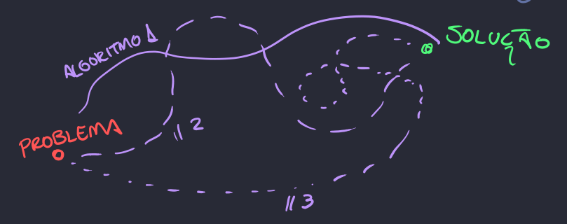

[Projeto e Análise de Algoritmos](index.md)

<!-- wiki:original:inicio -->
<a id="secao-1"></a>

# Notação Assintótica

------------------------------------------------------------------------

Já vemos desde o começo do curso que um algoritmo é um conjunto de instruções feitas com o objetivo de resolver um determinado problema. Porém, certos problemas apresentam diversos tipos de solução!



*Figura 1. Caminhos problema-solução*

Então, como podemos comparar eles? Como saber qual é o melhor caminho até a solução? De primeira podemos pensar: “É só ver quanto tempo demora para executar!”, mas isso gera um problema… Se executarmos um algoritmo em um computador atual e o mesmo algoritmo em um computador de $1980$, com certeza eles vão levar tempos diferentes para executar, correto? Isso pode afetar na medição do algoritmo!

Então, o que fazer? O mais comum é analisarmos o quão bem o algoritmo consegue funcionar de acordo com o quão grande o problema fica!

**Definição: Função de Complexidade**

A complexidade de um algoritmo é a função $T:U^{+} \rightarrow {\mathbb{R}}$ que leva do espaço do tamanho das entradas do problema até a quantidade de instruções feitas para realizá-lo.

**Exemplo**

``` cpp
int sum(const int numbers[], int size) { 
  int result = 0;
  for (int i = 0; i < size; i++) {
      result += numbers[i];
  }
  return result;
}
```

Portanto, temos que, para esse algoritmo, $T(n) = n$, pois o algoritmo depende diretamente do tamanho da entrada, já que passa uma vez por cada elemento Como isso acontece somente uma vez(além de declarações unitárias de variáveis que não dependendem de n), $T(n) = n$.

Achar qual é exatamente essa função pode ser muito trabalhoso, além de que, muitas funções são parecidas e podem gerar dificuldade na hora da análise. Então, o que fazemos?

Se a partir de algum ponto certa função $T_{1}$ cresce mais do que $T_{2}$, então o algoritmo $T_{1}$ é pior que $T_{2}$, por isso, criamos a definição:

**Definição: Big O**

Dizemos que $T(n) = O\left( f(n) \right)$ se $\exists\text{   }c,n_{0} > 0$ tais que $$T(n) \leq cf(n),\ \forall n \geq n_{0}$$

Ou seja, dado algum $c$ e $n_{0}$ qualquer, depois de $n_{0}$, $f(n)$ SEMPRE cresce mais que $T(n)$

<a id="defomega"></a>

**Definição: Big $\Omega$**

Dizemos que $T(n) = \Omega(f(n))$ se $\exists c,n_{0} > 0$ tais que $$T(n) \geq cf(n),\ \forall n \geq n_{0}$$

Note que a definição acima apenas limita inferiormente, enquanto a primeira limita superiormente a função $T(n)$.

**Definição: Big $\Theta$**

Dizemos que $T(n) = \Theta(f(n))$ se $T(n) = \Omega(f(n))$ e $T(n) = O\left( f(n) \right)$

Ou seja, o algoritmo é completamente limitado e definido por $f(n)$(perceba que nem sempre é possível limitar o algoritmo superiormente e inferiormente pela mesma função).

Por fim, perceba que, se que $T(n) = O\left( f(n) \right)$, e $h\left( n_{0} \right) > f\left( n_{0} \right)\ \forall n > n_{0}$, então $T(n) = O\left( h(n) \right)$.

**Exemplo**

Digamos que $T(n) = O(n)$. Logo, a partir de certo ponto, $T(n) = O\left( n^{2} \right)$, já que também consegue ser limitado pela função $n^{2}$.

Essa ideia serve principalmente para dizer que qualquer função maior que $f(n)$ pode limitar $T(n)$, e é claro que você, caro leitor, pode achar isso óbvio, mas parece um pouco duvidoso achar que $T(n) = n$ é $O\left( n^{3} \right)$, porém isso é verdade.

O mesmo vale para funções menores que $\Omega(f(n))$, por isso, fique atento a esse tipo de pegadinha!

------------------------------------------------------------------------

<!-- wiki:original:fim -->

## Percurso de estudo

[Trilha: A1](../../trilhas/projeto-e-analise-de-algoritmos/a1.md) · [Apresentação e contexto da fonte](../../trilhas/projeto-e-analise-de-algoritmos/a1.md#apresentacao-original)

- Próximo: [Recorrência](recorrencia.md)
