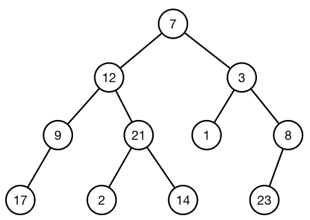

[Projeto e Análise de Algoritmos](../index.md)

<!-- wiki:original:inicio -->

# Recorrência

## Método da árvore de recursão

A ideia consiste em construir uma árvore definindo em cada nível os sub-problemas gerados pela iteração do nível anterior. A forma geral é encontrada ao somar o custo de todos os nós

- Cada nó representa um subproblema.

- Os filhos de cada nó representam as suas chamadas recursivas.

- O valor do nó representa o custo computacional do respectivo problema.

Esse método é útil para analisar algoritmos de divisão e conquista.

**Exemplo**

$$
T(n) = \begin{cases} \theta(1)\text{ se }n = 1 \\ 2T\left( \frac{n}{2} \right) + n\text{ se }n > 1 \end{cases}
$$

*Figura 2. Árvore de $T(n)$*

Temos então que: $$T(n) = \sum_{k = 0}^{\log(n)}2^{k}\frac{n}{2^{k}} = n\log(n) + n$$ Então temos que $T(n) = O\left( n\log(n) \right)$

## Método da Recorrência

O método da iteração consiste em expandir a relação de recorrência até o $n$-ésimo termo, de forma que seja possível compreender a sua forma geral

**Exemplo**

$$
T(n) = \begin{cases} \theta(1)\text{ se }n = 1 \\ 2T(n - 1) + n\text{ se }n > 1 \end{cases}
$$

Expandindo, temos: $$\begin{array}{r} T(n) = 2T(n - 1) + n \\ T(n) = 2\left( 2T(n - 2) + n \right) + n \\ \vdots \\ T(n) = 2^{k}T(n - k) + \left( 2^{k} - 1 \right)n - \sum_{j = 1}^{k - 1}2^{j}j \end{array}$$ Para chegar na última iteração, temos que $k = n - 1$ $$T(n) = 2^{n - 1} + \left( 2^{n - 1} - 1 \right)n - \sum_{j = 1}^{n - 2}2^{j}j$$ Temos que: $\sum_{j = 1}^{n - 2}2^{j}j = \frac{1}{2}\left( 2^{n}n - 3 \cdot 2^{n} + 4 \right)$, então podemos fazer: $$\begin{array}{r} T(n) = 2^{n - 1} + 2^{n - 1}n - n - 2^{n - 1}n + 3 \cdot 2^{n - 1} - 2 \\ \Leftrightarrow T(n) = 2^{n - 1} - n + 3 \cdot 2^{n - 1} - 2 \\ \Leftrightarrow T(n) = 4 \cdot 2^{n - 1} - n - 2 = 2^{n + 1} - n - 2 \\ \Leftrightarrow T(n) = \Theta(2^{n}) \end{array}$$

## Método da substituição

A ideia é provar por **indução** que $T(n)$ é $O$ de uma função **pressuposta**. Por isso, é claro, só é passível de uso quando se tem uma hipótese da solução, e provamos exatamente a hipótese na indução. Pode ser usado para limites superiores e inferiores.

**Exemplo**

$$T(n) = \begin{cases} \theta(1)\text{ se }n = 1 \\ 2T\left( \frac{n}{2} \right) + n\text{ se }n > 1 \end{cases}$$ Vamos pressupor que $T(n) = O\left( n^{2} \right)$. Queremos então provar $T(n) \leq cn^{2}$.

**Caso base**: $n = 1 \Rightarrow T(1) = 1 \leq cn^{2}$

**Passo Indutivo**: Vamos supor que vale para $\frac{n}{2}$, e ver se vale para $n$. Então temos: $$T\left( \frac{n}{2} \right) \leq c\frac{n^{2}}{4}$$ Vamos testar para $T(n)$ então $$\begin{array}{r} T(n) = 2T\left( \frac{n}{2} \right) + n \Rightarrow T(n) \leq 2c\frac{n^{2}}{4} + n \\ \Leftrightarrow T(n) \leq \frac{cn^{2}}{2} + n \\ \Leftrightarrow \frac{cn^{2}}{2} + n \leq cn^{2} \\ \Leftrightarrow 2n \leq 2cn^{2} - cn^{2} \\ \Leftrightarrow \frac{n}{2} \leq c \end{array}$$ Ou seja, conseguimos escolher um $c$ e um $n_{0}$ de forma que $\forall n \geq n_{0}$, $T(n) \leq cn^{2}$, logo, $T(n) = O\left( n^{2} \right)$

## Método mestre

Esse teorema é uma decoreba. Ele te dá um caso geral e vários casos de resultado dependendo dos valores na estrutura de $T(n)$

**Teorema: Teorema Mestre**

Dada uma recorrência da forma $$T(n) = aT\left( \frac{n}{b} \right) + f(n)$$ Considerando $a \geq 1$, $b > 1$ e $f(n)$ assintoticamente positiva

- Se $f(n) = O\left( n^{\log_{b}(a) - \varepsilon} \right)$ para alguma constante $\varepsilon > 0$, então **$T(n) = \Theta(n^{\log_{b}(a)})$**

- Se $f(n) = \Theta(n^{\log_{b}(a)})$, então **$T(n) = \Theta(f(n)\log(n))$**

- Se $f(n) = \Omega(n^{\log_{b}(a) + \varepsilon})$ para alguma constante $\varepsilon > 0$ e atender a uma condição de regularidade $af\left( \frac{n}{b} \right) \leq cf(n)$ para alguma constante positiva $c < 1$ e para todo $n$ suficientemente grande, então **$T(n) = \Theta(f(n))$**

**Exemplo: Primeiro caso**

$$T(n) = 9T\left( \frac{n}{3} \right) + n$$ Então $a = 9$, $b = 3$ e $f(n) = n$, calculamos então: $$n^{\log_{b}(a)} = n^{\log_{3}(9)} = n^{2}$$ Ou seja, conseguimos escolher $\varepsilon = 1$ de forma que $$f(n) = O\left( n^{2 - 1} \right) = O(n)$$ Ou seja, $T(n) = \Theta(n^{2})$

**Exemplo: Segundo caso**

$$T(n) = T\left( \frac{2n}{3} \right) + 1$$ Então $a = 1$, $b = \frac{3}{2}$ e $f(n) = 1$, calculamos então: $$n^{\log_{b}(a)} = n^{\log_{\frac{3}{2}}(1)} = 1$$ Ou seja, $f(n) = \Theta(n^{\log_{b}(a)})$, e isso quer dizer que $T(n) = \Theta(n^{\log_{\frac{3}{2}}(1)\log(n)}) = \Theta(\log(n))$

**Exemplo: Terceiro caso**

$$T(n) = 3T\left( \frac{n}{4} \right) + n\log(n)$$ Então $a = 3$, $b = 4$ e $f(n) = n\log(n)$, calculamos então: $$n^{\log_{b}(a)} = n^{\log_{4}3} \approx n^{0.79}$$ Temos então que $f(n) = \Omega(n^{\log_{4}3 + \varepsilon})$ para um $\varepsilon \approx 0.2$. Então agora vamos analisar a condição de regularidade: $$\begin{array}{r} af\left( \frac{n}{b} \right) \leq cf(n) \\ 3\left( \frac{n}{4}\log(\frac{n}{4}) \right) \leq cn\log(n) \Rightarrow c \geq \frac{3}{4} \end{array}$$ Ou seja, $T(n) = \Theta(n\log(n))$

**Exemplo: Exemplo que não funciona**

$$T(n) = 2T\left( \frac{n}{2} \right) + n\log(n)$$ Para agilizar, isso se encaixa no caso em que $f(n) = \Omega(n^{\log_{b}(a) + \varepsilon})$. Vamos então checar a regularidade: $$\begin{array}{r} af\left( \frac{n}{b} \right) \leq cf(n) \\ 2\frac{n}{2}\log(\frac{n}{2}) \leq cn\log(n) \\ \Leftrightarrow c \geq 1 - \frac{1}{\log(n)} \end{array}$$ **Impossível!** Já que $c < 1$

Esse método pode ser simplificado para uma categoria específica de funções

**Teorema: Teorema mestre simplificado**

Dada uma recorrência do tipo: $$T(n) = aT\left( \frac{n}{b} \right) + \Theta(n^{k})$$ Considerando $a \geq 1$, $b > 1$ e $k \geq 0$:

- Se $a > b^{k}$, então **$T(n) = \Theta(n^{\log_{b}a})$**

- Se $a = b^{k}$, então **$T(n) = \Theta(n^{k}\log n)$**

- Se $a < b^{k}$, então **$T(n) = \Theta(n^{k})$**

------------------------------------------------------------------------

<!-- wiki:original:fim -->

## Percurso de estudo

[Trilha: A1](../../../trilhas/projeto-e-analise-de-algoritmos/a1.md) · [Apresentação e contexto da fonte](../../../trilhas/projeto-e-analise-de-algoritmos/a1.md#apresentacao-original)

- Anterior: [Notação Assintótica](../notacao-assintotica/index.md)
- Próximo: [Algoritmos de busca](../algoritmos-de-busca/index.md)
