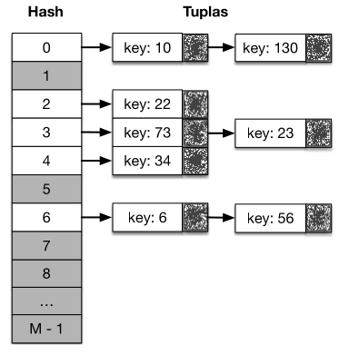
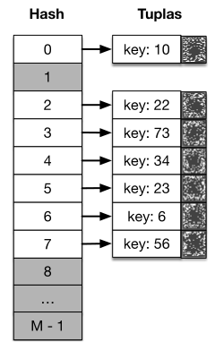
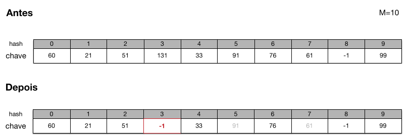
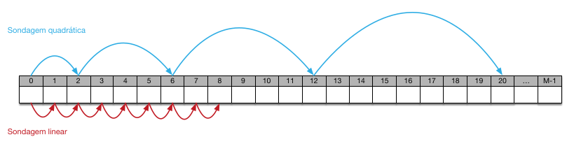
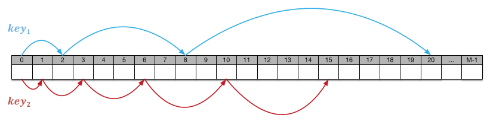

[Projeto e Análise de Algoritmos](../index.md)

<!-- wiki:original:inicio -->

<a id="secao-11"></a>

# Tabela Hash


<a id="definicao"></a>
<a id="secao-15"></a>

## Definição

Agora que entendemos toda a ideia da hash table, podemos fazer uma definição melhor para ela

**Definição: Hash Table**

A **tabela hash** é uma estrutura de dados baseada em um vetor de $M$ posições acessado através de endereçamento direto

**Definição: Função de Espalhamento/Hashing**

É uma função que mapeia uma chave em um índice $\lbrack 0,M - 1\rbrack$ do vetor. O resultado dessa função é comumente chamado de **hash**. O objetivo da função de espalhamento é reduzir o intervalo de índices de forma que M seja muito menor que o tamanho do universo U.

**Exemplo**

    hash(key) = key % M

**Definição: Colisão**

É quando a função de espalhamento gera os mesmos hashes para chaves diferentes. Existem várias abordagens para resolver esse problema

Uma função de hash é considerada **boa** quando minimiza as colisões (Mas, pelo princípio da casa dos pombos, elas são inevitáveis, pois quase sempre existem mais elementos do que chaves).

<a id="desafio"></a>
<a id="secao-12"></a>

## Desafio

Considere um programa que recebe eventos emitidos por veículos ao entrar em uma determinada região Cada evento é composto por um inteiro representando o ID do veículo. O programa deve contar o número de vezes que cada veículo entrou na região. Ocasionalmente o programa recebe uma requisição para exibir o número de ocorrências de um dado veículo.

**Mandatório**: a contagem deve ser incremental, sem qualquer estratégia de cache. Uma requisição para exibir o resultado parcial da contagem deverá contemplar todos os eventos recebidos até o momento.

<a id="secao-13"></a>

### Primeira abordagem: Endereçamento Direto

``` cpp
// Aloca-se um vetor com o tamanho do universo U:
int table[U];
for (int i = 0; i < U; i++) {
  table[i] = 0;
}

// Ao processar cada evento incrementa-se a posição no vetor
void add(int key) {
  table[key]++;
}

// Lê-se a contagem acessando a posição do vetor diretamente
int search(int key) {
  return table[key]
}
```

- `add` $= \Theta(1)$

- `search` $= \Theta(1)$

<a id="secao-14"></a>

### Segunda abordagem: Lista Encadeada

``` cpp
typedef struct LLNode CountNode;
struct LLNode {
  int id;
  int count;
  CountNode * next;
};

void add(int key) {
  CountNode * node = m_firstNode;
  while (node != nullptr && node->id != key) {
    node = node->next;
  }
  if (node != nullptr) {
    node->count += 1;
  } else {
    CountNode * newNode = new CountNode;
    newNode->id = key;
    newNode->count = 1;
    newNode->next = m_firstNode;
    m_firstNode = newNode;
  }
}
int search(int key) {
  CountNode * node = m_firstNode;
  while (node != nullptr && node->id != key) {
    node = node->next;
  }
  return node != nullptr ? node->count : 0;
}
```

Infelizmente nessa abordagem nós não atingimos o objetivo principal de realizar as operações em $\Theta(1)$, já que a função de busca é $\Theta(n)$ no pior caso. Como melhorar isso?

<a id="solucoes-para-colisao"></a>
<a id="secao-16"></a>

## Soluções para colisão

Vamos ver algumas abordagens para resolver o problema de colisão

<a id="secao-17"></a>

### Tabela hash com encadeamento

O problema de colisão é solucionado armazenando os elementos com o mesmo hash em uma lista encadeada.



*Figura 8. Tabela hash com encadeamento*

**EXEMPLO DE IMPLEMENTAÇÃO**

``` cpp
typedef struct HashTableNode HTNode;
struct HashTableNode {
  unsigned key;
  int value;
  HTNode * next;
  HTNode * previous;
};

class HashTable {
  public:
  HashTable(int size)
    : m_table(nullptr)
    , m_size(size) {
    m_table = new HTNode*[size];
      for (int i=0; i < m_size; i++) { m_table[i] = nullptr; }
    }
  ~HashTable() {
    for (int i=0; i < m_size; i++) {
      HTNode * node = m_table[i];
      while (node != nullptr) {
        HTNode * nextNode = node->next;
        delete node;
        node = nextNode;
      }
    }
    delete[] m_table;
  }
  ...
  private:
    unsigned hash(unsigned key) const { return key % m_size; }
    HTNode ** m_table;
    int m_size;
};


void insert_or_update(unsigned key, int value) {
  unsigned h = hash(key);
  HTNode * node = m_table[h];
  while (node != nullptr && node->key != key) {
    node = node->next;
  }
  if (node == nullptr) {
    node = new HTNode;
    node->key = key;
    node->next = m_table[h];
    node->previous = nullptr;
    HTNode * firstNode = m_table[h];
    if (firstNode != nullptr) {
      firstNode->previous = node;
    }
    m_table[h] = node;
  }
  node->value = value;
}


HTNode * search(unsigned key) {
  unsigned h = hash(key);
  HTNode * node = m_table[h];
  while (node != nullptr && node->key != key) {
    node = node->next;
  }
  return node;
}


bool remove(unsigned key) {
  unsigned h = hash(key);
  HTNode * node = m_table[h];
  while (node != nullptr && node->key != key) {
    node = node->next;
  }
  if (node == nullptr) {
    return false;
  }
  HTNode * nextNode = node->next;
  if (nextNode != nullptr) {
    nextNode->previous = node->previous;
  }
  HTNode * previousNode = node->previous;
  if (previousNode != nullptr) {
    node->previous->next = node->next;
  } else {
    m_table[h] = node->next;
  }
  delete node;
  return true;
}
```

O pior caso dessa implementação é quando todas as chaves são mapeadas em uma única posição

- **Inserção/Atualização**: $\Theta(n)$

- **Busca**: $\Theta(n)$

- **Remoção**: $\Theta(n)$

Nas operações estamos considerando o pior caso.

<a id="secao-18"></a>

### Hash uniforme simples (A solução ideal)

Cada chave possui a mesma probabilidade de ser mapeada em qualquer índice $\lbrack 0,M)$. Essa é uma propriedade desejada para uma função de espalhamento a ser utilizada em uma tabela hash. Infelizmente esse resultado depende dos elementos a serem inseridos. Não sabemos à priori a distribuição das chaves ou mesmo a ordem em que serão inseridas. Heurísticas podem ser utilizadas para determinar uma função de espalhamento com bom desempenho

Alguns métodos mais comuns:

- **Simples**

  - Se a chave for um número real entre \[0, 1)

  - `hash(key)` $= \left\lfloor {\text{key } \cdot M} \right\rfloor$

  - Exemplo: Suponha M = 10, então teremos $0,\ldots,9$ hashes:

    - chave $= 0,27 \Rightarrow 0,27.10 = 2,7 \Rightarrow \left\lfloor 2.7 \right\rfloor = 2$

    - chave $= 0,92 \Rightarrow 0,92.10 = 9,2 \Rightarrow \left\lfloor 9.2 \right\rfloor = 9$

- **Método da divisão**

  - Se a chave for um número inteiro

  - `hash(key)` $= \text{ key}\% M$

  - Costuma-se definir M como um número primo.

  - Exemplo: Suponha M = 23, logo, temos 23 hashes.

    - chave $= 14 \Rightarrow 14\% 23 = 14$

    - chave $= 35 \Rightarrow 35\% 23 = 12$

- **Método da multiplicação**

  - `hash(key)` $= \left\lfloor {M.\left( \left( \text{key } \cdot A \right)\% 1 \right)} \right\rfloor$

  - A é uma constante no intervalo $0 < A < 1$.

  - Exemplo: Suponha M $= 10$, A $= 0,618$, 100 hashes

    - chave $= 123 \Rightarrow 123.0,618 = 76,014 \Rightarrow 76,014\% 1 = 0,014 \Rightarrow \left\lfloor {0.014 \ast 100} \right\rfloor = \left\lfloor 1.4 \right\rfloor = 1$

Observe que a chave pode assumir qualquer tipo suportado pela linguagem

**Exemplo**

``` py
countries["BR"]
```

A função de espalhamento é responsável por gerar um índice numérico com base no tipo de entrada

**EXEMPLO DE HASH PARA STRINGS**

``` cpp
int hashStr(const char * value, int size) {
  unsigned hash = 0;
  for (int i=0; value[i] != '\0'; i++) {
    hash = (hash * 256 + value[i]) % size;
  }
  return hash;
}
```

------------------------------------------------------------------------

Em uma busca mal sucedida, temos que a complexidade é $T(n,m) = \frac{n}{m}$, isso se dá pois temos $m$ entradas no array da tabela hash e temos $n$ entradas utilizadas no todo, e esperamos que, escolhendo uma função de espalhamento que espalhe os valores uniformemente, a **complexidade média** do tempo de busca fica $\frac{n}{m}$. Nosso objetivo é sempre que $n$ seja bem menor que $m$, de forma que isso seja muito próximo de $\Theta(1)$.

Então podemos calcular a complexidade das operações de **remoção**, **inserção** e **busca** como: $$T(n) = \frac{1}{n}\sum_{i}^{n}\left( 1 + \sum_{j = i + 1}^{n}\frac{1}{m} \right) = \Theta(1 + \frac{n}{m})$$

Esse $\frac{1}{n}\sum_{i}^{n}$ representa uma média aritmética em todos os nós do valor que vem dentro da soma. Esse $1$ dentro representa a operação de *hash* para descobrir o “slot” chave que você irá procurar. Depois que você procurar o slot e achá-lo (Slot em que a chave que você está buscando estará), você vai percorrer um **número esperado** de $\sum_{j = i + 1}^{n}\frac{1}{m}$ chaves ($\frac{1}{m}$ = Probabilidade (Considerando o hash uniforme simples) de uma chave $i$ colidir com uma chave $j$)

Considerando a hipótese de hash uniforme simples podemos assumir que cada lista terá aproximadamente o mesmo tamanho.

Conforme inserimos elementos na tabela o desempenho vai se degradando, e calculando $\alpha = n/m$ a cada inserção conseguimos calcular se a tabela está em um estado ineficiente, e quando a considerarmos ineficiente, teremos então que fazê-la ficar eficiente novamente, mas como? Redimensionando-a.

A operação de redimensionamento aumenta o tamanho do vetor de $m$ para $M'$, porém, isso invalida o mapeamento das chaves anteriores, já que a métrica era feita especificamente para o tamanho anterior . Para contornar isso, podemos reinserir todos os elementos. Porém, isso é $\Theta(n)$. Se a operação de `resize` & `rehash` tem complexidade $\Theta(n)$ , como manter $\Theta(1)$ para as demais operações?

Então temos a **análise amortizada**, que avalia a complexidade com base em uma sequência de operações.

A sequência de operações na tabela de dispersão consiste em:

- $n$ operações de inserção com custo individual $\Theta(1)$

- $k$ operações para redimensionamento com custo total $\sum_{i = 1}^{\log(n)}2^{i} = \Theta(n)$

  - Considerando que $M' = 2M$

$$
\frac{n \cdot \Theta(1) + \Theta(n)}{n} = \Theta(1)
$$

Esse $n$ no denominador vem exatamente da amortização da análise, $n$ é o número de elementos inseridos.

**Exemplo de Análise Amortizada**

Vamos considerar a inserção de $n = 8$ elementos em uma tabela hash que dobra de tamanho sempre que enche.

Inicialmente $m = 1$, e os redimensionamentos ocorrem da seguinte forma: $1 \rightarrow 2 \rightarrow 4 \rightarrow 8$.

1.  Inserir o 1º elemento $\rightarrow$ custo $1$.

2.  Inserir o 2º elemento $\rightarrow$ tabela cheia, redimensiona para $2$ e re-hash de $1$ elemento. Custo: $1$ (re-hash) + $1$ (inserção) = $2$.

3.  Inserir o 3º elemento $\rightarrow$ tabela cheia, redimensiona para $4$ e re-hash de $2$ elementos. Custo: $2$ (re-hash) + $1$ (inserção) = $3$.

4.  Inserir o 4º elemento $\rightarrow$ custo $1$.

5.  Inserir o 5º elemento $\rightarrow$ redimensiona para $8$ e re-hash de $4$ elementos. Custo: $4$ (re-hash) + $1$ (inserção) = $5$.

6.  Inserir o 6º elemento $\rightarrow$ custo $1$.

7.  Inserir Inserir o 7º elemento $\rightarrow$ custo $1$.

8.  Inserir o 8º elemento $\rightarrow$ custo $1$.

- Inserções sem redimensionamentos: 5 operações (1, 4, 6, 7, 8)

- Redimensionamentos: $2 + 3 + 5 = 10$.

- Custo total: $15$.

Portanto, foram $n = 8$ inserções no total. O custo amortizado é dado por:

$$
\frac{\text{ Custo total}}{\text{inserções }} = \frac{15}{8} = 1.875 \approx \Theta(1)
$$

Assim, mesmo com redimensionamentos custosos, o custo médio por operação permanece constante.

<a id="secao-19"></a>

### Tabela hash com endereçamento aberto



O problema de colisão é solucionado armazenando os elementos na primeira posição vazia a partir do índice definido pelo hash. Ou seja,ao inserir um elemento $y$ na tabela, se ele tem o mesmo hash do elemento $x$ (que já está inserido na tabela), basta inserir num slot vazio.

[*Vídeo muito bom com desenhos sobre endereçamento aberto (Clique aqui)*](https://www.youtube.com/watch?v=yA8bDfWj0UU)

Estrutura de um nó da lista:

``` cpp
typedef struct DirectAddressHashTableNode DANode;
struct DirectAddressHashTableNode {
  int key;
  int value;
};
```

Ao buscar (ou sondar) um elemento com a chave `key`, nós checamos: Se a posição `table[hash(key)]` estiver **vazia**, nós garantimos que a chave não está presente na tabela, mas se estiver **ocupada**, precisamos verificar se `table[hash(key)].key = key`, já que eu posso ter inserido uma outra chave lá.

Exemplo de implementação:

``` cpp
class DirectAddressHashTable {
  public:
    DirectAddressHashTable(int size)
        : m_table(nullptr)
        , m_size(size) {
      m_table = new DANode[size];
      for (int i=0; i < m_size; i++) {
        m_table[i].key = -1;
        m_table[i].value = 0;
      }
    }
    ~DirectAddressHashTable() { delete[] m_table; }

  private:
    unsigned hash(int key) const { return key % m_size; }

    DANode * m_table;
    int m_size;
};


bool insert_or_update(int key, int value) {
  unsigned h = hash(key);
  DANode * node = nullptr;
  int count = 0;
  for (; count < m_size; count++) {
    node = &m_table[h];
    if (node->key == -1 || node->key == key) {
      break;
    }
    h = (h + 1) % m_size;
  }
  if (count >= m_size) {
    return false; // Table is full
  }
  if (node->key == -1) {
    node->key = key;
  }
  node->value = value;
  return true;
}


DANode * search(int key) {
  unsigned h = hash(key);
  DANode * node = nullptr;
  int count = 0;
  for (; count < m_size; count++) {
    node = &m_table[h];
    if (node->key == -1 || node->key == key) {
      break;
    }
    h = (h + 1) % m_size;
  }
  return count >= m_size || node->key == -1 ? nullptr : node;
}


bool remove(int key) {
  DANode * node = search(key);
  if (node == nullptr) {
    return false;
  }
  node->key = -1;
  node->value = 0;
  return true;
}
```

Porém, a remoção em uma tabela hash com endereçamento aberto também apresenta um problema:

- Ao remover uma chave key de uma posição $h$, partindo de uma posição $h_{0}$, tornamos impossível encontrar qualquer chave presente em uma posição $h'$ \> $h$, pois, quando o algoritmo procura partindo de $h_{0}$, como $h$ está vazio, interpretará que não precisa continuar a busca, porque ele não sabe que a key da posição $h$ foi removida.



*Figura 10. Exemplo de erro possível no uso de endereçamento aberto*

No exemplo acima, perceba que tínhamos um hash uniforme simples, com o hash = $\text{key }\% M$, e provavelmente a sequência de ordenação como $$\ldots 131 \rightarrow 33 \rightarrow 91 \rightarrow 76 \rightarrow 61 \rightarrow \ldots$$ e que, logo após, removemos o número $131$. Depois, buscamos os valores $91$ e $61$, mas não os encontramos, pois o primeiro slot onde eles se encaixariam(o do $131$) está vazio. Por isso, o algoritmo para e retorna que eles não estão na lista(por isso estão acinzentados).

Uma possível solução consiste em marcar o nó removido de forma que a busca não o considere vazio.

- Podemos criar uma flag para representar que o nó será reciclado.

``` cpp
typedef struct DirectAddressHashTableNode DANode;
struct DirectAddressHashTableNode {
  int key;
  int value;
  bool recycled;
};
```

- E inicializá-la com o valor false no construtor:

``` cpp
m_table[i].recycled = false;
```

Então vamos adaptar as funções de busca e remoção

``` cpp
DANode * search(int key) {
  unsigned h = hash(key);
  DANode * node = nullptr;
  int count = 0;
  for (; count < m_size; count++) {
    node = &m_table[h];
    if ((node->key == -1 && !node->recycled) || node->key == key) {
      break;
    }
    h = (h + 1) % m_size;
  }
  return count >= m_size || node->key == -1 ? nullptr : node;
}


bool remove(int key) {
  DANode * node = search(key);
  if (node == nullptr) {
    return false;
  }
  node->key = -1;
  node->value = 0;
  node->recycled = true;
  return true;
}
```

O fator de carga da abordagem de endereçamento aberto é definido da mesma forma: $\alpha = n/M$

- No entanto observe que nesse caso teremos sempre $\alpha \leq 1$ visto que $M$ é o número máximo de elementos no vetor (Antes,podíamos ter mais chaves do que espaços no vetor).

- A busca por uma determinada chave depende da sequência de sondagem `hash(key, i)` fornecida pela função de espalhamento. (i é o número da iteração da sondagem).

  - Exemplo linear: `hash(key, i) = (hash'(key) + i) mod M`

    - `hash(key, 0) = hash'(key)` $\rightarrow$ `hash(key, 1) = (hash'(key) + 1) mod M`

Note que `hash(key,i)` é a função de sondagem completa, que depende tanto da chave quanto da tentativa, enquanto `hash'(key)` é a função de espalhamento base, ou seja, a posição inicial da chave antes da colisão

- Observe que existem M! permutações possíveis para a sequência de sondagem(em geral isso não importa muito).

Porém, a abordagem linear rapidamente se torna ineficaz, já que em determinado momento o problema se transforma basicamente em inserir elementos em uma lista. Temos, por isso, outras alternativas:



*Figura 11. Exemplificação do endereçamento aberto usando de sondagem quadrática*

Na abordagem quadrática, temos que a função de hash segue o seguinte padrão: `hash(key, i) = ( hash'(key) + b*i + a*i**2 ) % m`

**Exemplo**

- Tamanho da tabela: $M = 11$

- Função de hash base: `hash'(key) = key mod M`

- Parâmetros: `a = 1`, `b = 0`

Sequência de sondagem quadrática:

`hash(27, 0) = (5 + 0 * 0 + 1 * 0) mod 11 = 5`

`hash(27, 1) = (5 + 0 * 1 + 1 * 1) mod 11 = 6`

`hash(27, 2) = (5 + 0 * 2 + 1 * 4) mod 11 = 9`

`hash(27, 3) = (5 + 0 * 3 + 1 * 9) mod 11 = 3`

`hash(27, 4) = (5 + 0 * 4 + 1 * 16) mod 11 = 10`

Porém isso gera agrupamentos secundários, ou seja, se duas chaves caem no mesmo local inicial `hash'(key)`, então elas seguirão a mesma sequência e tentarão ocupar os mesmos slots (podemos inserir outras abordagens).

Podemos introduzir o **hash duplo**, tal que temos **duas** funções de hash diferentes $\text{hash}_{1}$ e $\text{hash}_{2}$ de forma que o novo hash de uma chave será dado por: `hash(key, i) = (hash1(key) + i * hash2(key)) % M'`. Dessa forma, mesmo que uma mesma chave colida com outra na primeira função de hash, a segunda função garante que cada tentativa subsequente irá gerar um novo índice diferente, distribuindo melhor as chaves na tabela.

**Exemplo**

- Tamanho da tabela: $M = 11$

- Funções de hash:

  - `hash1(key) = key mod 11`

  - `hash2(key) = 1 + (key mod (M - 1))`

Sequência de sondagem com hash duplo:

`hash(27, 0) = (5 + 0 * 8) mod 11 = 5`

`hash(27, 1) = (5 + 1 * 8) mod 11 = 2`

`hash(27, 2) = (5 + 2 * 8) mod 11 = 10`

`hash(27, 3) = (5 + 3 * 8) mod 11 = 7`

`hash(27, 4) = (5 + 4 * 8) mod 11 = 4`



*Figura 12. Exemplificação do endereçamento aberto usando hash duplo*

Porém, vale ressaltar que a segunda função de hash deve:

- Ser completamente diferente da primeira

- Não retornar $0$

O número de sondagens(buscas) para inserir uma chave em uma tabela hash de endereçamento aberto (No caso médio) é: $$T(n) = \sum_{i = 0}^{\infty}\alpha^{i} = \frac{1}{1 - \alpha} = O(1)$$ também pela forma da PG.

------------------------------------------------------------------------

<!-- wiki:original:fim -->


## Percurso de estudo

[Trilha: A1](../../../trilhas/projeto-e-analise-de-algoritmos/a1.md) · [Apresentação e contexto da fonte](../../../trilhas/projeto-e-analise-de-algoritmos/a1.md#apresentacao-original)

- Anterior: [Árvores Binárias de Busca](../algoritmos-de-busca/index.md#arvores-binarias-de-busca)
- Próximo: [Algoritmos de Ordenação](../algoritmos-de-ordenacao/index.md)
