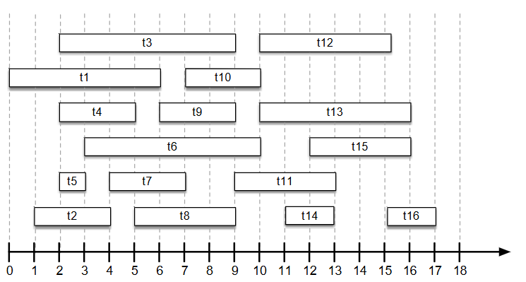
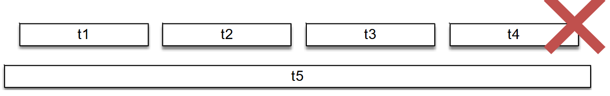
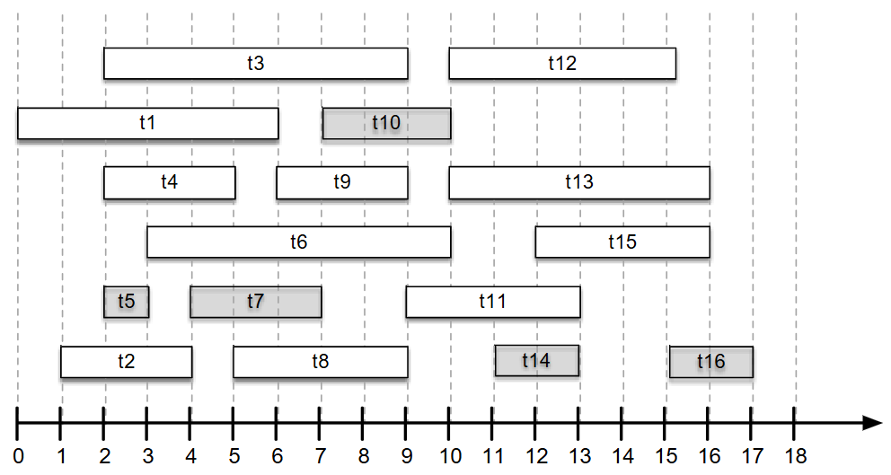
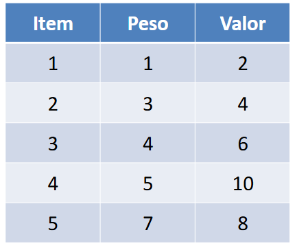
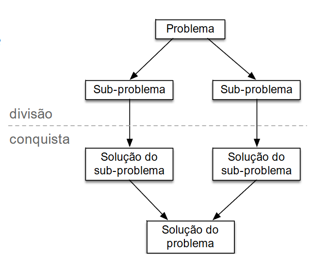
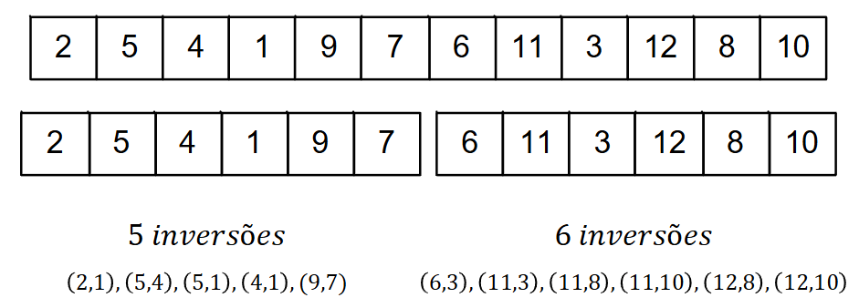
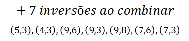
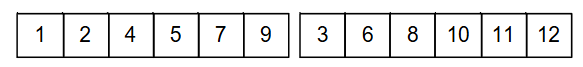
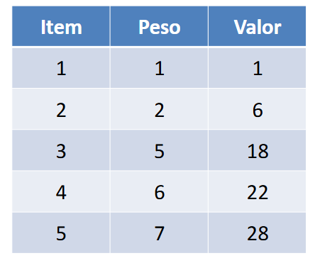

[Projeto e Análise de Algoritmos](index.md)

<!-- wiki:original:inicio -->

<a id="secao-1"></a>

# Técnicas de Projeto


<a id="metodo-guloso-greedy"></a>
<a id="secao-2"></a>

## Método guloso (Greedy)

O método guloso é uma famoso paradigma utilizado para projetos de algoritmo, onde a estratégia consiste em escolher a cada iteração a opção com maior valor, e avaliar se deve ser adicionada ao resultado final.

Seguindo essa abordagem, as opções precisam ser ordenadas pro algum critério. Costuma ser simples e eficiente, porém nem todo projeto pode ser resolvido através dessa abordagem.

<a id="secao-3"></a>

### O problema do agendamento de tarefas

Dado o conjunto de tarefas $T = \left\{ t_{1},t_{2},\ldots,t_{n} \right\}$ com $n$ elementos, cada uma com tempo de ínicio

``` start
[tk]
```

, e um tempo de término

``` end
[tk]
```

, encontre o maior subconjunto de tarefas que pode ser alocado sem sobreposição temporal.



*Figura 1. Exemplo do problema de agendamento*

Vamos projetar a solução!

Perguntas:

1.  Quais serão as opções a serem avaliadas a cada iteração?

    - Conjunto de tarefas que ainda não foi alocada ou descartada.

2.  Qual critério iremos utilizar para ordenar as opções?

    - Tempo de ínicio?

    - Menor duração?

    - Menor número de projetos?

    - Tempo de término?

Vamos analisar cada critério tentando construir ao menos um cenário que demonstre que o critério gera um resultado não-ótimo.

Que tal se colocarmos o critério de seleção como o tempo de início do agendamento?



*Figura 2. Contra-exemplo para uma possível solução do problema de agendamento*

Isso não daria certo, pois nesse caso, por exemplo, o $t_{5}$ seria escolhido, enquanto a melhor escolha seria pegar as 4 primeiras tarefas.

E se escolhessemos pela menor duração?


*Figura 3. Contra-exemplo para uma possível solução do problema de agendamento*

Isso também daria errado, já que escolheríamos $t_{5},t_{6}\text{  e  }t_{7}$ enquanto, novamente, a melhor escolha seriam os 4 primeiros.

Nada funcionou… Mas e se nosso critério fosse o tempo do término?

Ideia geral:

1.  **ordene** $T$ (pelo tempo de término)

2.  $T_{a}\lbrack 1,\ldots,n\rbrack = 0$

3.  **Insira a primeira tarefa da lista** $t_{0}$ **em** $T_{a}$

4.  $t_{\text{prev }} = t_{0}$

5.  **para** $t_{k}$ **em** $T$:

    1.  **se** $\text{start}\left\lbrack t_{k} \right\rbrack \geq \text{ end}\left\lbrack t_{\text{prev}} \right\rbrack:$

        1.  **adicione** $t_{k}$ **em** $T_{a}$

        2.  $t_{\text{prev }} = t_{k}$

6.  **retorne** $T_{a}$.

Essa ideia não é muito difícil. Como a lista é ordenada pelo horário de saída, então o primeiro elemento a ser adicionado é simplesmente o primeiro elemento. Note que, como o objetivo é apenas a quantidade máxima de tarefas, e não o tempo máximo que podemos otimizar para todas as tarefas que temos, então pegar o menor término **desde o início** é o que realmente faz o algoritmo funcionar (por exemplo, se tivéssemos os horários `[(5,10),(5,12)]`, pegar o menor tempo de saída nos ajudaria no caso de termos outra tarefa, como `(11,14)`).

Após selecionarmos a primeira tarefa da lista, basta compararmos os tempos de entrada das próximas tarefas, já que, pelo mesmo raciocínio do porque escolher a menor saída, se a próxima tarefa não colidir com a saída passada, então podemos pegar nossa nova tarefa e atulizar com o tempo de saída da nova tarefa atual (como a lista está ordenada pelo tempo de fim, a nova tarefa a ser pega garantiria que seria a melhor tarefa, já que seria a primeira que se encaixa com o tempo de finalização da última tarefa selecionada e a mais curta já que estamos olhando por ordenação).

Nosso pseudocódigo usa apenas um for sem nada demais dentro dele, mas precisamos ordenar a lista antes. Isso nos traz uma complexidade de $\Theta(n\log(n))$.




*Figura 4. Solução para o problema de tarefas usando o algoritmo proposto*

**Por que essa solução é ótima?**

**Definição**

Escolha gulosa

Uma solução ótima global pode ser atingida realizando uma sequência de escolhas locais ótimas (gulosas).

- A escolha local não considera o resultado das escolhas posteriores, e produz um sub-problema contendo um número menor de elementos.

- A definição do critério de escolha nos auxilia à organizar os elementos de forma que o algortimo seja eficiente.

**Definição**

Sub-estrutura ótima

Ocorre quando uma solução ótima de um problema apresenta dentro dela soluções ótimas para sub-problemas.

**Definição**

Swap argument (Argumento de troca)

Considere que temos uma solução ótima $S$, e a solução gulosa $G$. Então é possível substituir iterativamente os elementos de $S$ por elementos de $G$ sem que a solução deixe de ser viável e ótima, provando assim que $G$ é, no mínimo, tão boa quanto $S$.

Vamos usar o que aprendemos então:

Seja $T_{a} = \left\{ g_{1},g_{2},\ldots,g_{k} \right\}$ o conjunto de $k$ tarefas selecionadas pelo nosso algoritmo guloso, já ordenadas pelo tempo de término (como no pseudocódigo). Seja $S = \left\{ s_{1},s_{2},\ldots,s_{m} \right\}$ uma *solução ótima* qualquer, com $m$ tarefas, também ordenadas por tempo de término.

Nosso objetivo é provar que $T_{a}$ é ótima, ou seja, que $k = m$.

Queremos primeiro provar que a primeira escolha gulosa, $g_{1}$, pode fazer parte de *alguma* solução ótima.

1.  $g_{1}$ é a tarefa escolhida por nosso algoritmo, então ela é a tarefa em *todo* o conjunto $T$ com o *menor tempo de término*.

2.  $s_{1}$ é a primeira tarefa da solução ótima $S$. Ela tem o menor tempo de término *dentro de $S$*.

Por definição, como $g_{1}$ tem o menor tempo de término de *todas* as tarefas, seu tempo de término deve ser menor ou igual ao de $s_{1}$:

$$
\text{ end}\left\lbrack g_{1} \right\rbrack \leq \text{ end}\left\lbrack s_{1} \right\rbrack
$$

Agora, vamos comparar $g_{1}$ e $s_{1}$.

1.  *Caso 1:* $g_{1} = s_{1}$. Se a primeira tarefa da solução ótima $S$ é a mesma da solução gulosa $T_{a}$, então $S$ já começa com a escolha gulosa.

2.  *Caso 2:* $g_{1} \neq s_{1}$. Vamos “trocar” $s_{1}$ por $g_{1}$ na solução ótima $S$. Considere uma nova solução $S'$: $S' = \{ g_{1},s_{2},s_{3},\ldots,s_{m}\}$ Precisamos verificar se $S'$ ainda é uma solução viável (sem sobreposições).

    - Como $S$ era uma solução viável, todas as suas tarefas eram compatíveis. Sabemos que $s_{2}$ devia começar após $s_{1}$ terminar: $\text{start}\left\lbrack s_{2} \right\rbrack \geq \text{ end}\left\lbrack s_{1} \right\rbrack$.

    - Mas, como vimos na Etapa 1, $\text{end}\left\lbrack g_{1} \right\rbrack \leq \text{ end}\left\lbrack s_{1} \right\rbrack$.

    - Combinando os fatos, temos que $\text{start}\left\lbrack s_{2} \right\rbrack \geq \text{ end}\left\lbrack g_{1} \right\rbrack$.

    - Isso significa que $g_{1}$ não se sobrepõe a $s_{2}$, e o resto das tarefas ($s_{3},\ldots$) também não, pois já eram compatíveis com $s_{2}$.

A nova solução $S'$ é, portanto, viável. O mais importante é que $S'$ tem $m$ tarefas, o *mesmo tamanho* da solução ótima $S$. Isso significa que $S'$ *também é uma solução ótima*.

Concluímos que *sempre* existe uma solução ótima (seja $S$ ou $S'$) que começa com a primeira escolha gulosa $g_{1}$. Podemos repetir esse processo indutivamente. Em cada passo $i$, trocamos $s_{i}$ por $g_{i}$, transformando a solução ótima $S$ na solução gulosa $T_{a}$, sem nunca diminuir o número de tarefas, usando sub-estruturas ótimas. Isso só é possível se as duas soluções tiverem o mesmo tamanho desde o início. Portanto, $k = m$.

Logo, a solução gulosa $T_{a}$ é, de fato, uma solução ótima.

**Implementação em Python:**

``` py
def scheduling_problem(tasks):  
    if len(tasks) == 0:                               #caso de contorno
        return 0

    sorted_by_end = sorted(tasks, key= lambda x:x[1]) #ordena pelo término
    choosed_tasks = []
    choosed_tasks.append(sorted_by_end[0]) 
    t_prev = sorted_by_end[0]

    for task in sorted_by_end[1:]:                    #começa depois da primeira
        if task[0] >= t_prev[1]:                      #tempo maior que o de saída
            choosed_tasks.append(task)
            t_prev = task
    return choosed_tasks, len(choosed_tasks)          #retorna lista, quantidade
```

<a id="secao-4"></a>

### O problema da mochila fracionária

Dado um conjunto de itens ${\mathbb{I}} = \left\{ 1,2,3,\ldots,n \right\}$ em que cada item $i \in {\mathbb{I}}$ tem um peso $w_{i}$ e um valor $v_{i}$, e uma mochila com capacidade de peso $W$, encontre o subconjunto $S \subseteq {\mathbb{I}}$ tal que $\sum_{i \in S}^{\vert S\vert }\alpha_{i}w_{i} \leq W$ e $\sum_{i \in S}^{\vert S\vert }\alpha_{i}v_{i}$ seja máximo, considerando que $0 < \alpha_{k} \leq 1$.



*Figura 5. Tabela de exemplo para o exemplo da mochila*

**Exemplo**

- W = 9

  - A escolha $\left\{ 1,2,3 \right\}$ tem peso 8, valor 12 e cabe na mochila;

  - A escolha $\left\{ 3,5 \right\}$ tem peso 11, valor 14 e **não** cabe na mochila

  - A escolha $\left\{ 3_{50\%},5_{100\%} \right\}$ tem peso 9, valor 11 e cabe na mochila

  - A escolha $\left\{ 1_{100\%},3_{75\%},4_{100\%} \right\}$ tem peso 9, valor 16.5 e cabe na mochila

Seria possível criar um algoritmo capaz de encontrar uma solução ótima para esse problema?

- Pergunta 1: quais são as opções a serem avaliadas à cada iteração?

  - Itens (ou fragmentos de itens) que ainda não foram adicionados ou descartados.

- Pergunta 2: Qual critério iremos utilizar para ordenar as opções?

  - Menor peso?

  - Menor valor?

  - Maior razão peso/valor?

Essa ideia de razão parece fazer sentido, já que podemos separar e pegar a proporção que quisermos. Daí vem a ideia do algoritmo:

1.  **Mochila** $$(I,v,w,n,W):$$

    1.  **ordene** $I$ (pela razão valor/peso)

    2.  $C,i = W,1$

    3.  $M\lbrack 1,\ldots,n\rbrack = 0$

    4.  **enquanto** $i \leq n\text{  e  }C \geq w_{i}$:

        1.  $M\lbrack i\rbrack = 1$

        2.  $C = C - w_{i}$

        3.  $i + = 1$

    5.  **se** $i \leq n:$

        1.  $M\lbrack i\rbrack = \frac{C}{w_{i}}$

    - **retorne** $M$

Onde $I$ é o conjunto de itens, $v$ o vetor de valores de cada item, $w$ o vetor de pesos de cada item, $n$ a quantidade de itens e $W$ é a capacidade máxima da mochila.

Analisando brevemente, ordenamos **descrescentemente** o vetor de itens $\mathbb{I}$, e declaramos a variável $C$, de capacidade, e $i$, de índice. Criamos o vetor de zeros $M$ (de tamanho $n$), que é o vetor de porcentagem, referente a cada item. Note que como estamos ordenando pela proporção de valor por peso decrescentemente, pegar o primeiro item significa pegar o que item que mais vale a pena. Logo, o while serve para, enquanto couber a capacidade, pegara maior quantidade possível de valores. Quando o while quebra (no índice $i$), o algoritmo verifica se não chegou ao final, e, caso não tenha chegado, pega a proporção máxima da capacidade máxima restante sobre o peso, e retorna a lista de pesos ao final.

O mais complexo é a ordenação, que pode ser garantido com $\Theta(n\log(n))$.

**Implementação em Python:**

``` py
def fractional_bag_problem(I, v, w, max_w):
  n = len(I)                            #as três listas têm o mesmo tamanho   
  idx_w_ratio = []
  for i in range(n):
      ratio = v[i]/w[i]
      idx_w_ratio.append((i, w[i], ratio))#lista que armazena o índice, peso e razão
                                        #ordena por razão logo abaixo
  idx_w_ratio = sorted(idx_w_ratio, key = lambda x: x[2], reverse=True)
  capacity, i = max_w, 0
  M = [0] * n

  while i < n and capacity >= idx_w_ratio[i][1]: 
      M[i] = 1                          #faz o while normal 
      capacity -= idx_w_ratio[i][1]
      i += 1
  if i < n:
      M[i] = capacity/idx_w_ratio[i][1]

  itens_choosed = [0] * n               #lista que referencia a cada item a sua 
  for j in range(n):                    #porcentagem escolhida
      if M[j] != 0:
          itens_choosed[idx_w_ratio[j][0]] = M[j]

  return itens_choosed                  #retorna a lista de índices com a %
```

<a id="dividir-e-conquistar"></a>
<a id="secao-5"></a>

## Dividir e Conquistar

O nome já diz muito, e esse paradigma é dividido em três etapas:



- Dividir o problema em um conjunto de sub-problemas menores.

- Resolver cada sub-problema recursivamente.

- Combinar os resultados de cada sub-problema gerando a solução.

Figura 6: Exemplificação do paradigma Dividir e Conquistar.

<a id="secao-6"></a>

### O problema de contagem de inversões 

Dado um problema com $n$ números, calcule o número de inversões necessário para torná-la ordenada.

**Exemplo**

Considere a sequência `A = [3,7,2,9,5]`

O número de inversões é 4: `(7,2),(3,2),(9,5),(7,5)`

A solução por força bruta seria verificar todos os pares, exigindo $\Theta(n^{2})$.

A solução baseada em dividir e conquistar deverá definir estratégias para resolver cada sub-problema do número de inversões, e depois juntar, claro. Podemos dividir a sequência em dois grupos com aproximadamente metade (O primeiro array até $\frac{n}{2}$, o segundo de $\frac{n}{2} + 1$ até $n$). Essa operação é constante, portanto $O(1)$.

A estratégia de resolução deve contar o número de inversões de cada grupo:

**Exemplo**



*Figura 7. Exemplo do problema da contagem de inversões*

Esse resultado pode ser obtido executando o algoritmo recursivamente ($\sim T\left( \frac{n}{2} \right)$). Claro que, por fim, teremos que contar as inversões da junção das duas listas:



Totalizando, assim, 18 inversões.

Ok, a ideia está concisa, mas como fazer essa junção? Se ordenarmos cada segmento, e “juntarmos” direto, conseguiríamos fazer isso de forma fácil. Voltemos ao exemplo após ordenar:



Para a contagem de inversões para a junção, considere a sequências à esquerda de $L$ e à direita de $R$ e defina $i = 0$.

1.  **para** $a_{j}$ **de** $R$:

    1.  **incremente** $i$ **até** $L\lbrack i\rbrack > a_{j}$

    2.  $\text{inv}_{\text{aj}}$ $= \vert L\vert  - i$.

Com $\text{inv}_{\text{aj}}$ sendo a quantidade de inversões do elemento $a_{j}$ de $R$.

Para explicar, considere o exemplo da imagem anterior e relembre um pouco do algoritmo de ordenação MergeSort. Dado que as listas menores já estão ordenadas, se colocarmos um ponteiro no início de cada lista, digamos `l` e `r`, então basta verificar se $L\lbrack l\rbrack \leq R\lbrack r\rbrack$, e incrementarmos $l$(ou $r$, dependendo da comparação).

Vamos continuar o exemplo (à princípio, pense que apenas juntamos as duas listas):

- Para `l = 0` e `r = 0`, temos $1 \leq 3$, que é verdade. Incrementamos o `l`.

- Para `l = 1` e `r = 0`, temos $2 \leq 3$, que ainda é verdade. Incrementamos o `l`.

- Para `l = 2` e `r = 0`, temos $4 \leq 3$, que é mentira. Então, podemos aplicar o raciocínio: sabendo que todos os elementos após o $4$, como estão ordenados, são maiores ou iguais a $4$ e, portanto, também teriam que ser considerados como maiores do que 3, então do ínidice $l$ atual até $\vert L\vert$, uma inversão precisaria ser feita, se concatenássemos as duas listas. Logo, temos $\vert L\vert  - l$ trocas a serem feitas a partir de $L\lbrack l\rbrack$. Isso explica o algoritmo para a contagem de inversões para a junção.

Agora que resolvemos esse problema, podemos desenhar o algoritmo final:

1.  **CountInversions** $(A):$

    1.  **se** $\text{len(A) } = 1:$

        1.  **retorne** $0$

    2.  **divida a lista em** $L$ e $R$

    3.  $i_{l} = \text{ CountInversions}(L)$

    4.  $i_{r} = \text{ CountInversions}(R)$

    5.  $L = \text{ Sort}(L)$

    6.  $R = \text{ Sort(R)}$

    7.  $i = \text{ Combine (L, R)}$

    8.  **retorne** $i_{l} + i_{r} + i$

Avaliando a complexidade desse algoritmo, temos:

$$
T(n) = 2T\left( \frac{n}{2} \right) + O\left( n\log(n) \right) = O\left( n\left( \log(n) \right)^{2} \right)
$$

O $O\left( n\log(n) \right)$ vem da ordenação das duas listas, e o $2T\left( \frac{n}{2} \right)$ das duas listas que separamos. Os métodos de complexidade aprendidos na A1 nos levam a uma solução simples de $O\left( {n\left( \log(n) \right)}^{2} \right)$, já que sabemos que essa divisão pela metade traz um peso de $\log(n)$.

Seria possível trazer uma otimização ainda maior? Sim, se eliminassemos a etapa de ordenação explícita. Podemos fazer isso se, no algoritmo de contagem de inversão, além de contar, invertessemos e realizassemos o merge, trazendo o array ordenado direto.

Novo algoritmo:

1.  **CountInversions** $(A):$

    1.  **se** $\text{len(A) } = 1:$

        1.  **retorne** $0,A$

    2.  **divida a lista em** $L$ e $R$

    3.  $i_{l},L = \text{ CountInversions}(L)$

    4.  $i_{r},R = \text{ CountInversions}(R)$

    5.  $i = \text{ Combine (L, R)}$

    6.  $A = \text{ Merge}(L,R)$

    7.  **retorne** $\left( i_{l} + i_{r} + i \right),A$

Aqui, nós nos aproveitamos da recursão para fazer a ordenação, em vez de fazer isso por outro algoritmo. Dado que a recursão vai até quando só tivermos um elemento, e que sempre fazemos um merge, a lista está garantidamente sempre ordenada. Isso permite a execução do Combine sem problemas.

A função Combine é $O(n)$, já que apenas conta a quantidade de inversões que precisaríamos. A função Merge também é $O(n)$, já que apenas junta as duas listas. Portanto, temos:

$$
T(n) = 2T\left( \frac{n}{2} \right) + O(n) = n\log(n)
$$

**Implementação em python**

Para essa implementação, vamos relembrar basicamente a função MergeSort, só que contando a quantidade de inversões. Ainda, vamos juntar as funções CountInversions e a Merge numa mesma.

``` py
def combine_merge(v, start_a, start_b, end_b):
    r = [0] * (end_b - start_a)
    a_idx = start_a
    b_idx = start_b
    r_idx = 0
    num_inv = 0                         #adicionado

    while a_idx < start_b and b_idx < end_b:
        if v[a_idx] <= v[b_idx]:
            r[r_idx] = v[a_idx]
            a_idx += 1
        else:
            num_inv += start_b - a_idx  #adicionado (explicado anteriormente)
            r[r_idx] = v[b_idx]
            b_idx += 1
        r_idx += 1

    while a_idx < start_b:
        r[r_idx] = v[a_idx]
        a_idx += 1
        r_idx += 1

    while b_idx < end_b:
        r[r_idx] = v[b_idx]
        b_idx += 1
        r_idx += 1

    for i in range(len(r)):
        v[start_a + i] = r[i]

    return num_inv                      #adicionado

def count_inversions(v, start_idx, end_idx):
    if (end_idx - start_idx) > 1:
        mid_idx = (start_idx + end_idx) // 2
        il = count_inversions(v, start_idx, mid_idx)      #essas linhas mudaram 
        ir = count_inversions(v, mid_idx, end_idx)        #apenas a igualdade

        i = combine_merge(v, start_idx, mid_idx, end_idx) #antes não tinha
      return il + ir + i                #adicionado
    else:
      return 0
```

Todo o código (a menos de linhas comentadas) foi tirado da versão original do MergeSort. Como dito, fizemos o MergeSort contando a quantidade de inversões. :)

<a id="secao-7"></a>

### O problema de pares mais próximos

Dado uma sequência com n pontos em um plano, encontre o par com a menor distância euclidiana.


A primeira solução que vem a cabeça é simplesmente testar cada par com cada outro par, trazendo uma complexidade de $O\left( n^{2} \right)$

Como desenvolver uma solução melhor com o método que aprendemos?

Figura 10: Exemplificação do problema de pares mais próximos

Podemos dividir o plano de forma que cada lado tenha aproximadamente o mesmo número de pontos (ordenando pelo eixo x).

Em seguida, resolva cada lado encontrando o par mais próximo recursivamente.

Figura 11: Exemplificação da solução do problema de pares mais próximos


Com o plano dividido, combine os resultados comparando O par mais próximo no lado direito, o par mais próximo do lado esquerdo, e o par mais próximo em cada lado. A última comparação parece exigir $\Theta(n^{2})$, não parece muito bom.

Se pensarmos apenas na comparação da divisão dos planos, sejam $\delta_{l}$ e $\delta_{r}$ os pares com menor distância nos lados esquerdo e direito, respectivamente.


*Figura 11. Exemplo da distância de comparação.*

Como estamos procurando o par mais próximo, seja $\delta_{\text{min }} \leq \min(\delta_{l},\delta_{r})$ (sabemos que $\delta_{\text{min}}$ está restrito a, no máximo, essa distância).

Ideia: procurar somente os pontos que estejam no máximo à $\delta_{\min}$ da divisória, ordenando os pontos na faixa $2\delta_{\min}$ pela posição o eixo y.

Qual seria a complexidade desse algoritmo?

Bom, não seria $O\left( n^{2} \right)$, pois a distância em cada lado é no mínimo $\delta_{\min}$.

<a id="secao-8"></a>

### como faz isso cara como é 11 7, 5 sla

<a id="secao-9"></a>

### Implementação em Python

<a id="programacao-dinamica"></a>
<a id="secao-10"></a>

## Programação Dinâmica

O paradigma de programação dinâmica, também aplicado a [processos de decisão de Markov](../aprendizado-por-reforco/programacao-dinamica.md), consiste em quebrar em sub-problemas menores e resolvê-los de forma independente. Semelhante ao dividir e conquistar, porém com foco em sub-problemas que usam repetição. Nessa técnica, um sub-problema só é resolvido caso não tenha sido resolvido antes (caso contrário é usado o resultado anterior guardado previamente).

<a id="secao-11"></a>

### O problema de Fibonacci


*Figura 12. Exemplo de como seria $\text{fib}(6)$*

Dado um inteiro $n \geq 1$, encontre $F_{n}$. Solução recursiva (e ineficiente):

``` py
def fib(n):
  if n <= 2:
    return 1
  return fib(n-1) + fib(n-2)
```

Note como, para $n$, o tempo de execução é exponencial, e que, grande parte dos problemas são re-computados. Podemos utilizar um cachê para reaproveitar resultados. Vamos fazer isso!

Solução Top-Down (recursiva):

``` py
def Fib(n):
  if n == 0:
      return 0
  if n == 1:
      return 1

  F = [-1] * (n + 1)
  F[0], F[1], F[2] = 0,1,1

  def FibAux(k):
    if F[k] == -1:
      F[k] = FibAux(k - 1) + FibAux(k-2)
    return F[k]

  return FibAux(n)
```


*Figura 13. Exemplo de como fica o cachê para $\text{Fib}(6)$*

A complexidade desse algoritmo é $\Theta(n)$, sabendo que usamos apenas a lista para guardar os valores da lista de Fibonacci.

Solução Bottom-Up (interativa):

``` py
def Fib(n):
  if n <= 2:
      return 1
  F = [0] * n
  F[1], F[2] = 1, 1
  for i in range (3,n + 1,1):
      F[i] = F[i - 1] + F[i - 2]
  return F[n]
```

A complexidade é a mesma da recursiva, desde que continuamos usando apenas um for e usando-a para guardar apenas uma lista.

A abordagem Top-Down é recursiva, somente executa a recursão caso o sub-problema não tenha sido resolvido e inicia no problema maior, enquanto em problemas Bottom-Up a solução é iterativa e resolve os sub-problemas do menor para o maior. Além disso, em geral apresentam a mesma complexidade.

<a id="secao-12"></a>

### O problema da mochila (não fracionária)

Dado um conjunto de itens ${\mathbb{I}} = \left\{ 1,2,3,\ldots,n \right\}$ em que cada item $i \in {\mathbb{I}}$ tem um peso $w_{i}$ e um valor $v_{i}$, e uma mochila com capacidade de peso $W$, encontre o subconjunto $S \subseteq {\mathbb{I}}$ tal que $\sum_{i \in S}^{\vert S\vert }w_{i} \leq W$ e $\sum_{i \in S}^{\vert S\vert }v_{i}$ seja máximo.

A diferença desse problema para o que vimos no paradigma Guloso é que agora, não podemos pegar uma fração do item, apenas ou o pegamos ou não. Isso faz com que, agora, por mais que o item seja o mais valoroso possível na proporção valor/peso, ainda assim possa existir alguma outra combinação que tenha um valor maior.

Exemplo:

W = 11

A escolha $\left\{ 1,2,4 \right\}$ tem peso 9, valor 29 e cabe na mochila.

A escolha $\left\{ 3,5 \right\}$ tem peso 12, valor 46 e não cabe na mochila.



*Figura 14. Tabela auxiliar para exemplo*

Solução(ineficiente): criar um algoritmo de força bruta que testa todas as possibilidades e escolhe a que cabe na mochila com maior valor.

Tentando usar o que estamos aprendendo aqui (programação dinâmica), temos:

- para cada item $i$, considere a possibilidade de adicioná-lo ou não a mochila;

  - se adiconado, o valor é incrementado de $v_{i}$ e a capacidade é reduzida de $w_{i}$

  - avalie qual o melhor valor obtido em cada caso.

Após considerar esse item, restam $n - 1$ itens disponíveis para serem avaliados (encontramos a sub-estrutura ótima).

Ideia geral (sem cachê):

1.  **Mochila** $$(I,v,w,W):$$

    1.  **se** $\vert I\vert  = 0$ **ou** $W = 0$

        1.  **retorne** 0

    2.  **escolha** um item $i \in I$

    3.  **se** $w_{i} > W:$

        1.  **retorne Mochila** $$(I - i,v,w,W):$$

    4.  $\text{value\_using } = v_{i} +$ **Mochila** $\left( I - i,v,w,W - w_{i} \right)$

    5.  $\text{value\_not\_using } =$ **Mochila** $(I - i,v,w,W)$

    6.  **retorna** $\max\left\{ \text{value\_using},\text{ value\_not\_using} \right\}$

Vamos para as soluções definitivas, usando o paradigma que estamos aprendendo. A ideia, como temos que fazer uma comparação a cada item que podemos pegar com e sem ele, é usar uma matriz $I\text{ x }W$, onde o valor de cada célula $M\lbrack i\rbrack\lbrack w\rbrack$ responde a seguinte pergunta: Qual é o valor máximo que consigo obter usando apenas os itens de 1 até $i$, com uma mochila de capacidade máxima $w$ (não $W$).

Solução Top-Down:

1.  **Mochila** $$(n,v,w,W):$$

    1.  **crie** uma matriz $n\text{ x }W$

    2.  **para** $i = 0$ **até** $W$:

        1.  $M\lbrack 0\rbrack\lbrack i\rbrack = 0$

        2.  **para** $j = 1$ **até** $n$:

            1.  $M\lbrack j\rbrack\lbrack 0\rbrack = 0$

            2.  $M\lbrack j\rbrack\lbrack i\rbrack = - 1$

    3.  **retorna MocilhaAux**$(n,v,w,W)$

onde $n$ é o total de itens.

Continuação da solução:


*Figura 15. Exemplo da matriz para o algoritmo Top-Down e valores anteriores.*

1.  **MochilaAux** $$(i,v,w,W):$$

    1.  **se** $M\lbrack i\rbrack\lbrack W\rbrack = - 1$:

        1.  **se** $w_{i} > W$:

            1.  $M\lbrack i\rbrack\lbrack W\rbrack =$ **MochilaAux** $(i - 1,v,w,W)$

        2.  **caso contrário**:

            1.  $\text{using } = v_{i} +$ **MochilaAux** $\left( i - 1,v,w,W - w_{i} \right)$

            2.  $\text{not\_using } =$ **MochilaAux** $(i - 1,v,w,W)$

            3.  $M\lbrack i\rbrack\lbrack W\rbrack = \max\left\{ \text{using,not\_using} \right\}$

    2.  **retorna** $M\lbrack i\rbrack\lbrack W\rbrack$

Onde $i$ é o item que estamos considerando no momento. Essa solução usa a ideia explicada anteriormente, de fazer a verificação entre o melhor caso, adicionando e não adicionando. Vamos agora para a solução Bottom-Up:

1.  **Mochila** $$(n,v,w,W):$$

    1.  **crie** uma matriz $n\text{ x }W$

    2.  **para** $i = 0$ **até** $W$:

        1.  $M\lbrack 0\rbrack\lbrack i\rbrack = 0$

    3.  **para** $j = 1$ **até** $n$:

        1.  $M\lbrack j\rbrack\lbrack 0\rbrack = 0$

    4.  **para** $j = 1$ **até** $n$:

        1.  **para** $i = 1$ **até** $W$:

            1.  **se** $w_{j} > i:$

                1.  $M\lbrack j\rbrack\lbrack i\rbrack = M\lbrack j - 1\rbrack\lbrack i\rbrack$

            2.  **caso contrário**:

                1.  $\text{using } = v_{j} + M\lbrack j - 1\rbrack\left\lbrack i - w_{j} \right\rbrack$

                2.  $\text{not\_using } = M\lbrack j - 1\rbrack\lbrack i\rbrack$

                3.  $M\lbrack j\rbrack\lbrack i\rbrack = \max\left\{ \text{using,not\_using} \right\}$

    5.  **retorna** $M\lbrack n\rbrack\lbrack W\rbrack$

Sabendo que toda a análise e o algoritmo é baseado na criação da matriz, onde dentro da criação de cada item acontecem apenas verificações, então a complexidade $\Theta(nW)$ (o que **não** é polinomial, já que $W$ é um tamanho, não um valor). Vamos ver agora como essa matriz ficaria no final:


*Figura 16. Resultado final da matriz finalizando o primeiro exemplo da mochila fracionária.*

Lembre qual a função da matriz: o índice $i$ (na linha) representa que podemos pegar qualquer dos itens $1$ até $i$, e o peso $W$ (na coluna) é o peso $w$ que foi escolhido, e o número no índice $n\text{ x }w$ é o valor que conseguimos nessa combinação. Portanto, podemos interpretar que, na segunda linha, na coluna de $w = 0$, temos $0$ itens para ser colocados e podemos colocar até um peso $0$, logo, o valor máximo é 0. Ao continuar dessa linha, conseguimos ver que, a partir de quando o peso fica $\geq 1$, conseguimos colocar o único item liberado ($1$), com peso $1$ e valor $1$. Por isso, toda a segunda linha é igual a $1$ a partir do momento que $w \geq 1$.

**Nota:** Seguindo esse raciocínio, você, caro leitor, pode verificar cada valor da tabela. Existe **um** erro na tabela. Convido a você interpretá-la e entendê-lá e encontrar o erro. Se quiser validar que encontrou o erro, mande uma mensagem (Thalis).

Para finalizar, precisamos definir quais itens devem ser adicionados à mochila:


*Figura 17. Exemplo da busca dos itens adicionados (as células pintadas de laranja são as células visitadas pelo algoritmo)*

1.  $S,i,j = \left\{ \right\},W,n$

2.  **enquanto** $j \geq 1$:

    1.  **se** $M\lbrack j\rbrack\lbrack i\rbrack = M\lbrack j - 1\rbrack\left\lbrack i - w_{j} \right\rbrack + v_{j}$

        1.  $S = S \cup \left\{ j \right\}$

        2.  $i = i - w_{j}$

    2.  $j = j - 1$

3.  **retorna** $S$

Vamos entender o código: $j$ itera nas linhas, W nas colunas. Em teoria, a última célula da matriz ($n\text{ x }W$) carrega com certeza o maior valor que satisfaz a condição do problema, e por isso começamos por ela. O que estamos fazendo é verificar se $M\lbrack j\rbrack\lbrack i\rbrack = M\lbrack j - 1\rbrack\left\lbrack i - w_{j} \right\rbrack + v_{j}$, ou seja, se o valor da célula voltando o peso do item atual (supondo que ele foi adicionado) e voltando um item ($j - 1$) somado ao valor de $v_{j}$ é igual ao valor da célula atual, pois, se isso for verdade, significa que adicionamos esse valor ao descobrir o item $j$.

Vamos olhar para o exemplo da tabela:

- Ponto de partida: $M\lbrack 5\rbrack\lbrack 11\rbrack$. Valor $= 40$. O item 5 (peso 7, valor 28) foi usado para obter esse valor de 40?

  - Comparamos o valor atual ($M\lbrack 5\rbrack\lbrack 11\rbrack = 40$) com o valor da célula de cima ($M\lbrack 4\rbrack\lbrack 4\rbrack = 7 + v_{j} = 7 + 28 \neq 40$).

  - Como os valores não são iguais, significa que o item 5 **não** foi incluído. A solução ótima para capacidade 11 já existia sem ele.

  - Então o algoritmo “sobe” para a célula $M\lbrack 4\rbrack\lbrack 11\rbrack$.

- Posição Atual: Célula $M\lbrack 4\rbrack\lbrack 11\rbrack$. Valor $= 40$. O item 4 (peso 6, valor 22) foi usado?

  - Comparamos o valor atual ($M\lbrack 4\rbrack\lbrack 11\rbrack = 40$) com o valor da célula de cima ($M\lbrack 3\rbrack\lbrack 5\rbrack = 18 + v_{j} = 18 + 22 = 40$).

  - Os valores são iguais. Isso significa que o item 4 **foi** incluído!

  - Adicionamos o item 4 ao nosso conjunto de solução $S$.O algoritmo “sobe” para a linha anterior ($i = 3$) e “anda para a esquerda” subtraindo o peso do item 4 da capacidade: $11 - 6 = 5$. O novo ponto de análise é $M\lbrack 3\rbrack\lbrack 5\rbrack$ .

E assim sucessivamente!

**Implementação em Python**

``` py
def bag_problem_bottom_up(n, v, w, W):
  #primeira parte (criar a matriz e inserir os valores)
  M = [[0] * (W + 1) for _ in range(n + 1)]
  for j in range(1, n + 1):
      for i in range(1, W + 1):
          peso_item_j = w[j-1]
          valor_item_j = v[j-1]          
          if peso_item_j > i:
              M[j][i] = M[j - 1][i]
          else:
              not_using = M[j - 1][i]
              using = valor_item_j + M[j - 1][i - peso_item_j]
              M[j][i] = max(using, not_using)

  #segunda parte (identificar os itens selecionados)
  itens_selecionados = []
  valor_maximo = M[n][W]
  j, i = n, W
  while j > 0 and i > 0:
      peso_item_j = w[j-1]
      valor_item_j = v[j-1]
      if peso_item_j <= i and M[j][i] == (M[j- 1][i - peso_item_j] + valor_item_j):
          itens_selecionados.append(j)
          i -= peso_item_j
          j -= 1
  itens_selecionados.reverse()
  return valor_maximo, M, itens_selecionados
```

Convido o caro leitor a implementar a solução Top-Down.

------------------------------------------------------------------------

<!-- wiki:original:fim -->


## Percurso de estudo

[Trilha: A2](../../trilhas/projeto-e-analise-de-algoritmos/a2.md) · [Apresentação e contexto da fonte](../../trilhas/projeto-e-analise-de-algoritmos/a2.md#apresentacao-original)

- Próximo: [Grafos](grafos-a2.md)
