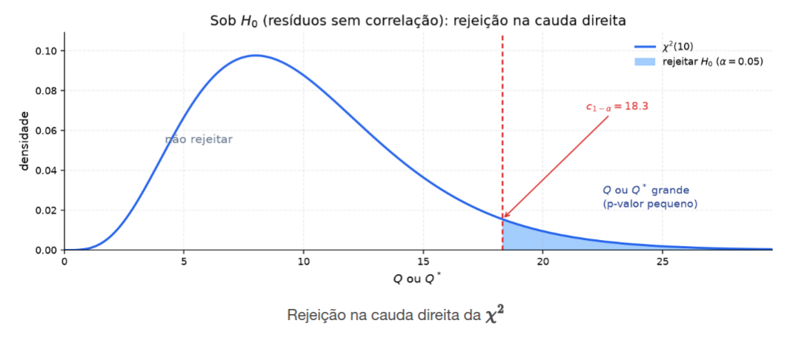
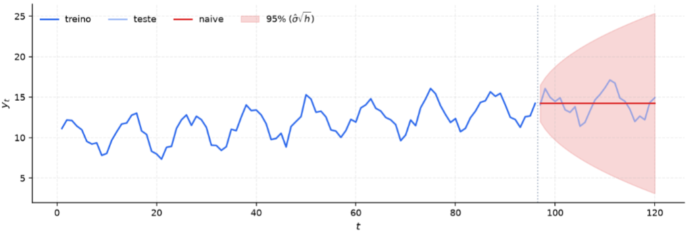
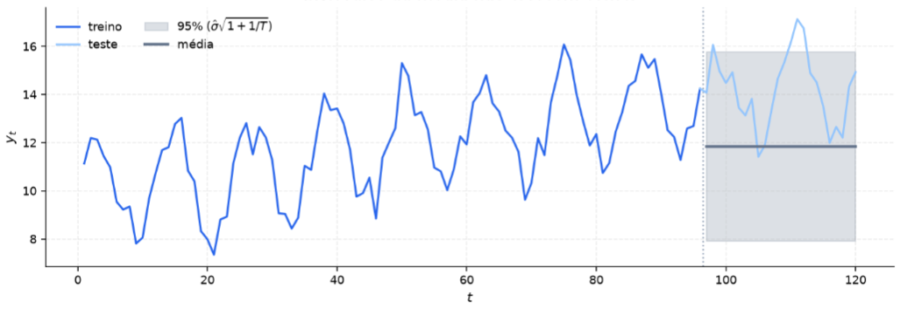
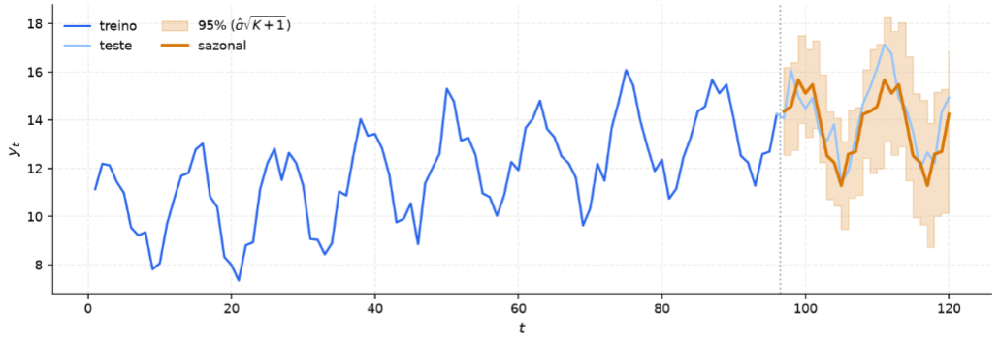
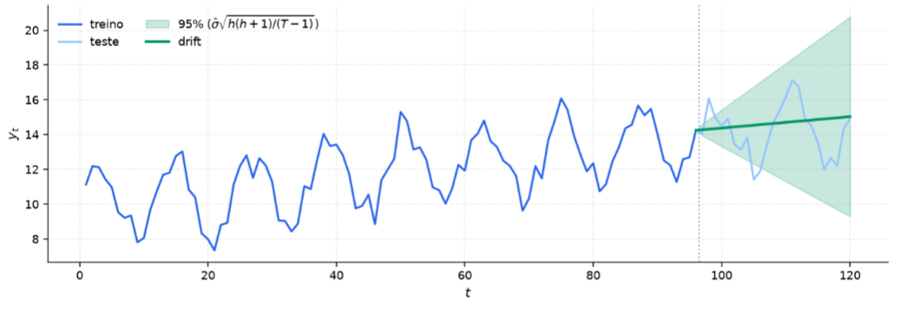
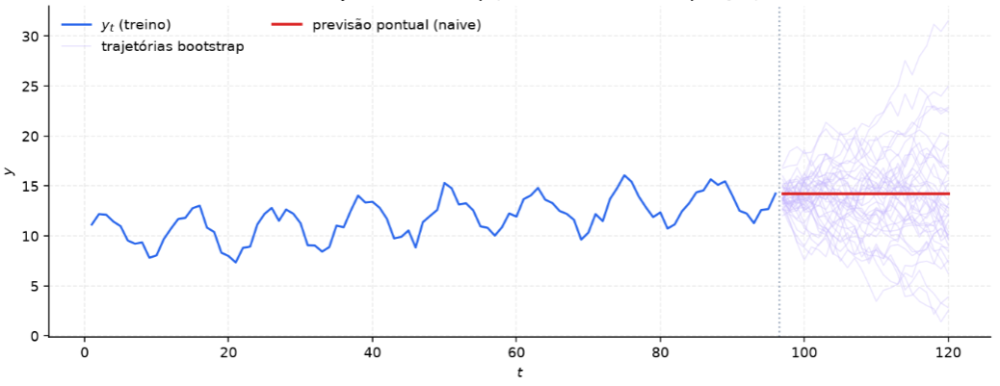

[Séries Temporais](index.md)

<!-- wiki:original:inicio -->

# Diagnóstico de Resíduos

## Introdução

No capítulo passado visualizamos formas de previsão utilizando da relação linear que as covariáveis possuem entre si ($\rho(h)$). Nesse capítulo, vamos entender que tipo de informações conseguimos retirar a partir dos **resíduos** das previsões

**Definição: Resíduo**

Um resíduo $e_{t}$ é a diferença entre o valor observado $Y_{t}$ e o valor previsto ${\hat{Y}}_{t}$

$$
e_{t} = Y_{t} - {\hat{Y}}_{t}
$$

ele representa justamente aquilo que o modelo não absorveu, ou seja, a parte da série temporal que não foi explicada pelo modelo. Se o modelo for bom, os resíduos devem se comportar como **ruído branco**, ou seja, não devem apresentar autocorrelação significativa, ou seja, eles devem apresentar ${\mathbb{E}}\left\lbrack e_{t} \right\rbrack = 0$ e $\text{Cov}\left( e_{t},e_{t + h} \right) = 0$, garantindo que não houve memória não explorada.

Algumas outras características, não obrigatórias, mas desejáveis, são variância constante ${\mathbb{V}}\left\lbrack e_{t} \right\rbrack = \sigma^{2}$ e distribuição **aproximadamente** normal, essencial para o ajuste de intervalos de confiança e testes de hipóteses.

Nós vamos ver alguns testes de hipótese que trabalham em cima dos resíduos e testam justamente as propriedades que citamos, mas, mesmo que nós já tenhamos visto isso em matérias anteriores, vale ressaltar que o teste **passar**, não significa que o modelo é bom, mas sim que **não há evidência suficiente** para rejeitar a hipótese nula de que os resíduos são ruído branco. Já se o teste **falha**, significa que o modelo é **inadequado** e que há memória não explorada na série temporal, ou seja, há espaço para sua melhoria.

## Testes de Autocorrelação conjunta

Antes de iniciarmos, os dois testes apresentados serão os *testes portmanteau*, que têm o mesmo objetivo, avaliar a autocorrelação conjunta dos resíduos até um lag limite $l$

$$
\begin{array}{r} H_{0}:\rho_{e}(1) = \rho_{e}(2) = \ldots = \rho_{e}(l) = 0 \\ H_{1}:\exists h \in \left\{ 1,\ldots,l \right\}\text{ tal que }\rho_{e}(h) \neq 0 \end{array}
$$

 ou seja, atuam sobre a hipótese nula que **não existe** autocorrelação significativa nos resíduos até o lag $l$. Antes de partirmos para os testes, vale também ressaltar a definição:

$$
r_{k} = {\hat{\rho}}_{e}(k) = \frac{\sum_{t = k + 1}^{T}\left( e_{t} - \overline{e} \right)\left( e_{t - k} - \overline{e} \right)}{\sum_{t = 1}^{T}\left( e_{t} - \overline{e} \right)^{2}}\text{\quad\quad}\forall k \in \left\{ 1,\ldots,l \right\}
$$

Os testes vão se basear no [teorema da distribuição da autocorrelação amostral](estacionariedade-e-acf.md#acf-amostral-dist) que nos garante que, sob a hipótese nula de IID, temos que

$$
\sqrt{T}r_{k}\overset{d}{\rightarrow}\mathcal{N}(0,1)\text{\quad\quad}\forall k \in \left\{ 1,\ldots,l \right\}
$$

### Teste de Box-Pierce

Dado o [teorema da distribuição da autocorrelação amostral](estacionariedade-e-acf.md#acf-amostral-dist), então podemos enunciar o seguinte teorema

**Teorema: Normalidade Conjunta**

Se $\left\{ Y_{t} \right\} \sim \text{ IID}\left( 0,\sigma^{2} \right)$ com ${\mathbb{E}}\left\lbrack Y_{t}^{4} \right\rbrack < \infty$, então para qualquer $h > 0$ fixo, quando $T \rightarrow \infty$ e para um $l$ fixo:

$$
\sqrt{T}\begin{pmatrix} r_{1} & \ldots & r_{l} \end{pmatrix}^{T}\overset{d}{\rightarrow}\mathcal{N}(0,I_{l})
$$

Sabendo que cada um dos lags $r_{k}$ converge para uma distribuição normal padrão, podemos construir a estatística de teste de Box-Pierce como

$$
Q = T\sum_{k = 1}^{l}r_{k}^{2}
$$

 dessa forma, sob a hipótese nula, temos que

$$
Q\overset{d}{\rightarrow}\chi_{l}^{2}
$$

No entanto esse teste possui uma limitação em amostras finitas, pois sob $H_{0}$, é possível mostrar que a variância de $r_{k}^{2}$ para um lag $k$ é

$$
{\mathbb{E}}\left\lbrack Tr_{k}^{2} \right\rbrack \approx \frac{T - k}{T + 2} < 1
$$

como a estatística de teste $Q$ trata ${\mathbb{E}}\left\lbrack Tr_{k}^{2} \right\rbrack = 1$, então $Q$ torna-se sistematicamente **superestimado** em amostras finitas, o que leva a rejeitar a hipótese nula de ruído branco mesmo quando ela é verdadeira (muito conservador). Para contornar esse problema, foi proposto o teste de Ljung-Box

### Teste de Ljung-Box

Aplica um fator de reescalonamento que pondera cada lag pelo inverso de sua variância exata sob a hipótese nula, assim, a estatística de teste de Ljung-Box é definida como

$$
Q^{\ast} = T(T + 2)\sum_{k = 1}^{l}\left( \frac{r_{k}^{2}}{T - k} \right)
$$

 assim, a distribuição empírica de $Q^{\ast}$ aproxima-se com maior precisão da distribuição teórica Qui-Quadrado em amostras finitas, sendo o teste preferido na prática

### Distribuição Assintótica e Regra de Decisão Formal

Sob a hipótese nula $H_{0}$, ambas as estatísticas seguem assintoticamente uma distribuição Qui-Quadrado:

$$
Q\overset{a}{\rightarrow}Χ^{2}(d)\text{\quad\quad}Q^{\ast}\overset{a}{\rightarrow}Χ^{2}(d)
$$

onde $d = l - K$ representa os graus de liberdade, $l$ o número de lags testados. Há uma regra prática de fixar $l = 10$ para dados não-sazonais e $l = 2m$ para dados sazonais. A escolha de $l$ deve ser fixada antes do cálculo do $p$-valor. $K$ é o número de parâmetros estimados no modelo que gerou os resíduos5 (para as baselines simples sem calibração por otimização, $K = 0 \Rightarrow d = l$)

Fixando o nível de significância $\alpha$, queremos rejeitar $H_{0}$ quando a estatística de teste $Q$ ou $Q^{\ast}$ forem maiores que um $c_{1 - \alpha}$, ou seja

$$
{\mathbb{P}}(Q > c_{1 - \alpha}) = \alpha
$$

dado que, sob a hipótese nula, $Q$ e $Q^{\ast}$ seguem uma distribuição Qui-Quadrado com $d$ graus de liberdade, então o limite crítico $c_{1 - \alpha}$ é dado pelo quantil $(1 - \alpha)$ da distribuição Qui-Quadrado, logo

$$
c_{1 - \alpha} = \chi_{d}^{2}(1 - \alpha)
$$

 e o p-valor

$$
p = {\mathbb{P}}(Χ_{d}^{2} > Q\vert H_{0}\text{ verdade}) = 1 - F_{Χ_{d}^{2}}(Q)
$$

*Figura 13. Ilustração do teste de Box-Pierce*

### Intervalos de Precisão

Sob a premissa de que os erros seguem distribuição Normal $e_{t} \sim \mathcal{N}(0,\sigma^{2})$ e são não-correlacionados, o intervalo de previsão com $95$% de confiança para o horizonte $h$ é

$$
{\hat{Y}}_{T + h\vert T} \pm 1.96\sqrt{{\mathbb{V}}\left\lbrack Y_{T + h} - {\hat{Y}}_{T + h\vert T} \right\rbrack} = {\hat{Y}}_{T + h\vert T} \pm 1.96\sqrt{h\sigma^{2}}
$$

 onde o desvio padrão do erro de previsão é estimado como

$$
\hat{\sigma} = \sqrt{\frac{1}{T - K - M}\sum_{t = 1}^{T}{\hat{e}}_{t}^{2}}
$$

A acumulação do desvio padrão futuro ${\hat{\sigma}}_{h}$ varia conforme a estrutura de cada baseline

- **Naive**: ${\hat{\sigma}}_{h} = \sqrt{h} \cdot \hat{\sigma}$

  

  *Figura 14. Ilustração do método ingênuo*

- **Mean**: ${\hat{\sigma}}_{h} = \hat{\sigma}\sqrt{1 + \frac{1}{T}}$

  

  *Figura 15. Ilustração do método da média*

- **Naive Sazonal**: ${\hat{\sigma}}_{h} = \sqrt{K + 1} \cdot \hat{\sigma}$ com $K = \left\lfloor \frac{h - 1}{m} \right\rfloor$

  

  *Figura 16. Ilustração do método ingênuo sazonal*

- **Drift**: ${\hat{\sigma}}_{h} = \hat{\sigma} \cdot \sqrt{\frac{h(h + 1)}{T - 1}}$

  

  *Figura 17. Ilustração do método do desvio*

## Intervalo de Previsão por Bootstrap

Quando a distribuição dos resíduos apresenta assimetria ou caudas pesadas, a premissa de normalidade falha, gerando intervalos paramétricos mal calibrados

Algoritmo de Construção das Trajetórias Simuladas:

1.  Extrair os resíduos observados de 1 passo $\left\{ {\hat{e}}_{1},\ldots,{\hat{e}}_{T} \right\}$.

2.  Para o horizonte $h = 1$, sortear com reposição um resíduo $e_{T + 1}^{\ast} \in \left( {\hat{e}}_{t} \right)$ e calcular $Y_{T + 1}^{\ast} = {\hat{Y}}_{T + 1~\vert ~T} + e_{T + 1}^{\ast}$.

3.  Para os passos subsequentes $h = 2,3,\ldots$, sortear com reposição um novo resíduo $e_{T + h}^{\ast}$ e atualizar recursivamente $Y_{T + h}^{\ast} = {\hat{Y}}_{T + h~\vert ~T + h - 1}^{\ast} + e_{T + h}^{\ast}$.

4.  Repetir esse processo $B$ vezes (gerando $B$ trajetórias futuras) e extrair os quantis empíricos de $2,5$% e $97,5$% para formar o intervalo a $95$% de confiança.

O bootstrap não conserta um modelo com erros autocorrelacionados. Se a ACF dos resíduos indicar memória, a reamostragem i.i.d. mistura choques dependentes como se fossem independentes, destruindo a cobertura nominal do intervalo. O bootstrap relaxa a hipótese de normalidade, mas exige rigorosamente a ausência de autocorrelação.

*Figura 18. Ilustração do método de bootstrap*
<!-- wiki:original:fim -->

## Percurso de estudo

[Trilha: A1](../../trilhas/series-temporais/a1.md) · [Apresentação e contexto da fonte](../../trilhas/series-temporais/a1.md#apresentacao-original)

- Anterior: [Previsão e Baselines](previsao-e-baselines.md)

- Próximo: [Métricas de Avaliação](metricas-de-avaliacao.md)
