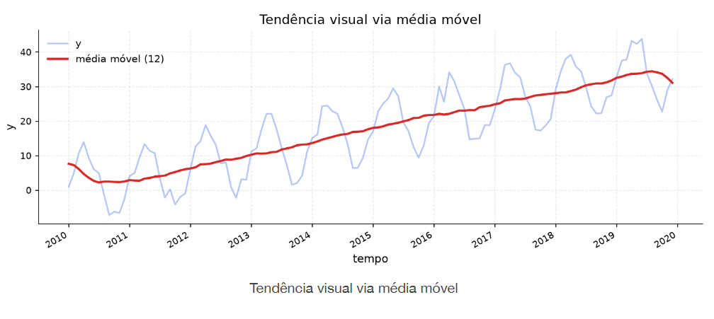
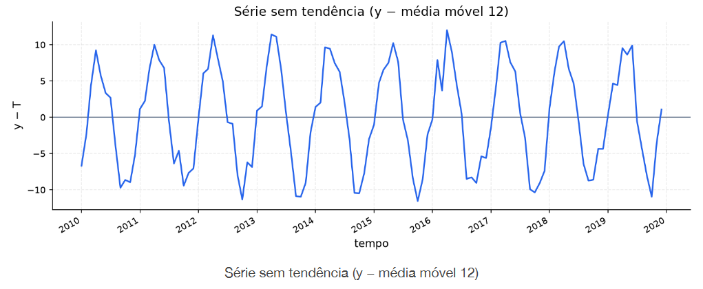
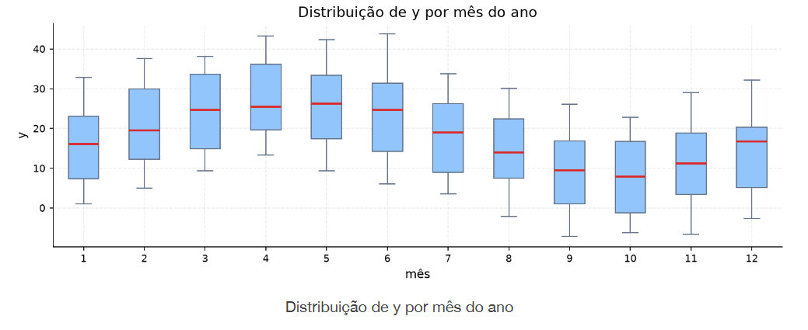
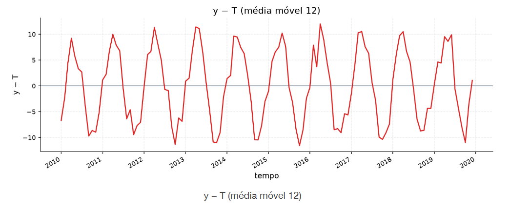

[Séries Temporais](index.md)

<!-- wiki:original:inicio -->

# Diagnóstico Visual

## Introdução

Antes de testes formais, ARIMA, ACF, PACF, etc., podemos fazer um diagnóstico visual da série temporal. O objetivo é identificar padrões, tendências, sazonalidades e possíveis anomalias nos dados. Essa análise inicial nos ajuda a formular hipóteses sobre o comportamento da série e a escolher modelos apropriados para previsão. Podemos primeiro pensar na série como

$$
y_{t} = T_{t} + S_{t} + R_{t}
$$

onde $T_{t}$ representa a tendência (nível que a série se move no médio/longo prazo), $S_{t}$ a sazonalidade (padrões que se repetem em intervalos fixos) e $R_{t}$ os resíduos (por definição, o que sobra após fixar $T_{t}$ e $S_{t}$)

**Exemplo**

Vamos analisar a seguinte figura

Visualmente conseguimos identificar cada um dos componentes da série temporal.

**$T$**: No médio/longo prazo, a tendência é um crescimento linear, com inclinação positiva. Mesmo que existam flutuações de subida e descida, é perceptível que a cada a no o valor de $y_{t}$ tende a aumentar. **$S$**: A série mostra uma sazonalidade de subida no inicio de cada ano e descida no final, mostrando um padrão anual claro (mas de forma que a descida sempre se mantém acima do padrão anterior, gerando a tendência positiva citada anteriormente)

## Covariáveis

Dentro dessa estrutura, podem existir também **covariáveis explicativas** que influenciam a série temporal. Por exemplo, em uma série de vendas de um produto, fatores como campanhas de marketing, feriados ou eventos especiais podem afetar os valores observados. Incorporar essas covariáveis nos modelos pode melhorar a precisão das previsões e fornecer insights sobre os fatores que impactam a série. Ainda dentro do nosso framework visual, podemos introduzir essas covariáveis como

$$
y_{t} = \underset{\text{ Estrutura Temporal}}{\underbrace{T_{t} + S_{t}}} + \underset{\text{ Covariáveis}}{\underbrace{x_{t}^{T}\beta}} + R_{t}
$$

Na prática, $T_{t}$ e $S_{t}$ são incorporados dentro de $x_{t}$ e não são derivados explicitamente, mas é importante entender que eles existem e como eles caracterizam a série temporal. A análise visual pode nos ajudar a identificar quais covariáveis podem ser relevantes para o modelo e como elas se relacionam com os padrões observados na série.

## Tendência

Tendência é o movimento lento do nível da série: crescimento, queda ou platô ao longo de muitos períodos. Em dados mensais, uma média móvel com janela da ordem de um ano (por exemplo 12) alisa oscilações curtas e ajuda a ver esse nível. A média móvel aqui é ajuda visual, não um modelo formal

*Figura 2. Exemplo de tendência em uma série temporal*

## Sazonalidade

Sazonalidade é estrutura que se repete em fases do calendário (mês do ano, dia da semana, hora do dia, …). Distinguir sazonalidade de “subiu uma vez e nunca mais” é parte da descrição. Três gráficos olham a mesma sazonalidade, mas respondem perguntas diferentes.

**Overlay por ano**. Eixo = mês; uma linha por ano. Serve para ver **o ciclo se repetindo**: o formato do ano (pico/vale em quais meses); se o padrão é estável ou muda de ano para ano (linhas parecidas vs. um ano “fora”); a amplitude. Anos mais “altos” no gráfico ainda carregam tendência — o formato relativo é o que importa

*Figura 3. Exemplo de sazonalidade em uma série temporal (overlay por ano)*

**Série sem tendência**. Plotar $y_{t}$ menos a média móvel (12) no calendário real. Serve para ver a **onda anual na seta do tempo**, depois de tirar o nível lento $T_{t}$. Dá para ver se a oscilação volta todo ano (liga a $S_{t}$) e se a amplitude muda ao longo dos anos. Ainda mistura sazonalidade + ruído — não é puro.

*Figura 4. Exemplo de sazonalidade em uma série temporal (série sem tendência)*

**Boxplot por mês**. Resume o nível típico de cada mês, agregando os anos. Serve para o ranking (quais meses são sistematicamente mais altos/baixos), a dispersão dentro do mês (caixa larga = aquele mês varia muito entre anos) e outliers. Não mostra a trajetória no tempo — cada mês aparece uma vez.

*Figura 5. Exemplo de boxplot por mês*

Em uma frase: overlay = “como o ano se parece”; sem tendência = “a onda no tempo”; boxplot = “estatística por mês”

## Resíduos

Por definição $R_{t} = y_{t} - \left( T_{t} + S_{t} \right)$, ou seja, o que sobra após extraírmos a tendência e a sazonalidade. Tomemos por exemplo o seguinte gráfico

*Figura 6. Exemplo de resíduos em uma série temporal*

Aqui, estratificamos $T$ que é a média móvel, no entanto, o gráfico ainda contém a estrutura da **sazonalidade**. Podemos, nesse caso, interpretar a sazonalidade como a **média mensal** de $y_{t} - T_{t}$ (detalhes serão melhor compreendidos posteriormente). Removendo essa sazonalidade $S_{t}$, então obtemos um gráfico dos resíduos

*Figura 7. Exemplo de resíduos em uma série temporal*

Essa extração visual é temporária, serve no momento para termos um entendimento do que são resíduos e como eles se comportam. Posteriormente, vamos aprender a extrair $T$ e $S$ de forma formal, utilizando modelos estatísticos

## Split Temporal

Comentamos anteriormente sobre, para fazer modelos preditivos das séries temporais, para separar eles em **treino** e **teste**. Sendo mais formal, isso é feito a partir de um **split temporal**, onde, ao invés de embaralhar os dados, pegamos uma parte inicial da série para treino e uma parte final para teste a partir de uma data-fronteira.

*Figura 8. Exemplo de split temporal em uma série temporal*

------------------------------------------------------------------------

<!-- wiki:original:fim -->

## Percurso de estudo

[Trilha: A1](../../trilhas/series-temporais/a1.md) · [Apresentação e contexto da fonte](../../trilhas/series-temporais/a1.md#apresentacao-original)

- Anterior: [Modelagem Clássica aplicada ao Tempo](modelagem-classica-aplicada-ao-tempo.md)
- Próximo: [Estacionariedade e ACF](estacionariedade-e-acf.md)
